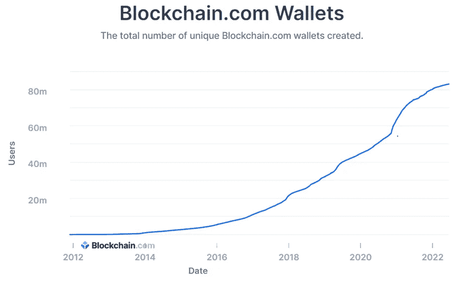
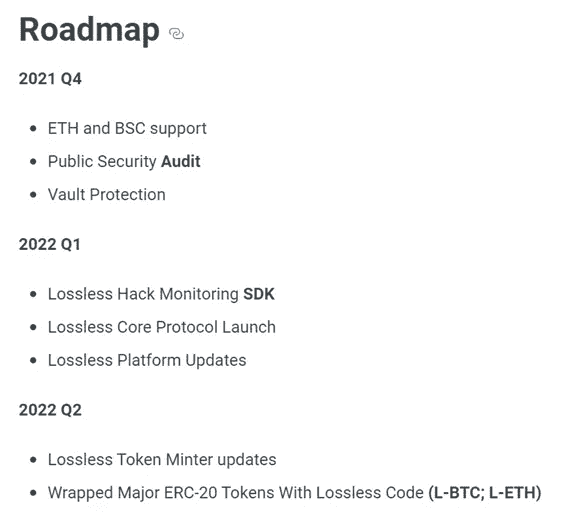
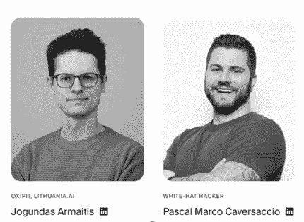

# 第一次密码破解💀具有 32 亿美元潜在市场的缓解工具

> 原文：<https://medium.com/coinmonks/crypto-fundamental-analysis-lossless-protect-defi-7ba22c28681a?source=collection_archive---------22----------------------->

“无损 DeFi”协议的密码原理分析

> 无损(LSS)号称是世界上第一个**加密黑客缓解工具**，**奖励白帽黑客**举报黑客。通俗地说，这意味着无损协议监控区块链上发生的交易，并检测黑客攻击，即恶意交易。无损有能力在恶意交易完成之前**阻止它们**。如果交易已经完成，无损还可以**取回被盗资金**。

# 概观

*   项目类别:网络安全
*   技术:专有
*   治理:利益的证明
*   权限:开源
*   商业模式:出售代币，代币持有者获得价值
*   融资:社区和风险投资支持的象征性项目
*   联系人: [hello@lossless.cash](mailto:hello@lossless.cash)

**网络:**

*   以太坊—合同地址:0x3b 9 be 07d 622 accaed 78 f 479 BC 0 EDA bfd 6397 e 320
    https://ethers can . io/Address/0x3b 9 be 07d 622 accaed 78 f 479 BC 0 EDA bfd 6397 e 320
*   BNB 智能链—合同地址:0 xf 7686 f 43591302 CD 9 B4 b 9 C4 Fe 1291473 FAE 7d 9 c 9
    https://bscscan . com/Address/0 xf 7686 f 43591302 CD 9 B4 b 9 C4 Fe 1291473 FAE 7d 9 c 9

无损旨在通过防止利用、黑客和社会工程形式的网络攻击来创建一个安全的 DeFi 生态系统。

无损支持手动黑客发现，白帽黑客可以监控交易并报告欺诈交易。它还支持社区创建的自动黑客发现机器人。一旦黑客被发现，被盗资金将被冻结。这些被冻结的交易由“无损决策机构”审查，该机构由无损代表、受信任的关键公众人物/审计公司和持有大量 LSS 代币股份的投资者组成。

**DeFi 上升**

*   截至 2022 年 6 月 16 日，DeFi 锁定的总价值(TVL)约为 400 亿美元。在 2021 年 10 月的牛市中，这一数字超过了 1000 亿美元。自 2020 年 7 月以来，DeFi 中的 TVL 增加了 8 倍以上。

Total value locked (TVL) in DeFi. Source — [defipulse](https://www.defipulse.com/)

*   到 2024 年，全球在区块链解决方案上的支出预计约为[190 亿美元。](https://www.idc.com/getdoc.jsp?containerId=prUS47617821)
*   预计到 2026 年，区块链技术市场将增长到近 700 亿美元。
*   blockchain.com 独特的 T2 钱包总数呈指数级增长。

The total number of unique Blockchain.com wallets created. Source — [Blockchain.com](https://www.blockchain.com/charts/my-wallet-n-users)

*   根据 [Emergenresearch](https://www.emergenresearch.com/industry-report/decentralized-finance-platforms-market) 的数据，预计到 2028 年，全球 DeFi 市场将达到 5079 亿美元，2021 年至 2028 年的 CAGR 将达到 43.8%。
*   根据“The Block ”,截至 2022 年 6 月，DeFi 的累计收入已达到 45.5 亿美元。

Cumulative DeFi revenue. Source — [theblock](https://www.theblock.co/data/decentralized-finance/protocol-revenue/total-defi-protocols-revenues)

所有上述数字表明，尽管我们正在经历 2022 年的市场混乱，但 DeFi 具有巨大的潜力，并将在长期内爆发。随着散户投资者和机构成为主要参与者，它正慢慢成为主流。

# 问题是

大量资金流入 DeFi——散户的血汗钱——但也有大量资金流出 DeFi。感谢黑客和网络罪犯的利用。

尽管 DeFi 在未来几年将会激增，但该技术仍处于早期阶段。DeFi 协议的安全性也是如此。它尚未成熟，仍处于婴儿期。这导致了几个大的黑客攻击，损害了加密的采用。

> 交易新手？尝试[加密交易机器人](/coinmonks/crypto-trading-bot-c2ffce8acb2a)或[复制交易](/coinmonks/top-10-crypto-copy-trading-platforms-for-beginners-d0c37c7d698c)

根据 defiyield 的 [Rekt 数据库](https://defiyield.app/rekt-database)，大约 200 亿美元在各种黑客攻击中损失。其中，只归还了价值 20 亿美元的资金。这意味着只有 10%的资金可以收回，90%的资金将永远失去。

Total funds lost in DeFi. Source: [defiyield](https://defiyield.app/rekt-database)

让我们来看看 Crypto 历史上一些最大的黑客攻击。这会让你了解这个问题的严重性。

Top 10 cryptocurrency hacks. Source: [chainalysis](https://go.chainalysis.com/2022-Crypto-Crime-Report.html)

*   聚网黑客攻击:这是最大的加密黑客攻击，价值高达 6 . 13 亿美元。事情发生在 2021 年 8 月 10 日。黑客能够利用 Poly network 的“合同调用”中的漏洞。幸运的是，由于聚网团队的不断沟通&外联努力，大部分资金被黑客退回。但这并不是每次都管用。
*   浪人协议黑客:浪人是一个著名玩家赚取加密游戏 Axie Infinity 侧链。6 . 15 亿美元从桥上转移到浪人的侧链上。根据来自 Axie Infinity 开发者 Sky Mavis 的[报告](https://roninblockchain.substack.com/p/community-alert-ronin-validators?s=w)，攻击者使用了“通过我们的 gas-free RPC 节点的后门，他们滥用它来获得 Axie DAO 验证器的签名。”
*   [虫洞](https://decrypt.co/91899/hacker-steals-320-million-solana-ethereum-bridge-wormhole) Hack:虫洞是一个交叉链桥。它在包装以太坊(wETH)损失了约 3.2 亿美元。黑客的目标是索拉纳的桥腿。用户需要将以太坊锁定到智能合约中，以获得等量的包装以太坊。黑客设法在没有锁定虫洞的情况下制造了 wETH。
*   Beanstalk Hack: Beanstalk 以其算法稳定币 BEAN 而闻名。黑客在一次闪贷攻击中窃取了 1.82 亿美元。
*   Compound[Hack:2021 年 10 月，Compound 出现了一个漏洞，让借款人索取超过他们预期份额的报酬。为了修复这个漏洞，Compound 必须提出一个治理提案才能通过。机构群体花了 7 天时间才接受它，到它被接受时，又损失了 6880 万美元。](https://decrypt.co/82499/compound-exploit-drains-21m-from-lending-protocol)
*   [火神锻造](https://decrypt.co/88177/hacker-steals-140-million-polygon-gaming-platform-nft-marketplace-vulcan-forged) Hack:火神锻造是 Polygon 上的一个即玩即赚平台。2021 年 12 月，其用户损失超过 1.4 亿美元。一名黑客获得了该平台集中用户钱包的凭证。黑客用它来获取平台资产组合功能中的私钥。
*   [Cream Finance](https://decrypt.co/84590/cream-finance-suffers-third-hack-losing-over-130-million)Hack:2021 年 10 月，Lending protocol Cream Finance 在一次闪贷攻击中损失了 1.3 亿美元。黑客能够通过在不同的以太坊地址重复获得快速贷款来利用定价漏洞。Cream finance 以前也经历过闪贷攻击。
*   [Badger DAO](https://decrypt.co/87415/bitcoin-defi-project-badgerdao-hacked-120m) Hack: Badger DAO 是一个比特币到 DeFi 的桥梁。2021 年 12 月，当骗子欺骗 Badger DAO 成员批准恶意交易时，它遭受了 1.5 亿美元的损失。这使得他们能够控制用户的金库资金并窃取资金。
*   [bZx](https://decrypt.co/85360/ethereum-defi-project-bzx-hacked-again-reported-55-million) Hack: bZx 是一个多链协议。在私钥泄露后，它损失了部署在币安智能链& Polygon 上的 5500 万美元。bZx 之前也面临过两次以上的攻击。
*   [pancake bunny](https://decrypt.co/71585/pancakebunny-defi-exploit)Hack:pancake bunny 是一个产量农业协议。一名黑客利用一系列八次闪贷攻击操纵 PancakeBunny 的定价算法。黑客窃取了 4500 万美元的 protocol 的原生令牌 BUNNY，方法是以市场价廉价购买，并通过人为抬高价格来出售。
*   [Vee Finance](https://decrypt.co/81400/avalanche-defi-platform-vee-finance-suffers-35m-hack)Hack:2021 年 9 月，Vee Finance 遭遇了一次攻击，原因是其杠杆交易功能存在漏洞，该功能依赖于 Avalanche 的主要流动性协议穿山甲提供的令牌价格。它损失了 3500 万美元。
*   Meerkat Finance Hack:就在这个项目启动的第二天，用户在一次攻击中损失了 3100 万美元。攻击者利用了保险库功能中的漏洞。许多用户认为这是协议开发者的恶作剧。猫鼬否认了这些指控。
*   [Grim Finance](https://decrypt.co/88727/grim-finance-hacked-30-million-fantom-tokens)Hack:2021 年 12 月，该协议遭受了一种类型的攻击，攻击者在之前的交易尚未结算时伪造额外的存款进入金库。这种类型的攻击称为重入攻击。

巧合的是，当我写这篇文章的时候，一条关于 2022 年 6 月 24 日和谐协议的地平线桥受到网络攻击的新闻爆发了。这次入侵价值 1 亿美元。AAG 风险投资公司也受到了影响，但由于他们与 Lossless 进行了集成，他们成功冻结了 8400 万个令牌中的 7800 万个。这大约是 90 万到 100 万美元。

上述黑客只是一些最大的已知黑客的几个例子。但是，每个月都会发生数百起中小型攻击。看看其他一些著名的黑客，

*   豆茎农场(2022 年 4 月 18 日):1.82 亿
*   Rari 资本+ Fei 协议(2022 年 5 月 1 日):8000 万
*   量子位(2022 年 1 月 28 日):八千万
*   cashio(2022 年 3 月 23 日):5280 万
*   德乌斯金融(2022 年 4 月 28 日):1340 万
*   大象钱(2022 年 4 月 13 日):1120 万
*   马鞍财经(2022 年 4 月 30 日):1000 万
*   德高金融(2022 年 2 月 21 日):1000 万

这里是一份详尽的密码破解清单。只要看一看，并试图理解对各种区块链协议的网络攻击有多普遍，以及为什么避免它们是极其重要的。

下面是一些按特定类型分类的攻击。

Blockchain cyber attacks: Percentage of value stolen by attack type. Source: [Chainalysis](https://blog.chainalysis.com/reports/2022-defi-hacks/)

为了进一步说明，下面是对各种类型攻击的简要说明，

*   **交换黑客:**在这种类型的攻击中，网络犯罪分子以集中式和分散式交换为目标。这些攻击是通过利用代码中的漏洞或使用泄露的私钥来实现的。
*   **钱包黑客:【TrustWallet 或 MetaMask 等钱包应用成为攻击者窃取个人钱包中资金的目标。像社会工程这样的技术被用来实施这种攻击。**
*   **令牌制造:**一些协议有令牌制造合同，根据需要创建新的令牌。攻击者利用这些合同中的漏洞制造额外的新令牌并出售。
*   Flashloan 攻击:这是在区块链获得的贷款类型，必须在同一个区块内支付。Flashloans 通常与套利相结合，即用户借入一定数量的资金，在一个交易所购买特定的加密货币，然后在另一个交易所以更高的价格出售。攻击者利用智能合同中的漏洞恶意提取资金。
*   **拉锯战:**在拉锯战中，开发团队本身通过倾销代币和抽走流动性来欺骗投资者。

许多协议进行的最大和最重要的步骤之一是由第三方审计员对代码、智能契约和协议的其他方面进行审计。虽然审计很重要，但它不能保证安全。30%的代码漏洞和 73%的闪贷攻击发生在第三方安全审计一年内的协议上。

一旦黑客入侵发生，追踪资金流向就成了最重要的任务。攻击者试图通过将被盗资金发送到 DeFi protocols & risky services 来隐藏其踪迹。下图显示了被盗资金的去向。

Blockchain cyber attacks: Destination of stolen funds. Source: [Chainlysis](https://blog.chainalysis.com/reports/2022-defi-hacks/)

# 解决方案

广泛的灾难性网络攻击会导致直接和间接的经济损失、声誉损害和信誉损失。这最终给 DeFi 和整个加密域带来了坏名声。

*让 DeFi 生态系统成为投资者可信赖的安全天堂，避免或尽量减少网络攻击造成的财务损失，已经变得极为必要。*

这就是无损(LSS)的用武之地。

无损协议是一种旨在阻止网络攻击的协议。这分两个阶段实施。在第一阶段，恶意交易由人工或机器人识别。一旦查明，这些交易将被冻结。在第二阶段，决策结构审查冻结的交易，如果黑客读取，资金被撤销。

无损检测有防止黑客入侵的历史，

*   [无损存储保护为 gotEM 节省了 55，000 美元](https://beincrypto.com/lossless-vault-protection-stops-a-hack-and-saves-55000-for-gotem/)
*   [Lossless 帮助 Cream Finance 黑客追回 1670 万美元](https://cointelegraph.com/news/defi-security-project-lossless-helps-recover-16-7m-from-cream-finance-hack)

我们将在下面的“技术”部分详细了解无损技术。

# 市场潜力

2021 年，网络攻击者窃取了价值 32 亿美元的加密货币。看来 2022 年这种盗窃行为还在加速。2022 年前三个月，黑客已经盗取了 13 亿美元。

看看下面的图表，从 2015 年到 2022 年第一季度的盗窃总数和被盗价值。2022 年前三个月被盗的所有加密货币中，约有 97%是从 DeFi 协议中被盗的，高于 2021 年的 72%和 2020 年的 30%。

Total number of thefts and value stolen by type of victim. Source: [Chainalysis](https://go.chainalysis.com/2022-Crypto-Crime-Report.html)

如上图所示，每年被盗的金额(以十亿计)是无损检测的潜在市场。

# 技术

无损协议以两种方式与其他协议集成，

*   无损编码
*   通过包装现有令牌

使用令牌创建者插入到令牌中的一段代码，无损可以与其他协议集成。该代码允许无损冻结恶意交易的基础上，一套欺诈识别标准。

无损协议有四个主要特征

*   金库和金库保护:该功能帮助令牌创建者(加密项目)保护包含大量流动性的地址、流动性池，例如 DeFi 金库、跨链桥金库、DEX 流动性池和金库钱包。保护国库的主要安全机制之一是只允许令牌传输到白名单中的地址。流动性保护可以通过限制在特定时间段内转移出保险库的代币数量来实现。令牌必须集成无损控制器，才能使用保险库和金库保护功能。当 token 与无损控制器集成时，它就变成了 LERC20 token。

How hacks are reported on Lossless. Source: [Lossless](https://losslessdefi.medium.com/your-guide-to-lossless-tokenomics-85fd49be2ea5)

*   黑客缓解协议:它用于检测恶意交易。这是通过手动识别此类交易和使用社区创建的黑客识别机器人自动完成的。最常见的识别黑客的方法是，
    #监听链上事件，如 Mint()、OwnershipTransferred()。
    #检查不寻常的代币活动，如团队钱包中的大额交易，无需事先通知。
    #使用第三方报告，如加密组织或区块链安全审计员关于网络攻击的公告。

欺诈交易的发现者可以冻结一个地址 24 到 48 小时。
这些冻结交易由“三方无损决策结构”审查。这个结构由令牌创建者、无损公司和无损委员会组成。无损委员会由持有大量 LSS 代币的投资者和关键公众人物/实体组成，如提供可信和公正意见的审计公司。如果任何交易被三方无损决策结构推断为欺诈性的，则该地址将被冻结 14 天以上，并且委员会提议永久冻结和撤销该交易。当交易停止时，总被黑金额的 2%支付给黑客发现者。但是如果发现者的报告被拒绝，他/她的股份将被没收。2%分配给 LSS 代币持有者，他们将代币押在公开报告上。如果报告被批准，赌注者将获得奖励，但如果报告被拒绝，赌注者的赌注将被没收。2%分给无损委员会& 1%由无损公司留存。

Lossless Reward Distribution. Source: [Lossless](https://losslessdefi.medium.com/your-guide-to-lossless-tokenomics-85fd49be2ea5)

如果有兴趣，你可以在这里浏览黑客攻击缓解协议[的详细描述。](https://lossless-cash.gitbook.io/lossless/technical-reference/hack-mitigation-protocol)

Spotting suspicious transaction. Source: [Lossless](https://lossless-cash.gitbook.io/lossless/)

无损协议的技术架构

Technical Architecture of Lossless protocol. Source: [Lossless](https://lossless-cash.gitbook.io/lossless/)

*   无损令牌生成器:[无损令牌生成器](https://minter.lossless.io/)允许您创建&部署自己的令牌。新创建的令牌遵循缓解黑客攻击的 L-ERC20 标准。该标准将有助于发现、冻结&反向黑客相关交易。
*   令牌重启工具包:该功能允许您以无损安全的方式[重启您现有的令牌](https://relaunch.lossless.io/)。这项功能完全免费。

**L-ERC20:** LERC20 是标准 ERC20 的扩展。它有和 ERC20 一样的方法和接口。LERC20 借助额外的方法、修饰符和变量实现了所有无损特性。LERC20 技术规格可在[这里](https://lossless-cash.gitbook.io/lossless/technical-reference/lerc20)获得。

> 无损协议已经与一些领先的区块链集成，如以太坊(ETH)、币安(BNB)、多边形(MATIC)、Avalanche (AVAX)、Fantom (FTM)。它也将在几天后在和谐一号上直播。

# 令牌组学

以下是 LSS 记号经济学的一些细节，

*   股票代码:LSS
*   令牌类型:ERC20
*   TGE 日期:2021 年 6 月 3 日
*   象征性角色—治理
*   可开采的:不
*   最大值供应— 100，000，000 LSS
*   总供应量— 100，000，000 LSS
*   流通供应量——55，572，671.94 LSS
*   %循环供应— 56%
*   市值——6884184 美元
*   完全稀释的市值——12，387，714 美元
*   历史新高(2021 年 10 月 20 日)——2.61 美元
*   历史新低(2022 年 6 月 18 日)——0.105563 美元

以下是 LSS 代币控股公司的详细情况，

*   公司储备金— 15%
*   私人回合— 35%
*   顾问-5%
*   团队— 15%
*   采纳激励— 20%
*   营销/上市——10%

Lossless Token Metrics. Source: [Lossless](https://losslessdefi.medium.com/your-guide-to-lossless-tokenomics-85fd49be2ea5)

**归属时间表** —无损团队提供了清晰的归属时间表，这很好。以下是令牌发布时间表的详细信息，

*   2021 年 6 月 1 日，20%的代币在 TGE 解锁
*   每个季度，20%的私人轮代币解锁，直到第 13 个月
*   每个月都有 10%的营销/上市代币解锁，直到第 9 个月
*   每个季度，22.5%的采纳激励令牌在第 13 个月前解锁
*   从第 13 个月开始为团队、顾问和公司储备发放代币。上述三个类别的可行权计划为每月 8.33%。

Lossless Token Release Schedule. Source: [Lossless](https://losslessdefi.medium.com/your-guide-to-lossless-tokenomics-85fd49be2ea5)

**LSS 令牌实用程序**

任何协议上的令牌效用都是由该区块链上发生的各种活动中的令牌的集成来确定的。无损令牌的效用来自各种功能，如治理、费用、赌注、早期访问和推荐计划。LSS 令牌管理将允许持有其 LSS 令牌的白帽黑客参与提供反馈，并建议协议的各个方面和规划路线图等。黑客发现者也可以将他们的代币作为赌注，以获得发现者费用的资格。中介费以 LSS 币支付。顶级 LSS 令牌持有者将提前获得新功能、工具和网络安全见解。

# 路标

以下是作为无损白皮书的一部分发布的路线图。

Lossless Roadmap. Source: [Lossless](https://lossless-cash.gitbook.io/lossless/#roadmap)

无损[核心协议展示](https://losslessdefi.medium.com/core-protocol-the-launch-process-b97d19964cb0)计划于 2022 年在 Q1 进行。首次发布公告于 2022 年 3 月 1 日发布。无损团队已经成功地按照他们在路线图中的承诺交付了功能。但是，我们已经在 2022 年的 Q2，因此无损团队应该公布他们更新的路线图以及一些新功能/更新的细节。这将让投资者和用户清楚无损的未来方向。

# 白皮书

[无损白皮书](https://lossless-cash.gitbook.io/lossless/)以 gitbook 的形式提供。白皮书涵盖了无损项目的各个方面，并提供了以下细节

*   DeFi 市场概述
*   DeFi 安全问题
*   DeFi 网络安全领域的无损市场潜力
*   无损如何工作的细节
*   技术架构概述
*   无损核心特性
*   无损商业模式
*   无损增长模型
*   路标

同一 gitbook 还提供了无损功能和智能合约的所有技术细节。

# 组

以下是无损领导的一些成员。这支队伍似乎完全被打败了。每一位知名成员都在 Linkedin 或 Twitter 上有公开的个人资料。

Lossless Team. Source: [Lossless](https://lossless.io/about/)

Vygandas Masilionis 是无损 CEO。他从 2017 年开始涉足密码行业。他在加密领域拥有丰富的技术和商业经验。不确定他是否有网络安全或区块链安全方面的经验，但他似乎对无损有很好的愿景。

无损首席技术官多曼塔斯·佩拉蒂斯似乎是他个人资料的完美匹配。他是一个技术硬核，拥有全栈开发经验&从零开始开发了分散式保险平台。他自 2018 年以来一直在 crypto space 工作，对 DeFi 非常熟悉。

Dominykas A. van Otterlo 是 Lossless 公司的首席业务发展官。他在业务开发、销售和相关档案方面有大约 10 年的经验。

莫妮卡·斯维德斯克是无损的 CMO。她有 7 年多的市场营销经验。她拥有市场营销硕士学位。Monika 在社交平台上非常活跃，并回答社区成员的询问。她还提供每周更新，并主持 Twitter 空间。

Lossless Advisors. Source: [Lossless](https://lossless.io/about/)

Jogundas Armaitis 和 Pascal Marco Caversaccio 是无损检测的顾问。两人都是拥有丰富技术技能的连续创业者。

所有其他在无损网站上有个人资料的团队成员都在他们的领域有丰富的经验。总的来说，无损有一个坚实的团队和良好的顾问。

# 链上指标

前 100 名持有者总共拥有 89.43% (89，426，677.83 个令牌)的无损令牌

Lossless Top Token Holders. Source: [etherscan](https://etherscan.io/token/tokenholderchart/0x3b9be07d622accaed78f479bc0edabfd6397e320)

下图显示了 LSS 代币自成立以来的市值和供应量。

Lossless market cap & supply. Source: [ethplorer](https://ethplorer.io/address/0x3b9be07d622accaed78f479bc0edabfd6397e320#chart=candlestick&df&dt&legend=mc_supply)

# 开发者活动

无损公共 git 库最近没有太多的活动，但是无损团队在他们的中型配置文件上提供每月更新。以下是最近的一些更新

*   [发展更新:6 月](https://losslessdefi.medium.com/development-update-june-a81b1da35a45)
*   [无损开发更新:5 月](https://losslessdefi.medium.com/lossless-development-update-may-d24493d2ed3f)
*   [无损开发更新:4 月](https://losslessdefi.medium.com/lossless-development-update-april-ef7fc7c6d281)

Lossless Development Activity. Source: [github](https://github.com/Lossless-Cash/lossless-v3/graphs/commit-activity)

# 社会参与

[媒介](https://losslesscash.medium.com/):无损媒介账号很活跃，很有见地。团队提供与新合作关系、项目更新、新功能发布、团队发布相关的所有更新。除此之外，他们还发表一些关于区块链安全和案例研究的好文章。

[Twitter](https://twitter.com/losslessdefi) :和 Medium 一样，Lossless team 在 Twitter 上也很活跃。它目前拥有 5.17 万名粉丝。无损 CMO 莫尼卡 Sviderske 主机快速赶上，Twitter 空间，并提供定期更新。

[YouTube](https://www.youtube.com/c/LosslessDeFi/featured) :如果使用得当，YouTube 可以成为非常强大的免费营销工具。截至 2022 年 6 月 19 日，无损 YouTube 频道只有 154 名订户。我看到的最大问题是视频很少。发布的视频都很短。无损团队应该在 YouTube 上复制他们的媒体策略。他们应该为每一个新的合作伙伴，AMA 和区块链安全相关的主题创建 8-10 分钟的视频。这一定会帮助无损团队进行有机营销。

[电报](https://t.me/losslesscash):无损电报集团拥有 13K+成员，也相当活跃。最新的更新会被分享，社区成员的问题也会很快得到解答。

无损不和谐社区有 900 多名成员，活跃程度适中。

Linkedin 简介:无损 Linkedin 简介拥有 973 名粉丝，每周都会有几篇帖子，主要是关于新功能和产品更新的。

[Reddit](https://www.reddit.com/r/LosslessToken/) :无损 Reddit 配置文件上没有太多活动。只有 471 名成员。

[Instagram](https://www.instagram.com/lossless.cash/) :无损 Instagram 账号几乎死了，只有 4 个关注者。

# 生态系统

Lossless Ecosystem.

**交易所—**

*   集中交易所(CEXs): KuCoin (LSS/USDT)、Gate.io (LSS/USDT)
*   分散交易所:Uniswap v2 (LSS/USDT)，Pancakeswap v2 (LSS/WBNB)

**投资者—**

*   Poolz Ventures 是一家专注于区块链创新项目的投资公司。
*   Master Ventures—Master Ventures 是一家专注于区块链的私人风险投资公司和孵化器。自 2013 年以来，它已经投资了 50 多个数字资产/区块链网络。持有超过 10 亿美元的私人市场数字资产投资，包括付费网络。
*   Magnus Capital 也是一家专注于区块链的风险投资基金。
*   [X21 Digital](https://x21digital.com/) — X21 Digital 是一家区块链咨询和投资公司，致力于帮助主要是区块链的初创公司加速其在行业中的增长和曝光。

**合作伙伴关系—**

无损团队致力于两种类型的合作关系:

*   无损协议与其他(潜在客户的)令牌智能合同的集成，以及与区块链 launchpads 公司的合作关系。

Lossless 在各种加密子领域拥有 60 多家合作伙伴。下面是一些最近的伙伴关系的详细情况，

*   [无损 X Seedbox](https://losslesscash.medium.com/not-slowing-down-on-adoption-lossless-x-seedbox-7dbef559dc7d) : Seedbox 是一个一体化平台，允许散户投资者获得**风险投资**。
*   [无损 X Unicrypt](https://losslesscash.medium.com/why-partnerships-matter-the-case-of-unicrypt-76dd3d926c76) : Unicrypt 提供**多链分散协议** &服务。
*   [无损 X 链锁](https://losslesscash.medium.com/shedding-light-on-security-measures-in-defi-lossless-x-chainsulting-9ca47c15bd88):链锁是德国**区块链咨询发展**公司关于分布式账本技术(DLT) &数字资产的课题。
*   [无损 x IKONIC](https://losslesscash.medium.com/bringing-security-to-esports-nfts-lossless-x-ikonic-a880a2d90144) : IKONIC 是全球首个**电子竞技 NFT** 市场。
*   [无损 x KOLnet](https://losslesscash.medium.com/securing-new-type-of-offerings-imos-lossless-x-kolnet-1cc407bfc082) : KOLnet 是世界上第一个引入**初始营销产品**的营销发射台。
*   [无损 x 现代黑帮](https://losslesscash.medium.com/new-integration-on-polygon-lossless-x-modern-mobsters-b4e67651bd1b):现代黑帮是一个漫画犯罪集团黑帮 **NFTs** 的集合。
*   [无损 x CoinFantasy](https://losslesscash.medium.com/protecting-p2e-lossless-x-coinfantasy-90b61946f522) : CoinFantasy 是全球首款**Play-2-Earn**crypto fantasy 交易游戏。
*   [无损 X AvaXlauncher](https://losslesscash.medium.com/lossless-joining-forces-with-avaxlauncher-to-increase-defi-coverage-fe1e3d3ca121):AvaXlauncher 是雪崩生态系统的第一个**孵化器+ launchpad** 。
*   [无损 x 爱拉斯世界](https://losslesscash.medium.com/setting-foot-in-the-metaverses-lossless-x-lovelace-78dbee94fdf9):爱拉斯赋予创作者实现**元宇宙的潜力。**

以下是更多的合作伙伴关系——

*   [Hacken](https://hacken.io/) — Hacken 是专注于区块链安全的网络安全协议，渗透测试&其他安全评估。
*   付费网络 —付费网络是新协议的发射台。
*   [PolkaFoundry](https://polkafoundry.com/) —这是 Polkadot 上 DeFi & NFT 应用的一站式生产中心。
*   [DAOMaker](https://daomaker.com/) —这是一个为大众创造的新项目和风险投资的发射台。

# 竞争对手

区块链安全性通常由以下类型的产品组成:

*   安全审计
*   安全测试:这包括各种服务，如漏洞评估、DDoS 预防、渗透测试、威胁建模等。
*   Bug bounty 程序:这些程序试图识别生产/类似生产的环境中的漏洞。
*   安全保险

所有上述安全评估(除了安全保险)都侧重于对网络攻击的“检测”。

无损公司提出了一种新的方法，即通过识别欺诈交易、冻结和逆转被黑资产来“预防”网络攻击。据我所知，截至 2022 年 6 月，没有其他协议关注这一方法。

无损的一些间接竞争包括 Hacken，Slowmist，卡巴斯基区块链安全，Bugcrowd，ABDK 咨询，Certik 等。

# 安全审计

*   Hacken 在 2021 年 5 月进行了第一次安全审计。未发现严重、高、中漏洞。仅报告了 1 个低严重性漏洞。这是[全面安全审计报告](https://hacken.io/audits/#lossless)。
*   Certik 于 2021 年 10 月完成了第二次安全审计。报告了 1 个严重、11 个重大、1 个中等和 5 个信息漏洞。所有关键和主要漏洞都与集权/特权有关。无损团队已经承认了这些问题。虽然没有解决任何漏洞，但通过使用硬件钱包、引入延时锁、在智能合同中加入角色以及对 Gnosis multisig 使用所有权放弃，这些漏洞得到了缓解。Certik 的审计报告在处[可用。](https://www.certik.com/projects/lossless)
*   ABDK 咨询公司已于 2022 年 2 月执行智能合同审计。报告了 4 个严重、7 个重大、12 个中等和几个低严重性漏洞。所有报告的问题都已修复。审计报告可以在这里找到[。](https://lossless-cash.gitbook.io/lossless/technical-reference/hack-mitigation-protocol/audits)

除了安全审计，Lossless 还有一个与 Immunefi 合作的 [bug 赏金计划](https://immunefi.com/bounty/lossless/)。该计划自 2021 年 11 月开始实施。If 根据以下报告的漏洞的严重级别提供 bug 奖励，

关键—50，000 美元，高—20，000 美元，中等—3，000 美元，低—1，000 美元

*   无损团队定期进行多次审核，这是一种良好的做法。尽管报告了关键和主要问题，无损团队已经快速修复/缓解了这些问题。定期的第三方审计、及时的漏洞修复和积极的漏洞奖励计划有助于增强投资者的信心。

# 评级机构的评级

无损是一个相对较新的项目，规模小得多。目前还没有任何一家主要评级机构对其进行评估。

# 摘要

*   黑客和网络攻击是 crypto 名声不好的最大原因之一。这是非常明显的无损使用案例。无损与其他协议不同，采用了一种防止黑客攻击的方法，而不是检测黑客攻击的方法。
*   这是一个新的非常需要的加密安全范例。无损作为一个先行者可以获得优势，超过其潜在的竞争对手。
*   无损在确保合作关系方面做得很好。他们每个月都能获得近 2 个合作伙伴。在这一领域可以取得很大成就。
*   无损团队在保持社区更新方面做得很好。他们的媒体和 Twitter 资料非常活跃，信息量也很大。
*   无损团队正在定期主动接受安全审计，并且有一个 bug 奖励计划。
*   到目前为止，没有观察到无损的主要泵转储。信用归于良好的授权计划。
*   团队看起来知识渊博，经验丰富。他们在区块链领域工作过，知道他们的东西。
*   Lossless 通过 Unicrypt 和 Kucoin 上的[赌注池提供了被动赚取机会和](https://twitter.com/losslessdefi/status/1464172252329660579?lang=en)[流动性耕作机会。](https://losslessdefi.medium.com/lossless-liquidity-farming-with-unicrypt-e1c5c8e5f8a5)
*   无损已经与主要的区块链如以太坊(ETH)，币安(BNB)，多边形(MATIC)，雪崩(AVAX)，Fantom (FTM)整合。如果他们能继续与更多的区块链少校融合，那就太好了。

**风险**

*   随着对区块链安全意识的提高，被盗资金的数量可能会大大减少。这将影响无损收入，因为它只对节省的金额收取固定的%费用。无损团队还应该考虑其他创收模式。
*   虽然，无损有早期进入者优势，但其他公司复制无损正在做的事情不会很难。如果 Lossless 的网络攻击预防模式成功，可能会有新公司的激烈竞争。看看无损团队对新玩家的加入会有什么反应也很重要。
*   35%的资金被分配给私人销售，这似乎很高。
*   大约 89%的令牌由前 100 个地址持有。尽管 Lossless 对团队和投资者有一个保守的授权计划，但这仍然是一个风险。
*   无损团队需要在营销方面付出更多努力，特别是在 YouTube 和 Reddit 上。

# 资源

*   网址:[https://lossless.cash/](https://lossless.cash/)
*   中:【https://losslesscash.medium.com/】T2
*   https://coinmarketcap.com/currencies/lossless
*   硬币壁虎:[https://www.coingecko.com/en/coins/lossless](https://www.coingecko.com/en/coins/lossless)
*   领英:[https://www.linkedin.com/company/losslessdefi/](https://www.linkedin.com/company/losslessdefi/)
*   github:[https://github.com/Lossless-Cash](https://github.com/Lossless-Cash)
*   白皮书:[https://lossless-cash.gitbook.io/lossless/](https://lossless-cash.gitbook.io/lossless/)
*   [最大 DeFi hacks](https://decrypt.co/93874/biggest-defi-hacks-heists)
*   [2022 DeFi 黑客](https://blog.chainalysis.com/reports/2022-defi-hacks/)
*   [Certik 2021 安全报告](https://certik-2.hubspotpagebuilder.com/the-state-of-defi-security-2021)
*   Certik 2022 安全报告

# 放弃

*   我所有的内容都是我个人的看法。这不是一个财务建议。
*   我不属于任何金融机构，也不是合格的财务顾问。
*   密码市场非常不稳定。投资前做好自己的研究。
*   我的观点是基于我所能收集到的信息。因此，我不对你的任何投资决定负责。
*   截至 2022 年 6 月 27 日，我没有持有任何无损(LSS)代币。