# 密码基本面分析 Arweave”:好概念，坚实的技术💾

> 原文：<https://medium.com/coinmonks/crypto-fundamental-analysis-the-arweave-good-concept-solid-tech-ffcf4bae9ebf?source=collection_archive---------4----------------------->

## 一个永远不会忘记的集体拥有的硬盘…

报告日期:2022 年 6 月 6 日

# 概观

Ticker — AR
项目类别—存储
技术— Arweave 协议
治理—访问证明
权限—开源
商业模式—出售代币，代币持有者获得价值
融资—社区和风险投资支持的基于代币的项目
联系人—[team@arweave.org](mailto:team@arweave.org)

Arweave 协议在区块链上实现了分散的、不可变的存储。它可以存储任何类型的数据，包括 web 应用程序。Arweave 的经济模型是由它的令牌“AR”提供动力的。它包括一个捐赠计划，使整个协议在经济上可持续发展。

Arweave 项目有以下主要目标-
1。为任何类型的数据创建分散的永久存储。
2。确保重要的历史和文化信息不会丢失、被审查或被篡改。
3。确保存储具有成本效益。

Arweave 成立于 2017 年，名为“Archain”。2018 年，在完成柏林 Techstars 导师计划后，该项目更名为“Arweave”。Arweave mainnet 于 2018 年 6 月推出，由来自不同国家的 1800 名精选参与者组成。2019 年 11 月，Arweave 获得了风投的 500 万美元融资。6 个月后，Arweave 团队又筹集了 830 万美元。

# 问题是

在 90 年代，互联网为信息共享打开了新的大门。随着时间的推移，由于互联网的实用性，它已经成为我们生活中不可或缺的一部分，以至于今天我们无法想象没有互联网的生活。人们期望互联网将允许任何人在世界任何地方自由交流信息。但随着时间的推移，它变得过于集中。很少有实体(如政府、大公司、大媒体公司)控制了互联网的主要部分，他们可以随心所欲地设定任何叙事。这损害了自由和公平的互联网的整体目的。

我们现在面临的核心问题是-
**链接失效-**
互联网上的信息不是一成不变的。换句话说，它可以被强大的实体如政府、企业等改变/操纵/移除。一个非常常见的例子是 404 错误页面，其中原始页面由于各种原因从互联网上删除，如域名过期或出版商因一些政治或其他压力而删除了内容。

**受控出版—** 互联网的大部分被有影响力的出版物、社交媒体网站等公司控制，它们根据政府政策制定自己的叙事/规则，严重影响信息的自由流动。

**监视—** 几乎每个互联网用户都以这样或那样的方式被跟踪。无论我们在互联网上做什么，无论是阅读特定主题、网上购物还是使用社交媒体，一切都会被跟踪。被追踪的数据就像一座数字金矿。这些数据由搜索引擎&社交媒体网站出售给在线电子商务网站。

更严重的是，你的网上搜索数据被政府收集。这些数据是随着时间的推移收集起来的，经过处理后，你的思想和政治倾向就会随着时间的推移而变得模糊。

你知道吗？

*   在主要社交媒体平台上，30%的共享链接在两年内[完全消失](https://link.springer.com/chapter/10.1007/978-3-642-33290-6_14)。
*   20 年后， [98.4%的网络链接对后代来说变得完全不可访问](http://libres.uncg.edu/ir/uncg/f/F_Oguz_URL_2016.pdf)。
*   最高法院判决中引用的 49%的联系都被打破了。
*   中国互联网用户利用区块链分享一篇经过审查的新闻文章。
*   100 多种科学期刊已经从互联网上消失，还有数百种可能面临危险。
*   《哈佛法律评论》和其他期刊[中 70%的 URL 没有将](https://papers.ssrn.com/sol3/papers.cfm?abstract_id=2329161)链接到原始信息。

这种对信息和数据的操纵是一个严重的问题，因为这不是互联网的目的。互联网应该是“免费信息”，没有任何“数据收集”和“监视”。

现在，让我们继续关注区块链

无论是可替代令牌还是不可替代令牌(NFT)，区块链都为我们提供了一种以分散和不变的方式拥有和交换数字资产的方式。嗯，我们就是这么想的。但是，它可能并不总是正确的。许多 NFT 市场并不存储实际的 NFT 数据。主要原因是，这是非常昂贵的存储整个 NFT 链。实际的 NFT 存储在某个中央服务器/云存储上，只有指向该 NFT 的 url 存储在区块链上。这意味着你的 NFT 并不是一成不变的。危害该服务器/存储器、有权访问该服务器/存储器的任何人都可以篡改您的 NFT。

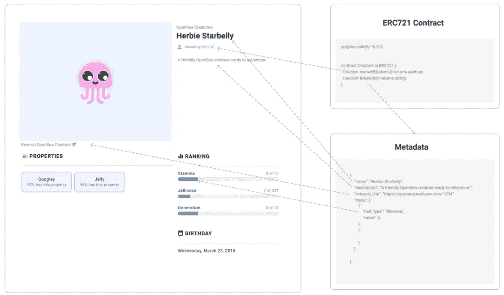

Source — Messari

还有 Filecoin、Sia 和 Storj 等提供分散存储的解决方案。但是，这些解决方案提供了基于合同的存储(CBS)。在 CBS 模型中，用户需要定期付费来存储数据。此外，他们可能不会承诺永久的数据存储。

# 解决方案

Arweave (AR)试图通过在存储和检索数据时应用去中心化来解决这个问题。不仅如此，存储在 Arweave 的区块链上的数据是不可变的，即它将永远存在，不能以任何方式被操纵/更改/删除。这种存储数据的功能是由达成共识的矿工执行的，他们将数据存储在 Arweave 区块链的块中。最棒的是，Arweave 被设计成使用 http 等标准网络协议，可以在任何现代网络浏览器中访问。

在深入研究 Arweave 的其他细节之前，让我们先看看 Arweave 协议的目标市场。

> 交易新手？试试[加密交易机器人](/coinmonks/crypto-trading-bot-c2ffce8acb2a)或者[复制交易](/coinmonks/top-10-crypto-copy-trading-platforms-for-beginners-d0c37c7d698c)

# 市场潜力

众所周知，存储需求正在飞速增长。技术进步使得产生大量数据成为可能。这也使得存储容量成倍增加成为可能。

> 根据《财富商业洞察》题为“云存储市场，2022–2029”，
> T5 的报告，“2021 年全球云存储市场规模为 701.9 亿美元，2022 年将上升至 834.1 亿美元。预计到 2029 年，市场规模将达到 3763.7 亿美元，在预测期内，CAGR 将达到 24.0%。对先进技术不断增长的需求和不断增长的非结构化数据量有望推动市场增长。”

像 Arweave 这样的区块链存储解决方案将不仅限于个人用户，还将被大型机构和公司使用。事实上，Arweave 已经与 Solona 合作，在 Solona 区块链上生成的数据存储在 Arweave 上。本报告稍后将详细介绍这些合作关系。

> 区块链通常会产生大量数据，需要 Arweave 等基于区块链的解决方案来存储这些数据。

# 用例

Arweave 协议的不可变和分散的性质为如下所述的广泛的潜在使用情况提供了重要的效用，

*   可靠的记录存档:一旦数据被添加到 blockweave(下面有更多关于 blockweave 的内容)，它就不能以任何方式被删除或更改。
*   激励式数据存储和服务:数据被快速提供给网络中的所有参与者，包括最终用户。
*   真实性:blockweave 基于相关交易的可验证、可靠的时间戳，在任何给定时间点提供特定数据片段的“存在证据”。
*   分散式应用程序托管:blockweave 比任何集中式应用程序托管平台都能确保对应用程序的可靠访问。
*   出处:任何特定钱包的每笔交易都与来自同一钱包的前一笔交易永久关联，使最终用户能够验证数据的真实来源。

# 技术

**区块编织** [区块编织](https://www.arweave.org/technology#blockweaves)是为 Arweave 提供动力的核心技术。块状织物不同于典型的区块链。传统的区块链是包含事务的块的链接集合。另一方面，Blockweaves 是一组包含数据的块，链接到网络中多个以前的块。

**访问证明** Arweave 使用“访问证明”共识机制。通过这种机制，挖掘者被迫提供旧数据的“访问证明”(PoA)，以便添加新数据块。

**存储禀赋** 想要存储数据的用户必须一次性支付一定的金额(本金)，然后随着时间的推移(以存储购买力的形式支付利息)支付给提供存储空间的用户。Arweave 对存储定价采用了极其保守的估计。

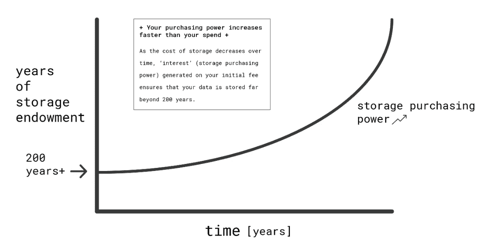

**perma web** perma web 是一个相互链接的文档和应用程序的集合，就像传统的 web 一样，是位于核心 Arweave 数据存储层之上的第二层。传统 web 和 Arweave 的主要区别在于，Arweave 上存储的数据是分散的和永久的。
Arweave 核心层对其内容是不可知的，因此 permaweb 可用于存储各种信息，如 wikis、任何格式的文档、视频和 web 应用程序。一旦数据被上传到 Arweave 上，没有人能以任何方式改变它，甚至是最初的上传者。
简单来说，你可以把 Permaweb 当成数据存储的 Airbnb，数据存储在有备用存储的参与者的磁盘上。

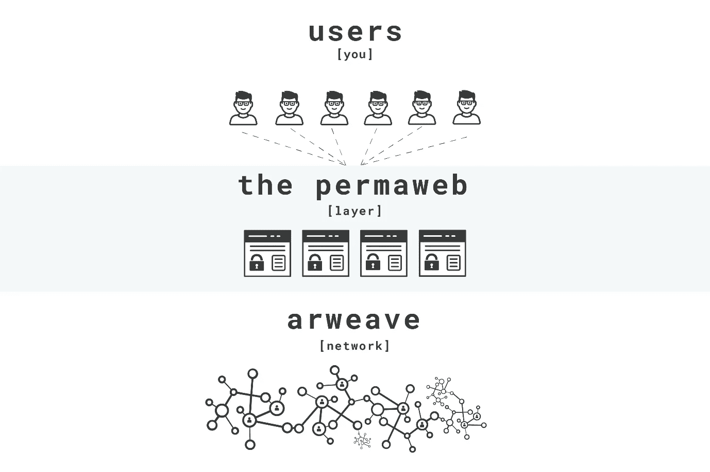

**内容审核** 与传统网络不同，permaweb 使用工具对其内容进行民主审核。这将信息控制权交到了用户手中。Arweave 团队与互联网观察基金会合作识别滥用材料。

**随机存取的简洁证明(SPoRA)**–
为了成功开采一个区块并获得区块奖励，矿工需要证明他们存储的数据是前一个区块的一部分，也是另一个随机选择的称为“召回区块”的区块的一部分。如果矿工不能证明他们拥有召回区块中的数据，他们就不会获得区块奖励。这种独特的共识机制被称为 SPoRA。哪家矿商开采该区块取决于存储容量、计算能力&互联网速度等综合因素。SPoRA 利用了 Monero 的 RandomX 共识。Arweave 的联合创始人萨姆·威廉姆斯帮助开发了 RandomX。

还有一些更值得一提的技术方面

**Bundlr** Bundlr 是 Arweave 协议的第 2 层，它使用户能够用非 Arweave 令牌为 Arweave 存储付费。Bundlr 在内部将非 AR 令牌转换为 AR 令牌。

**Kyve** Kyve 通过在 Arweave 区块链和其他区块链之间提供无缝连接来归档第 1 层链的历史数据。

雷石东
一个保存着阿韦弗区块链数据的 Defi 神谕

# 东京经济学

“AR”令牌的稀缺性是通过 blockweave 数据结构的一致性机制来实现的。AR token 的子单位是温斯顿。

> 1 AR = 1，000，000，000，000 个温斯顿。

AR token 的主要用途是在向区块链上传数据时作为唯一的支付媒介。其他效用是价值交换和奖励矿工的手段。

AR 的最大供应量将为 6600 万，其中 5500 万是在 2018 年 6 月 8 日网络发布时在 genesis 区块创建的。剩余的 1100 万英镑将作为区块开采奖励逐步投入流通。

当用户想要在 Arweave 存储上上传任何数据时，用户必须支付一定的 AR 令牌费用，这些费用不会直接转移给矿工。大部分交易费被转移到一个存储捐赠基金，在一段时间内分配到矿工的钱包里。

在过去的 50 年里，数据存储的成本逐渐降低。这个年平均降幅在 30%左右。得益于存储技术的发展。

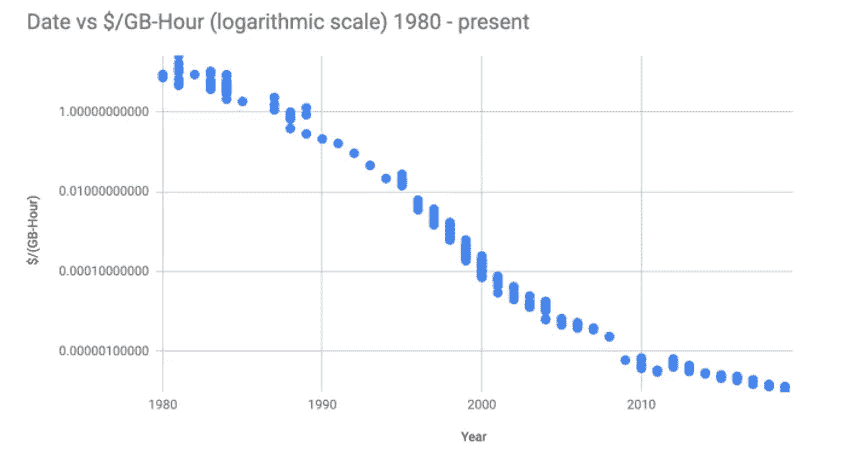

这是另一张描述降低每千兆字节硬盘成本(美元)的图表。

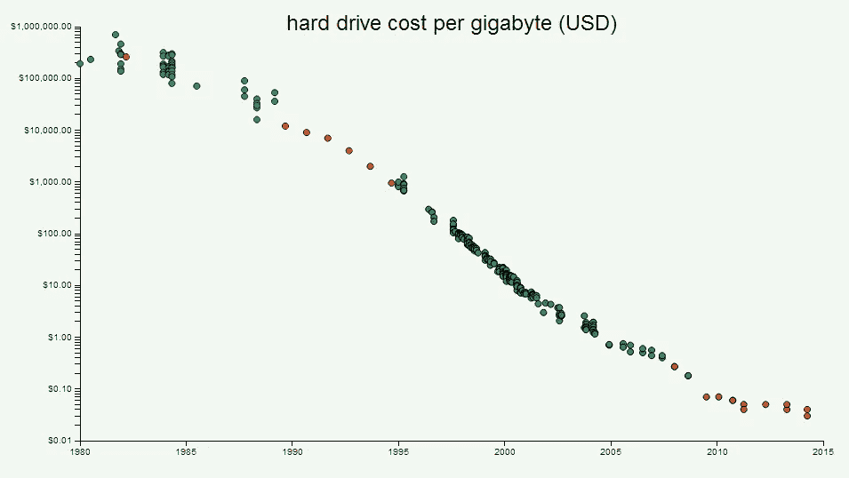

Source: [mkomo.com](http://www.mkomo.com/cost-per-gigabyte-update)

与其他基于月费的存储服务不同，Arweave 对永久存储收取一次性预付款。目前，永久存储的成本为每 GB 3.59 美元。该成本基于其他网络因素是动态的。

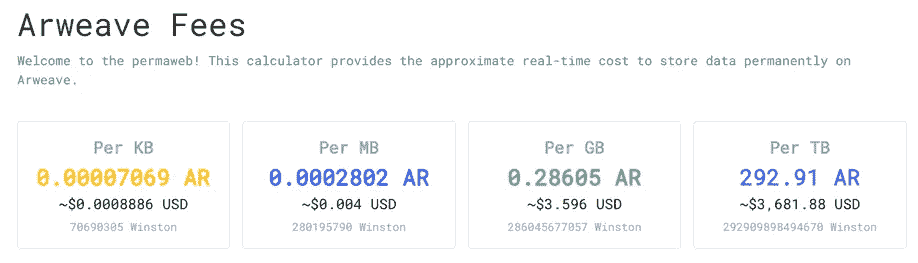

Source — [https://arweavefees.com/](https://arweavefees.com/)

以下是 AR 表征组学的一些细节，

最大值供应量— 66，000，000
总供应量— 64，598，643
流通供应量— 50，108，502
%流通供应量— 51%
市值—756，129，560 美元
完全稀释市值—995，929，811 美元
历史最高(2021 年 11 月 05 日)——90.94 美元
全部

Arweave 在 2017 年、2018 年、2019 年和 2020 年通过各种 ico 筹集了 2200 万美元。一篇发表在 2018 年 5 月 28 日[cryptobring](https://cryptobriefing.com/arweave-ico-review-ar-token-analysis/)的旧文章，有以下 Arweave ICO 发布的详细信息，

大众销售硬上限:870 万美元
总供应量:6600 万
代币分配:大众销售 48.5%，保留 26.5%，生态系统 19.1%，团队 13%，顾问 2.9%。
每枚代币价格:1 AR = $0.74 美元
初始市场上限(以众包价):1800 万美元
接受付款:ETH
不包括国家:美国、中国、朝鲜、伊朗
奖金结构:不适用
预售条款:不适用
重要日期:6 月 7 日开始众包销售
预计代币发行时间:6 月 8 日 mainnet 发布后

**PSC&PSTs** 开发人员可以使用利润分享社区(PSC)表达他们在 Permaweb 上构建的应用程序的所有权和治理权。PSC 由 SmartWeave 中的智能合同表示，SmartWeave 是 Arweave 的智能合同框架。

每个 PSC 都集成了[利润分享令牌](https://arwiki.wiki/#/en/profit-sharing-tokens)。使用 PSC 的 Permaweb 应用程序可以直接将其收入分配给利益相关方。利润分享代币(PST)可以在 PST 交易所创建，如 [Verto](https://testnet.verto.exchange/) 。这使得开发者和应用程序创建者能够为他们应用程序的未来开发建立他们自己的基金。我无法找到 PST 的更多细节，如 AR 协议中存在多少 PST，以及应用程序构建者筹集了多少资金。

# 路标

Arweave 网站没有提供项目路线图的任何细节，但 Arweave 团队发布的黄皮书提供了一些关于未来路线图的提示。以下是黄皮书中提到的三个里程碑，

*   访问的简洁证明——随机访问的简洁证明(SPoRA)是 Arweave 网络的一种新型共识机制。2021 年 2 月 26 日，Arweave 团队[宣布](https://arweave.medium.com/the-arweave-network-is-now-running-succinct-random-proofs-of-access-spora-e2732cbcbb46)实施了 SPoRA。
*   钱包日志
*   快速查找

我找不到关于其他两个功能(钱包日志和快速查找)实施的具体信息。

# 白皮书

Arweave 团队在 2017 年 8 月发布了[原创白皮书](https://www.arweave.org/whitepaper.pdf)。白皮书长达 18 页，提供了该协议(2017 年)提供的所有功能的鸟瞰图。它简要解释了 Arweave 协议架构、使用案例、AR 令牌、Blockweave 等核心技术和访问证明，以及加密和归档等其他技术细节。

名为 [Arweave Lightpaper](https://www.arweave.org/files/arweave-lightpaper.pdf) 的白皮书第二版于 2018 年 4 月 24 日发布。这是关于技术和原始白皮书的一种修订版。

Arweave 团队还发布了[黄皮书](https://www.arweave.org/yellow-paper.pdf)。虽然这篇论文没有发表日期，但它是一篇超过 60 页的综合性论文。本文涵盖以下主要主题——
*令牌组学
*网络:机制设计
*节点:协议合规行为
*分散内容策略
* ar weave 中的自适应机制设计:自适应交互激励代理(AIIA)
* Arweave 协议互操作性和 Permaweb
*未来工作

# 组

[萨姆·威廉姆斯](https://www.linkedin.com/in/sam-williams-2b5111144/)是首席执行官和联合创始人。他和威廉姆·琼斯(首席技术官&联合创始人)一起创建了 Arweave。Arweave 由一家名为最小跨度技术有限公司的盈利实体所有。山姆和威廉在攻读博士学位时是同班同学，他们决定组建 Arweave。大约一年后，威廉离开 Arweave 去完成他的博士学位。Sam 在 Arweave 项目中非常活跃，参与了各种讨论/采访。萨姆的职业生涯始于在肯特大学担任助理讲师。

[Sebastian Campos Groth](https://www.linkedin.com/in/sebastiancamposgroth/) 自 2019 年 6 月起成为首席运营官。
[Arweave 领英简介](https://www.linkedin.com/company/arweave/)
[Arweave Crunchbase 简介](https://www.crunchbase.com/organization/arweave)
[Abhav Kedia](https://www.linkedin.com/in/abhav-kedia-00842b16a/) ，参谋长

虽然我在 Arweave 网站上找不到任何团队成员和顾问的详细信息，但在 LinkedIn 等其他公共平台上可以找到详细信息。团队看起来是正统合法的。

整个团队是技术性的，有相关背景，似乎有能力建立所需的技术。

# 链上指标

以下是来自 Arweave 的区块链探索者的一些度量标准。该数据显示，关键指标如每月交易量、织物尺寸量、数据使用量都在持续增长。自该项目启动以来，每月交易量增长了五倍，这是一个好迹象。

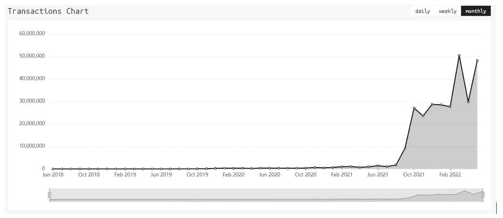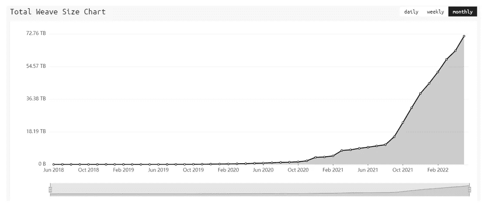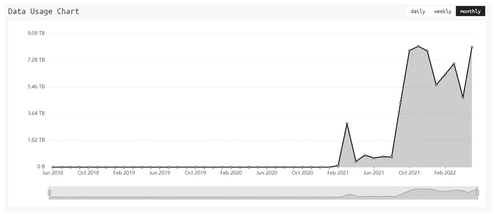

下面是 Arweave 节点图的图表。

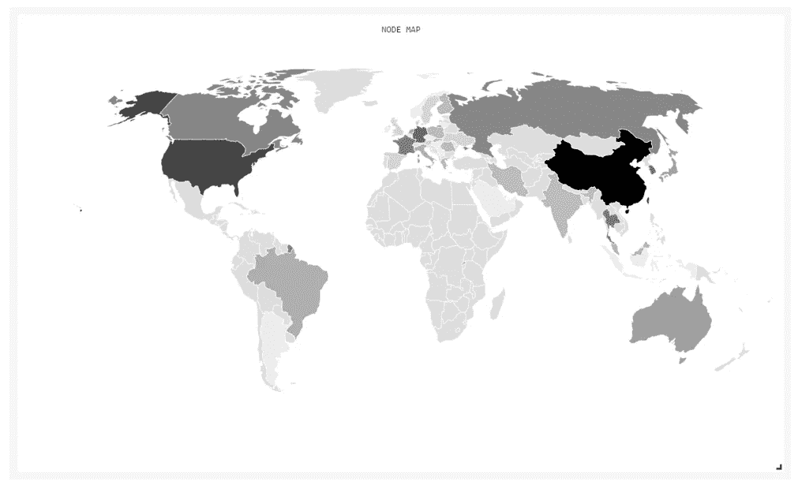

下面是 Messari 的图表，提供了 2021 年第三季度 Web3 基础设施和中间件协议的详细信息。可以看出，Arweave 以舒适的余量领先。

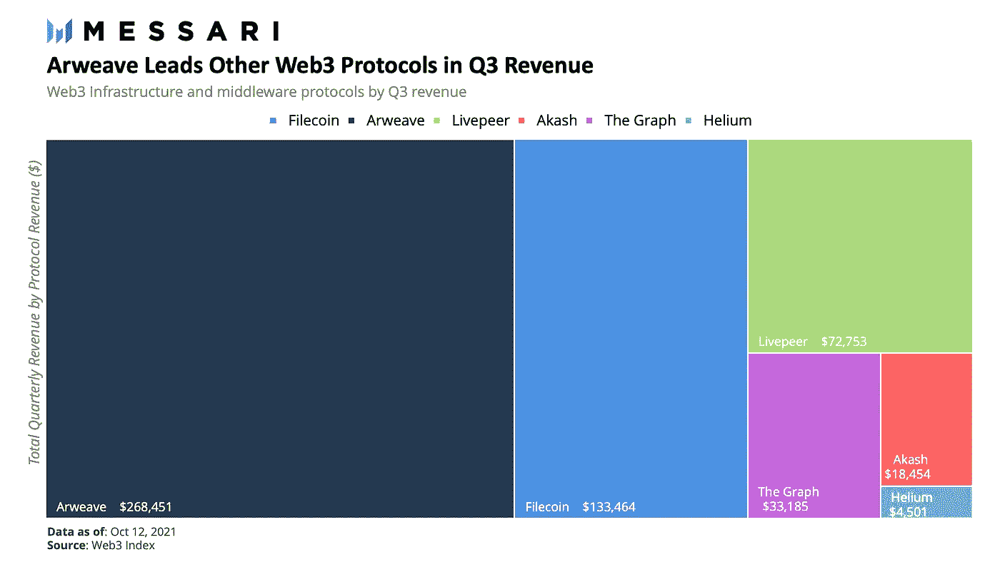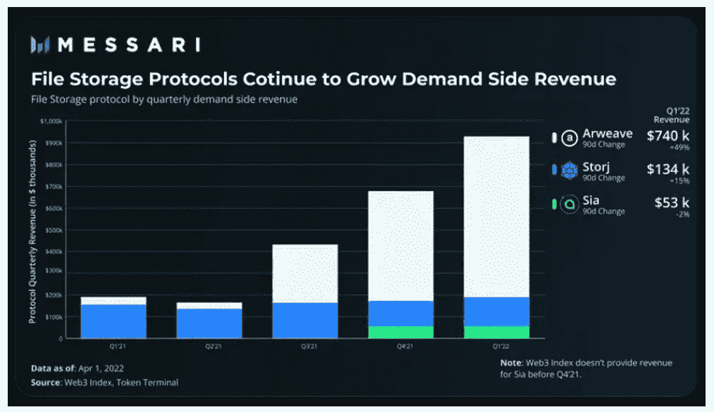

# 开发者活动

Arweave 的公开 github 分析显示低到中等的活动。这并没有提供开发活动的全貌，因为许多团队使用私有存储库来进行他们的开发活动。

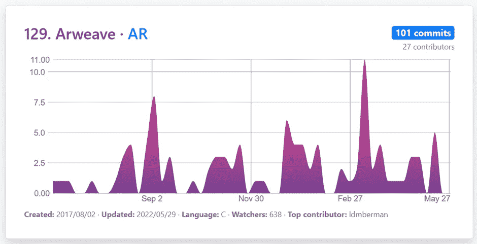

Image by [CryptoMiso](https://www.cryptomiso.com/#AR)

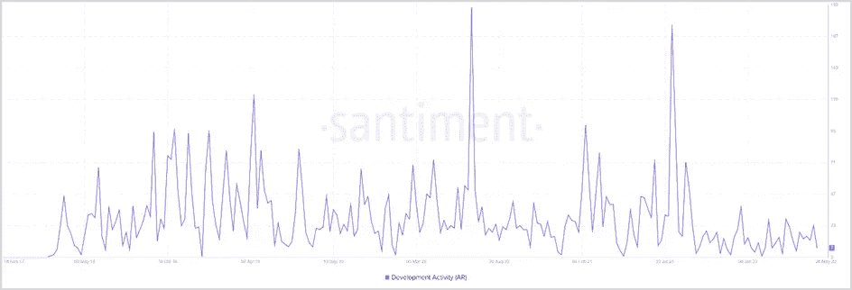

Image by [Santiment](https://app.santiment.net/)

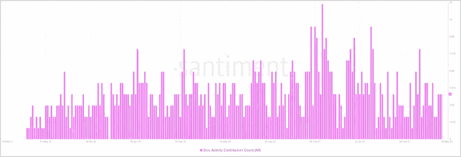

Image by [Santiment](https://app.santiment.net/)

有关开发活动的更多信息，请查看 Arwave 的[公共 github 知识库](https://github.com/ArweaveTeam/arweave/pulse/monthly) insights。

# 社会参与

Reddit:【https://www.reddit.com/r/Arweave/
T4 Arweave 的 Reddit 社区成立于 2018 年 2 月，拥有 4600 名成员。社区相当活跃，成员们正在询问与 Arweave 定价相关的问题。

推特:[https://twitter.com/ArweaveTeam](https://twitter.com/ArweaveTeam)
66K 左右的追随者。2017 年 8 月加入。Arweave 的推特账户相当活跃。首席执行官萨姆·威廉姆斯也活跃在 Twitter 上。下图由 [Santiment](https://app.santiment.net/) 制作，显示 Twitter 的稳步增长，这是一个好迹象。

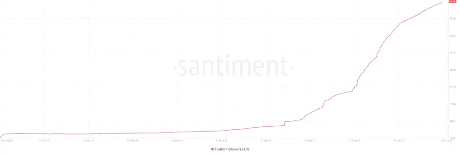

chart by [Santiment](https://app.santiment.net/)

电报:[https://t.me/arweavers](https://t.me/arweavers)
这是一个非官方的电报团体，成员不足 2000 人。没什么了不起的。

Discord:[https://discord.com/invite/Cz4tkDs](https://discord.com/invite/Cz4tkDs)
Arweave 社区在 Discord 上比其他社交平台活跃得多。它有几个不和谐的团体，共有 20K+成员
Arweave Dev Talk—[https://discord.com/invite/Cz4tkDs](https://discord.com/invite/Cz4tkDs)
Arweave Miners—[https://discord.com/invite/GHB4fxVv8B](https://discord.com/invite/GHB4fxVv8B)
Arweave Chat—[https://discord.com/invite/3Dad8J7](https://discord.com/invite/3Dad8J7)

媒体:[https://arweave.medium.com/](https://arweave.medium.com/)
Arweave 的媒体账号拥有 27000 名粉丝，非常活跃，定期发布与项目各方面相关的信息。

Instagram: Arweave 在 Instagram 上似乎根本不活跃。有一个名为@arweavenews 的账户声称是一个官方账户，但即使是这样，似乎也是死的。

YouTube:[https://www.youtube.com/c/Arweave](https://www.youtube.com/c/Arweave)
频道创建于 2017 年 8 月，只有 197 万订户。内容主要是信息，是长视频和短视频的混合。但是内容不是定期发布的。在一些月份，有 10+个视频，而一些月份则完全没有。视频缩略图也不怎么样。看来 Arweave 需要更好的内容& SEO 指导。

LinkedIn:[https://www.linkedin.com/company/arweave](https://www.linkedin.com/company/arweave)
接近 23000 名粉丝。没什么活动。

社区:
你可以在这里获得更多 Arweave 的所有社交和基于 Arweave 平台[构建的应用的详情。](https://www.arweave.org/get-involved/community)

# 生态系统

利润分享社区–
利润分享社区就像开源公司。这些社区支付利润红利。他们对创始人和贡献者都有利。阅读更多关于[利润分享社区](https://www.arweave.org/profit-sharing-communities)的信息。

Arweave 社区–
Arweave 社区由所有构建在 Arweave 平台上的应用组成。下面是快照。

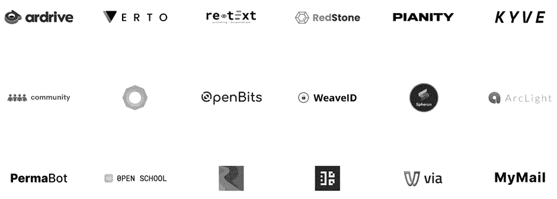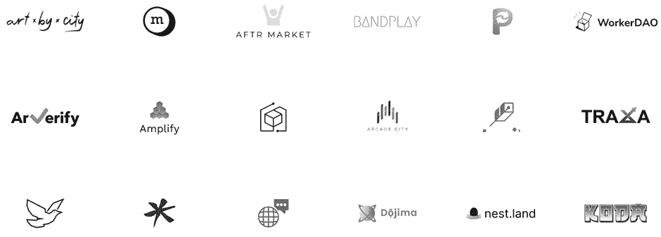

更多详情[此处](https://www.arweave.org/get-involved/community)。

投资和资助 Arweave 为那些想在 Permaweb 上开发应用程序的开发者提供资助。网站上没有关于选择哪些申请以及提供多少资助的详细信息。开发者需要联系 Arweave 团队。

**Open Web Foundry** [Open Web Foundry](https://owf.dev/)是孵化器和加速器计划的结合。它帮助创始人和建设者创建、推出和发展他们的利润分享社区和 permaweb 应用程序。

Arweave 还为有兴趣在 Permaweb 上构建应用的开发者提供免费的初始存储空间。同样，网站上没有详细信息。

**用 Arweave** 构建 Arweave 为想要构建应用的开发者提供了几个[资源](https://www.arweave.org/build)。

**交易所** 集中交易所(CEXs)
币安(AR/USDT，AR/BUSD，AR/BTC)
库科恩(AR/USDT)
Gate.io (AR/USDT)

Arweave 项目的一些著名投资者包括 Multicoin Capital、比特币基地风险投资公司、Andreessen Horowitz、Techstars 和 Union Square Ventures。

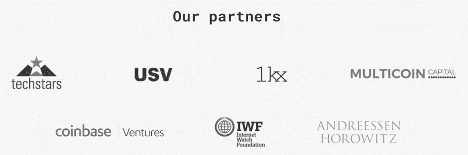

**合作关系** 一些主要的区块链，如 Solona、Cosmos、Avalanche、Polkadot、NEAR、SKALE、Mina、Celo，都集成使用 Arweave 来存储在其区块链上生成的数据。采用 Arweave 进行数据存储是 Arweave 的最大驱动力。

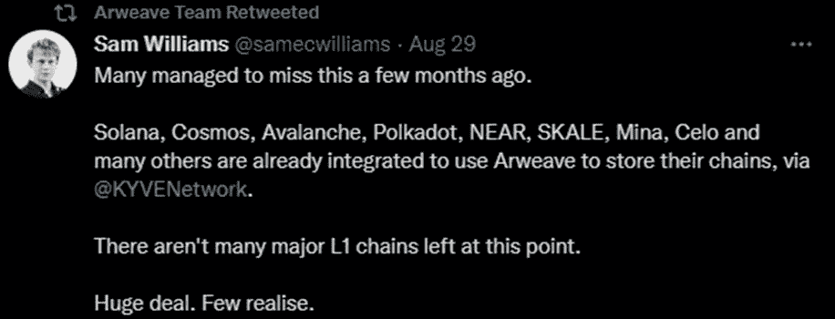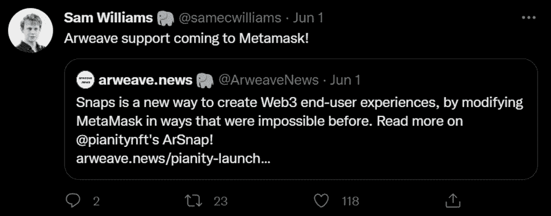

下面是火币孵化器最近整理的一个 [Twitter 空间](https://twitter.com/i/spaces/1nAJEYzkDDkJL?s=20)。

根据 [web3index](https://web3index.org/) ，这是一个旨在识别 web3 领域中最受欢迎的协议的指数，Arweave 以轻松的优势名列榜首。此索引是由其他加密项目“Livepeer”创建的。

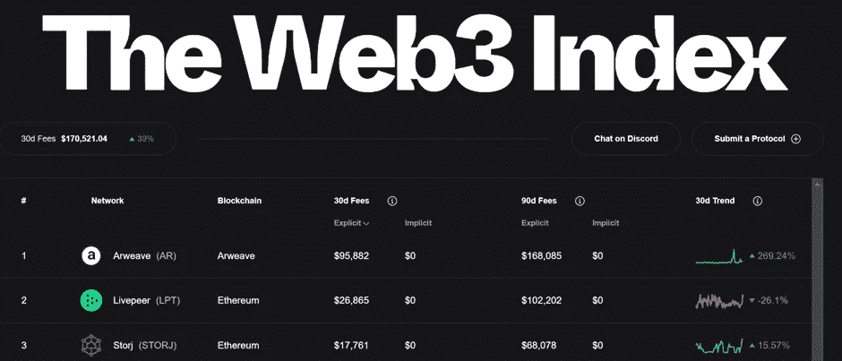

2021 年 10 月，领先的加密索引协议之一‘The Graph’[与 Arweave](https://thegraph.com/blog/graph-arweave) 集成。

10 月 6 日。2021 年，以太坊博客平台“镜子”向所有人开放。 [Mirror 使用 Arweave 来存储所有的博文](https://decrypt.co/82703/ethereum-based-blogging-platform-mirror-opens-up-to-everyone)。

同月，数据实现协议 KYVE network 从 Crypto VCs 融资 280 万美元。大多数加密货币，如 Avalanche、Zilique、Polkadot 的 Parachain、Moonriver、NEAR Protocol & Injective Protocol(INJ)。

2021 年 11 月，Arweave 通过 Bundlr 网络与以太坊领先的缩放网络 [Polygon 整合。](https://blog.polygon.technology/polygon-adds-permanent-data-storage-with-arweave-integration/)

“波士顿咨询集团”的助理 Alana Levin 在 Arweave 上发了一个很好的 Twitter 帖子。BCG 跟踪 Arweave 是件大事！强烈推荐阅读！！

2022 年 3 月，建立在 Arweave 网络上的分散化 NFT 音乐市场[“Pianity”从著名的秘密人士那里筹集了 650 万美元](https://arweave.news/pianity-raises-over-6-mil-funding/)。

ArDrive 建立在 Arweave 的基础上，是 Google drive 的分散式替代方案[,从各种加密风投那里筹集了 1700 万美元](https://www.coindesk.com/business/2022/03/03/ardrive-raises-17m-to-make-arweaves-data-storage-blockchain-more-usable/)。

2022 年 3 月， [Arweave 与 Arbitrum](/bundlr-network/users-on-arbitrum-can-now-permanently-store-their-data-on-arweave-via-bundlr-network-85b2878f6c11) 合作，通过 Bundlr 网络在 Arweave 上永久存储他们的数据。

# 安全审计

不幸的是，在为这份报告做研究时，我没有找到任何第三方审计公司所做的安全审计的任何清晰简明的信息。也没有找到 Arweave 团队安排的 bug 赏金计划的信息。我发现了一篇由 [Andre Cronje](https://za.linkedin.com/in/andre-cronje?original_referer=https%3A%2F%2Fwww.google.com%2F) (他后来创建了渴望金融)写于 2018 年的旧文章，其中他对 Arweave 进行了代码审查。他的结束语——

> *我真的很喜欢，通过强制共识层把矿工变成存储节点很性感。好的，简洁的代码。设计良好且有据可查。老实说，我仍然会在 IPFS 和 S3 存储我的数据，但如果他们的令牌足够便宜，这可能是一个很好的存储解决方案。*

你可以在这里阅读整篇文章[。](https://cryptobriefing.com/arweave-code-review-decentralized-storage/)

关于 [Arweave ICO](https://cryptobriefing.com/arweave-ico-review-ar-token-analysis/) 回到 2018 年还有一篇文章。以下是进行此审查的团队的结论——

> *虽然 Arweave ICO 背后的团队对创业世界来说是新手，但他们已经设法通过即将推出的 mainnet 带来了一种新颖的存储解决方案。尽管存在竞争和关于扩展的问题，我们认为 Arweave 是存储协议中的一个有力竞争者。*

Arweave 团队在 2020 年 12 月发布了一条关于 NCC 团队对新算法 SPoRA 进行安全审计的推文。

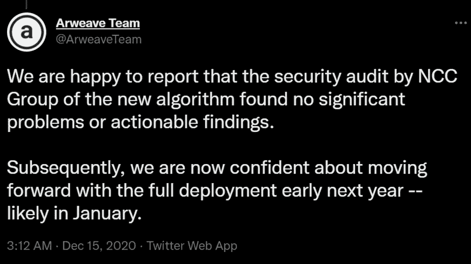

我试图在各种区块链安全公司的网站上找到有关最近安全审计的任何信息，但没有得到任何信息。如果我得到任何信息，我会更新这份报告。如果你知道我错过的任何安全审计，请在下面的评论中告诉我。

# 评级机构的评级

TokenInsight 是根据特定标准提供评级的评级公司之一。Arweave 的评级为“前景稳定的 BB”。此评级最后更新于 2022 年 6 月 4 日。你可以在这里看看最新的状态[。](https://tokeninsight.com/en/coins/arweave/overview)

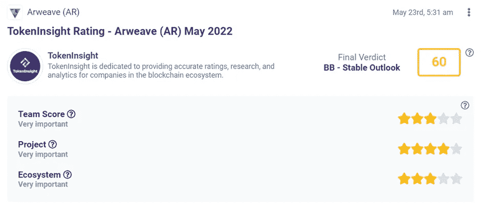

好像除了 TokenInsight，其他像 Baserank，Blocknomy & SIMETRI 这样的评级机构都还没有做任何审核。

# 摘要

*   在 github 公共资源库上可以看到低/中等程度的项目开发活动，但没有太多关于错误修复、以前和未来版本的详细信息。虽然开发也发生在私有存储库中，但是这种信息的可用性提供了更多的信心，即开发正在积极地进行，并且 bug 正在被定期地识别和修复。
*   区块链协议开始流行。许多新的用例正在区块链上实施。与大区块链协议公司的合作可以使 Arweave 成为区块链存储市场的领导者。Arweave 有先发制人的优势，坚实的技术和干净的记录。
*   Arweave 价格行动是相当明智的。到目前为止没有观察到大的泵转储，这是好的。
*   Arweave 团队很好，最重要的是它很明智。他们正在悄悄地研究他们的协议。
*   虽然 AR 令牌目前是通货膨胀，但如果 Arweave 被其他大型区块链协议采用，它可能会成为长期通货紧缩。这主要是因为与其他协议相比，AR 令牌的总供应量有限。

**风险**

*   来自新进入者和现有协议的竞争。虽然，Arweave 目前提供独特的主张，新的协议可能会提出更好的主张。
*   当我在 Arweave 的 viweblock explorer 上检查顶级地址时，我发现有 10 个地址拥有 Arweave 总令牌供应量的一半，即大约 3000 万个令牌。我不确定这些地址是属于 Arweave 区块链的智能合约，还是属于个人投资者/风投。如果这些地址属于个人投资者/风投/投资基金，那就要担心了。
*   Arweave 网站没有一个清晰的未来功能开发路线图。投资者需要了解项目的发展方向，因此应该对此进行研究。
*   Arweave 文件没有明确的授权时间表细节。目前还不清楚 Arweave 团队成员如何使用分配给他们的 ar 令牌。
*   团队缺乏营销。团队可以在营销协议方面做得更好，而无需在营销预算上花费太多。简单的改变，如更好的 YouTube 内容策略，更多地参与其他社交媒体平台，会带来很大的不同。我能想到的缺乏营销的一个原因是，Arweave 团队像其他加密协议一样专注于高价线索，而不是专注于零售用户。
*   缺少安全审计或缺少关于安全审计的官方信息是一个严重的问题。频繁发生的高调黑客事件凸显了定期安全审计的必要性。
*   很少有关于挖掘 AR 令牌的担忧。请务必阅读此帖子了解更多详情。
*   基于 Arweave 平台的应用正在增长，但用户参与度似乎有所下降。

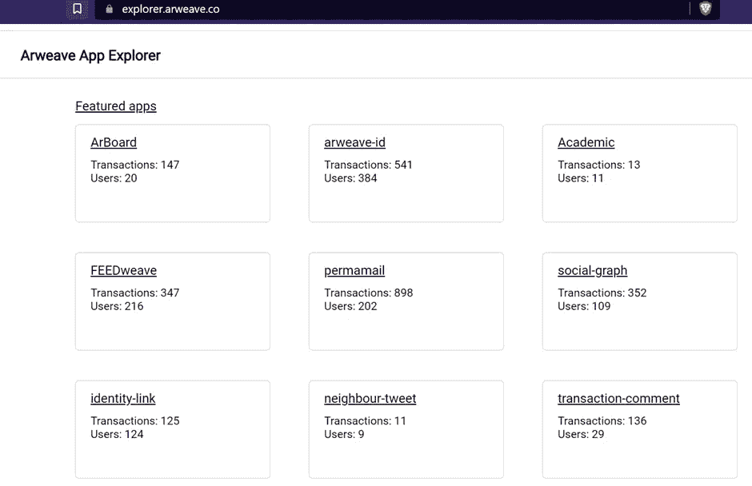

*   Arweave wallet extension 只有 20K+的下载量，这还不错，但也不算太好。

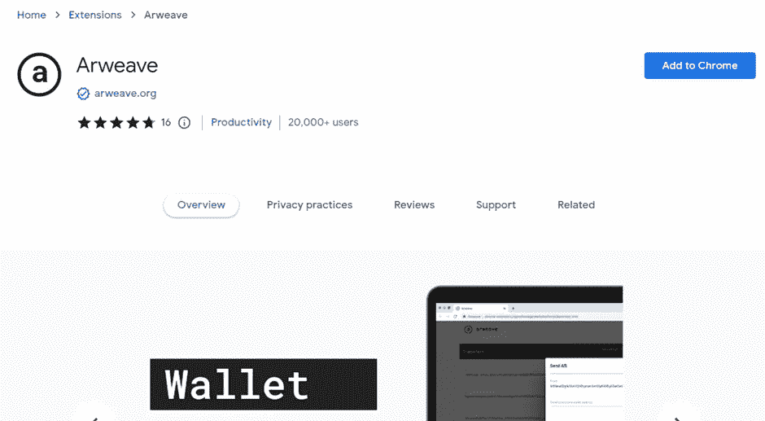

感谢阅读！请在下面的评论中告诉我你对这个 FA 的看法。另外，如果我错过了 Arweave 基本面分析的任何方面，请告诉我。

# 资源

[Arweave Wiki](https://arwiki.wiki/#/en/main)
[激励和去中心化的通往永久 web 的网关](https://ar.io/)
[链接腐烂:Web 正在腐烂](https://arweave.medium.com/link-rot-the-web-is-decaying-cc7d1c5ad48b)
[构建去中心化的 Web —第一部分:问题](https://arweave.medium.com/building-the-decentralised-web-part-one-the-problem-9766f1987c91)
[构建去中心化的 Web —第二部分:组件](https://arweave.medium.com/building-the-decentralised-web-part-two-the-components-97409d1fe545)
[云存储市场，2022–2029](https://www.fortunebusinessinsights.com/checkout-page/102773)
[https://arweave.news/](https://arweave.news/)
[https://coinmarketcap.com/currencies/arweave/](https://coinmarketcap.com/currencies/arweave/)

# 放弃

*   我所有的内容都是我个人的看法。这不是一个财务建议。
*   我不属于任何金融机构，也不是合格的财务顾问。
*   密码市场非常不稳定。投资前做好自己的研究。
*   我的观点是基于我所能收集到的信息。因此，我不对你的任何投资决定负责。
*   截至 2022 年 6 月 6 日，我没有任何 Arweave 代币。