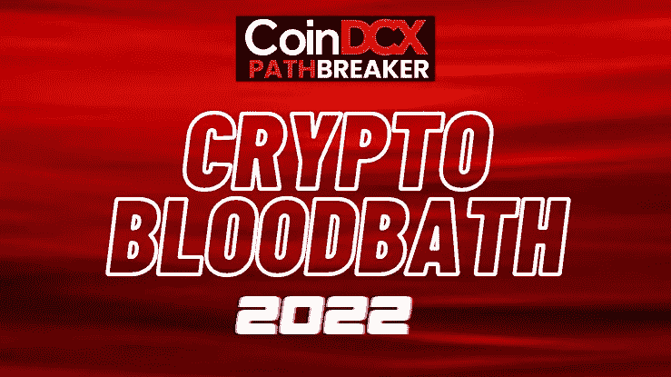
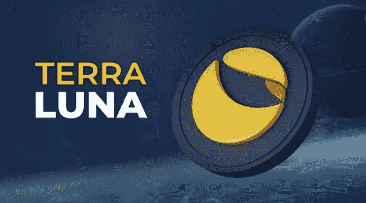
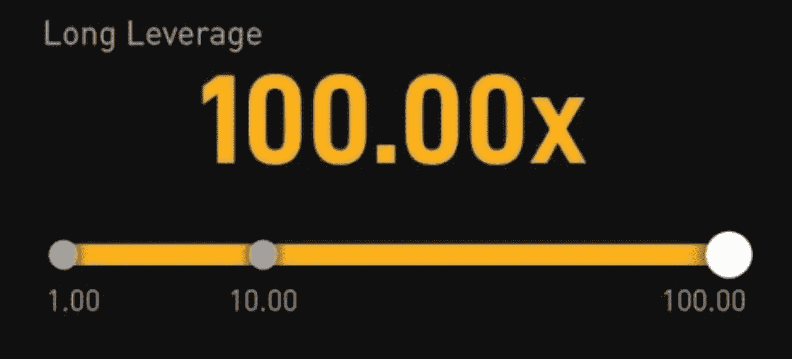

# 加密出错了，❌

> 原文：<https://medium.com/coinmonks/crypto-has-gone-wrong-5a407ff3f699?source=collection_archive---------24----------------------->

# CoinDCXpathbreaker

对于所有的隐密原生生物来说，最近隐密生物的大量死亡是最糟糕的景象。所有进入这个领域的散户都充满了幻想🤩现在已经被奥林匹斯山的崩塌摧毁了。

在这篇文章中，我将解释为什么我觉得 CRYPTO 已经完全失去了剧情&出了问题…至少在可预见的未来。

## $LUNA 的崩溃

第一，让我们把怪物赶走。发生在$LUNA 身上的不仅仅是对 Terra 的攻击，而是对整个密码社区的攻击。

阴谋论、网络攻击、间接利用、协议漏洞等等……我会在情感层面上写下我对这种情况的理解。

Terra 和社区认为他们太大而不能倒——我也有同样的想法。事实是，发生在 Terra 上的事，可能会发生在太空中的任何项目上。我并不为风投或百万富翁感到难过，而是为那些眼中带着梦想投入项目的散户投资者感到难过。我读到过人们如何将毕生积蓄投入锚定协议，以获得稳定的 20%贷款收益率……这些是天真的工薪阶层，他们试图保障自己的未来。是的，无情的人可以嘲笑他们把所有的钱都放在一个投资想法上，但是请记住——Terra，$LUNA，$UST &主播协议不是低价股或狗屎硬币，他们是精英中的精英……然而，他们在很多方面都失败了。

试图恢复$UST 与$1 的挂钩… Terra &团队从来没有考虑到，他们的机制在地面上是如此有缺陷，以至于如果像快速 depeg 这样的事情发生，$LUNA，$UST & Anchor 协议都会集体失败。这清楚地表明了团队是如何将自己视为一个不知道失败的实体的。

至少可以说，像$LUNA 这样的硬币从左、右、中被摘牌是令人失望的……在这次惨败之后，每个交易者现在都会带着怀疑和怀疑的眼光看待一个项目。

**最后更新** : Terra 放弃了露娜和 UST，并努力分叉 Terra 网络来保护 L1。

这非常令人失望，但是考虑到 Terra 是如何不可思议地未能找到解决方案，并定期更新社区，这就不再令人惊讶了。换句话说，这个项目失败了。

任何持有露娜和/或 UST 的人都有一个补偿计划。

**继续阅读了解更多:**[https://agora . terra . money/t/terra-ecosystem-revival-plan/8701](https://agora.terra.money/t/terra-ecosystem-revival-plan/8701)

## 鲸鱼的进入🐋

Laser eyes during BTC bloodbath 😒

人能蠢到什么程度？好吧，你得去推特上看看。在比特币价格达到 6.9 万美元的时候——拥有大量追随者的 BTC·马克西马主义者建议人们抵押他们的房子，因为 BTC 将直接达到 10 万美元——每个人都从那里参观 REKT CITY。

中本聪的愿景是让 BTC 成为人民的货币，这意味着小个子有大梦想。今天，我们看到公司因为他们庞大的现金流而装满了他们的袋子，并且在每一次购买中都捞到了数千个比特币。

告诉我这是怎样的去中心化？如果 Saylor、Musk、Grey Scale、Circle 等都在汲取如此多的供应&这种供应本质上是通缩的……那么，如果有一天它们都决定抛售，以获得大量利润，那该怎么办？零售平民将何去何从？

这正是我在文章中提到的原因， **Crypto 出错了** ❌

## 假人的杠杆⚠️

Cryptos biggest enemy

这是什么鬼话？100 倍杠杆？

作为一个散户，尤其是新手，你知道 100 倍杠杆的误差范围吗？

我不想打断你，但你对 100 倍的风险容忍度不到 0.1%——所以如果你用 100 倍@ $30，000 做多比特币，而 BTC 甚至下跌了$200，嘣！清算 101。

随着订单更多地转向技术方面，你知道 100x 在市场上创造什么样的泵吗？当鲸鱼用大小交易时，他们可以很容易地用大量订单移动市场，并欺骗资产的整个订单簿——任何一方。

这也给加密带来了长挤压和短挤压的概念…

*   对许多空头来说，资金是负数——一根巨大的绿蜡烛消除了空头交易者的所有止损
*   对许多未平仓的多头来说，资金是积极的——一根巨大的红烛消除了多头交易者的所有止损

大宗商品和外汇市场的杠杆率甚至可以达到 125 倍以上，因为它们的价格波动如此之大。加密本质上是超级不稳定的&当你看它们的百分比收益和损失时，我觉得所有的硬币都已经被杠杆化了。那么为什么要杠杆呢？

最糟糕的是，交易所在交叉保证金模式下提供 125 倍的杠杆。

你可能会觉得，好吧，我在 100 倍的基础上建立了一个只有 100 美元的头寸，所以我只会损失 100 美元。不对！在交叉保证金模式下，你将失去你的 100 美元以及你所有的期货交易账户。这就是风险。

## 这些该死的迷因硬币

Nuff said! Woof Woof

加密应该为我们提供效用，并打破我们传统金融的链条。

**回车-迷因币**

*   实用工具:那是什么？
*   **供应:嗯……无限量**
*   **记号经济学:谁在乎**？

这些迷因币在 2021 年牛市期间支配了每个新投资者的投资组合，因为影响者利用它们获得了巨大的收益。每个人都想要 100 倍，没有人再关心效用了…极度兴奋！嘣，迷因掉了，没人笑。

Memecoins 让人们更多地了解柴犬，而不是比特币，这是加密领域最糟糕的部分。他们的堕落现在让大多数人相信 crypto 是一个骗局&他们可能不会回来了。

## 结论

作为一个社区，关注教育我们自己和我们周围的人是非常重要的。我们需要让知识成为我们的使命，让人们出于正确的原因进入这个领域。

你可以从很多地方了解加密、协议、基础设施、区块链、框架、项目研究……专注于这些，而不是在 Telegram & Twitter 上搜索下一个 1000 倍的 gem。

如果你是一个绝对的初学者，我会建议你从像 [CoinDCX](https://medium.com/u/a30fa2b03c2f?source=post_page-----5a407ff3f699--------------------------------) Learn initiative 这样的资源开始学习，与社区成员交谈，参与 Discord servers 项目——罗马不是一天建成的，也不要打算在一天内到达月球。

***非常感谢 CoinDCX 给我这个机会撰写如此详细的报告，并成为# CoinDCXpathbreaker 计划的一部分，使我能够与加密领域的每个人分享这些知识。***

> 加入 Coinmonks [电报频道](https://t.me/coincodecap)和 [Youtube 频道](https://www.youtube.com/c/coinmonks/videos)了解加密交易和投资

# 另外，阅读

*   [3 商业评论](/coinmonks/3commas-review-an-excellent-crypto-trading-bot-2020-1313a58bec92) | [Pionex 评论](https://coincodecap.com/pionex-review-exchange-with-crypto-trading-bot) | [Coinrule 评论](/coinmonks/coinrule-review-2021-a-beginner-friendly-crypto-trading-bot-daf0504848ba)
*   [莱杰 vs Ngrave](/coinmonks/ledger-vs-ngrave-zero-7e40f0c1d694) | [莱杰 nano s vs x](/coinmonks/ledger-nano-s-vs-x-battery-hardware-price-storage-59a6663fe3b0) | [币安评论](/coinmonks/binance-review-ee10d3bf3b6e)
*   [Bybit Exchange 审查](/coinmonks/bybit-exchange-review-dbd570019b71) | [Bityard 审查](https://coincodecap.com/bityard-reivew) | [Jet-Bot 审查](https://coincodecap.com/jet-bot-review)
*   [3 commas vs crypto hopper](/coinmonks/3commas-vs-pionex-vs-cryptohopper-best-crypto-bot-6a98d2baa203)|[赚取加密利息](/coinmonks/earn-crypto-interest-b10b810fdda3)
*   最好的比特币[硬件钱包](/coinmonks/hardware-wallets-dfa1211730c6) | [BitBox02 回顾](/coinmonks/bitbox02-review-your-swiss-bitcoin-hardware-wallet-c36c88fff29)
*   [BlockFi vs 摄氏](/coinmonks/blockfi-vs-celsius-vs-hodlnaut-8a1cc8c26630) | [Hodlnaut 点评](/coinmonks/hodlnaut-review-best-way-to-hodl-is-to-earn-interest-on-your-bitcoin-6658a8c19edf) | [KuCoin 点评](https://coincodecap.com/kucoin-review)