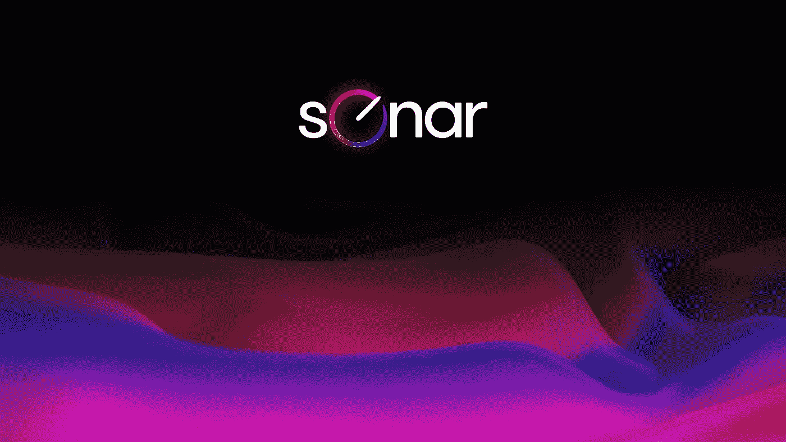
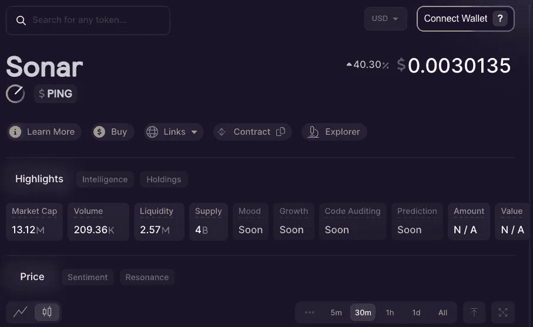

# 加密隐藏的宝石:声纳$平，我的独角兽发挥

> 原文：<https://medium.com/coinmonks/crypto-hidden-gems-sonar-ping-my-unicorn-play-cf77a3b221af?source=collection_archive---------4----------------------->

BSC 不贵，速度快，而且垃圾遍地。但是在过去的 9 个月里，一个出色的开发团队一直在稳步构建一个相当史诗般的平台

Image: Sonar Platform

> 投资应该更像是看着油漆干，或者看着草长。如果你想要刺激，带上 800 美元去拉斯维加斯——保罗·安东尼·萨缪尔森

# 为什么我是声纳兵

如果你还不知道，我是 [PING](https://www.sonarplatform.io/) 的受益持有人。我不为他们工作，也和他们没有任何私人关系。但从去年 10 月开始，我一直在稳步投资这个项目，我认为它们值得一谈。

我在我的文章中时不时地提到这个项目，但是我没有做这种无聊的评论。这个项目非常年轻，还没有被证实。但是他们现在已经到了一个地步，我相信与他们分享我的经验是有价值的。

在早期的[文章](/coinmonks/crypto-risk-management-to-vc-or-not-to-vc-60dc3682a857)中，我提出加密投资就像大众的风险投资。总的来说，区块链公司正处于发展的实验阶段。今天，我们所有投资加密技术的人都处在实验的前沿。

当我第一次从一个(非常成功的)加密投资者朋友那里听说 PING 时，Sonar 平台只不过是一个有远见的团队。我模仿了一点，只是因为朋友推荐。直到我完成了我的[作业](/coinmonks/crypto-investing-how-to-dyor-1e6dabdb1de9)，我才真正开始投入更多。

从加密投资的角度来看，我是超级保守的。我最喜欢的策略是提供稳定的货币对流动性、共识赌注链令牌和小型初创企业。我不会碰迷因、NFT，直到最近，我尽可能远离德根 DeFi 策略。

平开始是我的一个小包，长包。在我参与的六个游戏中，唯一一个我一直稳步上升的游戏是 PING。原因如下:

## 开发团队

核心创始人从一开始就完全不相信。没有闲扯，没有假名，只有真实的人，我可以在 LinkedIn 上查找，看看他们到底在做什么。他们不是美国宇航局的科学家，但他们有合法的证书。

我听过他们定期的 ama。超级谦虚，脚踏实地，通常提供现实的预测。他们已经完全坦白(据我所知)了他们在做什么和他们搞砸了什么。他们在社交网站和电报上是 100%可及的。

路线图里程碑始终得到一致的交付，通常会提前完成。他们把时间花在工作上，而不是炒作和炒作。他们对创业基金持保守态度，他们看起来都有价值/目标，没有明显的冲突或公共事件。

## 法规遵循

我在传统金融领域的大部分学术研究和出版都集中在证券法和反洗钱(AML)合规与风险管理方面。正因为如此，我知道很多这样的人拿出坟墓叉和疯狂的迪菲农场是在玩火。

这些协议迟早会被禁。事实上，DeFi 以外的许多加密项目也确实模糊了监管界限，我认为这对大多数项目来说也不是好兆头。相比之下，声纳团队从第一天起就专注于法规遵从性。

毫不夸张地说，我所见过的在密码领域运作的其他项目都是价值数十亿美元的公司。任何计算机科学呆子都可以复制/意大利面古墓丽影叉子。公平地说，学习稳固性和建立一个网站可能是一个挑战。

但涉水通过多辖区反洗钱法规和证券法？几个密码小子可以在两周内推出古墓丽影，叫嚣着达到一个显著的市值。但他们不可能通过遵守法规来虚张声势。

换句话说，声纳正在为可持续发展做需要做的事情。他们建立在合法的、法律认可的基础上。这是一条艰难而艰难的路线，但却是安全的路线。这是我辛苦赚来的钱长期存在的一个重要原因。

## 声纳平台

该平台仍处于早期测试阶段。他们新的从头开始构建的人工智能驱动的情感分析工具随时都会发布。他们慢慢上线的工具已经开始减少我打开进行研究的标签数量。而且穿起来很好看。

随着他们对平台和公司的发展方向有了更多的了解，我看到了更多的潜力。不是炒作驱动的、理论上的用例潜力，而是我在现实世界中看到的价值，包括(正如我从一路上的小提示中收集到的)创收基础设施。

Image: author screenshot

新闻编辑室订阅源(未显示)现在是我的每日签到时间。作为一名新铸造的 DeFi degen，我迫不及待地想参观 DeFi 工作室。对于交易者来说，很快就会有工具出现，NFT 人群，投资组合管理工具，一个“whalewatch”功能和一个钱包。

当然，这些都还没有到位，它们可能都是无用的。对于车队来说，前方肯定有一些相当大的技术挑战。我对他们交付能力的信念可能被证明是错误的。

但是我还没有看到声纳小组做任何让我怀疑他们的事情。除了像 BNB、AVAX 或 FTM 这样的连锁代币之外，我对我投资过的任何其他代币都不能这么说。

## 其他投资者

我在 Telegram 语音聊天中遇到并听到了一些其他投资者，他们与我在伦敦经济学院遇到的任何人都不相上下。我的投资伙伴不是“文月亮”猿。他们考虑周到，全面，而且精明。

把我介绍给平的朋友是一个在 Solana 和 Polkadot 市值数百万时买入它们的人。他不是傻瓜，他有一大袋声纳。当然，聊天中也有月亮狗、福德狗和猿猴，但它们来来去去。我在语音中遇到的或者在聊天中读到的投资人，都是我见过的实诚人。据我从他们中的一些人那里听到的，大多数真正的大投资者从来不吭声。

## 别骗我，有什么坏处？

这是一家新公司。它才成立 9 个月，初创企业失败的方式远远多于成功的方式。否则，初创企业会一直成功。风投的[成功率约为 7.5%](https://corporatefinanceinstitute.com/resources/knowledge/other/how-vcs-look-at-startups-and-founders/) 。换句话说，风投们投资的*绝大多数*项目可能不值得这么麻烦。声纳可能是我的项目之一。

显然我不认为是这样，但我对各种东西都是错的。我过去做过愚蠢的投资决定。我高价买进，低价卖出。我很容易受到确认偏见的影响。我错过了清晰的危险信号。基本上，我和其他所有投资过投机资产的人一样。

如果五年后 Sonar 是一家价值数十亿美元的公司，象征性价格为 10 美元，人们会说我才华横溢。如果明年象征性价格降到零，球队解散，他们会说我是傻瓜。两者都不对。这只是一个计算过的风险。

我并不总是最擅长数学，但对我来说，声纳 PING 计算很有意义。我并不是建议你应该跑出去，一头钻进去。我建议你也许想自己看一眼。这绝对不是短期的“文月夜”型项目，还有很长的路要走。

声纳探测肯定有风险。根据我的研究，我认为它比下一个 SuperDogeElonShibaDong 令牌或第五十个 5000% APR 坟墓分叉更安全，也更有可能实现可持续、可盈利的长期增长。只是说…

当然，这些只是我的 ***意见*。**我不是财务顾问，这不是财务建议，而且总是 [DYOR](/coinmonks/crypto-investing-how-to-dyor-1e6dabdb1de9) 。遵循这些想法中的任何一个都可能会让你失去所有的钱。我对此 100%认真。我喜欢摆弄这些东西，但我公开表现得像个彻头彻尾的狒狒。相应投资。

直到下一次，安全，聪明，并确保[绑骆驼](https://www.oxfordreference.com/view/10.1093/acref/9780199539536.001.0001/acref-9780199539536-e-2318)。

> 加入 Coinmonks [电报频道](https://t.me/coincodecap)和 [Youtube 频道](https://www.youtube.com/c/coinmonks/videos)了解加密交易和投资

# 另外，阅读

*   [BlockFi 信用卡](https://coincodecap.com/blockfi-credit-card) | [如何在币安购买比特币](https://coincodecap.com/buy-bitcoin-binance)
*   [火币交易机器人](https://coincodecap.com/huobi-trading-bot) | [如何购买 ADA](https://coincodecap.com/buy-ada-cardano) | [Geco。一次审查](https://coincodecap.com/geco-one-review)
*   [加密副本交易平台](/coinmonks/top-10-crypto-copy-trading-platforms-for-beginners-d0c37c7d698c) | [五大 BlockFi 替代方案](https://coincodecap.com/blockfi-alternatives)
*   [CoinLoan 点评【Crypto.com】|](https://coincodecap.com/coinloan-review)[coin loan 点评](/coinmonks/crypto-com-review-f143dca1f74c) | [火币保证金交易](/coinmonks/huobi-margin-trading-b3b06cdc1519)
*   [Bybit vs 币安](https://coincodecap.com/bybit-binance-moonxbt)|[stealth x 回顾](/coinmonks/stealthex-review-396c67309988) | [Probit 回顾](https://coincodecap.com/probit-review)
*   [顶级付费加密货币和区块链课程](https://coincodecap.com/blockchain-courses)
*   [CBET 评论](https://coincodecap.com/cbet-casino-review) | [库科恩 vs 比特币基地](https://coincodecap.com/kucoin-vs-coinbase) | [拜比特 vs 比特币基地](https://coincodecap.com/bybit-vs-coinbase)
*   [如何在加拿大购买加密货币？](https://coincodecap.com/how-to-buy-cryptocurrency-in-canada)