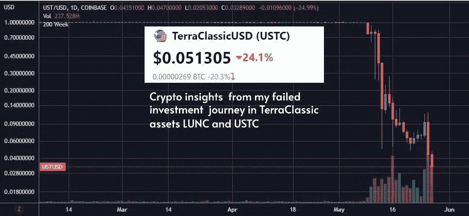
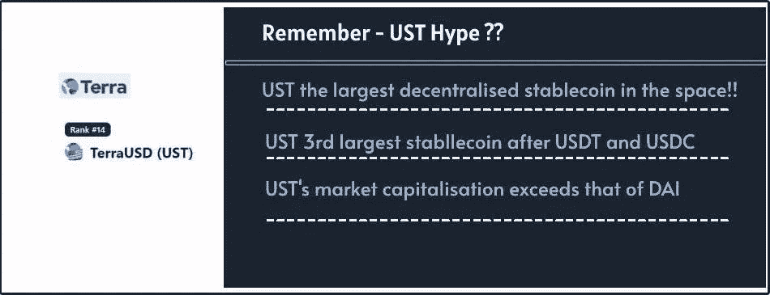
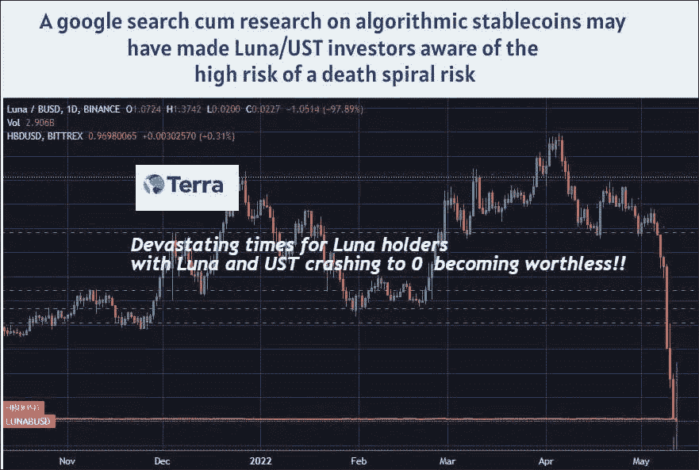
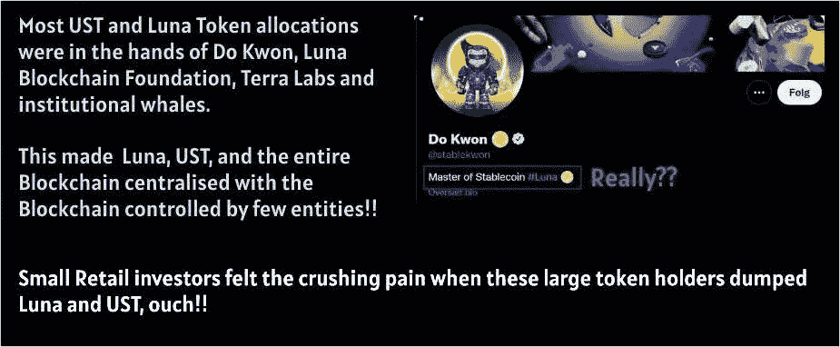

# 我在泰拉资产 UST 和露娜的失败投资之旅的秘密见解

> 原文：<https://medium.com/coinmonks/crypto-insights-from-my-failed-investment-journey-in-terra-assets-ust-and-luna-744a0a5c1585?source=collection_archive---------30----------------------->

是的，现在是加密领域的干燥时期，对加密作者来说是艰难的时期，也许我会为此写一个单独的帖子。然而，crypto 中不乏有趣的故事，仍然吸引着像我这样崩溃的 crypto fish。无论如何，我现在是这个空间里一条营养不良的隐鱼。

然而，我可以分享积累的秘密智慧。今天，我想再次分享我在一次重大[失败投资中的](https://cryptopotato.com/4-valuable-lessons-from-terras-collapse-opinion/)[感悟](https://cryptopotato.com/4-valuable-lessons-from-terras-collapse-opinion/)，即卢娜/UST ，因为像我这样的投资者可能已经发现了卢娜/UST 资产的断层线，在旧链被另一个 [hardfork 完成](/@kikctikcy/new-luna-airdrops-for-the-holders-of-the-original-terras-luna-and-ust-tokens-20c28d40adae?source=your_stories_page-------------------------------------)后，旧投资者收到了新卢娜代币的空投。

从逻辑上来说，LUNC 和 USTC 是高风险投资是有充分理由的。

# UST 的大肆宣传阻碍了投资者看到与该资产相关的明显风险

我确实冒险投资了 LUNC/USTC(当时是 Luna/UST)
由于 TerraClassic 是第二大最广泛使用的区块链，而 Anchor 协议作为一个被动的获利协议非常受欢迎，我被吸引了。

作为该领域的一名普通加密追随者，我无法进行更深入的研究，但如果我这样做了，忽略了中国科大(当时是)的知名度在各种主要的 DEFI 协议中被采用和引入所引起的炒作，然后忽略了权斗有趣的对话和行动所产生的令人振奋的热门新闻，他吹嘘将如何杀死戴 stablecoin 和 Luna Foundation Gaurd 为保护的联系汇率而建立的 100 亿美元比特币储备基金，我可能会对 Luna 的投资产生红色标记的直觉。

# 我没能看到和理解的旧卢娜-UST 的缺点

让我们深入分析一下这个老卢娜-UST 有哪些我们本该看穿的缺陷。

*UST 硬币没有一种可以吸收动荡时期重大价格下跌的资产作为支持*

*哦，是的，我认为这是该死的酷，UST 是免费的风险，可以与美元和自由的控制中央实体管理美元储备，以支持美元挂钩，因为它是与圈的 USDC。*

*我认为 UST 是抵制审查的，而像 USDC 和 UST 这样的中央集权城市则不是。*

**[***然而，到底有什么东西能真正地支撑起 UST 的价值***](https://cryptopotato.com/4-valuable-lessons-from-terras-collapse-opinion/) ***，有什么东西能真正地支撑起 UST 的价值？*****

**从一开始就很明显，卢娜主要是由卢娜-UST 组合的套利机会支持的。因此，当 UST 盯住美元的汇率低于 1 美元时，打折的 UST 就会被烧成 1 美元的新铸造的月神币，这些月神币可以以小利润出售。**

> **交易新手？尝试[加密交易机器人](/coinmonks/crypto-trading-bot-c2ffce8acb2a)或[复制交易](/coinmonks/top-10-crypto-copy-trading-platforms-for-beginners-d0c37c7d698c)**

**相反，当 UST 盯住美元的汇率高于 1 美元时，1 美元的卢纳因 UST 而被烧掉，套利交易者获得少量利润。**

**对于像我这样的相对较新的密码进入者来说，所有这些听起来都是新奇和创新的，他们从实践经验中学习所有的密码，但这整个算法稳定机制已经在早期被许多项目尝试过，他们最终失败进入死亡螺旋。**

**因此，如果有人刚刚谷歌了一下算法稳定的内容，那么这些信息可能已经存在了。**

*****不幸的是，我觉得我得到的消息是 UST 的炒作——“哦，UST 是继 USDT 和 USDC 之后最大的去中心化稳定货币”或者“OMG！！、UST 市值已超过戴 stable coin’等。*****

**然而，在大部分时间里，UST 从未得到任何具有稳固价值和深厚市场流动性的资产的支持。**

**现在想想，UST 的价值取决于与 Luna 的套利机会，在加密停机期间，当 Luna 的价格下跌，这个创造更多 Luna 的过程跟随维持 UST 挂钩，死亡螺旋的[风险总是，总是非常大！！](/@kikctikcy/understanding-the-death-spiral-finish-of-ust-from-the-lastest-crypto-market-crash-chapter-85205ea36e11)**

****

**有出售卢纳，加上增加卢纳供应的过程，在那个时候利用卢纳来维持 UST 的联系汇率是有风险的。**

**当然，后来卢纳基金会确实努力建立储备基金来保护 UST 的联系汇率。有创纪录的 10 亿美元购买分散的货币，如 BTC 和阿瓦克斯，以维持 UST 的联系汇率，但……UST 的联系汇率最终取决于卢纳基金会的行动，它取决于 LFG 如何用各种货币交换 UST，以保持 UST 的联系汇率不变。**

**我认为这整个概念听起来相当集中和不可持续。**

**我记得，当所有的比特币储备基金都是为了维持 UST 的联系汇率而建立的时候，这只会增强我对 UST 的信心，多么天真啊！。**

**稳定的债券由能够承受大部分市场波动的资产支持。在这里，UST 没有这样的支持。整个稳定币是建立在一个不稳定的前提上的。**

# **月神和 UST 的代币分配百分比使这两种资产集中化**

**我们这些卢纳-UST 的老投资者应该感到震惊的另一个方面是卢纳和 UST 的象征经济学。我早些时候试图查看卢娜-UST 的 tokemics，但 terra explorer 似乎不透明，没有提供顶级投资者持有卢娜-UST 股份比例的细节。我觉得这实际上是不透明的。**

**后来，我明白了大部分露娜和 UST 的令牌是由鲸鱼和 Do Kwog、Terra Labs 和 LFG 持有的，这是一个大红旗。为什么？**

****

**首先，这意味着卢娜和 UST 不是分散的，如果大部分由鲸鱼持有，UST 不可能是分散的稳定硬币，因为卢娜和 UST 的价格将取决于他们是否丢弃这些代币。**

**因此，持股相对较少的散户投资者会发现，由于鲸鱼的行为，他们在卢纳和 UST 的资产迅速贬值。**

**有很多鲸鱼投资了露娜和 UST，因为 UST 给出了 18%的利息。这些鲸鱼是风险资本投资者，像 Celsius 这样的贷款公司，他们中的许多人很快就抛售了卢娜和 UST 的代币，这就像一颗炸弹，降低了 UST 和卢娜的价格。**

**散户投资者落后了 100 步，而我显然落后了 1000 步。**

**我不相信 UST 是一个分散的稳定货币，因为 UST 的大部分股份都被鲸鱼，卢娜基金会，道权和特拉实验室持有。UST 和露娜区块链由上面提到的 3 个实体控制，使 UST 成为一个集中的硬币，后来证明也是不稳定的。**

## **激励 UST 储户的锚定协议在一种不可持续的商业模式中发挥作用**

**还有更根本的原因应该提醒卢纳和 UST 的投资者，就像锚协议是维持 UST 流动性的核心。**

**Anchor Protocol 能为其 UST 储户的存款提供 20%的丰厚利息，并激励持有者继续持有 UST 股票多久？**

**看起来 protocol 实际上并没有从它的业务中获得足够的利润来给投资者这样的收益，因为 UST 的贷方总是比借方多。这意味着 Anchor Protocol 的支出超过了其收入，仅仅是为了维持 ust 使用 Anchor Protocol 的流动性。**

**事后看来，这并不实际，也不可持续。这意味着，在锚定协议中，UST 储户的高收益是从 Terra 的国库中获得的，而在去中心化协议中，国库资金总是属于社区的。**

# **`Over pompous behavior and attitude showed by Do Kwon, founder of Terra Blockchain`**

**最后，道权的态度和他不正当的背景。看起来道权已经有了坏名声，因为他已经参与了一些失败的项目，这些项目已经让投资者陷入困境。**

**事实上，向损害散户利益的主要人物发送警告信息的有趣的全球黑客组织 Anonymous 制作了这个视频"[匿名消息给 Do Kwon](https://youtu.be/RB4rK9eB2oE) '
向美国观众(世界公民)透露，Do Kwon 以化名参与了一个失败的算法 stablecoin 项目。**

**哎哟……[在这里看视频](https://youtu.be/RB4rK9eB2oE)**

**[https://youtu.be/RB4rK9eB2oE](https://youtu.be/RB4rK9eB2oE)**

**道权过度浮夸的行为也表明他不是一个领导区块链项目的文职领导人**

**道权变得过于傲慢和浮夸，攻击任何指出卢娜和可能的弱点和他密谋杀害戴的行动的人，并声明享受 95%的公司失败，表明他不在乎一个加密投资者的控股超过吹嘘他的协议。**

**Do Kwon 甚至说 Terra 区块链可以成为比特币的第二层解决方案！！真的有！！！！**

**我觉得任何负责人都应该谈论责任，像这样谈论领导项目的人是一个危险信号。**

**我记得我写的一篇[文章](https://ecency.com/hive-150329/@mintymile/understanding-the-death-spiral-finish)，他与投资曲线协议的大型机构建立了合作伙伴关系，以便 TerraLabs 获得大多数曲线货币持有量，因为凭借这些曲线持有量的力量，他计划在治理 4 池中投票，将戴排除在外，以获得大多数曲线激励，只是为了阻止戴的 3 池获得曲线激励，最终没有流动性。**

**这听起来不仅仅是公平竞争，这个道权想要利用他的财富和影响力来攻击其他竞争者。**

*****这让人很不舒服。我真的对唐权的态度感到不安，这应该警告我退出与他的愚蠢的 terra 项目的联系，因为我是一个喜欢分散化，包容性而不是垄断的秘密价值以及传统商业世界中常见的资本主义力量的秘密鱼。*****

# **遭受重创的投资者认为道权和泰拉欺骗了他们！！**

**嗯，TerraClassic 的崩溃仍然有它的后遗症。我读到过一个欺骗投资者的贷款协议，声称他们在 USDC 存款上提供良好的收益，但他们将客户的存款投资于锚定资产，获得利息并支付投资者在 USDC 的收益。间接而言，即使是那些没有直接投资于 UST 的散户投资者也蒙受了损失，因为这些公司拖欠了储户的还款。**

**正如所言，Terra 本身似乎是一个骗局，道权正因他可能犯下的其他金融罪行而受到 SEC 等金融机构的调查。**

**所以，我觉得在地球经典的某个地方，卢娜-UST 的老投资者被道权欺骗了。这些投资者不仅仅是像我这样的散户投资者，而是像 3 Arrows 这样的专业投资公司和更多的风险基金。尽管如此，最终这种加密崩溃的痛苦对像我这样的小型加密鱼影响最大。**

**像往常一样，世界青睐街头聪明的投资者，而不是像我这样天真的秘密鱼):，&可悲的是，我觉得我在加密方面失败了，无法生存，我不知道我是否应该对我的加密学习和写作能力抱有希望、信念和信心，或者这是一个死胡同，我应该退出生活本身，因为没有加密我什么都不知道。**

****感谢您阅读…****