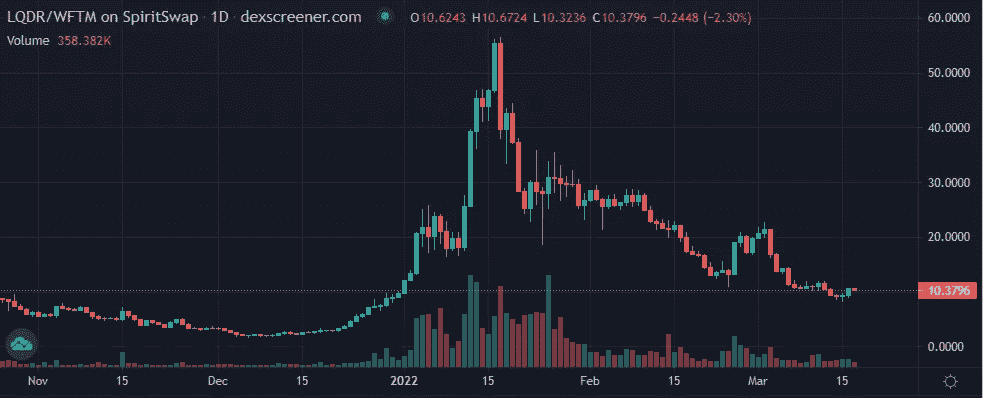

# 熊市的秘密投资

> 原文：<https://medium.com/coinmonks/crypto-investing-for-the-bear-market-f53652f48138?source=collection_archive---------59----------------------->

***推特:***【https://twitter.com/tradfichad】T4

当我写这篇文章时，BTC 目前的股价为 41，000 美元，比 11 月 21 日早期的 69，000 美元下跌了 40%。在很大程度上由 BTC 的动向决定的加密市场总市值也从 2.9 万亿美元降至 1.8 万亿美元。我们现在似乎正处于一个漫长的加密冬天的第四个月，没有春天的迹象(这是双关语)。

在这 4 个月的时间里，我们还看到各种加密媒体的影响者呼吁逐代触底，并购买 dips *slurp slurp*。如果你已经存在足够长的时间，你会意识到把握市场时机通常是徒劳的。当市场继续下跌时，没有经验的交易者往往会抓住掉下来的刀。幸存者通常是专业交易者、极早期的进入者和那些已经计划好低波动策略的人。

考虑到我们所处的位置，我认为借此机会讨论一些在低迷或熊市中幸存下来的策略是非常好的。虽然许多人会正确地认为农业是首选策略，但我通常不鼓励多头或空头仓位，因为很难把握市场底部的时机。

示例:

*Anon 预计 LQDR 将在 1 月/2 月 22 日期间稳定在 25-30 美元之间。Anon 假设这是底部，并花费 100 美元购买 25 美元的现货 LQDR，以获得 100%的 APR。LQDR 在 3 月 21 日跌至 10 美元，假设 LQDR 价格和 APR 分别保持在 10 美元和 100%，Anon 在 1 年后的头寸为 80 美元，不含复利。在这一点上，马厩似乎更有吸引力，不是吗？*

当然，有人可能会说，当市场状况改善时，阿农将会赚回更多的钱。然而，价格和 ARP 很容易进一步下降。如果说有什么不同的话，我的经历教会了我以下几点:

1.  今天炙手可热的项目可能明天就会夭折。启动失败率 90%(来源:[https://www.failory.com/blog/startup-failure-rate](https://www.failory.com/blog/startup-failure-rate))。对于像加密狂野西部这样的新兴行业，我预计这个数字会更高。
2.  加密价格更多的是与投机联系在一起，而不是基本面。这意味着价格和价值并不是内在一致的。一旦市场有足够的时间来消化这一点，价格可能会永久保持在较低水平，而不会再创新高。请参阅 XMR 或 ADA 作为主要示例。

因此，我将在下面的帖子中讨论主要的稳定和 delta 中性策略，在我继续的几个月中，我将通过一个 ELI5 来讨论这些策略以及一系列更新。请稍等片刻。看到我刚才做的了吗？；)

链接到帖子:
[*三角洲中立农业一:战略与机遇*](/@TradfiChad/delta-neutral-i-strategies-and-opportunities-9fe35749c0b6)