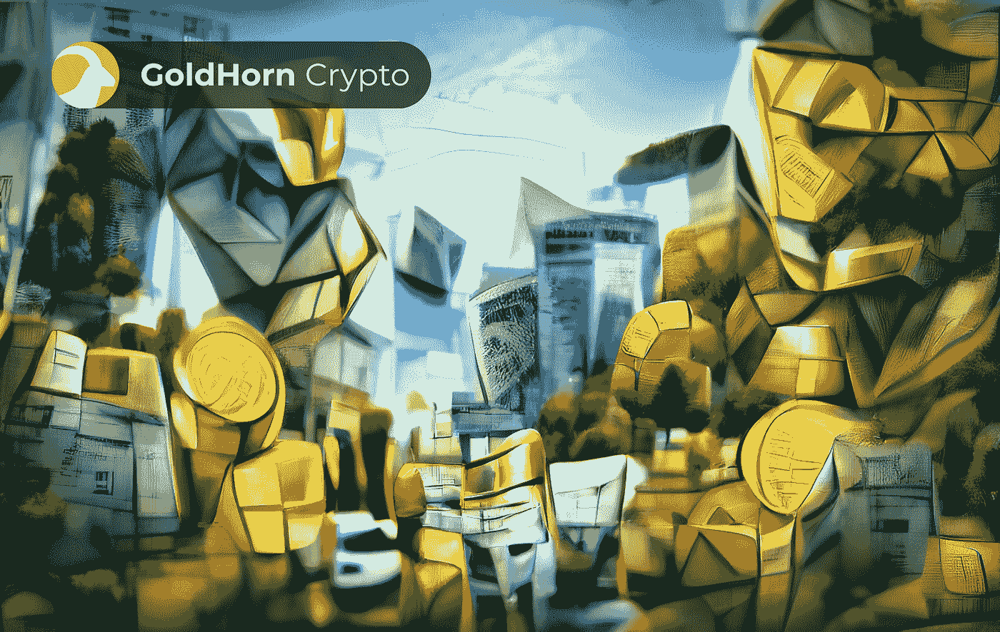
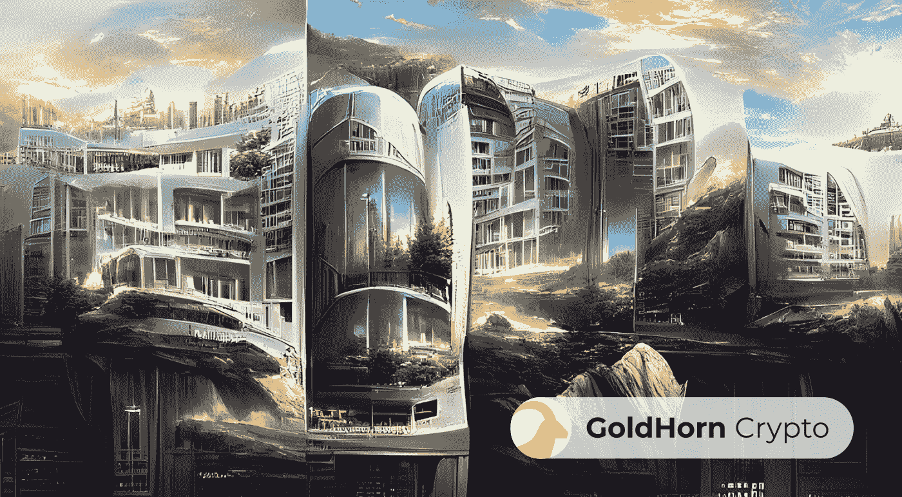
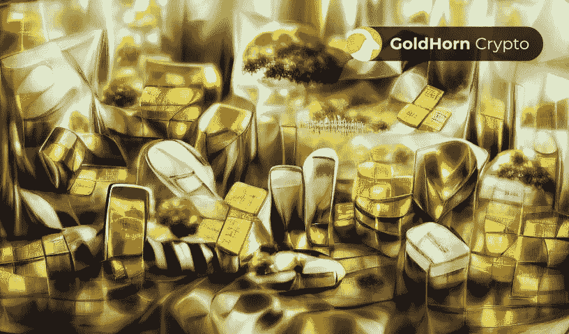
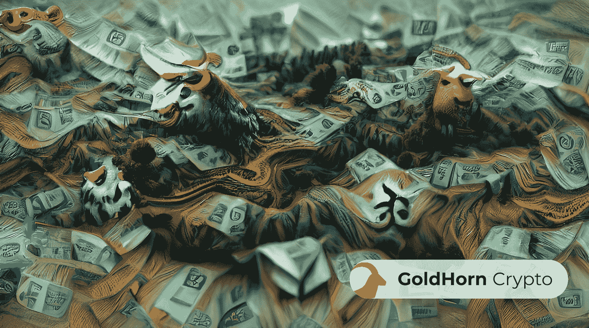
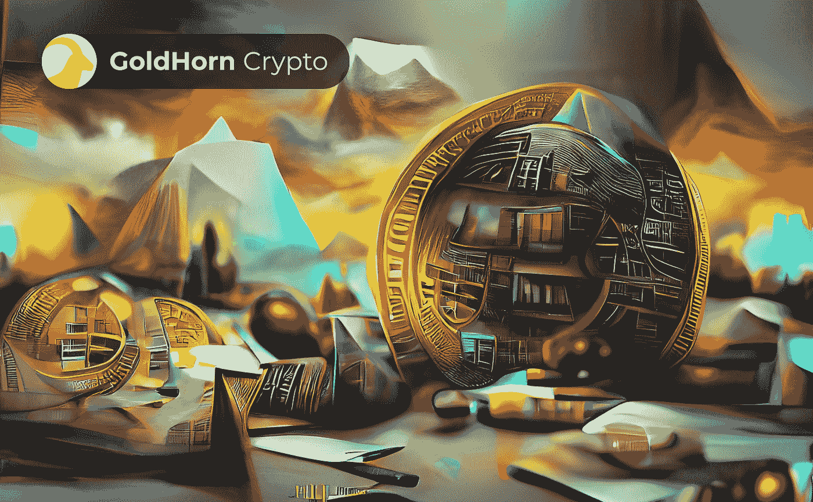

# 2022 年加密投资与传统市场

> 原文：<https://medium.com/coinmonks/crypto-investment-vs-traditional-markets-in-2022-6ba89030bafe?source=collection_archive---------36----------------------->

Investment options / AI assisted artwork

如果你准备开始投资，但不确定选择什么类型的投资，你来对地方了。投资是最受欢迎的增值方式之一。它可以简单到在股票市场上购买一家公司的股票，也可以复杂到将你的钱投资到多种产品中，以尝试并最大化你的回报。

投资很重要！这是确保你现在和将来财务安全的最好方法。投资可以让你增加财富，同时产生高于通胀的回报。这是确保你今天和将来能养活自己和家人的最好方法。

在这篇文章中，我们准备了不同投资的比较。向下滚动，了解传统和最受欢迎的投资，以及他们的现代另类投资。

# 让我们来谈谈这些传统的和最受欢迎的投资

投资是构建你财务未来的一个好方法。最常见的投资是那些被认为是“安全的”并且已经存在了很长时间的投资。这些传统投资包括股票市场、房地产、贵金属和债券等。

从长远来看，投资是增加你的钱的好方法，但它也有风险。这就是为什么在你投资之前，你应该研究不同的选择，这样你才能做出明智的决定。考虑到这一点，我们来看看不同投资的对比。

# 投资股票市场

股票市场已经存在了数百年，并且还在继续增长。是长期投资，不要指望快速致富。但是，如果你密切关注你的投资，并随着市场的变化调整你的策略，你就能为你的财务未来打下坚实的基础。

# 投资股市安全吗？

当你购买一只股票时，这意味着你拥有你购买股票的公司的一部分。这伴随着一定程度的风险。市场是不稳定的，你的投资价格会时涨时跌。在任何一天，市场的方向都可能发生巨大的变化，投资者赚钱或赔钱取决于他们是否在正确的时间买入或卖出。

你的投资是否有利可图取决于你购买股票的公司的经营状况。如果一家公司表现良好，其股票价格可能会上涨，这意味着投资者会赚钱。但如果一家公司表现不佳，其股票可能会贬值，并影响你的整个投资。

一家公司经营得如何取决于许多外部和内部因素。例如，一家公司的业务可能会受到负面新闻、当前的经济状况，或者像我们最近经历的那样，受到全球性疫情等不可预测事件的影响。这就是为什么投资从来不是 100%安全的。事实上，这一切都是为了承担合理的风险。如果投资决策明智，随着时间的推移，一些安全的长期股票可能会带来丰厚的回报。

## 赞成的意见

*   公司利润随着经济增长而增长
*   你不需要很多钱来开始投资
*   你从价格上涨和股息支付中获得收入
*   良好的流动性

## 骗局

*   外部环境风险
*   内部环境(业务)风险
*   需要时间研究
*   股票市场不稳定

# 投资房地产

Real Estate Investment / AI assisted artwork

投资房地产长期以来一直是积累财富的可靠方法。从广义上讲，房地产投资是指购买和出租或出售财产以获取利润的行为。投资房地产的最终目的是获得经济回报。好消息是，如果你以合适的价格购买合适的房产，你就可以期待可观的投资回报。

# 投资房地产安全吗？

众所周知，房地产是可靠的投资选择。这是一项长期投资，可以提供稳定的收入流。这也是一个很好的对冲通货膨胀和积累财富的明智方法。然而，每一项投资都必然包含某种形式的风险。房地产也不例外。

投资房地产伴随着一系列独特的风险。在购买房产之前，你可能要考虑的一些最重要的事情是它的位置和房产的状态。投资一个位于不良街区或整体状况不佳的房产风险很大。它可能导致负现金流和高邻近性，这两者都代表着不产生任何投资回报的风险。然而，房地产投资中最不可预测的风险是人类控制之外的事件或官方称为天灾的活动。

那么，房地产是安全的投资吗？确实是！一般来说，房地产是你能做的最安全的投资之一。房产总是有价值的，房地产市场也基本稳定。如果进入这种类型的投资是见多识广，后来管理相应的财产，房地产是一个很好的投资方式。

## 赞成的意见

*   产生稳定的现金流入
*   提供通胀对冲
*   房地产市场基本稳定
*   房地产往往会升值

## 骗局

*   投资房地产需要很多钱
*   收入(现金流)是可变的
*   需要维护
*   低流动性

# 投资贵金属

Precious metals / AI assisted artwork

当考虑选择什么类型的投资时，许多人选择贵金属。事实是，从历史上看，贵金属一直是一项很好的投资，提供了一些最佳的回报。这个领域最受欢迎的投资是黄金。然而，银、铂和钯等其他贵金属也吸引了许多投资者的目光。

# 投资贵金属安全吗？

毫无疑问，投资贵金属可以增加你的财富，并提供一种有趣的投资组合多样化的方式。不同贵金属的价格可以上下波动，但它通常被认为是一种“安全港”投资。这并不意味着它没有一些风险和成本。

最大的风险是你的金属可能会贬值。最近贵金属波动很大。贵金属的价格由供求关系决定，并随着全球经济的波动而波动。这使得预测某物未来的价值变得困难。然而，这也意味着当条件合适时，在这一领域进行极其有利可图的投资是可能的。另一方面，如果你的投资不受控制，它可能会失去其原始价值。

购买实物黄金或任何其他贵金属也会带来存放地点的问题。贵金属可能会被盗，所以将它们保存在一个安全的地方应该是你的首要任务。尽管如此，投资黄金可能是一个从股票和其他传统投资中分散投资的好方法，因为它往往是比货币更可靠的价值储存手段。毕竟，贵金属有其内在价值，并提供了一个伟大的方式来对冲通货膨胀！

## 赞成的意见

*   投资组合多样化(与股票负相关)
*   作为通货膨胀对冲工具很受欢迎
*   有内在价值
*   与货币相比的价值储存

## 骗局

*   不要像股票或房地产那样产生现金流
*   价格是由供求关系决定的
*   安全储存问题
*   最近相当不稳定

# 投资于其他传统投资

当比较不同的投资时，你应该考虑所有的选择。我们已经提到了最常见的，但你也可以投资于私募股权或债券。如果这些都没有吸引力，你可以随时决定持有现金。让我们来看看这些投资是什么，投资它们的风险或安全性如何。

# 私募股权

私募股权投资本质上是创业公司的资金来源。这种类型的投资包括作为“种子资本”的早期高风险企业。通常有一个最低投资要求，投资者应该准备投入他们的资金至少十年，直到公司开始盈利。

## 赞成的意见

*   私募股权投资可以使你的投资组合多样化
*   创造高于平均水平的回报
*   这可能是一项有利可图的投资
*   在私营企业中创造价值

## 骗局

*   高风险
*   有一个最低投资要求
*   长期承诺和低流动性
*   利润取决于创业公司的成功

# 结合

如果你正在考虑选择什么类型的投资，你正在寻找最安全的选择，你应该考虑政府债券。它们是由政府发行的，为政府运作和偿还债务筹集资金。**T1。政府出售债券，承诺在一定时期内连本带利偿还投资。债券被认为是可靠的低风险投资，尤其是与股票市场相比。**

## 赞成的意见

*   给你源源不断的现金流
*   提供固定回报
*   与其他投资相比，风险较低
*   可靠的

## 骗局

*   比其他风险更高的投资回报更低
*   价格会随着货币的变化而波动
*   利率风险
*   复杂的金融产品

# 持有现金

Cash / AI assisted artwork

持有现金指的是把钱存起来，让你可以花掉，而不是用来投资。持有现金的最大风险是通货膨胀。随着商品和服务价格的快速上涨，持有现金变得越来越没有吸引力。

## 赞成的意见

*   良好的流动性
*   可靠的
*   需要时随时取用你的现金

## 骗局

*   通货膨胀
*   货币贬值和贬值
*   没有增加你的财富

# 投资加密货币作为一种选择

Bitcoin future / AI assisted artwork

为了完成我们对不同投资的比较，我们将看看现代的替代投资——加密货币。如果做得好，[投资加密货币](/coinmonks/investing-in-crypto-what-is-it-and-how-does-it-work-72e4ec844024)可以获得高额回报。要做到这一点，你需要足够的耐心和研究。这个市场很年轻，非常不稳定，但从足够长的时间来看，投资加密货币可以获得高于平均水平的回报。

# 投资加密货币安全吗？

密码市场是最令人兴奋的新投资机会之一。虽然有些人仍在试图判断这是否是一个合法的机会，但那些已经在这个游戏中玩了一段时间的人已经看到了巨大的回报。所以，如果你正在考虑进入这个市场，这里有一些你应该知道的事情。

加密货币可以安全地购买、存储和使用。为此，用户需要做出明智的决策并遵循最佳实践。如果你想知道 2022 年你应该考虑的最有前途的加密投资是什么，看看 2022 年最好买的 [5 种加密货币。](/coinmonks/5-of-the-best-cryptocurrencies-to-buy-in-2022-a82de72c88f7)

然而，在投入投资之前，你必须意识到投资总是像坐过山车一样。加密货币也不例外。例如，众所周知，密码可能会受到严重的价格波动。这是一个需要记住的重要风险，但不一定是坏事。通过密切监视市场的变化，你可以在适当的时候买卖密码以获取利润。

其他你应该留意的是投资炒作和诈骗。为了避免陷入这样的陷阱，你应该花时间去了解不同的货币和整个行业。保持消息灵通和及时更新将有助于你做出正确的投资决定，避免骗子。在这方面，你应该采取行动，保护自己免受网络钓鱼。网络钓鱼攻击是加密投资中相当常见的风险。因此，您应该意识到这一点，以便采取正确的措施来保护您的用户数据。你应该知道的最后一个风险是丢失你的钱包密码。这是因为如果您丢失了这个私钥，您将无法访问您的加密。换句话说，你将失去你的投资。

## 赞成的意见

*   易于移动
*   良好的流动性
*   高于平均收益
*   易于保存

## 骗局

*   理解加密货币需要时间和精力
*   加密货币可能是一种极其不稳定的投资
*   加密新手容易受到诈骗
*   投资加密技术风险很大

# 与投资其他传统投资相比，投资加密有什么好处？

投资加密货币经常被比作投资股票、债券、房地产和贵金属等传统资产。投资传统资产已被证明是一种屡试不爽的投资策略，有着获得长期回报的良好记录。然而，在现代金融领域，投资加密货币正迅速成为一种获得高于平均水平收益的行之有效的方式。

在过去十年中，投资加密货币已经成为传统投资方法的一种流行替代方式。与传统投资不同，加密货币是一种完全数字化的资产类别，可以在世界任何地方全天候访问和交易。在过去几年中，当前的加密货币市场一直在以指数速度增长，并且预计将继续增长。

通过投资加密货币，你冒着风险，希望你的投资会有回报。这在某种意义上类似于传统投资，即你希望获得利润，但主要区别是，你不是投资股票，而是投资加密货币。通过你的加密投资，你可以保护自己免受通货膨胀的影响，并充分利用市场的增长和升值。

# 投资艺术和文化作为一种选择

Art & music/ AI assisted artwork

人们早就说过，投资艺术和文化是你能做的最聪明的事情之一。这不仅仅是因为艺术看起来很美。事实证明，艺术品会随着时间的推移而升值，对于那些希望分散投资组合的人来说，这是一种明智的投资。因此，如果你正考虑涉足艺术品投资领域，这里有一些信息可以帮助你开始。

# 投资艺术文化安全吗？

对我们大多数人来说，投资是一种获利的方式。我们把钱投入某样东西，希望它会有回报。但是投资并不一定仅仅是为了利润。也可以是创造一个更好、更有活力的环境。要记住的一件事是，当你投资艺术和文化时，你不仅仅是买一幅画或一件雕塑。你在购买作品背后的历史、想法和情感。

投资艺术和文化是为后代建设一个更美好社会的好方法。决定你准备投入多少资金是一个个人决定。但是在做任何决定之前，考虑可能涉及的风险是很重要的。你应该记住的第一件事是，投资艺术品可能会很昂贵，除非你卖掉它，否则它不会给你带来任何货币价值。然而，拥有艺术品在许多不同的方面丰富了你——它给你的家带来了享受、社会价值、活力和正能量。

在投资艺术和文化之前，你应该确保自己对此有所了解，或者有人能帮你导航。市场上充斥着赝品，不恰当地保存你的艺术品无疑会毁掉它。为了避免这种风险，你需要小心你的购买和储存决定。

投资艺术和文化是支持我们社区的特殊方式。它带来活力和能量，提高我们的认同感，丰富我们的生活。最重要的是，这种投资是对天才创作者工作的支持。通过投资创意产业，你正在支持艺术表达的发展和围绕它的社区。

## 赞成的意见

*   随着时间的推移升值
*   价值储存手段
*   带来社会价值
*   帮助社区
*   丰富您的环境

## 骗局

*   它是昂贵的
*   在你卖掉它之前，投资收益是缺乏的
*   假冒风险
*   如果储存不当，有毁坏的危险
*   低流动性

# 总结一下

我们都知道传统投资是有利可图的。对加密货币等新替代品的投资也是如此。在不同投资的比较中，我们看到每种投资都有一定的收益和风险。这就是为什么我们强调研究你的选择以做出明智投资决定的重要性。我们也希望您知道，合理分配您的投资组合并使其多样化是明智之举。这很重要，因为它可以帮助你降低单个投资的表现影响整个投资组合表现的风险。

如果你是一个雄心勃勃的年轻人或中年人，准备为自己和家人的后代创造财富，我们有一些建议给你。进行风险更大的投资！风险更高的投资会带来更高的回报，这是你创造财富的最佳方式。如果你准备好了，我们建议你投资加密！INCONOMI 是一个伟大的、易于使用的平台，在这里你可以开始你的加密投资之旅。

如果你需要帮助管理你的加密货币投资组合，请联系[金角加密](https://www.goldhorn-crypto.com/strategies/overview)。我们是经验丰富的加密策略提供商，随时准备帮助您的投资决策。

在你离开之前的最后一件事，金角团队希望你记住，我们的生活不仅仅是关于钱！我们相信回馈社会是很重要的。我们认为支持艺术和文化是我们的责任和特权。作为世界公民，我们有机会受益于文化意识的提高。它直接导致我们社区内更好的生活条件，从而提高每个人的生活质量！

> 加入 Coinmonks [电报频道](https://t.me/coincodecap)和 [Youtube 频道](https://www.youtube.com/c/coinmonks/videos)了解加密交易和投资

# 另外，阅读

*   [如何在 FTX 交易所交易期货](https://coincodecap.com/ftx-futures-trading) | [OKEx vs 币安](https://coincodecap.com/okex-vs-binance)
*   [OKEx vs KuCoin](https://coincodecap.com/okex-kucoin) | [摄氏替代品](https://coincodecap.com/celsius-alternatives) | [如何购买 VeChain](https://coincodecap.com/buy-vechain)
*   [ProfitFarmers 回顾](https://coincodecap.com/profitfarmers-review) | [如何使用 Cornix 交易机器人](https://coincodecap.com/cornix-trading-bot)
*   [如何匿名购买比特币](https://coincodecap.com/buy-bitcoin-anonymously) | [比特币现金钱包](https://coincodecap.com/bitcoin-cash-wallets)
*   [瓦济克斯 NFT 评论](https://coincodecap.com/wazirx-nft-review)|[Bitsgap vs Pionex](https://coincodecap.com/bitsgap-vs-pionex)|[Tangem 评论](https://coincodecap.com/tangem-wallet-review)