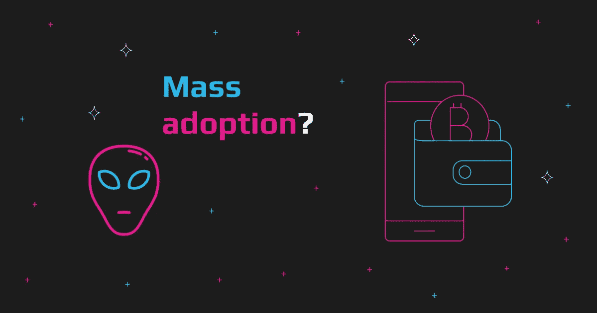
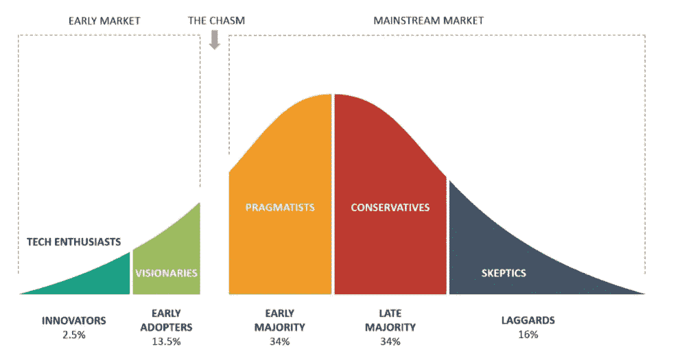
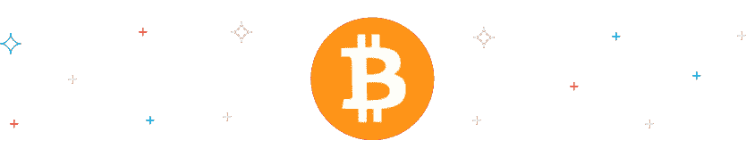

# 加密技术已经存在:距离大规模采用还有多远？

> 原文：<https://medium.com/coinmonks/crypto-is-here-to-stay-how-close-is-mass-adoption-fa3c954f26ec?source=collection_archive---------17----------------------->

自 2017 年相对模糊的性质以来，加密货币已经走过了漫长的道路。2018 年的崩盘现在看起来像是加密货币市场整体市值的一个亮点。我们可以清楚地看到过去三年的采用情况，持续上升的趋势，在 2021 年底达到超过 2 万亿美元的市值。然而，大规模采用仍然是加密社区中一个高度争论的话题。在我们实现完全主流采用之前，Crypto 仍有几个主要障碍要克服，例如普通用户更容易进入的障碍，更大的真实世界效用以及对自我保管资产的整体更好理解。让我们阐明加密采用的概念，并了解如果加密被完全采用会怎样。

# 什么是加密采用？

加密应用是指整个加密市场的市值或参与区块链的活跃钱包数量。然而，有几种不同的方法来描述什么是大量加密的采用。例如，我们可以说它是采用加密或关注单个超级大国监管和采用加密的政府的百分比，如美国和英国。

使用采用曲线可能是测量加密采用的可行方法。让我们看看什么是采用曲线，以及 2021 年的加密采用曲线。

# 加密采用曲线:它是什么？

下图是产品采用曲线，展示了五种不同的人群想要测试或尝试新产品。对于加密货币来说，这没有什么不同，有自己的加密采用曲线。

该曲线清楚地展示了五个阶段，最重要的是，为了完全进入主流市场，采用必须跨越的*鸿沟*。加密社区中的许多人已经相信加密已经跨越了鸿沟，渗透到实用主义者市场，所有采用的 34%将来自那里。

原因包括项目的更好效用、整个空间的真正创新和机构投资，这总是长寿的标志。然而，许多人认为我们仍处于幻想阶段，因为目前只有不到 16%的人有钱包。

# 2021 年加密采用曲线

在 2021 年，加密的采用是巨大的，但仍然比一些人预期的要小。2021 年，全球加密货币拥有率达到 4%，拥有 3 亿用户。当将这些数字与采用曲线进行比较时，crypto 几乎没有渗透到远见者市场。

然而，基于 2020/21 年的价格行动和加密市值的暴涨，结合机构投资的大规模采用，我们可以开始说加密货币已经越过了鸿沟。基金中管理的资产在一年内增加了 400 多亿美元，这意味着大规模采用加密技术可能指日可待。

# 加密采用率最高的国家

大规模采用在大多数国家已经起飞，许多较贫穷的国家利用进入国际市场，点对点贸易和 DeFi 应用。

印度拥有最多的加密货币所有者，部分原因是与中国等其他人口大国相比，印度人口众多，监管宽松。

有趣的是，与美元相比，本币相对较弱的国家的采用率也较高。这可能意味着用户正在利用加密货币作为一种金融自由和更大购买力的方法。

# 最常用的密码是什么？

按市值计算，很明显[比特币](https://bitcoin.org/en/)是全世界使用最多的加密货币，是现存的第一种加密货币。此外，与以太坊等其他*蓝筹*加密货币相比，比特币拥有与其货币绑定的最独特的钱包地址。

展望未来，由于萨尔瓦多等国家采用比特币作为法定货币，比特币可能会保持其第一的位置。因此，他们让数亿公民能够简单地使用比特币钱包。

# 如果完全采用 Crypto 会怎样？

通常情况下，秘密大规模采用被视为一个幻想乌托邦式的海市蜃楼。然而，它可能来得更早而不是更晚。然而，对于许多爱好者来说，它可能看起来与他们所希望的分散式仙境不同。

许多人认为，中央银行数字货币(cbdc)将接管加密货币领域，就像我们今天在我们的法定银行账户中使用 cbdc 一样。这可能会破坏加密货币的整个目的。在复杂的区块链上部署 CBDCs 可能意味着对政府的每一笔交易进行跟踪，为我们的生活提供前所未有的动力和途径。

幸运的是，比特币等加密货币将一直存在。这将给一些热心者带来希望，大规模加密的采用将给全球人民带来更大的金融自由。尤其是在世界经济中购买力很小甚至没有的贫困地区。

比特币等去中心化货币还可以解除许多腐败暴虐的政府对人民的束缚，因为它们控制着货币。没有许可和信任的 dApps 可能意味着这种暴君的终结，或者许多密码社区相信的那样。

# 何时会采用大量加密技术？

不可能确定加密货币何时会被大规模采用，因为可能会在几年后，或者十几年后。最重要的事实是，加密货币的大规模采用即将到来，这不是一个如果的问题，而是什么时候的问题。

# 尽你的绵薄之力:如何用 Crypto 购买 Crypto？

Swapzone 汇总了超过 600 个交易所的加密货币对的最佳汇率，但是您如何利用它呢？

在您做任何事情之前，请浏览我们的网站[这里](https://swapzone.io/)。

1.  选择你的搭档。
2.  输入您愿意兑换的金额，然后等待右侧弹出的报价。提示:您可以过滤您希望使用的特定汇率或交换。
3.  选择适合自己的优惠。请记住:您可以根据您要查找的内容，按速率、速度或评级进行过滤。
4.  一旦你有了想要接受的出价，点击 ***兑换*** 。
5.  确认兑换后，请务必仔细输入您的详细信息。如果需要退款，您需要提供:m 钱包地址以接收兑换的硬币或代币，以及您提供的硬币或代币的钱包地址。
6.  确认信息无误后，点击 ***进行交易*** *至*完成交易。

> 加入 Coinmonks [电报频道](https://t.me/coincodecap)和 [Youtube 频道](https://www.youtube.com/c/coinmonks/videos)了解加密交易和投资

# 另外，阅读

*   [投资印度的最佳加密软件](https://coincodecap.com/best-crypto-to-invest-in-india-in-2021) | [WazirX P2P](https://coincodecap.com/wazirx-p2p)
*   [西班牙 5 大最佳文案交易平台](https://coincodecap.com/copy-trading-spain)
*   [Pionex 双重投资](https://coincodecap.com/pionex-dual-investment) | [AdvCash 审查](https://coincodecap.com/advcash-review) | [支持审查](https://coincodecap.com/uphold-review)
*   [面向开发者的 8 个最佳加密货币 API](https://coincodecap.com/best-cryptocurrency-apis)
*   [7 个最佳零费用加密交易平台](https://coincodecap.com/zero-fee-crypto-exchanges)