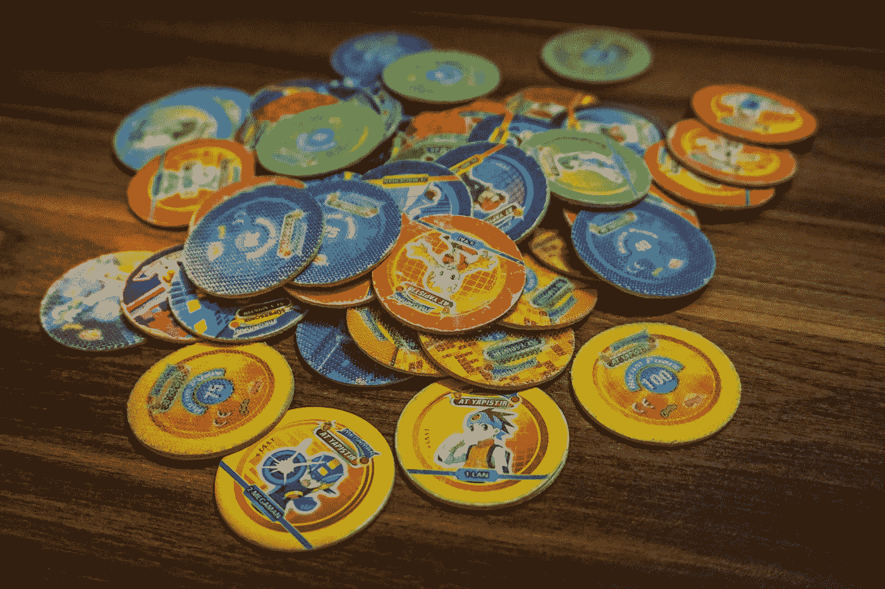
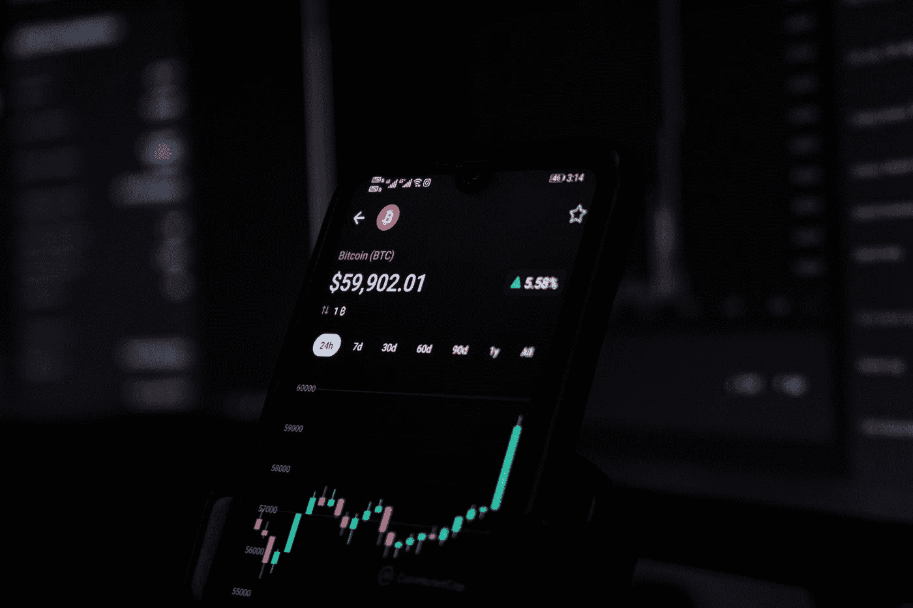

# 加密就像高中一样。

> 原文：<https://medium.com/coinmonks/crypto-is-like-high-school-1f250368ebe4?source=collection_archive---------24----------------------->

## 加密货币入门指南。

Photo by [Dmitry Demidko](https://unsplash.com/@wildbook?utm_source=medium&utm_medium=referral) on [Unsplash](https://unsplash.com?utm_source=medium&utm_medium=referral)

## 跟上潮流是不可能的。

时尚和 FOMO 携手并进。阿迪达斯撕裂裤，翻盖手机，剃刀滑板车，蝴蝶结，穿得像 G-Unit 的白人。

这是 2000 年代的高中。

> 比特币和以太坊
> 比特币现金和以太坊经典
> 智能合约
> DAOs 和 DApps
> Dogecoin
> Sh * tcoins
> 元宇宙和 NFTs
> DeFi 和 dex

这是 21 世纪 20 年代的密码。

像宇宙一样，密码世界也在不断扩张。它的木星和土星是比特币(BTC)和以太坊(ETH)，但如果你与密码爱好者接触，数字黄金和白银是旧帽子。区分什么是酷的，什么是有价值的从未如此困难。

2001 年，绳球公子哥儿们开始运动 [tearaways](https://www.pinterest.ca/pin/332633122473195354/) 并像野火一样传播开来。但就像它冲击青少年时尚一样，它很快就消失了。它们只是一时流行。翻盖手机很快就出现了。虽然手机的风格很快就失去了时尚，但手机的采用永远地改变了我们。

Crypto 的市值是 23 亿美元。这是以万亿为单位的，如果你想知道的话。它哪儿也去不了。

也是浑水摸鱼。Doge，一种 memecoin，是比特币的对立面。人们喜欢它是因为它现在价值 220 亿英镑。就连马克·库班和埃隆·马斯克也很乐观。

拉娜·罗迪斯最近发布了她自己的 NFT。

> 什么是 NFT，谁是拉娜·罗迪斯？

在谷歌上玩得开心，你可能会发现不可替代的艺术品“ [CryptoPunk 7523](https://www.cnbc.com/2021/06/10/covid-alien-cryptopunk-nft-sells-for-11point7-million-in-sothebys-auction.html) ”卖了 1100 多万美元。很…漂亮，对吧？

但是，如果 NFT、dex 和元宇宙是潜在的不稳定结构，智能合约、Dao 和 dApps 提供了值得研究的真实世界效用。

在数字投机中，很难判断你正在出售的黄金是傻瓜的还是纯粹的。

## 毕业是唯一的焦点。

感觉好像图表参数不断变化，以适应叙事密码市场是不可阻挡的，不会出错。

在高中，无论你是在考试中过关斩将，还是在社会阶梯上往上爬，你都在寻找一个光明而内在的未来。无论你是进入常春藤联盟大学还是完全没有目标，毕业都是你寻求的救赎。

大多数秘密价格行为都是横向盘整，夹杂着自由落体式的抛售和急速的价格飙升。但是那些激光眼的(我是说钻石手！)除了绿色什么都看不到，哪怕比特币刚刚一夜之间损失了 25%的价值。

即使有熊市的可信证据，专家们说我们正在经历一个超级周期！那是什么意思？一个极端高点和低点的牛市！如果感觉像什么？乔治·克鲁尼试图在飓风中驾驶安德里亚·盖尔号。

10 万美元在 2021 年的最后一个季度应该是固有的，但在 2022 年的 Q1，它正向 2 万美元修正。现在“专家”说，到 2022 年底，价格可能会达到 20 万美元！无论如何，给 HODL 的建议是(无论如何都要坚持住)。千万不要卖！

市场正处于悬崖边缘。有时考虑合法性需要等待是明智的。你可能要重做高三。

## 运动员什么都不知道。

我在以前的一篇文章中写过运动员如何试图用数量和无知淹没你。

有些人绝对地谈论加密将如何走上[pog](https://www.amazon.com/Pogs-Slammers/s?k=Pogs+and+Slammers)的道路。同样类型的人也认为二进制这个词表示一种性取向。

Photo by [Emre Turkan](https://unsplash.com/@emreturkan?utm_source=medium&utm_medium=referral) on [Unsplash](https://unsplash.com?utm_source=medium&utm_medium=referral)

他们听到乔·罗根称 crypto 为骗局，但他们都不能告诉你为什么。虽然张彬对一些事情有强烈的好奇心，但像我们许多人一样，他不可能对每件事都虔诚的投入时间和精力。

如果你怀疑 crypto，但对它一无所知，那也没关系。拥有它。当你甚至不知道查尔斯·庞兹是谁的时候，不要告诉我这是一个庞氏骗局。

另一方面，无知也是看涨的。他们不能告诉你区块链到底是什么，但他们确信它将改变世界，所以他们投资了 401k。

逃离这些人。任何人都可以有不需要努力就能形成的观点。

## 书呆子们成功了。

缺乏理解会导致失败。不管歇斯底里告诉你什么，你不能靠即兴表演来赚钱。

关于比特币的效用存在争议。对一些人来说，它是一种价值储存手段，一种抵御通货膨胀的手段，或者是一种真正的货币。

> 如果你是查理·芒格，那只是一种“性病”

简单的思想实验:你在 2009 年买了 1000 个比特币。截至 2022 年 2 月 23 日，你的投资价值 38，000，000 美元。任何说比特币是骗局的人都只是因为他们错过了其他人看到稀缺价值的机会而感到愤怒。像老布玛儿一样，查理。

Photo by [Sajad Nori](https://unsplash.com/@sajadnori?utm_source=medium&utm_medium=referral) on [Unsplash](https://unsplash.com?utm_source=medium&utm_medium=referral)

如果你想投资加密货币，要明白它是技术。

*   如何保护区块链？什么是共识机制？
*   为什么有价值？什么是散列率？
*   什么是工作证明？什么是利害关系证明？

当它是抛物线时，任何人都可以交易，但当它崩溃时，你会如何反应？你能谈谈市场的行为吗？

*   你能读懂烛台图表吗？
*   为什么均线如此重要？
*   什么是艾略特波浪理论？斐波那契回撤？威科夫分布？

加密不仅需要投资美元，还需要投资时间来破译黄铁矿和黄金之间的区别。

为了取得好成绩，你必须知道你在说什么。如果你考砸了，那不是考试的错。这是学生的错。

> 加入 Coinmonks [电报频道](https://t.me/coincodecap)和 [Youtube 频道](https://www.youtube.com/c/coinmonks/videos)了解加密交易和投资

# 另外，阅读

*   [币安期货交易](https://coincodecap.com/binance-futures-trading)|[3 commas vs Mudrex vs eToro](https://coincodecap.com/mudrex-3commas-etoro)
*   [如何购买 Monero](https://coincodecap.com/buy-monero) | [IDEX 评论](https://coincodecap.com/idex-review) | [BitKan 交易机器人](https://coincodecap.com/bitkan-trading-bot)
*   [尤霍德勒 vs 科恩洛 vs 霍德诺特](/coinmonks/youhodler-vs-coinloan-vs-hodlnaut-b1050acde55a) | [Cryptohopper vs 哈斯博特](https://coincodecap.com/cryptohopper-vs-haasbot)
*   [顶级付费加密货币和区块链课程](https://coincodecap.com/blockchain-courses)
*   [MXC 交易所评论](/coinmonks/mxc-exchange-review-3af0ec1cba8c) | [Pionex vs 币安](https://coincodecap.com/pionex-vs-binance) | [Pionex 套利机器人](https://coincodecap.com/pionex-arbitrage-bot)
*   [如何在印度购买比特币？](/coinmonks/buy-bitcoin-in-india-feb50ddfef94) | [瓦济克斯审查](/coinmonks/wazirx-review-5c811b074f5b)
*   [印度加密交易所](/coinmonks/bitcoin-exchange-in-india-7f1fe79715c9) | [比特币储蓄账户](/coinmonks/bitcoin-savings-account-e65b13f92451)
*   [Cloudbet 赌场评论](https://coincodecap.com/cloudbet-casino-review) | [点火赌场评论](https://coincodecap.com/ignition-casino-review)
*   [币安费用](/coinmonks/binance-fees-8588ec17965) | [Botcrypto 审查](/coinmonks/botcrypto-review-2021-build-your-own-trading-bot-coincodecap-6b8332d736c7) | [Hotbit 审查](/coinmonks/hotbit-review-cd5bec41dafb)