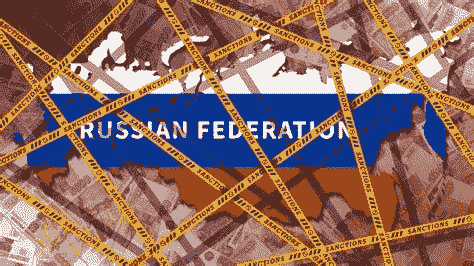

# 俄罗斯是否在使用密码来绕过制裁？

> 原文：<https://medium.com/coinmonks/crypto-is-not-being-used-to-bypass-russian-sanctions-unusual-bromance-4828380e2a00?source=collection_archive---------62----------------------->

## 加密晨酿 3.21

## 未来一周|加密和俄罗斯制裁|市场更新|新闻观察| NFT 和元宇宙

[*来观看节目，加入 crypto*](https://www.youtube.com/c/CryptoBanterGroup) *中发展最快的社区！*

*   今天关于记号经济学的一个伟大插曲