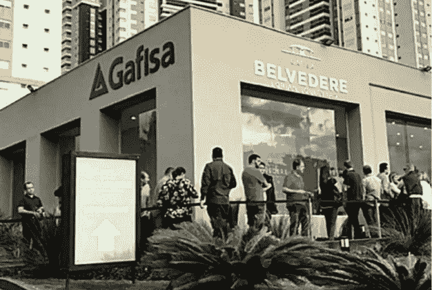

# Crypto 现在被巴西一家领先的房地产公司所接受

> 原文：<https://medium.com/coinmonks/crypto-is-now-accepted-by-one-of-brazils-leading-real-estate-companies-d0942174d835?source=collection_archive---------56----------------------->

领先的巴西房地产开发商 Gafisa 已经开始接受物业销售加密。

据 Gafisa 的幕后人员称，比特币是房地产开发企业的理想选择，因为它消除了房地产开发市场中常见的中间人做法。

根据一份新闻稿，该公司接受比特币的决定是基于该技术为金融领域的创新带来新前景的能力。

该公司宣布，它通过本地交易所 Foxbit 接受加密货币。

Gafisa 的首席执行官古伊列梅·奥古斯托·苏亚雷斯·贝内维德斯认为数字货币行业的扩张是该公司考虑的因素之一。

“如果不采用加密作为支付方式，就无法开展业务，因为除了为买家提供额外的支付选择之外……货币的使用为我们的客户带来了最佳利益，”Benevides 说。

由于数字货币在巴西的迅速普及，该国已成为最显著的采纳者之一。根据 Chainalysis 的一项调查，美国在区块链转移的价值方面排名第六。

尽管巴西央行不承认比特币是一种支付方式，但这种交易媒介已经发展到了如今被广泛使用的地步。

在证券交易所上市的大公司的参与证明了这种做法的流行。

“按市值计算，比特币是最有价值的加密货币，在技术上也是历史上最大的货币，”贝尼维德斯说。这是一种越来越受欢迎的货币，因此扩大了它的应用范围。"

除了比特币，Gafisa 还接受各种额外的虚拟货币，包括卡尔达诺(ADA)、以太坊(ETH)、$XRP 和索拉纳(SOL)。该公司接受总共 16 种不同加密货币的支付。

每 130 个巴西人中就有一个人住在 Gafisa 创建的房产中，这使该公司成为该国最大的房地产开发商之一。

要用加密货币购买房地产，买家必须提交表明其意图的文件。在买家收到钱包地址之前，公司会对该表格进行适当的检查。

过去几个月，比特币的收盘价一直为负。此前一周是连续第七周下跌，是有记录以来持续时间最长的一周。

然而，尽管市场态度乐观，但本周却以下跌收盘，引起了投资者的普遍恐慌。

> 加入 Coinmonks [电报频道](https://t.me/coincodecap)和 [Youtube 频道](https://www.youtube.com/c/coinmonks/videos)了解加密交易和投资

# 另外，阅读

*   [Bookmap 点评](https://coincodecap.com/bookmap-review-2021-best-trading-software) | [美国 5 大最佳加密交易所](https://coincodecap.com/crypto-exchange-usa)
*   最佳加密[硬件钱包](/coinmonks/hardware-wallets-dfa1211730c6) | [Bitbns 评论](/coinmonks/bitbns-review-38256a07e161)
*   [新加坡十大最佳加密交易所](https://coincodecap.com/crypto-exchange-in-singapore) | [购买 AXS](https://coincodecap.com/buy-axs-token)
*   [红狗赌场评论](https://coincodecap.com/red-dog-casino-review) | [Swyftx 评论](https://coincodecap.com/swyftx-review) | [CoinGate 评论](https://coincodecap.com/coingate-review)
*   [投资印度的最佳密码](https://coincodecap.com/best-crypto-to-invest-in-india-in-2021)|[WazirX P2P](https://coincodecap.com/wazirx-p2p)|[Hi Dollar Review](https://coincodecap.com/hi-dollar-review)
*   [加拿大最佳加密交易机器人](https://coincodecap.com/5-best-crypto-trading-bots-in-canada) | [库币评论](https://coincodecap.com/kucoin-review)
*   [用于 Huobi 的加密交易信号](https://coincodecap.com/huobi-crypto-trading-signals) | [HitBTC 审查](/coinmonks/hitbtc-review-c5143c5d53c2)