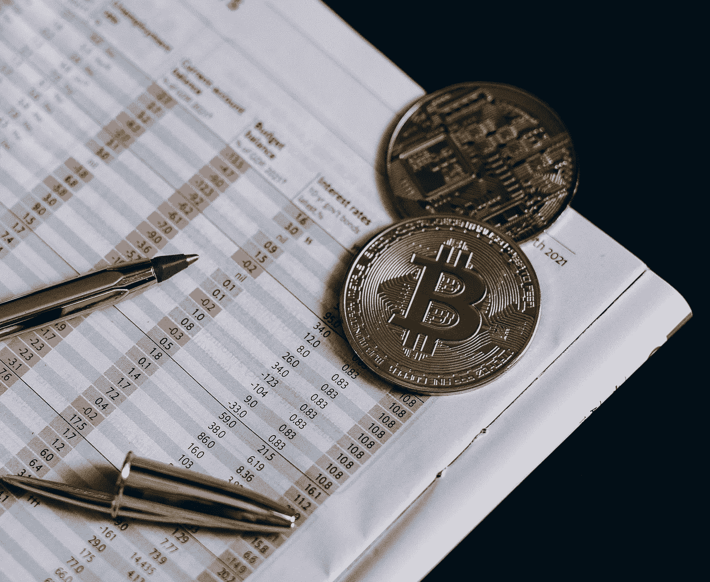
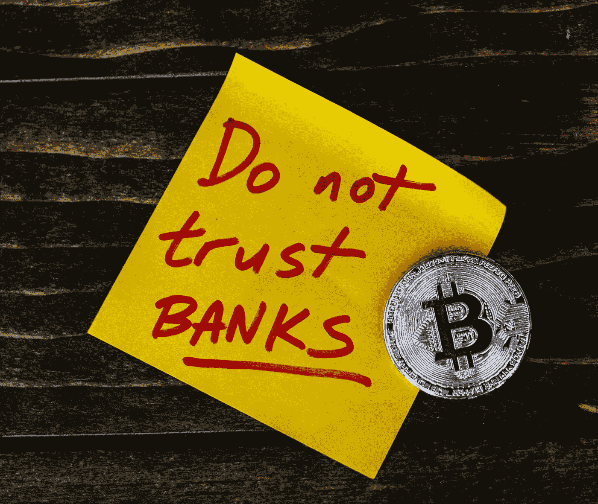

# 加密太大而不能崩溃吗

> 原文：<https://medium.com/coinmonks/crypto-is-too-big-to-crash-c786a5babf6f?source=collection_archive---------15----------------------->

## 金融利益集团绝不会让他们的新投资付诸东流

有些人对加密持怀疑态度，这是有充分理由的。这是一种新事物，一种老一辈可能难以适应的外来观念。然而，一些投资者已经看到了加密货币的真实面目，并投入了一切。许多幕后投资者在 crypto 投资。看起来我只是想玩确认偏见。您关注 crypto，所以您想听到有关 crypto 的好消息。然而，在这篇文章的结尾，我希望你能看到金融利益支撑着加密的支柱。

## 著名的投资者有很多钱参与其中

有些人和他们的公司在 crypto 上投入了数百万美元。如果你关注 YouTube 上的一些加密频道或者阅读关于他们的文章，你们中的一些人可能听说过他们的名字。这些是投资 crypto 的一些名人，他们是:

劳尔·帕尔:他最初是 GLG 全球宏观对冲基金的联席经理。2004 年，他从基金管理行业退休，创办了全球宏观投资者 2005。这是一份关于经济、市场分析和贸易建议的原创独立研究出版物。如果拉乌尔·帕尔经营一家经济学研究公司，很容易认为他会是第一个知道加密是否是下一个大事件的人。下面是一个采访，解释了他投资加密货币，尤其是以太坊的内容和原因。

Starts on how he got into crypto at 13 mins

**凯瑟琳(凯蒂)焕:**在投资 crypto 之前，她是一名联邦检察官，主要负责欺诈、网络和企业犯罪。因此，如果凯蒂认为 crypto 是一个骗局，她可能会知道，因为她的职业生涯。凯蒂是 crypto 公司的著名投资者，曾在比特币基地和哈克罗尼公司董事会任职。

**埃隆马斯克:**男人，神话，传奇。在制造汽车之前，埃隆通过投资互联网获得了财富，并通过开发 Zip2(一种在线查找黄皮书的方法)获得了代码。卖掉之后，他还投资了 PayPal，并获得了巨额利润。然后，当然是他成就了今天的特斯拉和 SpaceX。有些人喜欢艾伦，有些人讨厌他。但重要的是，他知道 PayPal 将是一项不错的投资。当他说 dogecoin 是一个好的密码时，有些人认为他是在开玩笑，但他有他的理由。他认为，快速的交易费用和低廉的价格是将加密作为一种真正的货币而不是一种你用来储存价值的东西的未来。当然，其他密码可能做得更快或更好，但 dogecoin 是我们大多数人知道的唯一一个。也许当[以太坊 2.0 合并](/coinmonks/ethereum-2-0-will-change-everything-cac01f24d56f)发生时，他可能会改变口风。因为这将解决他对气候和快速交易速度的担忧。

## 这些投资者不喜欢不必要的风险

如果你把股市看作一个赌桌，这可能很难想象。但是大投资者通常不喜欢他们可能会损失的东西。这和好莱坞拍续集的原因一样。或者为什么电子游戏总是被同一批人玩。因为配方很畅销，而且很有效。因此，当投资者看到一个新的机会时，他们不会只是把钱扔在桌子上，然后转动方向盘。他们会思考，通常会让别人来分析，除非他们更擅长。做出他们的决定。有很多重要的名字都在 crypto 上。如上所述。随着你开始看到加密越来越受欢迎，你可能会开始看到政府中的一些人支持加密，要么是因为他们认为加密很受欢迎，要么是因为金融机构希望政府对他们宽容一些。旋转门政治之类的。

## 许多银行开始营业了

信不信由你，欧洲的一些银行已经接受了加密。美国的银行也开始准备开门营业。通过搜索欧洲接受 crypto 的银行，我可以找到一篇这样的文章。

 [## 欧洲的加密友好银行:概述和最佳选择-区块链咨询公司

### 在欧洲有任何加密友好的银行吗？让我们来看看目前的情况和…的选择

www.blockchainconsultus.io](https://www.blockchainconsultus.io/crypto-friendly-banks-in-europe-overview-and-best-options/) 

虽然是去年的，但是有一篇关于美国银行准备使用来自美国消费者新闻与商业频道的加密技术的文章。这份 2021 年发布的报告称，今年。事后看来是 2020 年，但有时像这样的重大变化可能需要一到三年才能完成，所以可能他们只是日期搞错了。

如果 crypto 即将分崩离析，为什么会有这么多银行买入？重要的是要知道，银行和富人通常会得到大多数普通人从未听过的提示和见解。所以如果 crypto 明天崩溃，他们很可能会第一个知道。

## 他们希望你卖，这样他们就可以买:

这种情况也可能发生在股票上，但许多大圈子通常会对任何值得购买的资产采取以下措施。他们会报道 x 资产做得不好，导致媒体抓狂，让你卖出。当你这么做的时候，公司会把它买下来，让你来背黑锅。人们通常会告诉你，不要在下跌时卖出，只能买入更多。这是一直在使用的卑鄙伎俩。同样的事情也发生在 crypto 身上。除了因为 crypto 太新了，它上面有很多不必要的讨厌。

I would also add companies and the news to that note.

## 结论:

就目前而言，从个人经验来看。Crypto 又开始看到更多正常的健康数字了。我们经历了一场大崩盘，现在开始有所恢复。有很多人不喜欢 crypto。但是一些值得一听的最聪明的人告诉你加密是未来。这么多有意义的直觉都试图进入派对，因为他们来晚了。拥有密码的人绝不会希望看到它被浪费掉。如果他们有一百万美元的以太币，你认为他们会希望他们的以太币变成一美元吗？作为最后的手段，他们甚至可能会向政府行贿，让政府对加密更宽松一些。可能还有许多其他有钱人和公司在 crypto 里有钱。所以问问你自己，那些比你想象的更有钱的人愿意看到他们的资产在一夜之间消失吗？或者他们只是想分你一杯羹？

我不是金融专家小心你的钱！

*来源引用:*

 [## -安德森·霍洛维茨

### 凯瑟琳(“凯蒂”)焕是普通合伙人。此前，她作为联邦检察官花了十年时间专注于欺诈…

a16z.com](https://a16z.com/author/katie-haun/)  [## 加密托管公司 NYDIG 表示，今年将有数百家美国银行使用比特币

### 美国消费者新闻与商业频道了解到，比特币可能向主流采用又迈进了一步。第一次，一些客户…

www.cnbc.com](https://www.cnbc.com/2021/05/05/bitcoin-is-coming-to-hundreds-of-us-banks-says-crypto-firm-nydig-.html) 

> 加入 Coinmonks [电报频道](https://t.me/coincodecap)和 [Youtube 频道](https://www.youtube.com/c/coinmonks/videos)了解加密交易和投资

# 另外，阅读

*   [3 商业评论](/coinmonks/3commas-review-an-excellent-crypto-trading-bot-2020-1313a58bec92) | [Pionex 评论](https://coincodecap.com/pionex-review-exchange-with-crypto-trading-bot) | [Coinrule 评论](/coinmonks/coinrule-review-2021-a-beginner-friendly-crypto-trading-bot-daf0504848ba)
*   [莱杰 vs Ngrave](/coinmonks/ledger-vs-ngrave-zero-7e40f0c1d694) | [莱杰 nano s vs x](/coinmonks/ledger-nano-s-vs-x-battery-hardware-price-storage-59a6663fe3b0) | [币安评论](/coinmonks/binance-review-ee10d3bf3b6e)
*   [Bybit Exchange 审查](/coinmonks/bybit-exchange-review-dbd570019b71) | [Bityard 审查](https://coincodecap.com/bityard-reivew) | [Jet-Bot 审查](https://coincodecap.com/jet-bot-review)
*   [3 commas vs Cryptohopper](/coinmonks/3commas-vs-pionex-vs-cryptohopper-best-crypto-bot-6a98d2baa203)|[赚取加密利息](/coinmonks/earn-crypto-interest-b10b810fdda3)
*   最好的比特币[硬件钱包](/coinmonks/hardware-wallets-dfa1211730c6) | [BitBox02 回顾](/coinmonks/bitbox02-review-your-swiss-bitcoin-hardware-wallet-c36c88fff29)