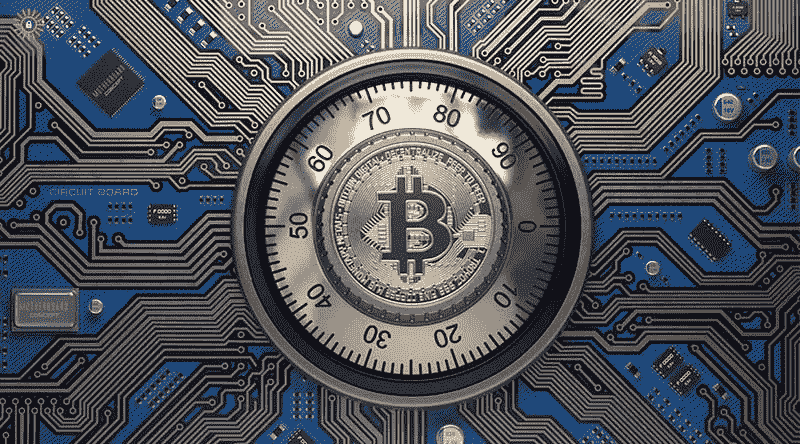
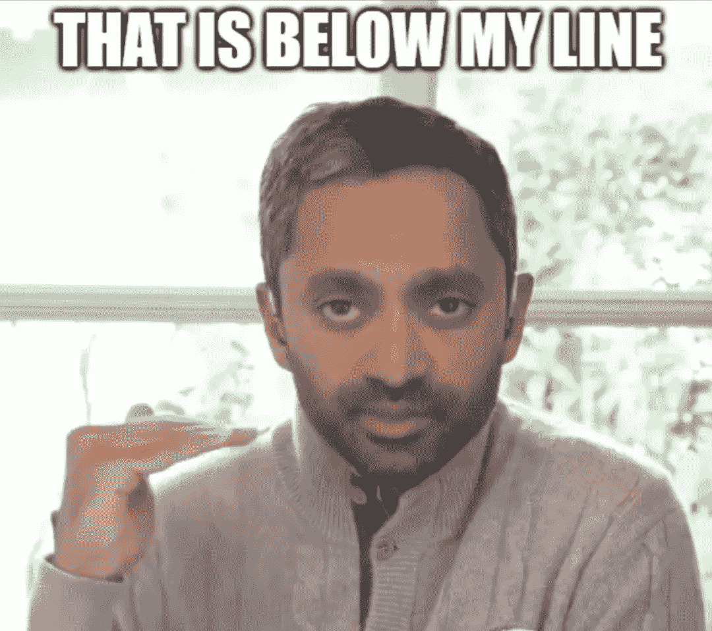

# 加密问题:加密货币安全吗？

> 原文：<https://medium.com/coinmonks/crypto-issues-is-cryptocurrency-safe-c7a2b6fa5cd5?source=collection_archive---------49----------------------->

每一次创新都会带来挑战。它在我们面前设置了新的障碍，我们需要找到尽可能好的方法来处理它们。我们必须提出新的想法、观点和思维方式来解决这些问题，并制定安全和标准化的解决方案。

这并不容易，这是一条充满实验和失败的艰难道路。有时我们会碰壁，走进死胡同。然后我们必须回去重新开始。这很糟糕，但这是过程的一部分。

Are cryptocurrency safe? [Source](https://www.google.com/url?sa=i&url=https%3A%2F%2Fgoldskysecurity.com%2Fcrypto-vulnerability-management-for-smbs%2F&psig=AOvVaw0FCbEfLSmOiUtw6luejlp3&ust=1649371711228000&source=images&cd=vfe&ved=0CAoQjRxqFwoTCIjux8zCgPcCFQAAAAAdAAAAABAD)

# 区块链

区块链本身没什么意思。它只是另一种数据结构。但是如果你把它和其他工具结合起来，比如共识机制、密码签名等等，它可以创造出一些有趣的东西。

我们见证了完全去中心化的新支付系统的诞生。该平台不依赖于任何中间人，任何单点故障。但是如果协议本身存在漏洞呢？

那么，安全吗？保险箱到底是什么意思？安全吗？可以全天候访问吗？我可以随时安全地转移我的资金吗？我认为这可能是这篇文章的正确定义。让我们总结一下当时发生的一些问题，看看我们如何进一步对待这个系统。

## 比特币

比特币是最初的去中心化加密货币。这是迄今为止最古老、最经得起战斗考验的密码。没有太多的技术问题，但更像是社会-社区剧，比如 [Segwit fork](https://en.wikipedia.org/wiki/SegWit) 或者[克雷格·赖特](https://en.wikipedia.org/wiki/Craig_Steven_Wright)的人(一个自称的 Satoshi)。

然而，即使是比特币也有它的问题。完整的漏洞列表可以在[这里](https://en.bitcoin.it/wiki/Common_Vulnerabilities_and_Exposures)找到。最著名的漏洞之一是 [**通货膨胀漏洞**](https://decrypt.co/39750/184-billion-bitcoin-anonymous-creator) ，它让开发者在 2010 年产生了 1840 亿个比特币。[这导致了一个暂时的链分裂，直到最长的带修复的链接管](https://en.bitcoin.it/wiki/Value_overflow_incident)。另一个有趣的问题发生在 2018 年的 [**双花漏洞**](/hackernoon/bitcoin-core-bug-cve-2018-17144-an-analysis-f80d9d373362) 。快速修复发布了，但是我花了时间到达大多数节点。

通货膨胀对每个连锁店都是一个威胁，如果没有人注意，一些连锁店甚至可能在没有通知它的情况下经营。[或者更糟，它甚至不可见，就像 Zcash](https://zfnd.org/concerning-the-sprout-vulnerability-cve-2019-7167/) 的情况一样。

比特币挺过了这些难关(也许运气不错)，它是最稳定、久经考验的链条之一。[此处跟踪其正常运行时间(99.98%以上)](https://www.buybitcoinworldwide.com/bitcoin-uptime/)。

## 以太坊

以太坊技术引入了可编程区块链，提高了它的复杂性。世界计算机能够以分散的方式运行程序(智能合同)的想法是惊人的。

以太坊能够得到开发者社区的关注，得到牵引。它打开了有趣的去中心化产品的大门，如 [DAOs](https://en.wikipedia.org/wiki/Decentralized_autonomous_organization) 、 [ICOs](https://en.wikipedia.org/wiki/Initial_coin_offering) 、 [DeFi](https://en.wikipedia.org/wiki/Decentralized_finance) 、 [NFTs](https://en.wikipedia.org/wiki/Non-fungible_token) 等。它也为聪明的合同开发和新技术的发展打开了大门。

如果把以太坊作为一个平台本身来看，最困难的时候可能是[2016 年的 DAO hack](https://www.gemini.com/cryptopedia/the-dao-hack-makerdao)。以太坊链本身并没有受到损害，但是著名的[重入错误](/@MyPaoG/explaining-the-dao-exploit-for-beginners-in-solidity-80ee84f0d470)导致 Dao 合同中 360 万以太坊被盗。

大讨论随之而来，因为它是总供应量的三分之一左右，消除剥削的叉子开始被讨论。一些人不同意，并为“代码即法律”的方法和不变性而斗争。导致了硬分叉，产生了以太坊和以太坊经典(决定尊重 hack)。

以太坊从黑客(和叉子)中恢复过来，成为最强的链条之一，如果不是最强的话。它提供区块链创新，如缩放技术、烧钱机制或 ZK 加密的实现。

这对投资者来说可能很可怕，因为每一项创新都会带来一些不确定性和漏洞的威胁。另一方面，[以太坊的正常运行时间是 **100%** ，从创世纪区块到现在](https://ethstats.net/)。以太坊是一个强大且运行良好的平台。

不幸的是，对小投资者来说，使用它变得很昂贵，这允许了替代链的兴起([或多或少成功](https://www.reddit.com/r/CryptoCurrency/comments/se1ytq/cardano_network_clogged_avalanche_congested_a/))，在许多情况下基于以太坊代码。然而， [L2 解决方案](https://ethereum.org/en/layer-2/)一旦得到更广泛的采用，就可以将使用带回以太坊生态系统。

## 索拉纳

索拉纳推出了一种超快速、廉价且可扩展的网络。索拉纳的价格从 2020 年初的 0.5 美元涨到了 2021 年末的 260 美元，令人难以置信。它还因为多起撞车事故而受到关注。不幸的是，网络不够健壮，一个月内[甚至面临 6 次停电](https://fortune.com/2022/01/25/solana-founder-anatoly-yakovenko-crypto-crash-blockchain-instability/)。

我不得不承认我不理解开发者的讨论和想法。我只有一个基本的概述。我试着用链条，效果还不错。[关于去中心化的营销至少是有问题的](https://www.makeuseof.com/reasons-solana-isnt-really-decentralized)。

我在索拉纳看到了一场营销攻势。当然，这个项目有大量的资金支持。它可以演变成一个成功的项目，但还很不成熟。所有像“main net — beta”和“在 Rust 中开发并因此得到保护”这样的营销声明只需回忆一下 2017 年。可扩展性和去中心化也是一个大问题。一旦索拉纳足够进化，它将成为以太坊的有力竞争者。

## 卡尔达诺

卡尔达诺是 2017 年 ICO 热潮的产物。它建立了一个[利益证明](https://en.wikipedia.org/wiki/Proof_of_stake)链，专注于智能合约和令牌化。它是一个易于使用、快速、廉价的平台。

它作为日本的以太坊而诞生。一些传言说，它最初的重点是在线赌博，但我找不到任何关于它的东西。营销开始将它贴上第一个同行评审的区块链的标签。

Haskell 和[函数式编程](https://en.wikipedia.org/wiki/Functional_programmin)走得更远，被认为是最安全和“*防错语言*”。在我看来，将安全漏洞归咎于 [OOP](https://en.wikipedia.org/wiki/Object-oriented_programming) 听起来非常愚蠢。智能合约的出现引起了一些关注，因为它表明函数式编程不能解决所有问题。然而，似乎卡尔达诺能够向前迈进。而且看起来[也挺稳的](https://www.reddit.com/r/cardano/comments/r5upt7/cardano_ada_achieved_another_milestone_earlier/)。

## 多边形

Polygon 是一个以太坊侧链，带有几个特征。在以太坊还很贵的时候，对于一些用户来说是一个很棒的平台。它设法吸引了许多项目，并提供了类似以太坊互动的感觉。

这里会出什么问题呢？多边形面临几个问题。举几个例子，在他们的等离子桥上有一个[严重错误。它使 8.5 亿美元陷入危险。幸运的是，它没有被利用。最近，网络面临](https://cryptobriefing.com/polygon-swerves-850-million-hack-ethereum-bridge/)[区块重组](https://forum.polygon.technology/t/investigating-reorg-and-rpc-issues-on-polygon-pos/2190)和[后来由于升级](https://cryptopotato.com/heres-why-polygon-matic-network-was-down-for-11-hours/)中的一个 bug 而遭遇 **11 小时的中断**。

## Iota

Iota 将其网络设计为[有向无环图](https://en.wikipedia.org/wiki/Directed_acyclic_graph)，数据结构称为[缠结](https://en.wikipedia.org/wiki/IOTA_%28technology%29#The_Tangle)。主要关注点是微交易和[物联网](https://en.wikipedia.org/wiki/Internet_of_things)。它意味着快速和廉价(原本感觉不到)的交易。

共识是通过中心节点即协调者达成的。这违背了分散化和消除单点故障的理念。Iota 承诺一旦网络成熟就移除它。一些人争论这是否可能。

Iota 在 2017 年有了第一部安全剧。DCI 实验室的科学家成功破解了 EU-CMA 的安全系统，但是[对结果](/@noahruderman/a-summary-of-why-iotas-refutation-of-a-vulnerability-by-dci-labs-is-absurd-128e894781b1)提出了质疑。最艰难的时候是在 2020 年。[网络在一次 200 万美元的黑客攻击后被关闭。2021 年 Firefly 的进一步升级并没有更好，因为一些用户在几个月内(我相信是 4 月至 8 月)无法访问他们的资金。](https://www.theblockcrypto.com/linked/58337/iota-is-back-online-nearly-a-month-after-2-million-attack-on-wallet-software-users)

此外，Iota 还面临一些 DDoS 攻击，因为它的无感觉交易。它试图[带来智能合约](https://wiki.iota.org/smart-contracts/overview)，但谁知道接下来会出现什么。

# 摘要

有许多发行规模或大或小的加密货币。我们可以看到，即使是最可靠的公司也有一些问题需要解决。每一项创新都会带来新的障碍，如何应对这些障碍取决于我们。

我们应该关注负责任的团队如何解决问题，以及他们的解释有多诚实。我们不能排除关键漏洞会再次出现。但是最强的队伍证明了自己的素质，很好的处理了这些情况(至少比特币和以太坊)。

基于我糟糕的记忆力，我随机选择了描述的项目。主要的想法是不要提升或贬低任何一个。主要的想法是表明，每个项目都有困难的时候，必须处理它们。很难说任何加密货币是否安全。由你决定你的底线在哪里。

And where is your line? [Source](https://www.google.com/url?sa=i&url=https%3A%2F%2Ftwitter.com%2Frationalaussie%2Fstatus%2F1483413640330244106&psig=AOvVaw1cBp7Ivu3yeTIA331WUy1H&ust=1649371098263000&source=images&cd=vfe&ved=0CAoQjRxqFwoTCICnqajAgPcCFQAAAAAdAAAAABAD)

> 加入 Coinmonks [电报频道](https://t.me/coincodecap)和 [Youtube 频道](https://www.youtube.com/c/coinmonks/videos)了解加密交易和投资

# 另外，阅读

*   [Bitsgap 审查](/coinmonks/bitsgap-review-a-crypto-trading-bot-that-makes-easy-money-a5d88a336df2) | [Quadency 审查](/coinmonks/quadency-review-a-crypto-trading-automation-platform-3068eaa374e1) | [Bitbns 审查](/coinmonks/bitbns-review-38256a07e161)
*   [密码本交易平台](/coinmonks/top-10-crypto-copy-trading-platforms-for-beginners-d0c37c7d698c) | [Coinmama 审核](/coinmonks/coinmama-review-ace5641bde6e)
*   [印度加密交易所](/coinmonks/bitcoin-exchange-in-india-7f1fe79715c9) | [比特币储蓄账户](/coinmonks/bitcoin-savings-account-e65b13f92451)
*   [OKEx vs KuCoin](https://coincodecap.com/okex-kucoin) | [摄氏替代品](https://coincodecap.com/celsius-alternatives) | [如何购买 VeChain](https://coincodecap.com/buy-vechain)
*   [币安期货交易](https://coincodecap.com/binance-futures-trading)|[3 comas vs Mudrex vs eToro](https://coincodecap.com/mudrex-3commas-etoro)