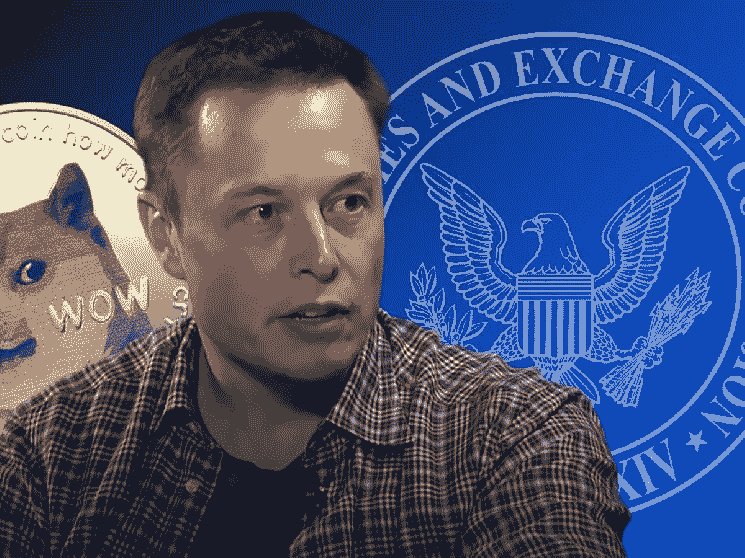

# 密码法律创始人警告埃隆·马斯克在 Dogecoin 推广推特上

> 原文：<https://medium.com/coinmonks/crypto-law-founder-warns-elon-musk-over-dogecoin-promotional-tweets-f55193e3920f?source=collection_archive---------51----------------------->

CryptoLaw 公司创始人兼主持人约翰·迪顿(John Deaton)警告埃隆·马斯克(Elon Musk)，他的加密项目可能会面临与 Ripple (XRP)遭受的相同的法律问题，因为他经常在推特上推广 Dogecoin。迪顿提到了世界上最富有的人，同时回应了一个名叫杰布的人的推特，他批评 SEC 的加里·格尔森对 Ripple 的诉讼。

该用户在推文中抱怨称，SEC 主席对所有虚拟资产都没有公平的政策。他们敦促与美国以外的金融机构有超过 300 个联系的 Ripple 面临法律障碍，而 Elon Musk 一直通过推特自由控制他的狗币的价格。

> 伊隆在推特上发了关于$DOGE &它跳了#Ripple 和几乎每一个主要的金融机构都有交易& XRP 仍然受到压制，因为加里·詹斯勒把他们作为人质..谢谢你的保护加里。

这并不意味着 twitter 的随机用户希望 SEC 起诉埃隆·马斯克，但迪顿表达了他的怀疑，并警告了 SpaceX、特斯拉、Starlink 和其他两家公司的所有者。他认为，SEC 官员可以将 Dogecoin 视为在马斯克及其公司领导下运作的投资合同。

> 小心@elonmusk，因为@GaryGensler 和 SEC 可能会试图将#DOGE coin 称为与您和您的公司的投资合同。

> 加入 Coinmonks [电报频道](https://t.me/coincodecap)和 [Youtube 频道](https://www.youtube.com/c/coinmonks/videos)了解加密交易和投资

# 另外，阅读

*   [Bookmap 点评](https://coincodecap.com/bookmap-review-2021-best-trading-software) | [美国 5 大最佳加密交易所](https://coincodecap.com/crypto-exchange-usa)
*   最佳加密[硬件钱包](/coinmonks/hardware-wallets-dfa1211730c6) | [Bitbns 评论](/coinmonks/bitbns-review-38256a07e161)
*   [新加坡十大最佳加密交易所](https://coincodecap.com/crypto-exchange-in-singapore) | [购买 AXS](https://coincodecap.com/buy-axs-token)
*   [红狗赌场评论](https://coincodecap.com/red-dog-casino-review) | [Swyftx 评论](https://coincodecap.com/swyftx-review) | [CoinGate 评论](https://coincodecap.com/coingate-review)
*   [投资印度的最佳密码](https://coincodecap.com/best-crypto-to-invest-in-india-in-2021)|[WazirX P2P](https://coincodecap.com/wazirx-p2p)|[Hi Dollar Review](https://coincodecap.com/hi-dollar-review)