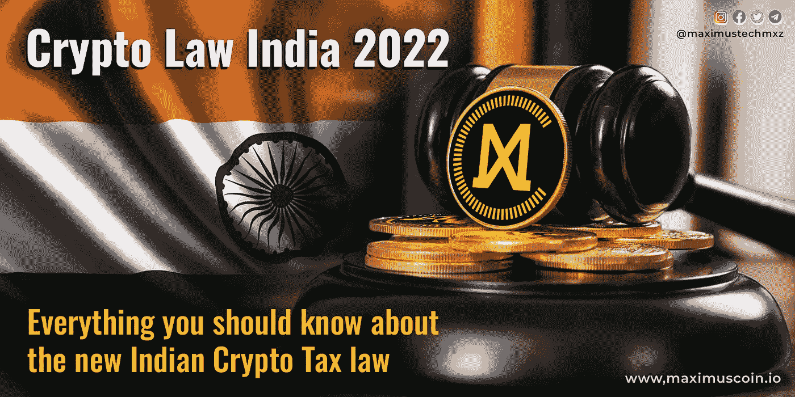

# 印度 2022 年加密法:关于新印度加密税法你应该知道的一切

> 原文：<https://medium.com/coinmonks/crypto-law-india-2022-everything-you-should-know-about-the-new-indian-crypto-tax-law-dfa270417ecf?source=collection_archive---------47----------------------->

Crypto Law India 2022: Everything you should know about the new Indian Crypto Tax law

《2022 年加密税法》是目前大多数投资者、交易者和从事加密行业或与加密行业相关的人讨论的热门话题。长期以来，政府一直在暗示禁止或监管印度的加密技术。但随着上一财年的结束，所有的猜测也告一段落，新的《印度 2022 年加密法》出台了。
Crypto 税法 2022 一起买了喜忧参半的眼泪。一方面，印度政府监管加密技术，不像中国那样禁止加密。而另一方面，我们可敬的政府对来自虚拟数字资产的收入征收高达 30%的税，对加密传输征收 1%的 TDS。

印度政府肯定已经收紧了加密货币交易的螺栓。人民院通过的 2022 年财政法案引入了新的第 115BBH 节，处理虚拟数字资产的税收问题。印度加密税法第 115BBH 节规定了计算方法，并对虚拟数字资产(VDA，如加密货币和 NFT)转让所得征收 30%的税率。

根据人民院通过的新税法，所有虚拟数字资产的收益都将征收 30%的税(加上 cess 和附加费)，即使您的应纳税收入低于 2，50，000 卢比，也将适用。补充说明，在计算应纳税额时，不允许扣除除购置成本以外的其他费用。

## 如何计算和扣除加密税？

如果你为₹15k 购买了密码，然后卖给了₹45k，你的直接收益就是₹30k.
将按照以下方式征税:
销售对价₹45k
(减去)收购成本₹15k
所得税 30% @ ₹30k 成为₹9k

此外，没有关于抵消和结转无人认领的损失的规定。换句话说，如果你认为你可以通过调整一个加密收益的损失和另一个加密收益来逃避税收。让我告诉你，对于这种情况，在新的密码法律下已经有了一个条款。
条款(2)(b)禁止根据《信息技术法案》的“任何其他条款”从收入中抵消加密资产的损失。此外，在本条例草案下,「其他」一词已被删除。
这仅仅意味着你被禁止用另一种数字资产的收益对冲加密货币的损失。这意味着，如果你在柴犬交易中出现亏损，它们不能与比特币或任何其他 VDA 的盈利相抵消。

财政部长 Nirmala Sitharaman 在谈到人民院 2022 年财政法案时表示，政府已提议对虚拟货币征税，因为该领域正在进行大量交易。人们投入资金，取出资金，创造资产，由此产生货币，这就需要监管。

此外，2022 年金融法案下的修正案规定，印度人购买或出售密码时在源头扣除 1%的税收，以及对密码礼物征税。与 VDA 30%的资本利得税不同，TDS 将于 2022 年 7 月 1 日开始生效。这将使税务部门更容易跟踪所有的加密交易。

《2022 年加密法案》提议对一年中超过 10，000 卢比的虚拟货币支付征收 1%的 TDS，并对接受者手中的此类礼物征税。对于特定人员，TDS 的起点限额将为每年 50，000 卢比，这包括需要根据《所得税法》对其账户进行审计的个人和住房公积金。

好消息是，我们可以就涉及损失的交易要求 TDS 退款。因此，如果您正在进行加密货币交易，建议您提交所得税申报表。

这项印度加密税收法案在区块链业界引起了褒贬不一的反响。我们认为有必要对密码进行监管和征税。但据我们所知，以其目前的形式，它被怀疑弊大于利。

印度加密货币交易所 [WazirX](https://wazirx.com/) 的创始人兼首席执行官尼斯查尔·谢蒂(Nischal Shetty)表示，由于许多事情没有得到适当的批准，它将无法为政府提供预期的结果。这可能会导致对遵守 KYC 规范的印度交易所的大量参与，并导致资本更多地流向外国交易所或不遵守 KYC 规范的交易所。这对政府或印度的秘密生态系统都没有帮助。

专家表示，提议的 30%的税收，不管加密资产是否是资本资产，都可能对投资者的增长有害。此举将使日内交易者无法节省税款，即使他们目前不在所得税范围内。

你对新的 2022 年加密法案有什么想法？你支持它还是认为它是密码产业发展的一个障碍？

关注我们的[脸书](https://www.facebook.com/maximustechmxz) & [推特](https://twitter.com/maximustechmxz/)

在[电报](http://t.me/maximustechmxz)上加入 Maximus 社区

> 加入 Coinmonks [电报频道](https://t.me/coincodecap)和 [Youtube 频道](https://www.youtube.com/c/coinmonks/videos)了解加密交易和投资

# 另外，阅读

*   [如何在 FTX 交易所交易期货](https://coincodecap.com/ftx-futures-trading) | [OKEx vs 币安](https://coincodecap.com/okex-vs-binance)
*   [CoinLoan 评论](https://coincodecap.com/coinloan-review) | [YouHodler 评论](/coinmonks/youhodler-4-easy-ways-to-make-money-98969b9689f2) | [BlockFi 评论](https://coincodecap.com/blockfi-review)
*   [XT.COM 评论](https://coincodecap.com/profittradingapp-for-binance)币安评论 |
*   [SmithBot 评论](https://coincodecap.com/smithbot-review) | [4 款最佳免费开源交易机器人](https://coincodecap.com/free-open-source-trading-bots)
*   [比特币基地僵尸程序](/coinmonks/coinbase-bots-ac6359e897f3) | [AscendEX 审查](/coinmonks/ascendex-review-53e829cf75fa) | [OKEx 交易僵尸程序](/coinmonks/okex-trading-bots-234920f61e60)