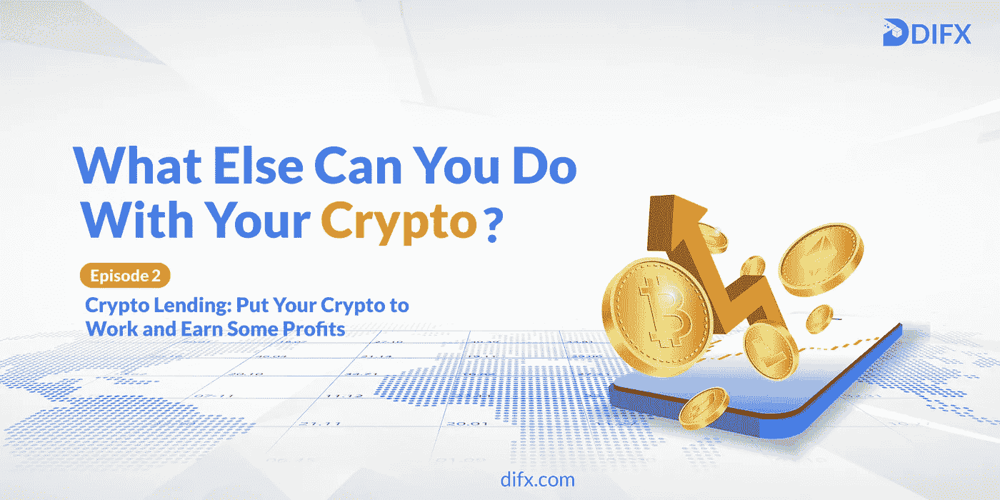

# 加密贷款:把你的加密工作，赚取一些利润！

> 原文：<https://medium.com/coinmonks/crypto-lending-put-your-crypto-to-work-and-earn-some-profits-1cc76b755e31?source=collection_archive---------25----------------------->

## 你还能用你的密码做什么:第二集

区块链和加密货币领域充满了巨大的机会，可以帮助你通过做你喜欢做的事情来创造新的收入来源。你可以玩，搜索，学习，甚至做你的日常网上冲浪，赚取加密！

有了我们的新**“你还能用你的密码做什么？”**系列，我们旨在帮助您识别这些机会，并充分利用它们。密码世界不仅仅是交易:所以让我们一起探索无限的可能性！

# 第 2 集:加密贷款

2008 年比特币诞生后不久，DeFi 生态系统在加密镇开始工作，推出了一个创新金融产品和服务的大型游乐场。第一次，我们可以获得良好的财务自由感，因为 DeFi 允许我们在不依赖银行或金融机构的情况下经营我们的财务生活。

分散金融(DeFi)很快在加密用户中占据了一席之地，每天都有数十亿美元在[易手](https://coinmarketcap.com/view/defi/)！这个生态系统充满了金融应用，其中大多数都提供了传统银行通常提供的服务或产品的透明和开放版本；

我们主要将这些金融应用称为去中心化应用或 DApps。

**DeFi 中的分散应用**

一般来说，DApps 旨在将有需求的用户与其他愿意付费提供解决方案的用户联系起来。用户的需求可以从内容或金钱到特定的服务，如广告和促销。

在 DeFi 的背景下，DApp 只是将借款人和贷款人联系在一起；借款人可以在有(有时没有)抵押品的情况下获得他们需要的资金，并且必须向贷款人支付少量费用作为利息。

除了 DApps 之外，一些集中式密码交换或借贷平台也提供这些服务。

## 加密贷款:它是如何工作的？

正如我们上面提到的，有不同的方法可以让你借出你的密码并获得新的收入来源。一般来说，您必须在集中式平台(如传统的加密交换)和分散式借贷应用(如 Compound)之间做出选择。

在加密交易所，平台负责获得你的资金，将它们借给合适的借款人，并最终将利息还给你。另一方面，在 DApp 中，智能合约处理所有这些工作，这些工作本质上是在区块链系统上运行的一段代码。

所以基本上作为贷款人，你需要做的就是把你的资金交给借贷平台，等到借贷期结束，连本带利拿回来。但是，正如加密世界的其他方面一样，如果管理不当，事情往往会变得复杂，有时甚至失控。

## 加密贷款:了解风险

加密贷款可能很有回报，但你不能忽视风险。让我们一起来看看其中的一些:

*   DApps 的安全性很大程度上依赖于他们所依赖的智能合约。合同代码中任何一个简单的 bug 都可能让你损失所有的资金。
*   加密市场是高度不稳定的，你的贷款资金可能会经历剧烈的价格波动。换句话说，在这段时间里，你管理资金的能力是有限的，因为在贷款期间，你无法动用你的资金。
*   急剧的市场崩溃可能会导致你的资金损失，因为借款人可能无法偿还；拖欠贷款。

查看我们的“ [10 大加密相关金融风险](https://difxio.medium.com/10-crypto-related-financial-risks-you-should-know-6eee45642963)”文章，了解更多关于加密市场中常见金融风险的信息！

**免责声明 **

*请注意，交易加密货币可能会带来很高的风险。建议在任何投资前总是寻求专业建议，并且只投资你能承受损失的金额。*

# 关于 DIFX

DIFX 是一个 CEX，它使用区块链技术来整合中央金融。这是一个易于使用的平台，新的和有经验的交易者，机构和投资者。正如 Cointelegraph、BeInCrypto 和许多其他媒体所报道的那样，DIFX 允许用户提名他们家人、朋友或亲人中的任何人，并允许他们在主要用户去世后合法化他们的主张。

此外，该公司希望通过消除中介，增加数字货币在受益人和付款人之间直接结算的使用。要开始您的无限可能之旅，请立即从 [iOS](https://apps.apple.com/ae/app/difx-exchange/id1588944811) 或[谷歌 Play 商店](https://play.google.com/store/apps/details?id=app.difx.exchange)下载应用程序，或访问我们的[difx.com](http://difx.com/)。

> 加入 Coinmonks [电报频道](https://t.me/coincodecap)和 [Youtube 频道](https://www.youtube.com/c/coinmonks/videos)了解加密交易和投资