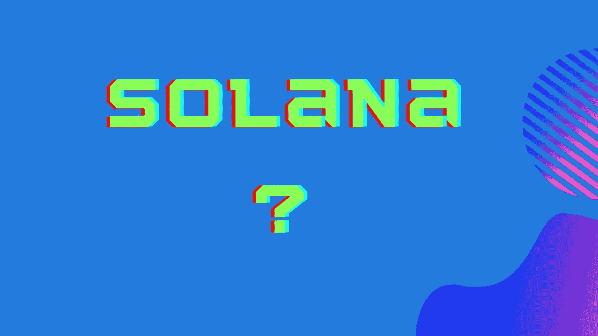

# crypto——让我们来谈谈索拉纳

> 原文：<https://medium.com/coinmonks/crypto-lets-talk-about-solana-d42a55255849?source=collection_archive---------63----------------------->

目前有超过 10，000 个。Solana 是实际的加密货币平台，单个单位称为 sol。索拉纳，由阿纳托利·亚科文科开发，在基于区块链分类账的分散式计算机网络上运行。

这个区块链数据库管理和跟踪货币，有效地记录了货币中发生的每一笔交易，如果你愿意，类似于长期运行的收据。计算机网络记录货币交易，然后验证数据的完整性。

这种分散的设置加强了网络，并允许用户在不需要中间人的情况下进行交易。Solana 自称是世界上最快的区块链，声称每秒钟能够验证 65，000 笔交易，每笔交易不到 1 美分。

虽然许多人认为加密硬币只是一种货币形式，

更有用的是将 crypto 视为一种令牌，可以支持或启用平台上的其他应用程序。例如，vSolana 可以支持智能合同、分散式金融应用程序、NFT 和其他应用程序。

Solana 可以为许多应用程序提供各种功能，例如:货币:使用加密货币钱包，您可以发送或接收硬币，以及转移硬币以换取商品和服务。

智能合同:智能合同是当合同条件得到满足时，自动执行合同条款的应用程序。

NFT(不可替代的代币):NFT 现在很热，经常与数字艺术联系在一起，这些可以由 Solana 驱动，允许艺术家和其他人向消费者出售它们。分散财务:Solana 还允许你创建和使用免许可支付，这避免了集中或政府控制。

除了其他功能外，Solana 还支持开发各种其他应用程序，包括游戏、投资、社交媒体等。

一种基于历史证据的方法:除了使用利害关系证明方法来验证交易之外，Solana 还会给它们加上时间戳，从而消除了验证者为了自己的利益而重新排序交易的能力。这有助于索拉纳成为一个“抵制审查”的网络。

由于硬币奖励给支持加密货币的人，索拉纳每年的发行量有限。索拉纳开始时每年增加 8%的供应量，但这个数字每年下降 15%，直到最终下降到每年 1.5 %

为了验证交易，管理硬币供应，并创造新的硬币，索拉纳采用了一个“股份证明”系统。要参与利益证明系统，您必须首先拥有加密货币，但随后您可以通过协助系统运行获得奖励。

当您向验证器提交令牌时，您是在信任验证器来授权交易。然而，与其他利害关系证明系统一样，如果经过验证的交易未能满足系统的要求，利害关系人可能会损失金钱。

验证者收到新硬币形式的赌注奖励，用于验证交易，并收到奖励的一部分作为佣金。然后，他们将剩余的奖金按比例分配给与他们一起下注的人。

到 2020 年底，投资索拉纳(CRYPTO:SOL)的 1000 美元到 2021 年底将增长到 112781.46 美元。索尔在一年内从 1.51 美元涨到 170.30 美元，涨幅为 11178.1%。但是为打翻的牛奶哭泣是没有意义的。

但是随着市场变老，看着图表想象可能会发生什么是一种常见的消遣，老实说，这样惩罚自己可能是不可取的。当价格降低时，你可以后悔没有购买，也可以责怪自己没有早点购买。

也就是说，在过去的五年里，密码市场发生了很大的变化。甚至索拉纳和以太坊仅在去年就取得了重大进展。

那么，索拉纳的未来会怎样？这是一项值得投资的项目吗？

首先，如果你想投机索拉纳或其他加密货币，你可以直接交易它们或投资于可能受益于加密货币需求增长的公司。

尽管交易索拉纳有风险；如果你不先做研究，你可能会失去所有的钱。大多数人都知道加密货币具有很高的波动性，而且它几乎没有任何有形的东西作为支持，如实物资产或经常性收入。

如果不提供财务建议，不要用你不能承受损失的资金进行交易，如果你正在交易加密货币是你的事情。另一方面，如果你是长线投资，短期波动不会影响你，加上使用你认为是可牺牲的钱，你更有可能看到积极的结果。

所以，现在完全脱离加密世界是可能的。你没有必要为此担心，因为这些项目还没有对你的生活产生直接影响。

但在 10 年内，甚至更短的时间内，很容易想象这样一个世界:更多的公司和国家在其资产负债表上携带代币，智能合约和用户友好的应用程序在索拉纳区块链司空见惯。市场可以向两个方向发展，即使这需要一段时间，而且一路上有起有落。同样，如果你是长期投资者，你的耐心很可能会得到回报。