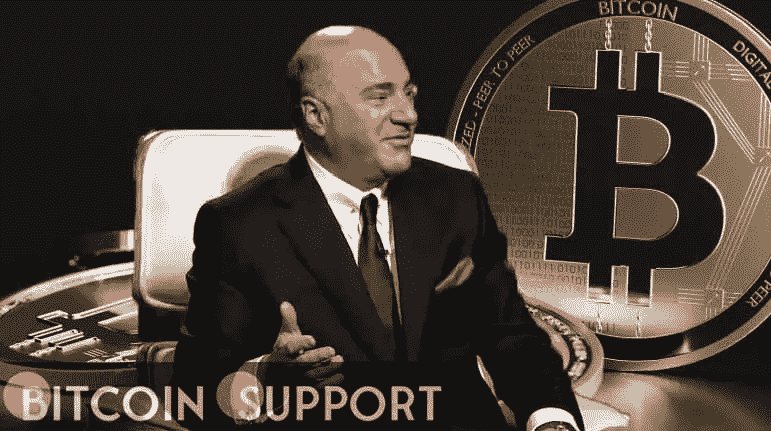

# “加密占了我投资的五分之一，”凯文·奥利里说

> 原文：<https://medium.com/coinmonks/crypto-makes-up-one-fifth-of-my-investment-holdings-kevin-oleary-says-2318e0de7d60?source=collection_archive---------54----------------------->

**Visit our website:-** [**https://bitcoinsupports.com/**](https://bitcoinsupports.com/)

以“鲨鱼池”闻名的凯文·奥利里(Kevin O'Leary)上周五在接受《美国消费者新闻与商业频道》采访时表示，他五分之一的投资资产都在不断扩张的加密货币和区块链行业，大量股份主要分散在加密令牌、货币和公司。他还认为总统乔·拜登的加密行政命令过于模糊。他还对拜登的指令强调与比特币相关的气候危害表示保留。

**凯文·奥利里的加密货币持有量占其总投资组合的 20%**

在最近接受美国消费者新闻与商业频道《Squawk Box》采访时，投资者凯文·奥利里表示，数字资产占其总投资组合的 20%。他表示，“

”我有数百万美元，加密货币和区块链现在占我投资组合的 20%。”

[https://twitter.com/SquawkCNBC/status/1502252853481639946](https://twitter.com/SquawkCNBC/status/1502252853481639946)

他认为，既然投资者都在往谷歌、微软这样的公司里砸钱，为什么不去投资比特币、区块链这样的前沿技术呢？

奥利里还讨论了他持有的加密货币，包括以太坊、索拉纳、氦和雪崩等。

**“你必须多样化；我持有 32 个不同的头寸，包括 FTX 股票。"关键是你不知道谁会赢。"它们都是我的。”**

他对拜登的指示强调加密货币对环境的风险的方式表示不满。根据奥利里的说法，他至少有一家私人比特币采矿厂。然而，他确实说过，在拜登发布行政命令后，他卖掉了自己在公开交易的比特币矿业公司的股份。

“公开交易的比特币公司前途未卜。“因为 RIOT，MARA，HIVE，&小屋使用碳信用额，我在阅读完 POTUS 的密码行政命令后卖掉了我所有的 RIOT，MARA，HIVE，&小屋。这在审计中是站不住脚的。机构资金只会投资于完全由水电驱动的煤矿！”

**在密码政策方面，美国需要迅速赶上**

此外，他强调，美国在密码政策方面落后于加拿大和瑞士等国家，需要迎头赶上。

“加拿大人更发达。他们拥有世界上第一个加密交易所和世界上第一个比特币交易所交易基金。”为什么我们没有它？这个将引领金融服务的萌芽业务的政策远远落在后面。"

**访问我们的网站:-**[**https://bitcoinsupports.com/**](https://bitcoinsupports.com/)

**免责声明:以上为作者观点，不应视为投资建议。读者应该自己做研究。**