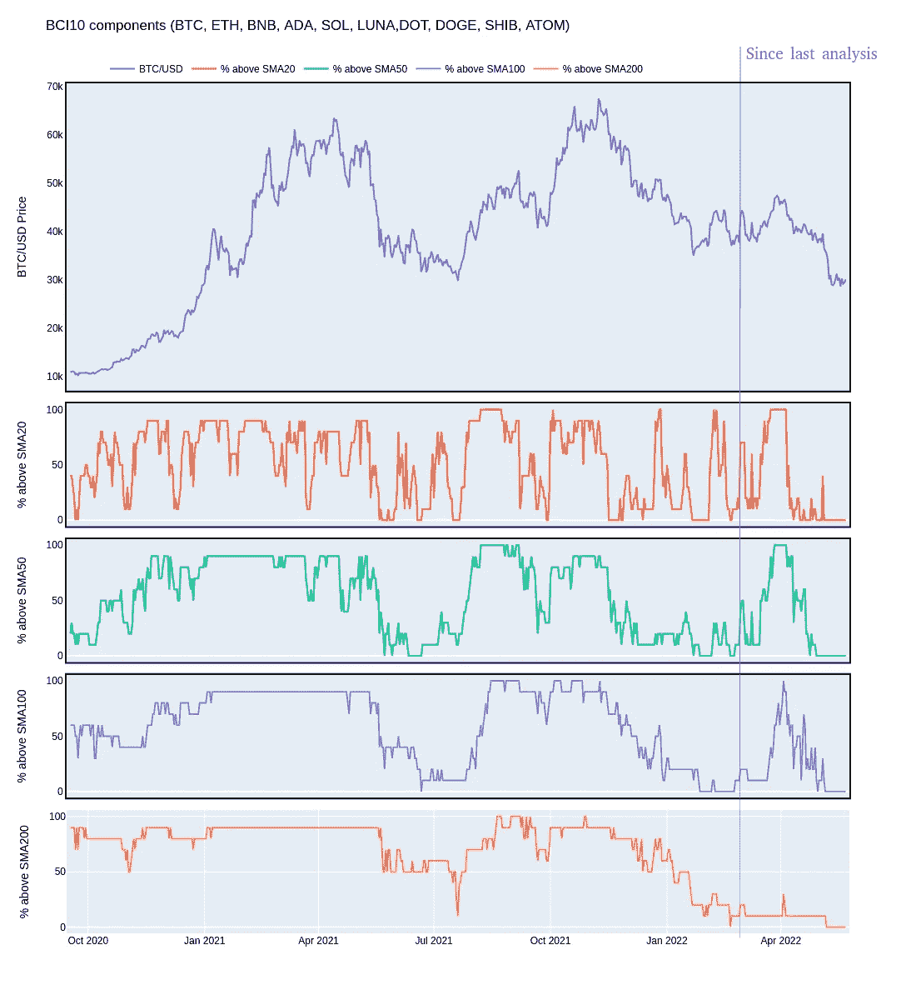

# 密码市场大图

> 原文：<https://medium.com/coinmonks/crypto-market-big-picture-6ddfa8b5b441?source=collection_archive---------18----------------------->

2022 年 2 月底，我试图考察加密市场的大图景([https://medium.com/p/49193095b555](/p/49193095b555))。自那以来，最大的加密货币的估值再次下降，似乎没有趋势变化的迹象。

# 回顾一下:我们在二月份看了什么

上次我们试图确定加密市场的整体情况，我们选取了 10 种最大的加密货币(就估值而言)，并检查了其中有多少高于最重要的 SMA(【https://medium.com/p/49193095b555】T2)。这种方法可以被认为是市场广度分析的一部分，在这种分析中，人们试图看到更大的画面:当前的上涨或下跌是由更广泛的市场还是由一些大玩家带来的？

我们在 2 月份的最后一次评估是，我们当时正看着一个疲软的市场，没有迹象表明情况会很快改变。此外，现在也不是进入新交易或投资的好时机(从“多头”的角度来看)。

# 自二月份以来，加密市场发生了怎样的变化？

现在是时候再次看看市场宽度数据了:10 种最大的加密货币中有多少是关于它们的 SMA20、SMA50、SMA100 和 SMA200 交易的？为了便于比较，我将使用与上次相同的 10 种加密货币:

*   比特币
*   以太坊
*   BNB
*   卡尔达诺
*   索拉纳
*   土地
*   波尔卡多特
*   总督
*   芝 INU
*   宇宙

根据他们的数据，我将尝试绘制以下内容:

*   用于对比的比特币价格图(找不到方便的方法下载 BCI10 历史指数数据)
*   某一天交易价格高于 SMA20 的成分百分比(BCI10)
*   某一天交易价格高于 SMA50 的成分百分比(BCI10)
*   某一天交易价格高于其 SMA100 的(BCI10 的)成分百分比
*   某一天交易价格高于其 SMA200 的(BCI10 的)成分百分比

结果如下:

Crypto market breadth / current health state

我还加了一条细线，大致标出了自 2 月 26 日最后一次分析以来的时间范围。

# 密码市场的健康解释了

根据我衡量加密市场健康程度的方法，我们可以从上面的图表中读到以下内容:

自上次评估以来，估值出现大幅增长，伴随而来的是交易价格超过 SMA20、SMA50 和 SMA100 的加密货币大幅增加。这一发展起初似乎是健康的，但交易高于其 SMA20 的货币的急剧下跌使得**市场的疲软**再次可见(4 月初)。此外，估值的上升过于短暂:**在 SMA 200 上方交易的加密货币数量，这是一个很好的中长期指标，大部分时间都停留在 0 附近。** **正如我们所知，可持续的价格波动通常伴随着超过其 SMA200 的交易货币数量的适当变化。3 月/4 月的情况并非如此，该数字目前处于我们图表中所能看到的最低水平。**

因此，我们可以确定情况实际上比 2 月份更糟。这对你来说一点也不奇怪。但值得注意的是，目前估值的下降是伴随着市场宽度的下降——因此，目前的下降是“健康的”和可持续的。价格变动和市场宽度之间没有出现背离。

那么，密码市场的下一步是什么？

在我的分析中有一些好消息:当 SMA 市场宽度指标都处于可能的最低水平时，就像现在的情况，底部很有可能已经接近(如果还没有达到，但这不会是我今天的结论)。没有办法知道下跌会持续多久，但很可能我们已经接近底部，就像我们中的一些人可能认为的那样。

另一个有趣的方面是，加密市场——至少是其最大的货币——似乎与股票市场联系在一起，尤其是与科技/增长行业联系在一起。很可能 crypto 将继续像这些市场一样发展，并且如果其他市场将很快面临趋势变化，那么这些市场中的一个甚至可能成为早期指标。

就目前而言，我建议不要进入任何大仓位。但是如果你决定开始/继续你的每月储蓄计划(DCA ),这可能会在未来给你带来巨大的回报。

> 加入 Coinmonks [电报频道](https://t.me/coincodecap)和 [Youtube 频道](https://www.youtube.com/c/coinmonks/videos)了解加密交易和投资

# 另外，阅读

*   [3 商业评论](/coinmonks/3commas-review-an-excellent-crypto-trading-bot-2020-1313a58bec92) | [Pionex 评论](https://coincodecap.com/pionex-review-exchange-with-crypto-trading-bot) | [Coinrule 评论](/coinmonks/coinrule-review-2021-a-beginner-friendly-crypto-trading-bot-daf0504848ba)
*   [莱杰 vs n rave](/coinmonks/ledger-vs-ngrave-zero-7e40f0c1d694)|[莱杰 nano s vs x](/coinmonks/ledger-nano-s-vs-x-battery-hardware-price-storage-59a6663fe3b0) | [币安评论](/coinmonks/binance-review-ee10d3bf3b6e)
*   [Bybit Exchange 审查](/coinmonks/bybit-exchange-review-dbd570019b71) | [Bityard 审查](https://coincodecap.com/bityard-reivew) | [Jet-Bot 审查](https://coincodecap.com/jet-bot-review)
*   [3 commas vs crypto hopper](/coinmonks/3commas-vs-pionex-vs-cryptohopper-best-crypto-bot-6a98d2baa203)|[赚取加密利息](/coinmonks/earn-crypto-interest-b10b810fdda3)
*   最好的比特币[硬件钱包](/coinmonks/hardware-wallets-dfa1211730c6) | [BitBox02 回顾](/coinmonks/bitbox02-review-your-swiss-bitcoin-hardware-wallet-c36c88fff29)
*   [BlockFi vs 摄氏度](/coinmonks/blockfi-vs-celsius-vs-hodlnaut-8a1cc8c26630) | [Hodlnaut 审核](/coinmonks/hodlnaut-review-best-way-to-hodl-is-to-earn-interest-on-your-bitcoin-6658a8c19edf) | [KuCoin 审核](https://coincodecap.com/kucoin-review)