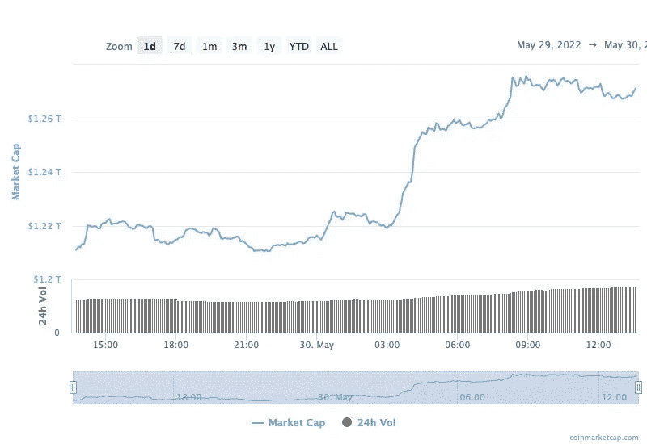
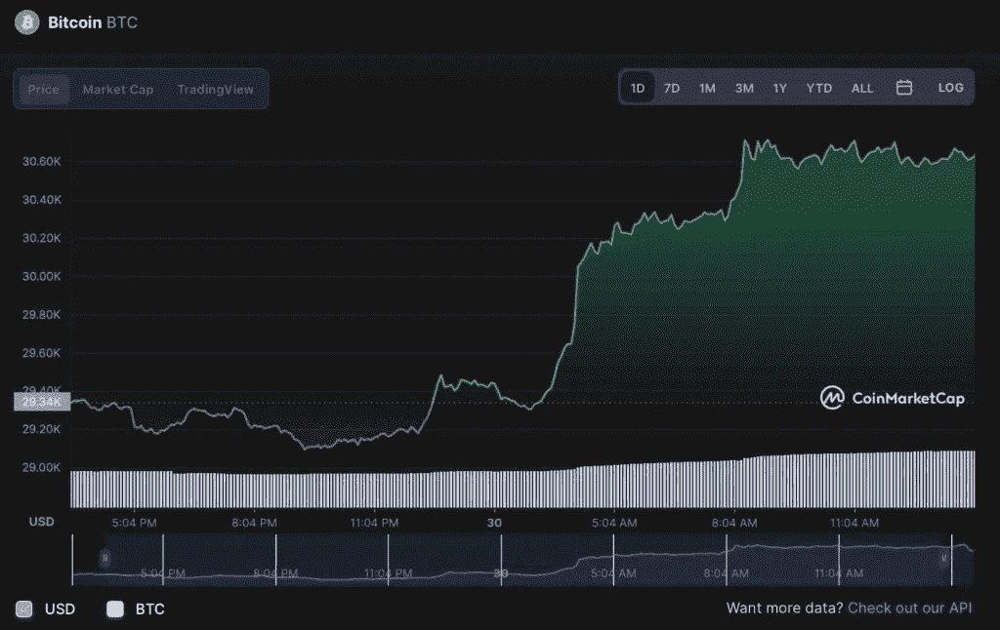

# 随着比特币接近 3.1 万美元，加密市值 24 小时内流入 600 亿美元

> 原文：<https://medium.com/coinmonks/crypto-market-cap-sees-60-billion-inflow-in-24-hours-as-bitcoin-nears-31k-9f22d0327fc1?source=collection_archive---------37----------------------->

比特币(BTC)的价格已经开始出现复苏迹象，5 月 30 日攀升至 30，000 美元以上，比 5 月中旬达到的 18 个月低点上涨了 15%。

自去年 11 月创下历史新高以来，整个加密货币市值已经损失了超过 1.5 万亿美元，仅比特币一项在过去六个月中就下跌了 60%以上。

然而，今天旗舰数字资产向绿色的转变也对更广泛的加密货币市值产生了影响，根据 CoinMarketCap 的数据，加密货币市值在过去 24 小时内增加了 600 多亿美元。

特别是，在 5 月 29 日至 5 月 30 日期间，全球密码市场从 1.21 万亿美元增长到 1.271 万亿美元。

整个市场在过去一天经历了 4.64%的增长。在过去的 24 小时内，加密市场的总交易量为 694.2 亿美元，增长了 39.60%。有趣的是， [Defi](https://finbold.com/guide/liquidity-mining-definition/) 的总成交量目前为 68.9 亿美元，占加密市场 24 小时总成交量的 9.92%，而所有稳定币现在为 608.2 亿美元，占比 87.62%。

# 比特币逼近 31000 美元

如前所述，比特币的价格重新回到了 30000 美元，更接近 31000 美元。旗舰数字资产目前的交易价格为 30，692 美元，在过去 24 小时内上涨了 4.48%，上周上涨了 0.80%。

> “最后，比特币正在上升。这里还有一些盘整，我们准备进一步向上突破，32.8 万美元和 35 万美元是阻力。”

值得一提的是，由于加密货币市场的崩溃，比特币恐惧与贪婪指数(Bitcoin Fear & Greed Index)记录了“极度恐惧”，这导致该指标跌至 2019 年初以来的最低水平。

然而，现在摩根大通(纽约证券交易所: [JPM](https://finbold.com/stock/jpmorgan-chase-stock-jpmj/) )、[的策略师声称加密货币具有“巨大的上行潜力”，这有助于改变本周的市场情绪。](https://finbold.com/jpmorgan-says-bitcoin-and-crypto-is-now-its-preferred-alternative-asset-class/)

# 波浪在市场上掀起波澜

在替代硬币方面，领先的数字资产，如以太坊、卡尔达诺、柴犬和 Dogecoin，每天都在上涨几个百分点或更多。然而，前 100 种加密货币中收益最大的是 Waves(波)。

事实上，Waves 在加密市场的涨幅最大，目前上涨了 27.38%，当日交易价格为 5.65 美元。

> 加入 Coinmonks [电报频道](https://t.me/coincodecap)和 [Youtube 频道](https://www.youtube.com/c/coinmonks/videos)了解加密交易和投资

# 另外，阅读

*   [Bookmap 点评](https://coincodecap.com/bookmap-review-2021-best-trading-software) | [美国 5 大最佳加密交易所](https://coincodecap.com/crypto-exchange-usa)
*   最佳加密[硬件钱包](/coinmonks/hardware-wallets-dfa1211730c6) | [Bitbns 评论](/coinmonks/bitbns-review-38256a07e161)
*   [新加坡十大最佳加密交易所](https://coincodecap.com/crypto-exchange-in-singapore) | [购买 AXS](https://coincodecap.com/buy-axs-token)
*   [红狗赌场评论](https://coincodecap.com/red-dog-casino-review) | [Swyftx 评论](https://coincodecap.com/swyftx-review) | [CoinGate 评论](https://coincodecap.com/coingate-review)
*   [投资印度的最佳密码](https://coincodecap.com/best-crypto-to-invest-in-india-in-2021)|[WazirX P2P](https://coincodecap.com/wazirx-p2p)|[Hi Dollar Review](https://coincodecap.com/hi-dollar-review)