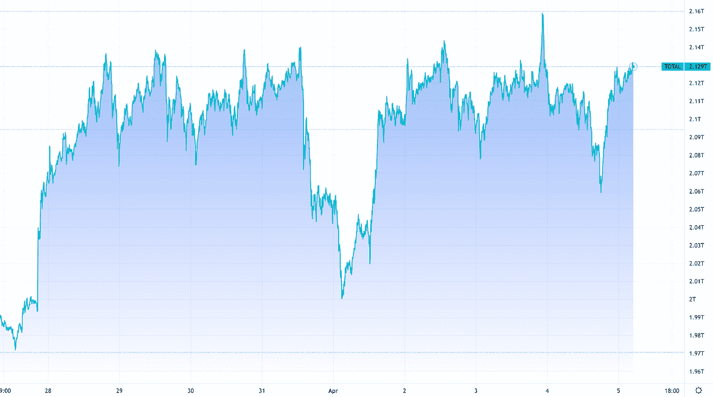
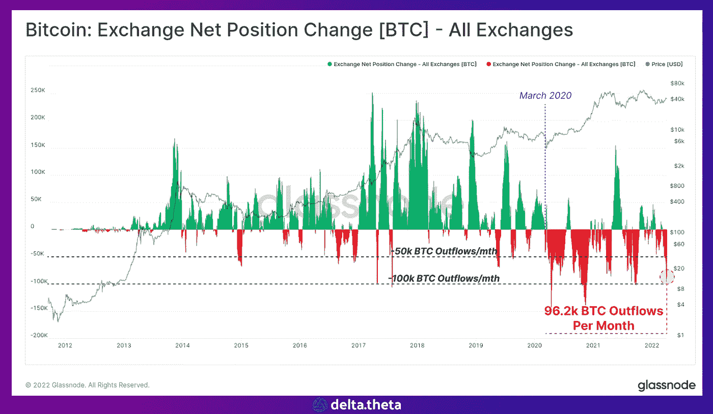
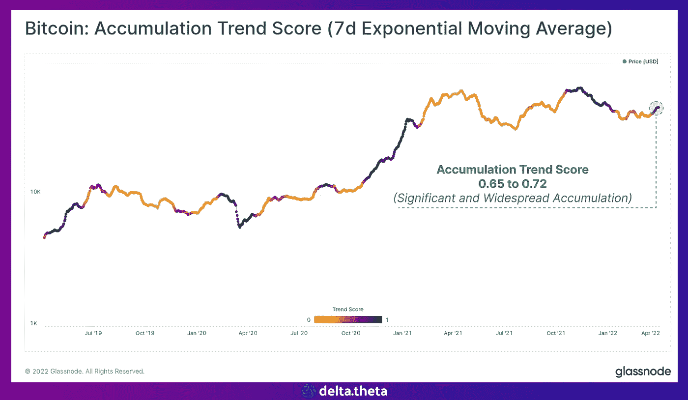
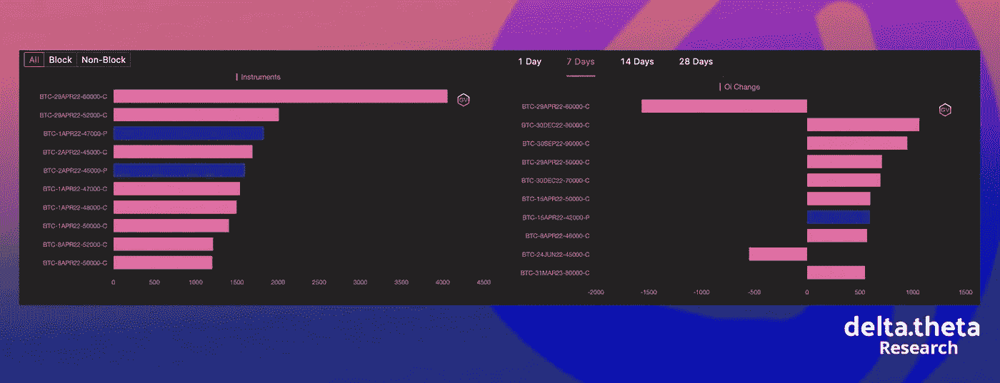
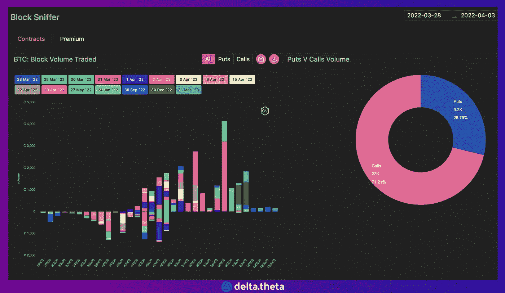

# 加密市场整合

> 原文：<https://medium.com/coinmonks/crypto-market-consolidation-bfca74835322?source=collection_archive---------30----------------------->

April 6 crypto market review

基于上周的结果，我们可以得出结论，加密货币总市值指数已经从局部增长阶段进入局部巩固阶段。

在本周初以 2.1 万亿美元开始后，该指标处于横向运动中，周中大幅降至 2 万亿美元，然后迅速回升至 2.11 万亿美元。

本周开始时，比特币价格以 48 200 的局部峰值开始，此后一直平稳下行(除了周中大幅跌至 44400 和类似的快速反弹)。截至本报告期结束时，第一种加密货币的数量为 46 150 种(下降 4.2%)。

在过去的一周里，以太坊图表与比特币的运动方向完全相反，但强度完全相同。从 3380 开始，到周末，第二种加密货币达到 3480(累计增长 2.95%)。与此同时，周中也出现了短暂下探至 3225 的水平，随后快速回升。在周末，ETH 在加密货币市场结构中的主导地位有所上升，而 BTC 的同一指标有所下降。

# 新闻

又一轮重大投资浮出水面。这一次，Blockchain.com[筹集了](https://www.bloomberg.com/news/articles/2022-03-30/blockchain-com-in-talks-for-new-funding-at-14-billion-valuation)总估值为 140 亿美元的资金，金额未披露。此外，上周有消息称，他们已经收购了场外交易平台 Autonomy。此外，筹集的部分资金将用于建立自己的 NFT 市场，该公司已经为此努力了一年多。这一消息可能会进一步导致对整个加密货币钱包行业的重新评估。

3 月 31 日，两个欧洲议会委员会[投票支持要求加密公司收集和传输某些交易数据的措施。经济和货币事务委员会(ECOM)和公民自由、司法和内政事务委员会(LIBE)投票支持扩大对加密的反洗钱要求。该提案旨在要求加密服务提供商，如交易所，收集和传输这些资产转移的发送者和接收者的信息——类似于支付服务提供商对电汇的做法。通过这种方式，立法者希望确保加密服务提供商和所谓的“未注册钱包”之间的转移的可追溯性，以便能够更好地识别和潜在地阻止可能的可疑交易。](https://www.theblockcrypto.com/linked/140034/eu-parliament-approves-rules-targeting-transfers-to-unhosted-crypto-wallets)

另一条值得注意的新闻是在 Fantom 网络上发布的 USDB 稳定币。平衡公司是新分散资产的发行者。USDB 可以通过焚烧 FHM 代币来发行。利用套利机会的用户将把稳定币与 1 美元挂钩。

一名土耳其检察官[要求对伊斯坦布尔加密货币交易所 Thodex 的 21 名官员处以总计 40 564 年的监禁。这发生在该公司关闭、其首席执行官失踪约一年后。去年四月，首席执行官 Fatih Ozer 出现在伊斯坦布尔机场的镜头中。土耳其警方无法找到他。Thodex 是土耳其加密货币热潮的一部分，该热潮吸引了寻求保护其储蓄免受通胀和货币疲软影响的投资者。](https://news.bitcoin.com/prosecutor-seeks-thousands-of-years-of-prison-for-missing-ceo-of-turkish-crypto-exchange-thodex/)

比特币基地首席执行官 Brian Armstrong [在他最新的博客中表示](https://blog.coinbase.com/namaste-india-8eb5136541c8)该平台旨在吸引网络 3 人才，帮助加速印度的经济和金融目标。阿姆斯特朗于 4 月 7 日在班加罗尔宣布了一项加密货币社区活动，以讨论加密货币和 web3 在印度的未来。他还表示，该交易所仅今年一年就计划在其印度中心雇佣 1000 人。比特币基地风险投资公司已经向印度的加密和 Web3 技术公司投资了总计 1.5 亿美元。

# 市场情况。

根据分析服务 Glassnode 的数据，交易所地址上的比特币数量持续下降。超过 96000 BTC 在 3 月被撤回，这是有史以来最大的流出量之一。

累积而不是减少其余额的地址数量也增加了。一个更详细的聚类分析显示，微型(最多 1 BTC)和超大型(超过 1000 BTC)钱包持有者最活跃。已确认的主要买家包括 Microstrategy、Luna 基金会(韩国加密货币 Terra 的开发商)和加拿大现货 ETF(purpurouse 和 3iQ CoinShares 比特币(BTCQ。u))。

在期权市场，未来一个月的主要交易兴趣在 52 000 点和 60 000 点水平，交易商在上涨预期下购买看涨期权。在对冲当前价格方面，卖出期权的最高交易量出现在 47 000 和 42 000 水平，这可以作为最接近的价格支撑位。

最近比特币价格升至 47 000 以上，促使交易员更积极地交易月度看涨期权，希望这一趋势能够持续下去。

分析师表示，市场目前处于整合阶段。在 BTC 价格飙升并突破 38，000–45，000 通道后，现货市场的势头有所减弱，但期权交易者预计下个月将继续上涨至心理关口 5 0，000 点。

> 加入 Coinmonks [电报频道](https://t.me/coincodecap)和 [Youtube 频道](https://www.youtube.com/c/coinmonks/videos)了解密码交易和投资

# 此外，请阅读

*   [Capital.com 评论](https://coincodecap.com/capital-com-review) | [香港密码借贷平台](https://coincodecap.com/crypto-lending-hong-kong)
*   [如何在 Uniswap 上交换密码？](https://coincodecap.com/swap-crypto-on-uniswap) | [A-Ads 审核](https://coincodecap.com/a-ads-review)
*   [WazirX vs coin dcx vs Bitbns](/coinmonks/wazirx-vs-coindcx-vs-bitbns-149f4f19a2f1)|[BlockFi vs coin loan vs Nexo](/coinmonks/blockfi-vs-coinloan-vs-nexo-cb624635230d)
*   [本地比特币审核](/coinmonks/localbitcoins-review-6cc001c6ed56) | [密码货币储蓄账户](https://coincodecap.com/cryptocurrency-savings-accounts)
*   [什么是融资融券](https://coincodecap.com/margin-trading) | [美元成本平均](https://coincodecap.com/dca)