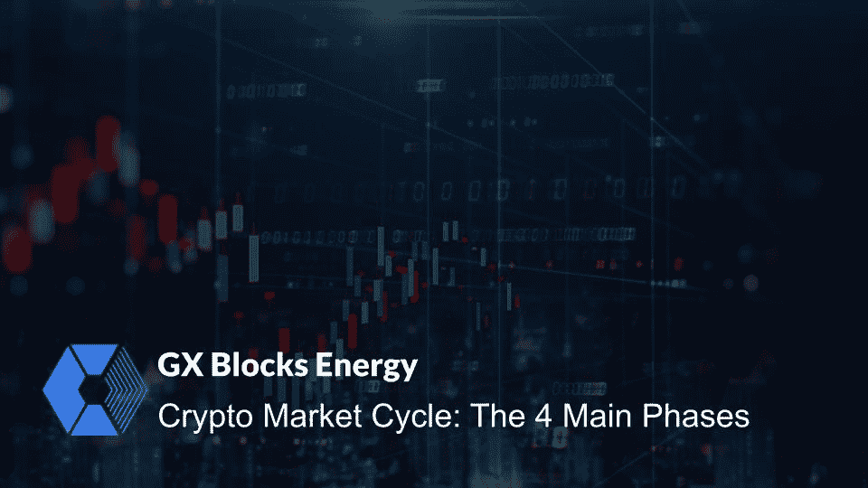
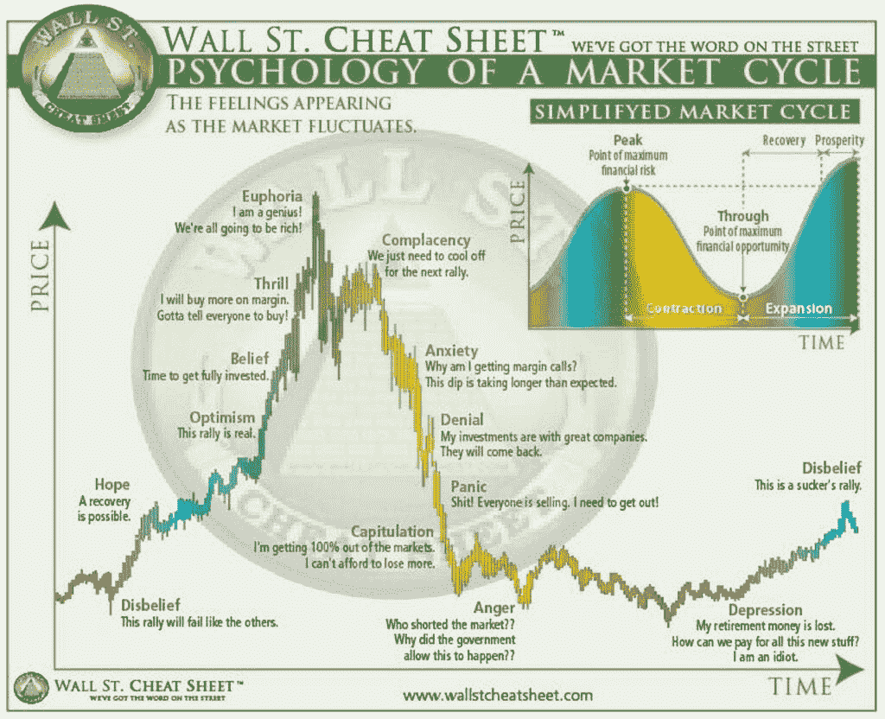
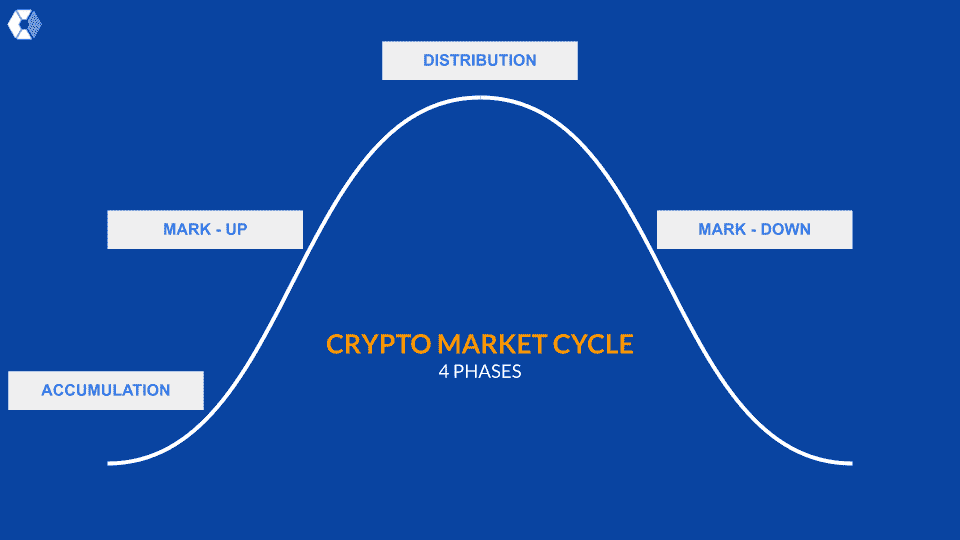

# 加密市场周期:4 个主要阶段

> 原文：<https://medium.com/coinmonks/crypto-market-cycle-the-4-main-phases-5177e9e1a31?source=collection_archive---------5----------------------->

[GX Blocks](https://medium.com/gx-blocks\)

金融市场以**微观**和**宏观趋势**的周期为特征，这也发生在**加密市场**。随着时间的推移，这些周期不断重复，而“ ***给你机会***“**预测未来的价格走势**。这些阶段是**周期性**、上升**、峰值**、下降**、触底**和触底**。当一个秘密市场周期结束时，另一个周期开始，这在每个市场都在发生。**

***但是加密货币的市场周期到底是什么？这些周期对价格有长期或短期的影响吗？如何识别这些阶段？***

> 加密货币市场周期为交易者和投资者提供了关于特定加密资产价格变化的宝贵见解。

> 秘密市场周期是市场最高价和最低价之间所有阶段的集合。

如果你学会了阅读它们，你就能知道什么时候是正确的时间**购买**和**出售**你的密码。****

> *很多人用“* ***市场泡沫*** *”这样的说法，但你知道到底是什么吗？*
> 
> *“市场泡沫”是市场阶段之一，但如果你想识别它，理解这些阶段是什么很重要。*

# 市场周期的 4 个阶段

大多数投资者和交易者都不知道什么时候是什么阶段。即使你知道市场周期，选择周期的顶部或底部也是一个挑战。

首先，让我们看看市场周期的心理，然后我们将分别解释每个阶段。

Source: [www.wallstcheatsheet.com](http://www.wallstcheatsheet.com)

*   **难以置信**:机构投资者和早期采用者在较低时期(价格触底)积累比特币，原因是那些从上一个高峰期持有其资产的人感到沮丧和愤怒。
*   **希望**:当比特币(或其他加密货币)上涨时，投资者因不相信和希望而持有其加密。聪明的投资者在涨价阶段持有并在支撑位买入下跌。市场正显示出新一轮牛市的积极信号。
*   乐观:当价格随着新资本的流入而上涨时，主要情绪是乐观的，市场前景乐观，投资者更愿意投资。
*   **兴奋，信念** & **欣快**:随着加价阶段的进行，人们变得兴奋，许多 FOMO 人购买(那些以较低价格购买的人比那些较早进入的人购买)，这导致价格快速上涨。市场情绪是信念、激动和兴奋，有了这些情绪，卖出或持有将是明智的。投资者在市场中寻找新的机会。
*   **欣快** & **自满**:在这个阶段，比特币分布较高。这是销售的最佳时机。
*   **焦虑** & **否认**:比特币开始走低，市场情绪是焦虑和否认的混合体。随着比特币价格下跌，这是你第二次卖出或做空比特币的机会。
*   **恐慌，投降** & **愤怒**:比特币暴跌得更远更快。第一种情绪是恐慌和悲伤。由于恐慌，人们向空头市场出售，玩反弹，并开始做空。
*   **愤怒**T42**沮丧**:当降价阶段结束时，比特币触底反弹。主要情绪是愤怒和沮丧。这是另一个周期开始的信号。此时，早期投资者开始积累，并再次进行区间交易。
*   一个新的密码市场周期开始了。 *(重复)*

# **市场周期的 4 个阶段:**

## 第一阶段—积累

当市场**相对于**时的水平下跌太低时，周期的这一阶段标志着价格的下跌。在这一点上，市场创新者开始在低价位再次买入，认为不会有进一步的下跌。估值对任何辞职并卖出头寸的卖家都很有吸引力，而聪明的买家会发现机会，以尽可能低的价格买入。

现在，人们失去了兴趣，有些沮丧，厌倦，以及缺乏对成长的积极思考。媒体强调灾难和黑暗，只会引起焦虑和沮丧。整体市场气氛正慢慢开始从负面转为中性。

## 第二阶段—加价

这个阶段始于**加密货币市场达到稳定点**并开始**稳步升值**的时刻。因此，早期的大多数人认识到了市场的变化，并开始跟上**的潮流**。媒体开始用积极的新闻故事来讨论这一阶段，以支持这一变化，更多的投资者对此感兴趣。随着这一阶段的成熟，越来越多的投资者加入了这股潮流，因为对进入市场的恐惧被贪婪和被排除在外的想法所取代。然后，涨势放缓，此时一直在观望的人把这视为买入机会。这个周期已经接近顶部。

## 第三阶段—分销

这是密码市场周期的第三阶段，比特币和其他密码**以高价交易**。在分销阶段，卖家开始占据主导地位，加价阶段的看涨情绪转变为混合情绪。价格通常会在几周或几个月内保持在同一交易区间。这个阶段开始和结束都非常快。当分发阶段结束时，密码市场将会下跌。

这个阶段非常情绪化，市场被恐惧、贪婪和希望的综合情绪所主导。许多投资者(通常是早期投资者)无法决定现在是否是卖出的合适时机。情绪开始变化，慢慢下移。但是这种情况会因为强烈的负面新闻而很快发生。投资者开始质疑看涨情绪。

## 第四阶段—降价

这是市场周期的最后阶段。市场**下跌**，印象是负面的，有**焦虑**和**否认**。仍然持有加密货币的投资者处于最令人苦恼的境地。这些投资者通常是新来的，缺乏经验，或者他们的投资已经低于他们的支付价格。 这是底部即将来临的迹象。但另一方面，当市场下跌 50%或更多时，大量的投资者在发行阶段结束时或降价阶段开始时购买。人们变得悲伤和恐慌，随着人们恐慌抛售，市场下跌得更快。

值得一提的是，这个阶段，尤其是最后阶段，是以尽可能低的价格购买 crypto 的最佳时机。这也是另一个周期的信号。

***聪明的钱和早期投资者又开始积累了。***

> 小心，市场周期并不总是遵循这种模式！

# 结束语

对于交易者和投资者来说，重要的是要理解所有的加密市场都是周期性波动的

并确定这四个主要阶段。不可能每个市场都只向上走。市场周期可以提供一个有用的宏观角度。**买入**的最佳时机**是在**积累阶段**，因为价格停止下跌。当加密市场在加价阶段回升时，能够识别它的投资者持有并等待价格" ***赶上*** "最高可能增长率**。分发阶段标志着标记阶段的结束。因此，能够识别市场周期不同阶段的聪明投资者可以获得更多利润。****

> **当市场处于**怀疑**和**沮丧**的状态时，可能是考虑**建仓**(长期投资)的好时机，如果市场继续下跌，不要害怕和困惑。**
> 
> **当市场进入过度自信和过度兴奋的时期，可能是时候考虑获利了。**

*****“当别人贪婪时要恐惧，当别人恐惧时要贪婪，”沃伦·巴菲特说。*****

****

**[GX Blocks](https://gxblocks.com/)**

***如果您喜欢这篇文章，请务必关注* [*GX 版块*](https://medium.com/u/2bdbbc23c69?source=post_page-----a888d6c8f735-----------------------------------) *了解更多关于区块链技术的教育内容。***

> *****我们的邮寄地址:***【info@gxblocks.net **
> 
> ***订阅我们的简讯待更新* [***这里***](https://t.co/YHXeSlXykY) *。***
> 
> *****www.gxblocks.com*官方网站:****

***[**推特**](https://twitter.com/GxBlocks)|[**LinkedIn**](https://gr.linkedin.com/company/gx-blocks-energy)***

****版权所有 2021 GX 区块能源有限公司****

> ***加入 Coinmonks [电报频道](https://t.me/coincodecap)和 [Youtube 频道](https://www.youtube.com/c/coinmonks/videos)了解加密交易和投资***

# ***另外，阅读***

*   ***[Bookmap 点评](https://coincodecap.com/bookmap-review-2021-best-trading-software) | [美国 5 大最佳加密交易所](https://coincodecap.com/crypto-exchange-usa)***
*   ***最佳加密[硬件钱包](/coinmonks/hardware-wallets-dfa1211730c6) | [Bitbns 评论](/coinmonks/bitbns-review-38256a07e161)***
*   ***[新加坡十大最佳加密交易所](https://coincodecap.com/crypto-exchange-in-singapore) | [购买 AXS](https://coincodecap.com/buy-axs-token)***
*   ***[红狗赌场评论](https://coincodecap.com/red-dog-casino-review) | [Swyftx 评论](https://coincodecap.com/swyftx-review) | [CoinGate 评论](https://coincodecap.com/coingate-review)***
*   ***[投资印度的最佳密码](https://coincodecap.com/best-crypto-to-invest-in-india-in-2021)|[WazirX P2P](https://coincodecap.com/wazirx-p2p)|[Hi Dollar Review](https://coincodecap.com/hi-dollar-review)***