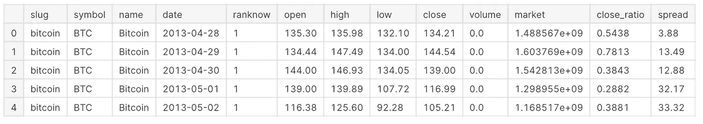
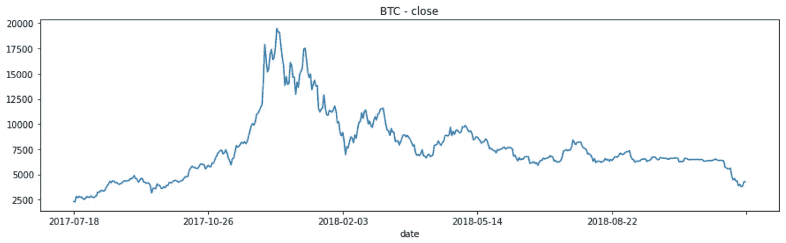
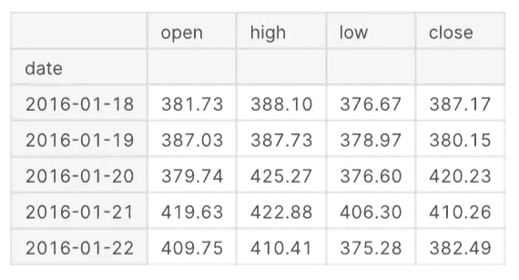
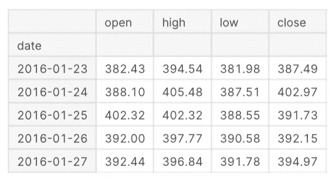
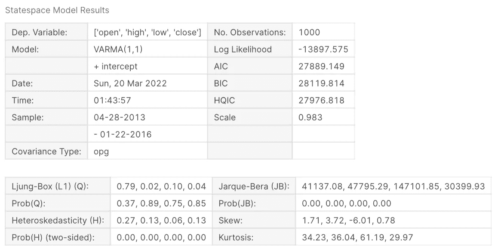
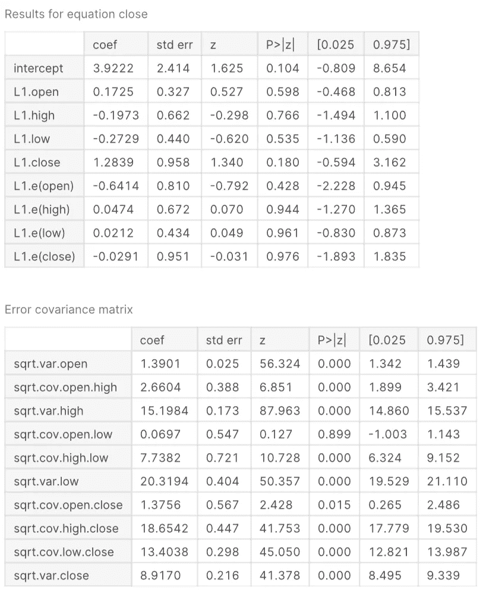
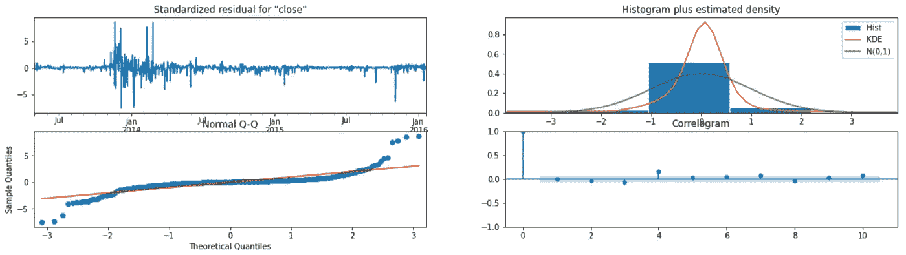
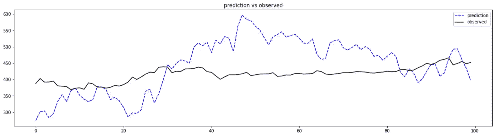
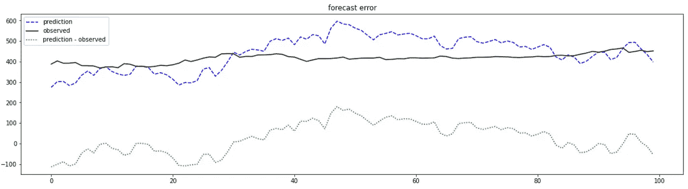

# 加密市场预测:StatsModels VARMAX 方法

> 原文：<https://medium.com/coinmonks/crypto-market-forecast-statsmodels-varmax-method-9c2aa07145f4?source=collection_archive---------10----------------------->

这是对广阔的价格行为预测模型的一个小小的贡献，谢天谢地，这个模型已经存在了足够长的时间，足以让它保持如此巨大的价值。我希望这能带来一些启示，如果不是只有一个的话，至少在 VARMAX 领域，预测输出，或者只是陶醉于我的鸡毛蒜皮的编码。不管你继续阅读的原因是什么，你至少会看到我应用前瞻函数来模拟一个加密货币样本的预测与观察价格行为。

可以在这里看到代码:[[https://www . ka ggle . com/code/da scient/crypto-forecast-using-stats models-varmax](https://www.kaggle.com/code/dascient/crypto-forecast-using-statsmodels-varmax)]

我将用更少甚至为零的幽默来开始剩下的部分:

```
# packages
import numpy as np *# linear algebra*
import pandas as pd *# data processing & cdv*
```

我们来看看最常见的货币，比特币。

```
*# bring in data*
df = pd.read_csv('/kaggle/input/all-crypto-currencies/crypto-markets.csv')

*# isolate BTC*
df = df.loc[df.symbol == 'BTC']
df.head()
```



BTC Price Action 2013, April/May

```
# plot
df.set_index('date')['close'].tail(500).plot(figsize=(15,4), title='BTC - close')
```



Close Price 2017–2018

使用 sklearn MinMaxScaler 和/或 MaxAbsScaler 缩放数据。下面的单元格也创建了“训练”和“测试”数据帧。“训练”包含模型要解释的观察数据。“测试”是用来预测模型的观察数据。

```
*# Use Scikit-learn to transform with maximum absolute scaling*
from sklearn.preprocessing import MinMaxScaler,MaxAbsScaler

scaled_df = df.set_index('date')[['open','high','low','close']]

scaler = MaxAbsScaler()
scaler.fit(scaled_df)
scaled = scaler.transform(scaled_df)
scaled_df = pd.DataFrame(scaled_df, columns=scaled_df.columns)

*# use first 1000 days as train*
train = scaled_df[:1000]

*# simulation window*
window = 100 *# days look ahead*
test = scaled_df[1000:1000+window]
```



train.tail()



test.head()

**启动 VARMAX 建模**

以及每个变量[o，h，l，c]的输出模型摘要。

```
*# VARMA example*
from statsmodels.tsa.statespace.varmax import VARMAX

*# contrived dataset*
data = train[['open','high','low','close']]
*# fit model*
model = VARMAX(data, freq = 'D', order=(1,1), seasonal_order=(0, 0, 0, 0),
                mle_regression = True,
                filter_concentrated = True)
model_fit = model.fit(disp=True)

*# make prediction*
yhat = model_fit.predict(len(data), len(data))
```



model_fit.summary() [0]



model_fit.summary() [1]

```
*# simulate prediction*
model_fit.plot_diagnostics(3,figsize=(20,5))
```



```
*# plot prediction vs observed*
pred = pd.DataFrame()
pred['prediction'] = model_fit.simulate(window).reset_index(drop=True).close
pred['observed'] = test.reset_index(drop=True).close
pred.plot(figsize=(20,5),title='prediction vs observed',color=['blue','black'],style=['--','-'])
```



```
# plot prediction - observed
pred['prediction - observed'] = pred['prediction'] - pred['observed']
pred.plot(figsize=(20,5),title='forecast error',color=['blue','black','green'],style=['--','-',':'])
```



查看上面的结果，我发现不管训练数据如何，运行 VARMAX 预测器都会生成随机预测。这部分是由于模型参数中随机产生的因素，仍然可以探索。未来的工作包括 VARMAX 模型，根据实时价格行为数据生成交易信号。

请随意对我的项目/存储库进行评价、评论、观察甚至审查/批评:

[](https://github.com/DaScient/SuperTrendTradingBot) [## GitHub-DaScient/SuperTrendTradingBot:一个 DaScient Capital，LP 专有项目&完全…

### 一个资金短缺、LP 专有的项目&超级趋势指标在加密货币上的完全自主应用…

github.com](https://github.com/DaScient/SuperTrendTradingBot) [](https://www.kaggle.com/code/dascient/daily-crypto-buy-sell-decision-maker) [## 每日加密买/卖决策者

### 使用 Kaggle 笔记本探索和运行机器学习代码|使用来自无附加数据源的数据

www.kaggle.com](https://www.kaggle.com/code/dascient/daily-crypto-buy-sell-decision-maker) 

我的资历和其他贡献可以在我的 LinkedIn 个人资料中得到验证:

https://www.linkedin.com/in/dontadaya

[](https://www.DaScient.com) [## DaScient 有限责任公司

### 快速服务-行业和地面水平分析，可视化和企业介绍，软件开发和人工智能…

www.dascient.com](https://www.DaScient.com) [](https://www.DaScientCapital.us) [## DaScient 资本集团

### Don D.M. Tadaya 是公认的获奖数学家、首席数据科学家和统计研究分析师…

www.dascientcapital.us](https://www.DaScientCapital.us) 

> 谢谢大家！
> 
> 加入 Coinmonks [电报频道](https://t.me/coincodecap)和 [Youtube 频道](https://www.youtube.com/c/coinmonks/videos)了解加密交易和投资

# 另外，阅读

*   [3 商业评论](/coinmonks/3commas-review-an-excellent-crypto-trading-bot-2020-1313a58bec92) | [Pionex 评论](https://coincodecap.com/pionex-review-exchange-with-crypto-trading-bot) | [Coinrule 评论](/coinmonks/coinrule-review-2021-a-beginner-friendly-crypto-trading-bot-daf0504848ba)
*   [莱杰 vs n rave](/coinmonks/ledger-vs-ngrave-zero-7e40f0c1d694)|[莱杰 nano s vs x](/coinmonks/ledger-nano-s-vs-x-battery-hardware-price-storage-59a6663fe3b0) | [币安评论](/coinmonks/binance-review-ee10d3bf3b6e)
*   [Bybit Exchange 审查](/coinmonks/bybit-exchange-review-dbd570019b71) | [Bityard 审查](https://coincodecap.com/bityard-reivew) | [Jet-Bot 审查](https://coincodecap.com/jet-bot-review)
*   [3 commas vs crypto hopper](/coinmonks/3commas-vs-pionex-vs-cryptohopper-best-crypto-bot-6a98d2baa203)|[赚取加密利息](/coinmonks/earn-crypto-interest-b10b810fdda3)
*   最好的比特币[硬件钱包](/coinmonks/hardware-wallets-dfa1211730c6) | [BitBox02 回顾](/coinmonks/bitbox02-review-your-swiss-bitcoin-hardware-wallet-c36c88fff29)
*   [BlockFi vs 摄氏度](/coinmonks/blockfi-vs-celsius-vs-hodlnaut-8a1cc8c26630) | [Hodlnaut 审核](/coinmonks/hodlnaut-review-best-way-to-hodl-is-to-earn-interest-on-your-bitcoin-6658a8c19edf) | [KuCoin 审核](https://coincodecap.com/kucoin-review)