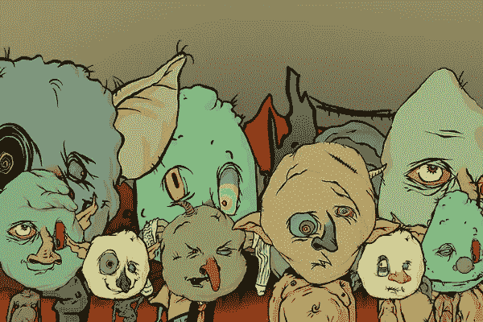
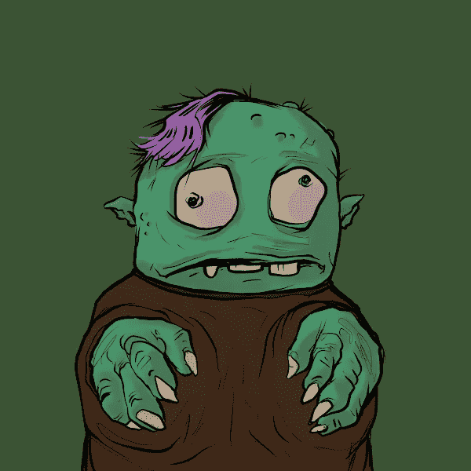

# 随着讽刺性的 NFT 收藏热潮，加密市场走向妖精城

> 原文：<https://medium.com/coinmonks/crypto-market-heads-to-goblintown-as-ironic-nft-collection-booms-b84b7268f73f?source=collection_archive---------40----------------------->

接管以太坊的最新热门 NFT 系列是对加密市场现状的肯定。它叫戈布林敦。

今天，格林顿 NFT 的底价首次超过了 2 英镑。

# 以太坊妖精集会

不仅仅是猿、蜥蜴和熊在 NFT 社区受到欢迎。现在，加密空间正深入下滑阶段，NFT 的狂热爱好者们正争先恐后地购买令牌化的妖精。

名为 goblintown 的 10，000 个地精 NFT 集合于上周推出，并迅速席卷市场。该系列的名称来自“Goblintown”，这是一个术语，指的是价格下跌和利息下降时数字资产领域的熊市。由于比特币、以太坊和其他资产已经连续七个月低于高点，加密空间目前处于“黑暗中”，这或许可以解释为什么 NFT 系列尽管有着故意怪诞的视觉审美，却仍然大受欢迎。

上周，格林顿的 NFT 免费发放，过去几天需求激增。OpenSea 上的交易量已超过 8800 以太坊，使 goblintown 成为过去一周交易量第二大的 NFT 收藏，仅次于 Otherside 的 Otherdeed。今天，一个 goblintown 的底价短暂地超过了 2 以太坊，这是一个相对较高的价格标签，尽管以太坊最近表现疲软(底价已经冷却到 1.8 以太坊)。以太坊的交易价格为 1840 美元，今天再次下跌，goblintown 的入门价格约为 3300 美元。有趣的是，尽管目前的保密气候，收藏中更为罕见的非功能性转录因子甚至要价更高。goblintown #8995 是一个戴着极其罕见的皇冠的独特妖精，周三在 LooksRare 上以 69.42 以太坊的价格售出，价值 136，207 美元。

# 格林顿拥抱 CC0

除了具有讽刺意味的同名之外，该合集受欢迎的一个原因可能是它的版权许可方式。goblintown 使用“无版权保留”政策，也称为 CC0，这意味着小妖精可以在公共领域获得，任何人都可以在它们的基础上进行开发，并根据自己的喜好重新利用它们。最近几个月，名词和 CrypToadz 等其他 CC0 NFT 收藏也越来越受欢迎，引发了关于 NFT 应该拥有什么“所有权”的辩论。NFT 领域版权问题最引人注目的例子可能是 creator 朋克创造者幼虫实验室向 creator 朋克衍生项目发布版权取消通知，采取了一些人描述为与 Web3 运动不一致的方法。今年 3 月，幼虫实验室将 CryptoPunks 的知识产权卖给了无聊猿游艇俱乐部的创始人宇迦实验室。收购完成后，宇迦实验室给了朋克持有者 NFT 的权利。有了 goblintown，理论上任何人都可以在自己的内容中重新利用收藏的艺术品。

与大多数其他 NFT 藏品不同，goblintown 自诩它“没有路线图”。没有不和。没有效用。”在一个成功的项目往往取决于团队的承诺和计划如何执行的领域，goblintown 的剥离式方法可能也是价格上涨背后的一个因素。当然，也有另一种解释。有可能市场参与者正在投机最新的趋势，希望在其他资产下跌时获得利润。其他 NFT 从这种市场行为中获益，但最终失败了。鉴于戈布林敦受到了 crypto 的“戈布林敦”的启发，它可能需要熊市条件才能持续炒作。

> 加入 Coinmonks [电报频道](https://t.me/coincodecap)和 [Youtube 频道](https://www.youtube.com/c/coinmonks/videos)了解加密交易和投资

# 另外，阅读

*   [Bookmap 点评](https://coincodecap.com/bookmap-review-2021-best-trading-software) | [美国 5 大最佳加密交易所](https://coincodecap.com/crypto-exchange-usa)
*   最佳加密[硬件钱包](/coinmonks/hardware-wallets-dfa1211730c6) | [Bitbns 评论](/coinmonks/bitbns-review-38256a07e161)
*   [新加坡十大最佳加密交易所](https://coincodecap.com/crypto-exchange-in-singapore) | [购买 AXS](https://coincodecap.com/buy-axs-token)
*   [红狗赌场评论](https://coincodecap.com/red-dog-casino-review) | [Swyftx 评论](https://coincodecap.com/swyftx-review) | [CoinGate 评论](https://coincodecap.com/coingate-review)
*   [投资印度的最佳密码](https://coincodecap.com/best-crypto-to-invest-in-india-in-2021)|[WazirX P2P](https://coincodecap.com/wazirx-p2p)|[Hi Dollar Review](https://coincodecap.com/hi-dollar-review)
*   [加拿大最佳加密交易机器人](https://coincodecap.com/5-best-crypto-trading-bots-in-canada) | [库币评论](https://coincodecap.com/kucoin-review)
*   [火币的加密交易信号](https://coincodecap.com/huobi-crypto-trading-signals) | [HitBTC 审核](/coinmonks/hitbtc-review-c5143c5d53c2)