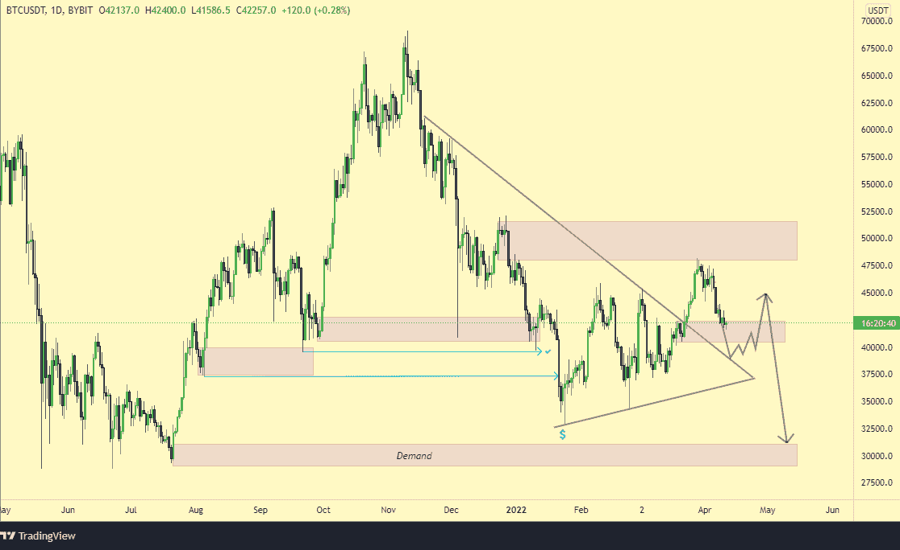
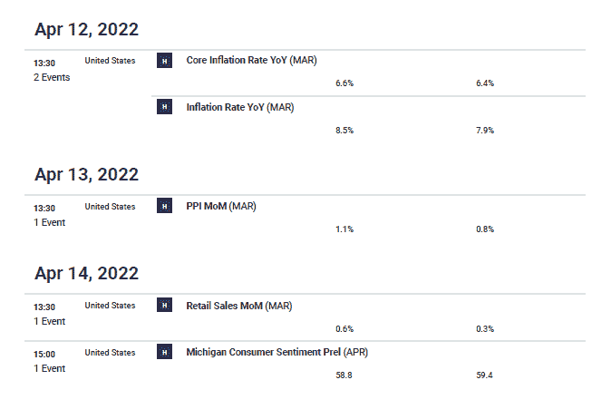
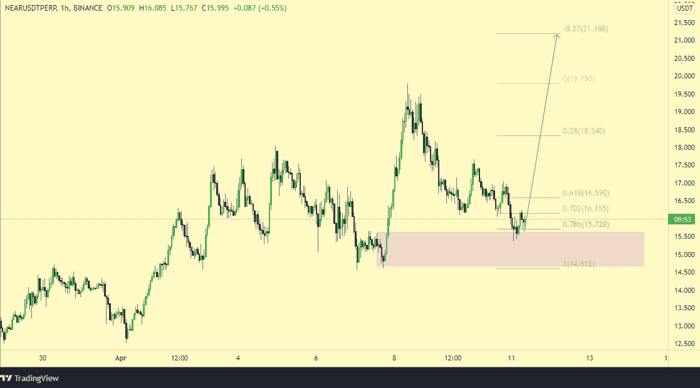

# 加密市场前景

> 原文：<https://medium.com/coinmonks/crypto-market-outlook-for-the-week-1c1bc67121ef?source=collection_archive---------7----------------------->

在我之前的[文章](/coinmonks/possible-market-direction-of-the-crypto-market-along-with-top-tokens-for-good-roi-f073a7d5c9e6)中，我坚决看空$btc。我给出了促使分析的各种因素。我从宏观、技术和基本面的角度来看。我还看了一些特别挑选的替代硬币，我必须说，性能正如我所料。自我更新以来，$BTC 下跌了 11.2%。

像往常一样，$LUNA 和$STG 是市场的异数。$CRV 和$AVAX 与市场同步，没有达到目标，但它通过了约 75%。我关于$RUNE 的想法是无效的，我接受了我们的损失。

本周，我会用同样的视角来看待市场价格。我会尝试给出我所看到的整体市场方向，给出数据支持，以及给出技术、宏观和基本面的观点。

让我们开始吧。

**$BTC:**

从技术角度来看，$btc 处于需求区域，但有一个问题。我们看到的反应不是我们想从这样一个地区看到的。我们在这里看到的情况类似于卖家吸纳买家并压低价格。如果价格确实看涨，我们希望看到需求的大幅反弹，但事实并非如此。

我们来看一位世界知名投资人的一些话；斯坦利·德鲁肯米勒

> “我在匹兹堡的第一个老板埃利斯博士曾经告诉我，操纵一只股票上涨需要数亿美元，但一旦你有了这个虚假的买入止损，你就可以让它在没有交易量的情况下下跌，并立即重新定价”。

听起来熟悉吗？是的，这是因为我们现在就有这样一个场景，跆拳道和 LFG 公开购买美元 btc。你不能一直从市场上拿东西。它必须重新平衡！

有人可能会说，那些标记为需求的区域实际上并不是真正的需求，而只是来自 LFG(月球基金会卫队)的心理战。如果你不熟悉 twappings，你需要去 Twitter 使用高级搜索功能来查看。LFG 一直领先于需求，同时保持着这样的预期，即通过他们的影响，人们会在不断上涨的同时跳上$btc 购买。但是这产生了一个问题。

突破前的成交量和动量都不好。这是软弱的，看起来更像是一个纠正的姿态。通过 twappings，price 创造了著名的蹩脚 twap 结构，它并不真正起到支撑作用，也不显示真实需求，因为原始需求是超前的，现在可以被视为无关紧要，因为买家现在知道卖家被困住了。当你可以等待购买他们的投降时，为什么要拯救他们？

没有内置的基础来测试图书支持，所以对于真正的买家来说，等待已经陷入困境的购买投降是一个+ve 游戏。没有一个明智的交易者会全心全意地相信，一旦跆拳道完成了 twapping，账面深度就会上升以支撑价格。MMs 和套期保值者仍然不得不出售他们的套期保值，这往往意味着价格回到原点。

如果说实话，现在形势已经大大有利于空头了。是的，价格可以上涨，但价格下跌以清除一些流动性并抓住真正的需求，这将符合多头的最大利益。

我们也对另外两种没有方向性买家或卖家的情况持开放态度，因此，创造了一个盘整或疯狂的市场，或者一系列有偏见的消息涌入本周。

**宏观经济展望:**

到目前为止，我们肯定都已经注意到，加密市场与股票市场密切相关，并与全球发达市场股票等基于债务的非自由风险资产市场保持同步。

明天是美联储关于核心通货膨胀率的报告，市场已经反映了从之前的 6.4%上升 0.2%的可能性。如果这个数字碰巧超过 6.6%，它肯定会在股票市场引发更多抛售，随后在加密市场也是如此。

美联储已经表明，他们在未来几个月是认真的，市场巩固了 5 月和 6 月两次加息 50 个基点的预期。这是一种看跌的风险情绪。随着和平谈判似乎毫无进展，人们对乌克兰冲突的降级也不太乐观。

加密市场的前景并不乐观。预计会出现回调，但我不确定会有多深。在这一点上，随着我们进入美国消费者物价指数周，减少风险敞口是明智的。

众所周知，看跌$btc 也意味着看跌 altcoins。人们不能简单地看跌美元 btc，而完全看好美元 alts。

如果有任何异常值，我们的最佳选择是$near。

**$近:**

$Near 看起来已经准备好了一波大的上涨。它还设法在 12 月和现在两次$btc 极度不稳定的时候反弹。

我们知道资本流入生态系统的说法看起来是被迫的，但我们必须承认，如果未来几天有任何替代货币看起来是异常的，那么$near 是最好的选择。

这是因为$near 正计划制作一个算法稳定的“USDN”。市场已经注意到了同样的计划对 Luna 和生态系统的效果。那么，期待类似的事情再次发生难道不是正确的吗？

随着 Terra 的成功，其他 L1 将尝试创建自己的储备货币，并与现有的分散稳定货币合作。是的，这里没什么新东西可看。只是叙事的力量。也许长$近短$露娜？谁知道呢。也许探索生态系统本身并找到高测试宝石来玩，可能是最好的主意。谁知道呢？

当你交易时，最好记住这些硬币大部分都偏离了高点，有很大的 fdv。你可能会退出流动性。最好抱着良好的心态谨慎交易，以利长期发展。明智地交易。

**结论:**

请记住，这不是财务建议。总是努力进行进一步的个人研究，以进一步弄清楚诸如此类的事情。

> 加入 Coinmonks [电报频道](https://t.me/coincodecap)和 [Youtube 频道](https://www.youtube.com/c/coinmonks/videos)了解加密交易和投资

# 另外，阅读

*   [如何在 FTX 交易所交易期货](https://coincodecap.com/ftx-futures-trading) | [OKEx vs 币安](https://coincodecap.com/okex-vs-binance)
*   [OKEx vs KuCoin](https://coincodecap.com/okex-kucoin) | [摄氏替代品](https://coincodecap.com/celsius-alternatives) | [如何购买 VeChain](https://coincodecap.com/buy-vechain)
*   [ProfitFarmers 点评](https://coincodecap.com/profitfarmers-review) | [如何使用 Cornix Trading Bot](https://coincodecap.com/cornix-trading-bot)
*   [如何匿名购买比特币](https://coincodecap.com/buy-bitcoin-anonymously) | [比特币现金钱包](https://coincodecap.com/bitcoin-cash-wallets)
*   [瓦济里克斯 NFT 评论](https://coincodecap.com/wazirx-nft-review)|[Bitsgap vs Pionex](https://coincodecap.com/bitsgap-vs-pionex)|[Tangem 评论](https://coincodecap.com/tangem-wallet-review)