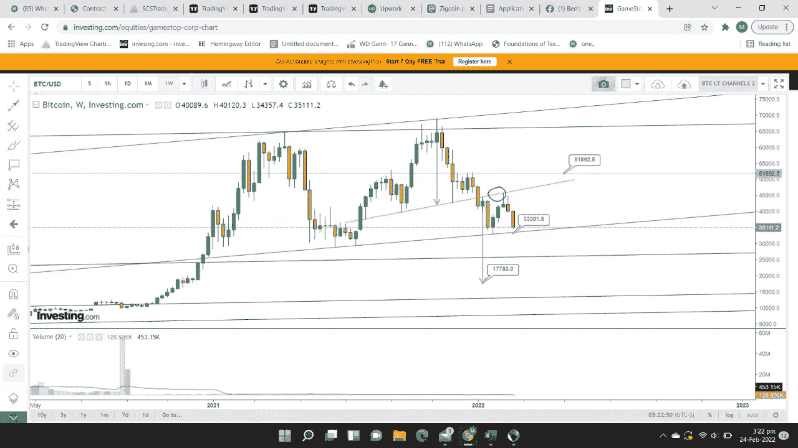
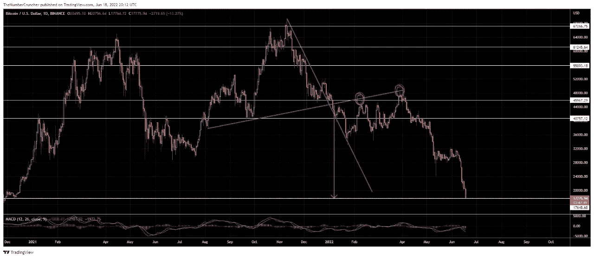
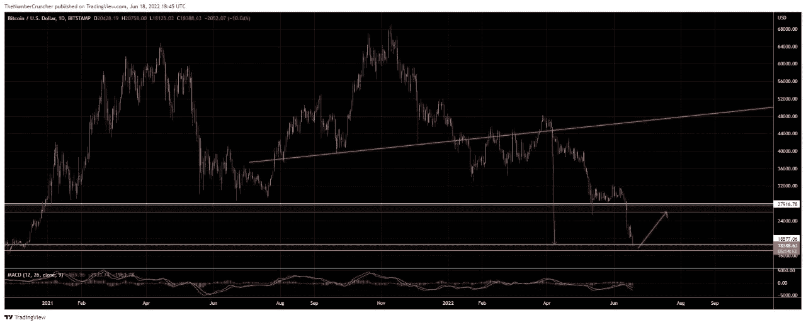
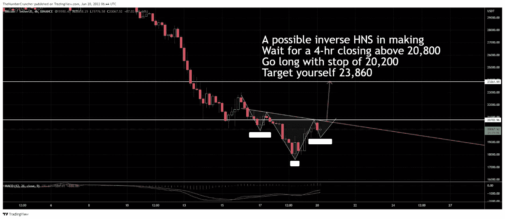
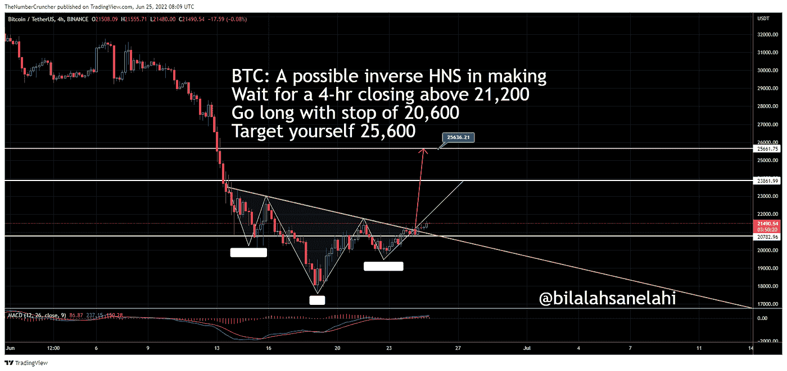
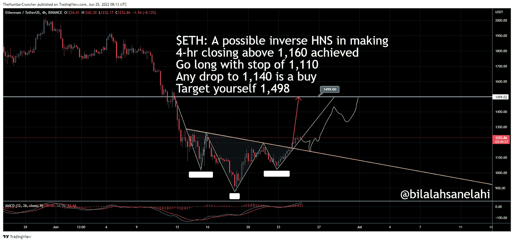
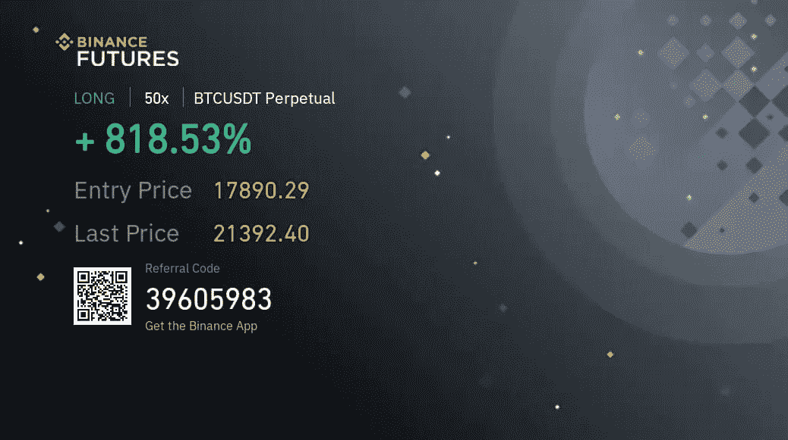
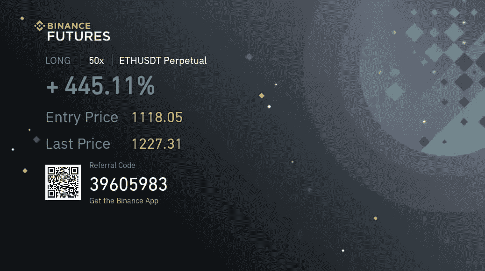

# 加密市场——回调在这里:BTC 25800 美元，ETH 1500 美元！NAFA！

> 原文：<https://medium.com/coinmonks/crypto-market-pullback-is-here-btc-25-800-eth-1500-712f5fdb9ac4?source=collection_archive---------23----------------------->

请注意，我分享我的个人观点是为了提供信息。我绝不希望产生任何交易的意愿。在进行任何交易之前，咨询你的独立财务顾问。这不是理财建议！

我喜欢画头肩底图案。这种冲动让我在图表上寻找它。当我发现它们时，我喜欢准备目标，给自己写交易。

回到 2022 年 2 月/3 月，我在 BTC 发现了一个 HNS。这显然意味着密码空间要毁灭了。当比特币(BTC)陷入困境时，什么能幸存下来？这是一张过去的图表(2022 年 2 月 24 日):

Chart prepared on 24 Feb. 2022, showing a head and shoulder had developed on BTC.

这表明颈线已经断裂，复试也已完成，导致拒绝。17，780 美元的目标现在是开放的(在我看来)。

因为是周线图，所以花了将近 4 个月(14 根周线蜡烛)才完成目标，BTC 在 6 月 22 日早些时候达到了 17，700 美元的低点。

虽然这没有出现在任何技术分析(TA)的书籍中，但我过去的实践告诉我，在 HNS 的目标完成后，通常会有一个反弹。这种情况发生在迄今为止我所目睹的 90%以上的案例中。

因此，我给自己写了第二笔交易。反弹。从 17700 美元到 17900 美元不等。目标完成的地方。以下是我对目标完成情况的描述:

My chart drawn on 18 Jun. 2022, showing that the target was complete.

根据我过去的经验，随着目标的完成，必须有一个反弹。因此，我画出了反弹的样子。这是我画的:

A bounce case.

我为自己准备了一篇报道。我写道:

“我的阅读(目前 BTC:18200)。反弹应该在 17，500 到 18，100 点之间形成。反弹应该以 24-26k 之间的区域为目标，然后继续向下(如果必须的话)”

我也在 17890 美元的水平在 BTC 做了一笔长期交易。

反弹开始了。大约 20K 水平，我发现 BTC 正在创造一个逆 HNS。这意味着，反转回调即将到来。这是我画的:

An inverse HNS in making

这使我的立场更加坚定。在 BTC 发现反向 HNS 意味着回调不会是短暂的！！

因此，我开始更加敏锐地追踪 BTC 和 ETH。

今天，我想和你们分享一些观点:

BTC 的反向 HNS 目标为 25，800 美元(个人观点):

我发了一条关于我的目标 BTC 的微博，内容如下:[https://Twitter . com/BilalAhsanElahi/status/1540608188285943809？s = 20&t = rgzsgzq 9 irgffahyoa-GA](https://twitter.com/BilalAhsanElahi/status/1540608188285943809?s=20&t=rGzSgzQ9IrGffAHyiOA-GA)

ETH 也有类似的案例！一个逆 HNS。为什么不在那里好好交易一下呢！所以，我也给自己写了一个长远的观点:

并且，我为 ETH 的 target 发推:[https://Twitter . com/BilalAhsanElahi/status/1540609381238276096？s = 20&t = rgzsgzq 9 irgffahyoioa-GA](https://twitter.com/BilalAhsanElahi/status/1540609381238276096?s=20&t=rGzSgzQ9IrGffAHyiOA-GA)

而且，我自己也一直在交易！

There goes the BTC long trade that I took on the bounce. I have been carrying it since. My target is $25,800!

There goes my ETH long-side trade that I took when an inverse HNS was initiating in ETH!

对我个人来说，BTC 和瑞士联邦理工学院的目标分别是 25800 美元和 1500 美元。

> 交易新手？试试[加密交易机器人](/coinmonks/crypto-trading-bot-c2ffce8acb2a)或者[复制交易](/coinmonks/top-10-crypto-copy-trading-platforms-for-beginners-d0c37c7d698c)

请注意，我是一个学习者，为了学习，我自己准备/写图表和交易。我分享这篇文章，观点和交易来展示 TA 实际上是如何工作的。我不是说任何人都可以根据我的个人观点进行交易。

在进行任何交易之前，一定要咨询你的独立财务顾问。我不会承担任何行动的责任，不管是什么样的反应！