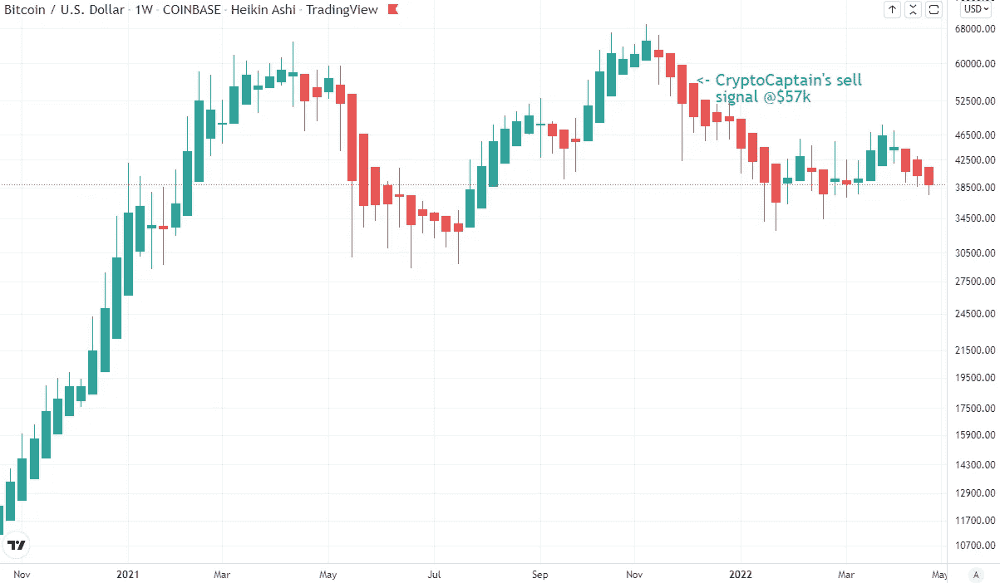
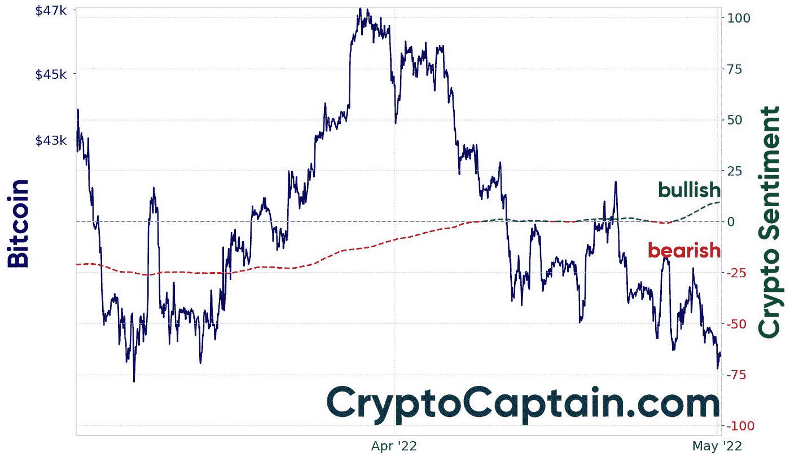

# 加密市场更新

> 原文：<https://medium.com/coinmonks/crypto-market-update-6126549724ee?source=collection_archive---------63----------------------->

# 市场状况

CryptoCaptain 的快速更新:在最近几周的加密市场上，价格方面没有什么变化。价格和情绪在牛市和熊市之间摇摆不定。

美国即将加息以对抗高通胀。这通常对股票和密码都不利。但问题是，它是否已经被计算在内了。如果是这样的话，甚至可能会有一些上升的潜力。

与市场即将触底的想法一致，市场情绪在过去几天变得有点乐观。onchain 指标也暗示了一些上行潜力，因为据说鲸鱼增加了他们的持有量，向冷钱包的转移增加了，比特币散列率达到了历史最高水平。让我们拭目以待。

一旦 CryptoCaptain 的算法发现了一个好机会，它会让你保持联系(如果你是会员的话)。[立即注册，让您安心！与此同时，我正在花时间研究新的令人兴奋的算法。敬请关注。](https://cryptocaptain.com/analytics/plans)

Weekly Bitcoin chart with Heikin Ashi candles (source: Tradingview.com)

# 市场情绪如何？

在 2022 年 4 月期间，加密市场情绪在牛市和熊市之间摇摆不定。现在，它已经开始转向看涨。但是等等，这不是买的信号。我们的算法考虑了许多不同的因素。[订阅](https://cryptocaptain.com/analytics/plans)了解更多。

Crypto Market Sentiment (source: https://cryptocaptain.com)

*原载于 2022 年 5 月 1 日 https://cryptocaptain.com***。**

> *加入 Coinmonks [电报频道](https://t.me/coincodecap)和 [Youtube 频道](https://www.youtube.com/c/coinmonks/videos)了解加密交易和投资*

# *另外，阅读*

*   *[5 款最佳加密交易终端](https://coincodecap.com/crypto-trading-terminals) | [最佳 DeFi 应用](https://coincodecap.com/best-defi-apps)*
*   *[比特币基地 vs 瓦济克斯](https://coincodecap.com/coinbase-vs-wazirx) | [比特鲁点评](https://coincodecap.com/bitrue-review) | [波洛涅克斯 vs 比特鲁](https://coincodecap.com/poloniex-vs-bittrex)*
*   *[德国最佳加密交易所](https://coincodecap.com/crypto-exchanges-in-germany) | [Arbitrum:第二层解决方案](https://coincodecap.com/arbitrum)*
*   *[币安交易机器人](/coinmonks/binance-trading-bots-d0d57bb62c4c) | [OKEx 评论](/coinmonks/okex-review-6b369304110f) | [阿塔尼评论](https://coincodecap.com/atani-review)*
*   *[最佳加密交易信号电报](/coinmonks/best-crypto-signals-telegram-5785cdbc4b2b) | [MoonXBT 评论](/coinmonks/moonxbt-review-6e4ab26d037)*