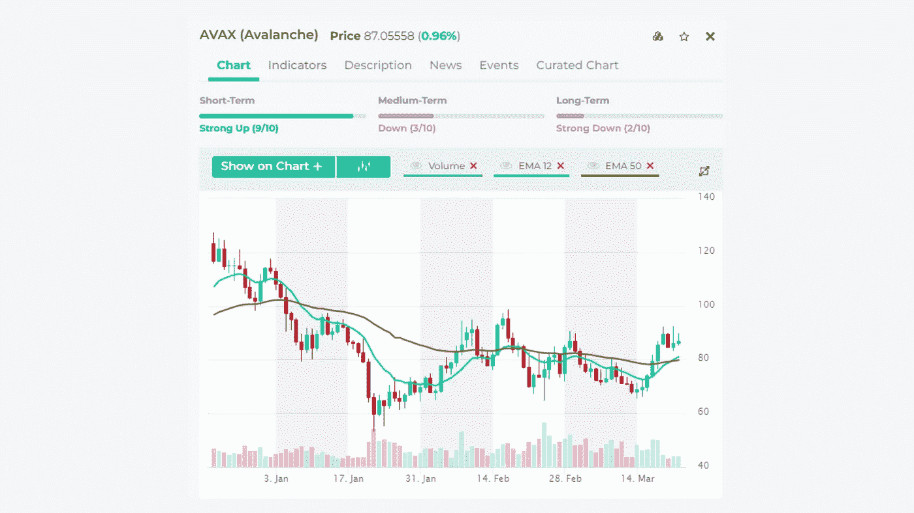

# 密码市场继续活跃

> 原文：<https://medium.com/coinmonks/crypto-markets-continue-to-perk-up-c8fed23cb19c?source=collection_archive---------67----------------------->

在我们新的 [**视频**](https://youtu.be/006QvU74oC4?utm_source=sendinblue&utm_campaign=Daily_Trading_tips&utm_medium=email) 中，我们突出了 **AVAX、SNX、DASH** 与**新鲜看涨的均线交叉**。这是一个简单但强大的趋势交易策略，我们在交易教育课程中教授。

你可以在我们的 [**市场集锦**](https://platform.altfins.com/dashboard?utm_source=sendinblue&utm_campaign=Daily_Trading_tips&utm_medium=email) 仪表盘上找到所有最近看涨均线交叉的硬币:**新鲜看涨交叉(均线 12/50)。**

这是一个简单而强大的趋势交易策略。找到一个趋势，利用它获得大收益。均线是用来发现趋势的。

当短期均线(如 12 天)穿过长期均线(如 50 天)时，看涨指数移动平均线(EMA)交叉出现。

这个市场屏幕在均线 12 最近(过去 2 天)穿过均线 50 并且价格高于均线 12 的地方找到硬币。

**交易规则:**

*   当均线 12 穿过均线 50，价格高于均线 12 时买入
*   当均线 12 低于均线 50 或者价格低于均线 12 时卖出
*   在前期低点下止损单(或警报)

精益更多**:**[**EMA 12/50 交叉如何交易？**](https://altfins.com/knowledge-base/ema-12-50-crossovers/?utm_source=sendinblue&utm_campaign=Daily_Trading_tips&utm_medium=email)教程视频 **:** [**新鲜 EMA 12 跨界 EMA 50**](https://youtu.be/IdR3g7u4eFc?utm_source=sendinblue&utm_campaign=Daily_Trading_tips&utm_medium=email)教育视频 **:** [**交易 MA 跨界**](https://youtu.be/YTcRjH3QGXE?utm_source=sendinblue&utm_campaign=Daily_Trading_tips&utm_medium=email)

> 加入 Coinmonks [电报频道](https://t.me/coincodecap)和 [Youtube 频道](https://www.youtube.com/c/coinmonks/videos)了解加密交易和投资

# 另外，阅读

*   [非洲最佳加密交易所](https://coincodecap.com/crypto-exchange-africa) | [胡交易所评论](https://coincodecap.com/hoo-exchange-review)
*   [eToro vs 罗宾汉](https://coincodecap.com/etoro-robinhood)|[MoonXBT vs Bybit vs Bityard](https://coincodecap.com/bybit-bityard-moonxbt)
*   [Stormgain 评论](https://coincodecap.com/stormgain-review) | [Probit 评论](https://coincodecap.com/probit-review) | [北海巨妖评论](/coinmonks/kraken-review-6165fc1056ac)
*   [如何在势不可挡的域名上购买域名？](https://coincodecap.com/buy-domain-on-unstoppable-domains)
*   [印度的秘密税](https://coincodecap.com/crypto-tax-india) | [altFINS 审查](https://coincodecap.com/altfins-review) | [Prokey 审查](/coinmonks/prokey-review-26611173c13c)
*   [Blockfi vs 比特币基地](https://coincodecap.com/blockfi-vs-coinbase) | [BitKan 评论](https://coincodecap.com/bitkan-review) | [期货交易机器人](/coinmonks/futures-trading-bots-5a282ccee3f5)