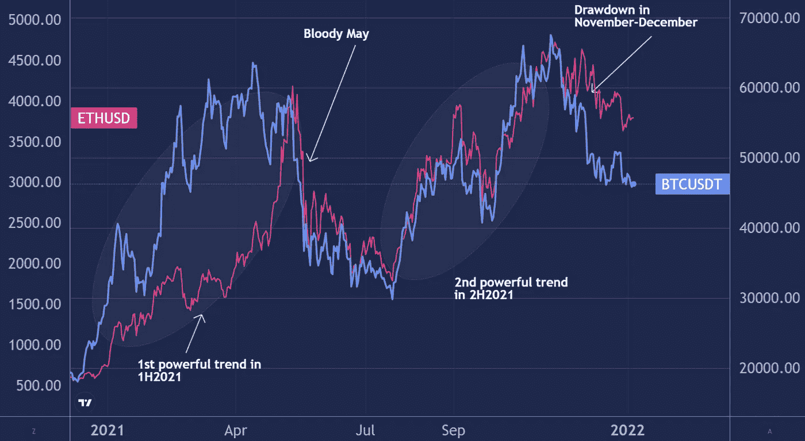
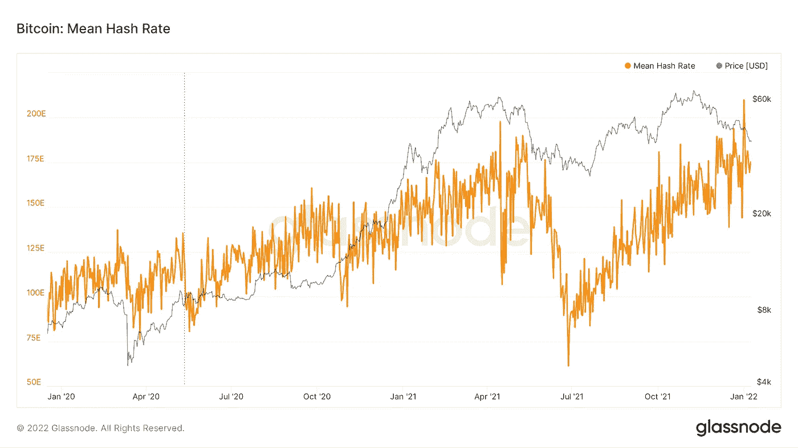
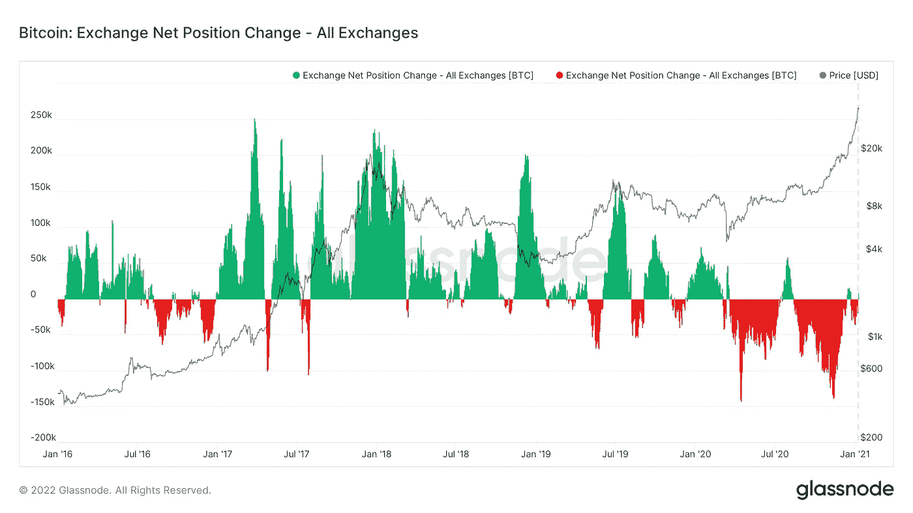
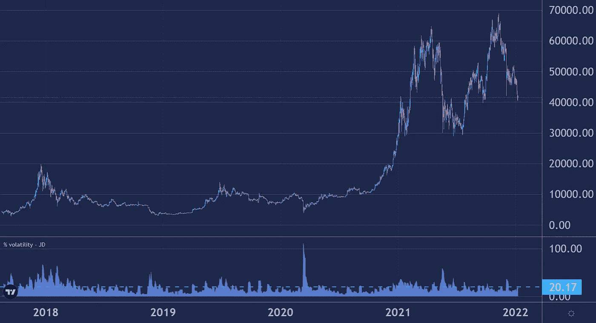
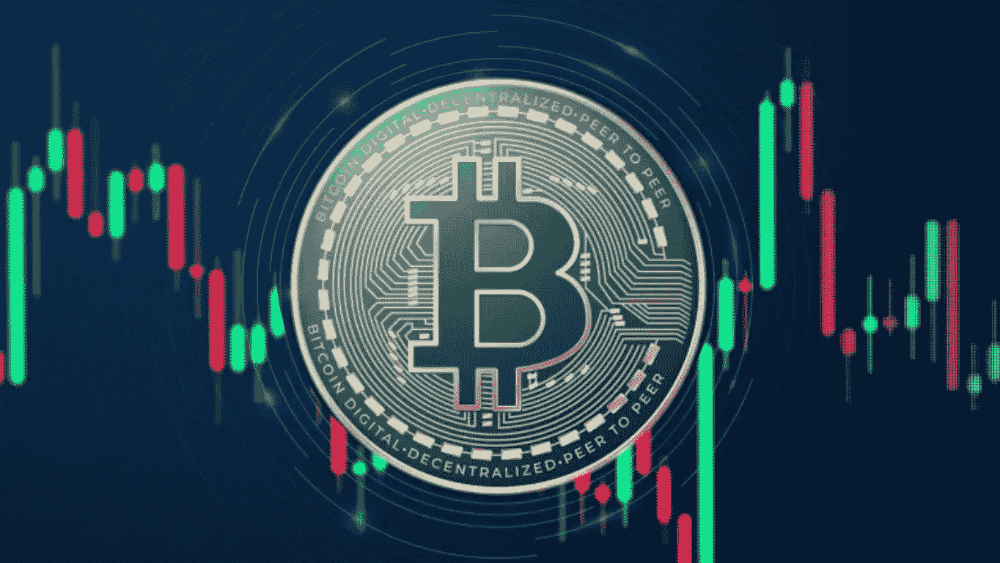

# 2021 年的密码市场。最耀眼的事件及其原因

> 原文：<https://medium.com/coinmonks/crypto-markets-in-2021-the-brightest-events-and-their-reasons-16d2fca2372d?source=collection_archive---------9----------------------->

## 分析 2021 年密码市场的情况及其原因

对于加密货币市场来说，2021 年初是伟大的一年。比特币和以太都在强劲的运动中增长了数十%，并给趋势算法(如 AlgonautBot)带来了收益。5 月份出现了大崩盘——加密货币的提款高达 50%！Crypto 在 7 月份才开始再次增长，一般来说，牛市会持续到 11 月份。11 月和 12 月，crypto 再次面临压力，并以远低于高点的价格结束了这一年。

BTCUSD & ETHUSD in 2021

【2021 年成绩:

*   比特币 **+59.7%**
*   以太坊 **+398.1%**

## 为什么加密市场会在 2021 年增长？

1.  **机构投资者**大量进入。对冲基金、特斯拉和 Microstrategy 这样的大公司为比特币和以太坊提供了不断增长的需求。加密技术已经成为全球投资者全球投资组合中的必备资产。
2.  **比特币基地 IPO** 。美国主要的加密货币交易所成为一家市值数十亿美元的上市公司。
3.  大量的私人交易者已经进入了加密市场。多亏了罗宾汉和比特币基地应用程序，购买和持有密码已经变得更加实惠。
4.  埃隆·马斯克和像柴犬这样的迷因币创造了另一波关于加密的噪音。
5.  **NFT 的发展**以及围绕它的炒作。
6.  各国对加密货币的监管越来越透明。

> 这些因素并不是支持加密货币报价的唯一因素。总体而言，经过 2017 年的大肆宣传、随后的加密冬天和 2020 年的复兴，加密行业“成熟”了。加密已不仅仅是一个极客的幻影，而是一个成熟的行业，拥有公共交易所、媒体人士的支持和私人投资者的认可。

**但在 5 月和 11 月，有两次重大下跌令加密货币社区担忧。是什么造成的？**

*   中国加强监管，禁止采矿。直到 2021 年 5 月，中国一直是最大的比特币开采国。在中国当局禁止大多数加密货币交易并禁止采矿后，该网络的散列率下降了一半以上。紧随其后，最大的加密货币的报价也下跌了 50%以上

*   **美国美联储的变化**对美元利率即将上调的言论和市场反应。加密货币与传统的交易所交易工具——股票和大宗商品——越来越相关。美联储的政策收紧和加息往往会导致大宗商品价格和股指下跌。
*   2021 年出现了许多私人杠杆交易商，这一事实也导致了抛售。由于风险控制不力和价格大幅下跌，交易所被迫强行出售客户的头寸，放大了加密价格的下跌。于是，2021 年 5 月，价值 24 亿美元的交易员头寸被平仓！

当然，也有许多隐藏的因素。例如，密码的流入或流出与交易所的钱包之间存在某种关联。流入是看跌信号，流出是看涨信号。Glassnode 服务允许跟踪大量加密货币市场参数，包括交易所的流入和流出。

为了看到最新的数据，你需要付费访问。我们不允许在这里广播付费数据。如果你感兴趣，你可以在 Glassnode 找到很多关于加密货币市场的信息。

**2021 年的波动率**并不是超高。因为比特币价格跳涨了几万，好像波动性加大了。然而，与前几年持平。

Bitcoin’s relative 7-day volatility

一周内很少有超过 20%的大幅波动。例如，2019 年和 2020 年出现了爆发式的运动，让我们这样的算法交易员赚得越来越多

然而，AlgonautBot 在 2021 年结束时获得了丰厚的利润:

*   **84%** 在 BTCUSD
*   ETHUSD 的 **+736%**

> 更多关于 AlgonautBot 的结果将在下一篇文章中发布。

总而言之，值得一提的是，这一年是加密货币的里程碑。不仅比特币或以太坊价格上涨，私人交易者和企业对它们的信心也在增长。我们希望 2022 年将是 crypto 的又一个好年景。

*AlgonautBot——是加密货币市场中使用自动算法的交易服务——机器人。任何人都可以从他们在交易所的账户连接到机器人，开始赚取高达 140%的年收益。*

*更多关于 AlgonautBot—*[*ALGONAUTBOT.COM*](http://algonautbot.com/?utm_source=medium&utm_medium=organic&utm_campaign=medium_articles&utm_content=article1_hist_270)

跟随我们，我们将讨论加密和算法交易。如何创建自己的 bot？如何检查是否有效？如何进行统计分析，预测结果？我们将来一定会报道它。

> 加入 Coinmonks [电报频道](https://t.me/coincodecap)和 [Youtube 频道](https://www.youtube.com/c/coinmonks/videos)了解加密交易和投资

## 也阅读

 [## 杠杆代币[多头代币]终极指南

### 杠杆化令牌是具有杠杆化风险敞口的 ERC20 令牌，不考虑保证金、要求、管理…

medium.com](/coinmonks/leveraged-token-3f5257808b22)  [## BlockFi 评论 2021:利弊和利率| CoinCodeCap

### 今天，我们提出了一个全面的 BlockFi 评论，这是一个成立于 2017 年的加密贷款平台，拥有其…

blog.coincodecap.com](https://blog.coincodecap.com/blockfi-review)  [## 如何在印度购买比特币？2021 年购买比特币的 7 款最佳应用[手机版]

### 如何使用移动应用程序购买比特币印度

medium.com](/coinmonks/buy-bitcoin-in-india-feb50ddfef94)  [## 加密税务软件——五大最佳比特币税务计算器[2021]

### 不管你是刚接触加密还是已经在这个领域呆了一段时间，你都需要交税。

medium.com](/coinmonks/best-crypto-tax-tool-for-my-money-72d4b430816b)  [## 9 个 2022 年最值得购买的密码| CoinCodeCap

### 2021 年对于加密货币、比特币、NFT 或不可替代代币、元宇宙等等来说是很棒的一年。这一年…

blog.coincodecap.com](https://blog.coincodecap.com/crypto-to-buy-in-2022)  [## 存储比特币的最佳加密硬件钱包[2021] | CoinCodeCap

### 保管您的数字资产很容易，但找到正确的存储方式却是一项繁琐的任务。在线钱包有一个风险…

blog.coincodecap.com](https://blog.coincodecap.com/best-hardware-wallet-bitcoin)  [## Pionex 评论 2021 |免费加密交易机器人和交换

### Pionex 是为交易自动化提供工具的后起之秀。Pionex 上提供了 9 个加密交易机器人…

medium.com](/coinmonks/pionex-review-exchange-with-crypto-trading-bot-1e459d0191ea)  [## 2022 年密码交易员的三大电报渠道

### 加密信号是来自专业交易者的交易想法，以特定的价格或价格买卖特定的加密货币

medium.com](/coinmonks/top-3-telegram-channels-for-crypto-traders-in-2021-8385f4411ff4)  [## 2022 年 5 个最佳免费加密投资组合追踪器

### 加密投资组合追踪器是作为一个解决方案创建的，既费时又令人困惑的家务提供一个…

blog.coincodecap.com](https://blog.coincodecap.com/free-crypto-portfolio-trackers)