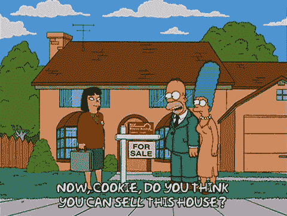
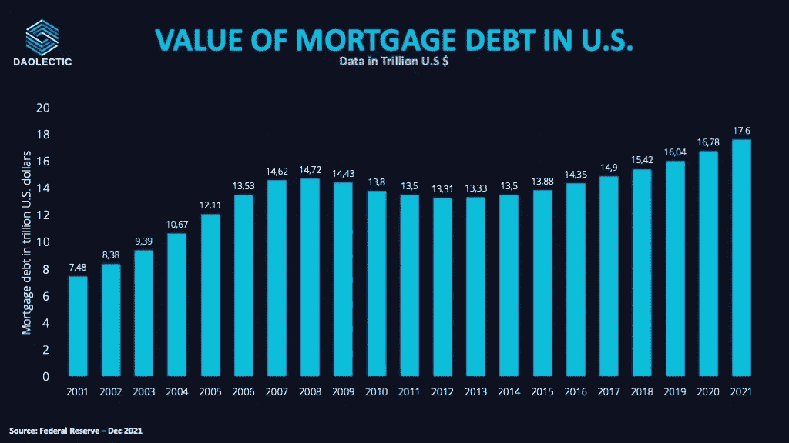
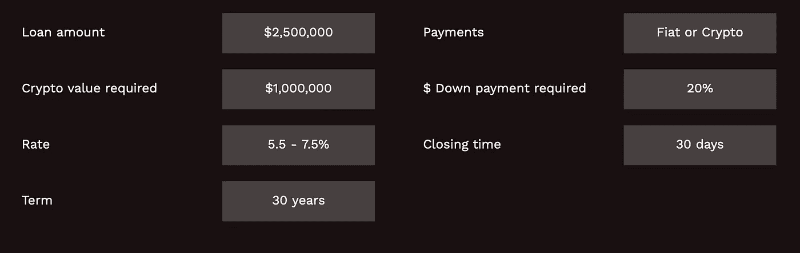
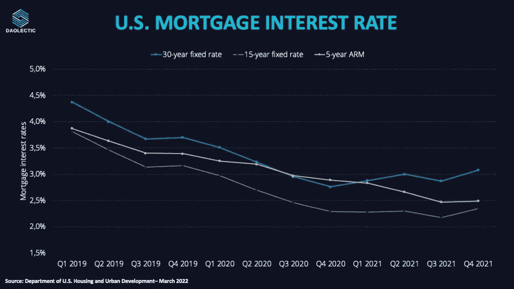
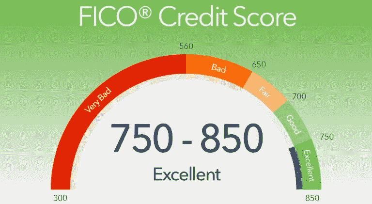

# 无抵押的加密抵押贷款。什么会出错？

> 原文：<https://medium.com/coinmonks/crypto-mortgages-with-no-collateral-what-could-go-wrong-3b9e51149eca?source=collection_archive---------24----------------------->

全球房地产估值冲击**2020 年 326.5 万亿美元。**

> **如果你可以在 crypto 中设置一个没有抵押的抵押， ***你会去做吗？*****

****

# **美国背景**

**近年来，美国的整体抵押贷款债务有所上升，房屋销售是主要支撑因素:**

**尽管在美国房地产泡沫破裂和全球金融危机后出现了短暂的下降，但美国的总体抵押贷款债务近年来有所上升:**

**抵押贷款债务从 2020 年的 16.8 万亿美元增加到 2021 年的 17.6 万亿美元，并且这一趋势正在逐年上升。**

****

**它为加密技术的采用创造了一个诱人的市场。**

# **加密上下文**

**[**USDC.homes**](https://usdc.homes) 合伙 w/ [@useteller](https://teller.org) 将为借款人提供加密无抵押抵押抵押贷款。**

**USDC.homes 将根据密码持有者的信用评分向他们提供贷款。**

** [## 德克萨斯州的加密抵押贷款

### 什么是加密抵押？加密抵押贷款让你在购房过程中利用你的密码。不像…

usdc.homes](https://usdc.homes) 

*有抵押或无抵押贷款是什么意思？*

*   抵押品是贷款的证券价值。大多数 DeFi 贷款交易需要等于或大于贷款金额(通常为 150%)的抵押品。这些标准将许多符合条件的用户排除在 DeFi 贷款之外。
*   无抵押贷款是一种基于过去记录或未来收入证明的信贷。

贷方可能会要求更高的利率来降低风险。

**潜在市场更大，因为潜在贷款金额没有理论上限。**

通过消除或减少对抵押品的需求，加密贷款可能更容易获得。

# 泰勒

[**@useteller**](https://teller.org) 是一个开源协议，使用过去的消费者数据来评估违约风险。

通过这样做，它可以提供无担保的加密资产贷款。

用户可以将钱借给@useteller 贷款池以赚取利息:

*   该协议根据针对消费者信贷风险的市场环境生成年利率。
*   借款人可以通过 USDC.homes 获得高达 500 万美元的贷款，其中包括 5.5%的融资费和 20%的首付款(BTC、瑞士联邦银行和 USDC)

该平台向一名德克萨斯州居民发放了首笔加密贷款:

通过@0xPolygon，用户用 50 万美元的信用购买了 68 万美元的房产！** 

**2020 年，美国所有抵押贷款利率降至 3.5%以下:**

**它们被减少是为了鼓励房屋销售和促进美国经济。**

**与传统抵押贷款相比，USDC.homes 的较高利率(5.5%)可以作为加密服务的额外费用进行折扣。**

****

**项目的可持续性如何？**

**该平台的首付款被押上，而不是出售，赚取的收入可能用于偿还债务。**

**到目前为止，还没有关于@usteller protocol 将支付多少首付的细节& APY 是多少。**

**鉴于 crypto 才出现了几年，提供 30 年的抵押贷款似乎很奇怪。**

**即使 crypto 在 30 年后仍然存在，也没有人知道哪些货币会有价值。**

**为了防止债务偿还出现困难，采用了 FICO 评分。**

****

**用户不会购买房产，除非他们有能力在一段时间内偿还。**

**USDC.home 也是一样，只有 FICO 分数高的人才会被录取。**

**加密抵押贷款对银行和客户都有好处。**

**在 USDC.homes 之前，购房者必须将加密资产转换为法定资产，从而使自己面临税收、费用和职位损失。**

> **在违约的情况下，房子和密码是抵押品。**

**加密抵押贷款的主要威胁是波动性:如果用户的加密价值下降，个人需要在交易中投入额外的资金。**

**USDC.homes 和@useteller 都将提供有关追加保证金通知的详细信息和可能性。**

# **关键要点**

*   **对于传统的抵押贷款来说，证明秘密持有的真实性仍然是痛苦的。**
*   **采用加密抵押贷款将减少今天的过程效率低下:所有需要的数据和信息都可以添加到链上，使过程更加顺畅和容易访问。**

***区块链与 FICO 信用评分整合:***

**这足以防止 2008 年因加密波动而引发的另一场房地产泡沫吗？**

**为了避免破产风险，可以直接从区块链找到一个可能的解决方案:**

> **从链上分析，贷款人可以认识到借款人的积极记录，过滤掉不良结果。**

**这种服务在美国以外是否有吸引力是有争议的。**

**但是这些服务首先被交付的事实表明了市场正在变得多么有活力。**

**在最后一个@useteller Twitter 空间中，@ryanmberkun 介绍了新的可能性可以从美国其他州产生，如佛罗里达州和加利福尼亚州。**

**然而，里斯本似乎也是欧洲地区的先行者。**

**【https://twitter.com/useteller/status/1521478123497267200 **

**加密和区块链应用在房地产市场会有什么影响？**

**他们如何为这个行业带来积极的成果？**

# **放弃**

**在任何情况下，这都不是财务建议，我研究的目标将永远是深入项目并从不同角度研究它们，我确实包括了基于我最近研究的类似项目的经验的个人意见。**

**我现在和将来都愿意接受讨论。**

****在 Twitter 上关注我们:****

****@道辛****

****在投资任何东西之前，请务必做好调查**。**