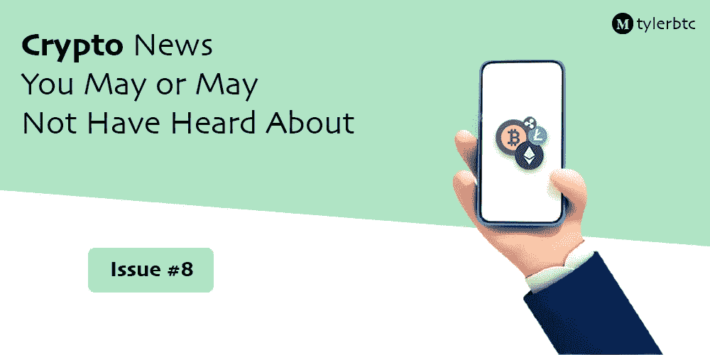

# 你可能听说过也可能没听说过的加密新闻——第 8 期

> 原文：<https://medium.com/coinmonks/crypto-news-you-may-or-may-not-have-heard-about-issue-8-72494f1b489f?source=collection_archive---------49----------------------->

## 了解 NFT 和加密货币领域目前正在发生的事情

随着我们看到越来越多的大品牌/公司进入加密领域，这对于加密货币的未来总是一个很好的迹象。也就是说，这将是一个每周系列，积累了各种加密和 NFT 相关的新闻，你可能听说过，也可能没有听说过。我们开始吧！

## WingStop 申请商标在元宇宙出售鸡翅

意外潜入元宇宙，在过去的几个月里，我们看到许多公司进入元宇宙，现在我们有了 WingStop！期待更多关于他们自己的 NFTs 的消息，这似乎是他们未来计划的一部分。

## CVS 为元宇宙的药房和诊所申请商标

就像 WingStop 一样，CVS 也进入了元宇宙。在竞争中领先使他们处于有利位置，许多竞争对手落后。他们的计划还没有完全确定，兴奋地看着他们想出什么。

## 黑客要求英伟达提供更快的挖掘速度

本周，我们看到一群黑客要求英伟达为他们的 GPU 提供更快的加密货币挖掘速度。作为回报，黑客不会公布从英伟达窃取的数据，包括超过 7.1 万名英伟达员工的电子邮件地址和登录凭证。这一消息出乎意料，英伟达尚未做出回应。

## Pixelmon 令人失望的发布

近几个月来，Pixelmon 一直是 NFT 最大、最受关注的项目之一。他们的造币厂上个月为这个项目筹集了 7000 多万美元。在令人失望地披露了他们的 NFT(如上图)之后，他们收到了对他们项目的强烈反对。

然而,,该项目的所有者后来在推特上解释说,“揭示为 NFTs”没有被正确加载，并且团队没有预料到它们的结果。他还发布了真实游戏角色的图片:

显然，这些图像看起来要好得多，然而，Pixelmon 团队的这一“糟糕表现”无疑让它们陷入了困境。

## BAYC 业主起诉 OpenSea 盗窃 NFT

在上周的 OpenSea 黑客攻击后，受影响的用户之一，Timothy McKimmy，他是 BAYC#3475 的所有者。他的 NFT 在不知情的情况下以 0.01 ETH(相当于大约 30 美元)的价格售出。紧接着，购买这笔交易的黑客以 99 ETH(相当于大约 25 万美元)的价格转卖给了 NFT，让麦克金米一无所有。McKimmy 已经向德克萨斯州法院提起诉讼，随着故事的发展，我相信你们也和我们一样对此感到兴奋！

我们在加密领域看到了很多令人兴奋的消息，希望在下周的期刊中见到你们！

> ***找到我这里:*** [*https://twitter.com/TylerResold*](https://twitter.com/TylerResold)[*https://y.at/scouts.joker.spades*](https://y.at/scouts.joker.spades)