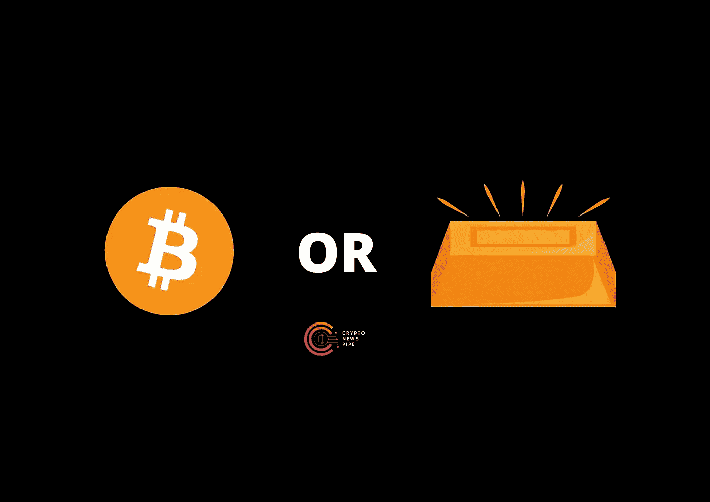

# 密码还是黄金？

> 原文：<https://medium.com/coinmonks/crypto-or-gold-580d9f0f9ce5?source=collection_archive---------36----------------------->

[Crypto or gold?](https://cryptonewspipe.com/crypto-or-gold/)

历史上，黄金一直是一种长期资产，用于抵御市场低迷。[比特币](https://cryptonewspipe.com/category/bitcoin/)仍然是一种未经证实的新投资，但[加密货币](https://cryptonewspipe.com/category/cryptocurrency/)投机者正在利用它来持有资产，保护自己免受市场下跌和衰退的影响。

加密货币市场仍然不稳定，但在爆发后，它们开始更接近于传统投资。