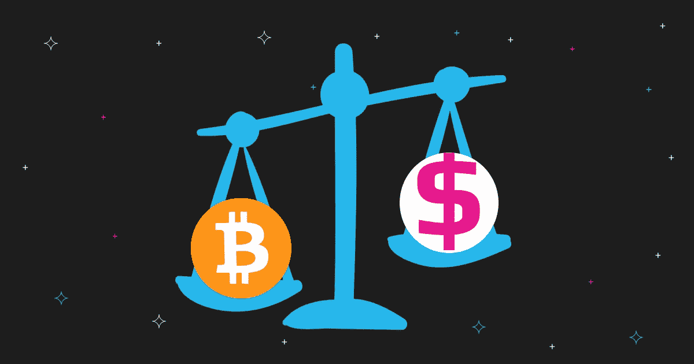

# 加密支付硬币:为什么人们放弃菲亚特支持加密？

> 原文：<https://medium.com/coinmonks/crypto-payment-coins-why-are-people-ditching-fiat-in-favor-of-crypto-b4f3fc145dcf?source=collection_archive---------31----------------------->

一次又一次，加密货币的怀疑者被系统性地、例行公事地证明是错误的。然而，这是否意味着大规模采用加密货币指日可待？讨论这个话题要看很多方面，比如机构投资，监管，加密货币的整体效用。例如，人们在很大程度上抛弃了菲亚特，转而支持加密支付。让我们更深入地探讨“加密支付是如何工作的？”看看随着 BTC 的发展，加密支付硬币越来越受欢迎。

# 什么是加密支付？

加密货币支付本质上与常规的在线法定支付相同，只是使用了比特币或以太坊等虚拟货币。法定支付和加密支付的区别在于支付方式。因此，大多数加密支付通过去中心化的区块链工作，例如以太坊，并且是完全匿名和去中心化的。因此，他们不需要任何第三方如 Paypal 来验证交易。

加密支付是安全的，并使用户通过他们的共识机制避免重复消费。支付所通过的共识机制，无论是工作证明还是利益证明，都将验证每一笔交易，以确保网络和支付的有效性和安全性。

如今，你已经可以使用加密支付来购买现实世界中的传统服务或产品。然而，他们有更多的使用案例，如支付/奖励区块链上的活动，如铸币和 NFTs，或参与 DeFi 协议治理。

# 加密支付是如何工作的？

所有的加密支付都发生在区块链上，如以太坊区块链或币安智能链，其中的*交易*由区块链的验证器进行验证和保护。这些验证器以挖掘器或利益验证器的形式出现。

矿工利用处理能力来验证每个区块。他们还与其他矿工竞争成为第一个开采该区块的人。

另一方面，Stake 验证者使用他们自己的 staked 加密货币(原产于区块链),被随机选择(基于几个标准)来验证该块。

这是加密支付的基本流程:验证块、验证支付、处理交易。由于支付是在区块链上进行的，它是完全透明的，一旦验证，没有人能篡改它，提供了匿名性、安全性和可靠性。

# 加密支付的优势

加密领域的不同区块链为加密支付提供了不同的优势，但是，一些最常见的优势是:

*   **无国界**

主持加密货币支付验证的区块链是完全无国界的。因此，支付在世界各地都是可能的，等待时间只限于网络。例如，一个印度的朋友可以立即向他在美国的朋友发送比特币，费用很低，也没有中央机构，如充当中介的银行。因此，世界各地的用户可以通过电话和互联网连接相互发送数字货币。

*   **不信任和不许可**

以太坊(Ethereum)等去中心化的区块链是完全不可信和不允许的，它允许任何具有互联网连接的人，不管任何其他可能限制他们获得传统金融的因素，都可以获得加密货币支付和金融自由。加密货币还允许点对点交易，这样两个人就可以在没有第三方的情况下在一个完全安全和不可信的环境中进行支付。

*   **透明度&速度**

区块链上的交易对任何人来说都是完全透明的，任何人都不能撤销交易。对企业的加密支付创造了一个不可信的商业环境，授权检查它，不允许退款交易。例如，与美国仍然存在的反向电汇相比，它们的速度也非常快。此外，即时支付意味着更容易的国际和国内贸易和商业。

# 加密支付硬币列表

BNB、TRX、XRP 和 XNO 等主要加密货币的加密支付是如何工作的？

# 加密支付硬币:TRX 硬币

[TRON network](https://tron.network/) 是一个大规模的加密货币公共区块链，以低交易费用为多种最常用的加密货币提供闪电般的支付，如 USDT——一种与一美元价值挂钩的稳定货币。TRX 币是支付任何网络费用的费用。

**每周交易量** 20m+ **每秒交易量**

30–40

**交易费用**

几乎为零

# 加密支付硬币:XRP 硬币

[XRP 币](https://swapzone.io/currencies/ripple)是市值最大的加密货币之一，用于支付结算、资产交换和其他 Ripple Lab 产品。这是 XRP 生态系统中的本地支付方式。

**每周交易**

10m+

**每秒交易量**

12–16

**交易费用**

少于 0.01 美元

# 加密支付硬币:BNB 硬币

[BNB 币](https://www.binance.com/en/price/bnb)是币安智能链生态系统的原生货币，由于低费用、快速交易和值得信赖的生态系统，它是最大的加密货币支付方式之一，基于集中交易所，[币安](https://swapzone.io/currencies/binance-coin)。然而，它是一个更集中的生态系统，有 21 个验证器，基于它们的权威共识机制的证明。

**每周交易**

35 米以上

**每秒事务数**

65–80

**交易费用**

$0.30

# 加密支付硬币:XNO 硬币

[XNO coin](https://nano.org/) 旨在提供比特币无法提供的东西，在一个真正去中心化的网络中提供无与伦比的可扩展性。此外，作为一种支付方式， [XNO](https://swapzone.io/currencies/nano) 不需要交易费用，交易通常在一秒钟内完成。

**每周交易**

不适用的

**每秒事务数**

290+

**交易费用**

不适用的

# 如何兑换加密支付币？

Swapzone 汇总了超过 600 种加密货币对的最佳汇率，为您带来最佳汇率，但您如何利用它呢？

如果你想获得一些加密支付货币，用 crypto 购物，你就处于有利位置。然而，在你做任何事情之前，请浏览我们的网站[这里](https://swapzone.io/)。

> 加入 Coinmonks [电报频道](https://t.me/coincodecap)和 [Youtube 频道](https://www.youtube.com/c/coinmonks/videos)了解加密交易和投资

# 另外，阅读

*   [3 商业评论](/coinmonks/3commas-review-an-excellent-crypto-trading-bot-2020-1313a58bec92) | [Pionex 评论](https://coincodecap.com/pionex-review-exchange-with-crypto-trading-bot) | [Coinrule 评论](/coinmonks/coinrule-review-2021-a-beginner-friendly-crypto-trading-bot-daf0504848ba)
*   [莱杰 vs n rave](/coinmonks/ledger-vs-ngrave-zero-7e40f0c1d694)|[莱杰 nano s vs x](/coinmonks/ledger-nano-s-vs-x-battery-hardware-price-storage-59a6663fe3b0) | [币安评论](/coinmonks/binance-review-ee10d3bf3b6e)
*   [Bybit 交易所评论](/coinmonks/bybit-exchange-review-dbd570019b71) | [Bityard 评论](https://coincodecap.com/bityard-reivew) | [Jet-Bot 评论](https://coincodecap.com/jet-bot-review)
*   [3 commas vs crypto hopper](/coinmonks/3commas-vs-pionex-vs-cryptohopper-best-crypto-bot-6a98d2baa203)|[赚取加密利息](/coinmonks/earn-crypto-interest-b10b810fdda3)
*   最好的比特币[硬件钱包](/coinmonks/hardware-wallets-dfa1211730c6) | [BitBox02 回顾](/coinmonks/bitbox02-review-your-swiss-bitcoin-hardware-wallet-c36c88fff29)
*   [block fi vs Celsius](/coinmonks/blockfi-vs-celsius-vs-hodlnaut-8a1cc8c26630)|[Hodlnaut 审核](/coinmonks/hodlnaut-review-best-way-to-hodl-is-to-earn-interest-on-your-bitcoin-6658a8c19edf) | [KuCoin 审核](https://coincodecap.com/kucoin-review)
*   [Bitsgap 审查](/coinmonks/bitsgap-review-a-crypto-trading-bot-that-makes-easy-money-a5d88a336df2) | [Quadency 审查](/coinmonks/quadency-review-a-crypto-trading-automation-platform-3068eaa374e1) | [Bitbns 审查](/coinmonks/bitbns-review-38256a07e161)