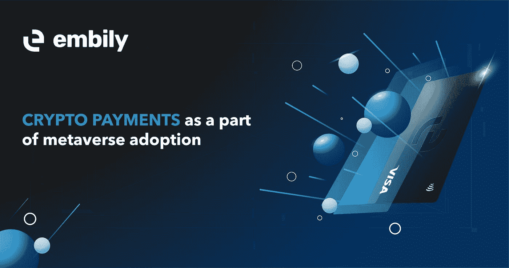

# 作为元宇宙采用的一部分的加密支付

> 原文：<https://medium.com/coinmonks/crypto-payments-as-a-part-of-metaverse-adoption-50d78ebe8448?source=collection_archive---------79----------------------->

Web 2.0 向 Web 3.0 的演进是一个自然的过程，分散式区块链技术在全球的发展和逐渐传播加快了这一过程。与它们的 Web 2.0 版本不同，下一代数字环境将不会孤立于服务器，并要求用户依赖外部内容。

相反，元宇宙将成为真实世界的数字再现，依靠先进的虚拟现实和区块链技术来创造一个具有自我维持经济的无尽环境。用户将把它作为内容创造者，把加密货币作为价值载体。

元宇宙是一个相对较新的术语，用来描述围绕特定假设开发的去中心化数字世界，如科幻小说设置或现实世界环境。所有 metaverses 都允许其参与者使用数字资产进行交流和互动，以标记现实世界的产品或服务。不可替代的代币在 metaverses 中充当价值载体，弥合数字经济和实体经济之间的差距，允许企业在网上销售其产品，并记录不变的所有权和现实世界价值的转换。

另一方面，用户将能够使用 NFTs 以数字形式在 metaverses 中创建任何类型的内容，从本质上丰富了环境，并为商品和服务的经济创造了基础。NFT 是可互换的、可互操作的，并且能够跨链迁移，同时保留它们的效用和价值。用户可以通过 metaverses 以固定价格购买、出售或交换这些资产。

由于 metaverses 完全是数字的，允许用户在虚拟现实环境中通过化身进行交互，因此在这样一个数字经济中的交换媒介也必须是分散的。加密货币已经作为本地货币与法定货币一起在 metaverses 内部使用。

因此，对可靠和方便的加密和平面网关的需求是简化数字经济中的流程的基本要素。例如， [Embily 借记卡](https://embily.com/?utm_source=medium)为 metaverses 用户提供所有必要的连接和服务。他们可以在数字环境中使用所有主要的加密货币进行无缝交易，或者在全球范围内以仅 1.5 欧元的价格轻松免费提取现金或 ATM 取款。