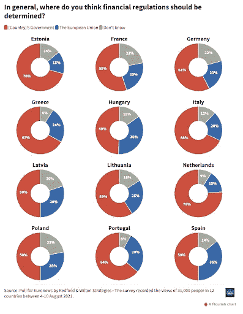

# 一个日益必要的问题。

> 原文：<https://medium.com/coinmonks/crypto-phenomenon-and-regulation-an-increasingly-necessary-issue-247f48e574f8?source=collection_archive---------72----------------------->

2021 年，比特币和加密资产现象被认为是如此重要，以至于不能再被忽视。也是因为这个原因，2022 年有望成为监管之年，或者至少是监管者首次尝试充分理解的一年。

大多数欧洲人希望他们的国家监管加密，而不是欧盟，我们可以从一项独家的欧洲新闻民意调查中看出这一点。

雷德菲尔德&威尔顿策略专门为*欧洲新闻网进行的大规模民意调查是欧洲就加密货币和金融监管主题进行的最广泛的此类调查。*

这项调查于去年进行，共有来自 12 个欧盟成员国的 3.1 万名受访者参与，包括爱沙尼亚、法国、德国、希腊、匈牙利、意大利、拉脱维亚、立陶宛、荷兰、波兰、葡萄牙和西班牙。

根据民意调查，虽然在整个欧盟范围内密码的使用仍然很少，但它们日益流行给**提出了监管**的问题，即如何监管以及由谁监管。

欧洲新闻网(Euronews)的一项具有里程碑意义的民意调查发现，大多数欧洲人希望自己的政府监管加密货币，而越来越多的人也支持创建国家数字货币，以便在一定程度上独立于欧盟。

研究还发现，各国的大多数受访者更希望本国政府来决定金融监管，相比之下，总体而言，约有四分之一的受访者支持欧盟做出这些决定。

新冠肺炎疫情已经出现了从现金到数字期权的重大转变，欧洲中央银行(ECB)等银行机构正在密切关注这一趋势。

迄今为止，**在义大利，税法中没有明确提到虚拟货币**，虚拟货币交易等。

那么，如果与数字经济相关的现象在反洗钱立法方面值得所有这些关注，那么是什么阻碍了考虑到完全解除监管的资产(如加密货币)的许多特殊性的税收法规的产生呢？

可能有许多因素减缓了这一进程:

*   缺乏对该部门及其复杂性的了解，
*   尤其是在最近几年，
*   但最重要的是它不可阻挡的成长和进化，典型的虚拟世界总是比现实世界领先两步。

如果你也想了解更多的密码世界，加入 BGT 俱乐部: [*点击这里*](https://bigtaurus.com/lp-ottieni-10-free-tokens-bgt/) *。*

> 加入 Coinmonks [电报频道](https://t.me/coincodecap)和 [Youtube 频道](https://www.youtube.com/c/coinmonks/videos)了解加密交易和投资

# 另外，阅读

*   XT.COM 评论[币安评论](https://coincodecap.com/profittradingapp-for-binance) |
*   [SmithBot 评论](https://coincodecap.com/smithbot-review) | [4 款最佳免费开源交易机器人](https://coincodecap.com/free-open-source-trading-bots)
*   [比特币基地僵尸工具](/coinmonks/coinbase-bots-ac6359e897f3) | [AscendEX 审查](/coinmonks/ascendex-review-53e829cf75fa) | [OKEx 交易僵尸工具](/coinmonks/okex-trading-bots-234920f61e60)
*   [如何在印度购买比特币？](/coinmonks/buy-bitcoin-in-india-feb50ddfef94) | [瓦济克斯评论](/coinmonks/wazirx-review-5c811b074f5b)
*   [隐翅虫替代品](/coinmonks/cryptohopper-alternatives-d67287b16d27) | [HitBTC 审查](/coinmonks/hitbtc-review-c5143c5d53c2)