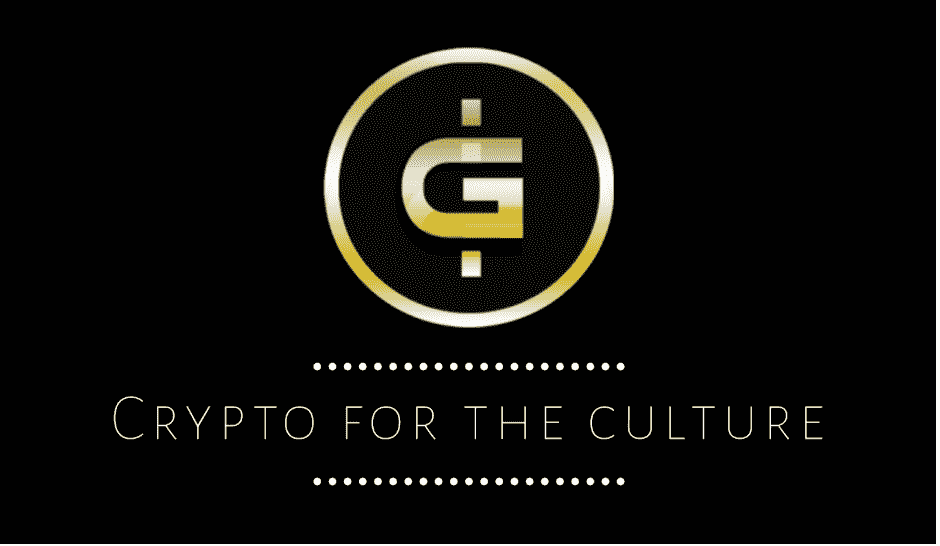

# 加密先锋——塔沃尼亚·埃文斯

> 原文：<https://medium.com/coinmonks/crypto-pioneer-tavonia-evans-f5634cbfc3cd?source=collection_archive---------63----------------------->

认识一下 Tavonia Evans， [Guap Foundation](https://guapfoundation.org/) 的创始人，这是一个非营利组织，使用文化硬币“Guap”通过金融教育和区块链技术来帮助服务不足的社区。Guap' miss 为黑人和棕色人种社区提供加密货币，并帮助缩小贫富差距。

据[瓜普基金会网站](https://guapfoundation.org/guap-foundation-about-us/)报道，塔沃尼亚创办了一家名为 Safe2Meet 的公司，这是一个点对点身份管理平台，她在 2015 年寻求投资，只是为了意识到黑人女性创始人在获得风险投资资金方面面临的非常现实的挑战。就在那时，她决定为社区创建 Guap。塔沃尼亚认为，加密货币扰乱了当前金融体系的现状。她设想了一个存在多种加密货币来解决问题的世界，并最终相信加密是为人民服务的，并希望 Guap 将成为其他人在其社区中用于经济赋权的模板。

**瓜普集锦**

*   瓜普币现在出现在[上](https://www.youtube.com/watch?v=Ci-zaxkVG9M)
*   第一位黑人[女性创立了加密货币](https://guapfoundation.org/guap-foundation-about-us/)，旨在对少数族裔小企业和社区产生影响。
*   [比特币欧洲大会](https://www.bitcoinferenceeurope.com/speaker/tavonia-evans/)特邀演讲嘉宾

# 跟随塔沃尼亚&瓜普

*   [瓜普基金会](https://guapfoundation.org/)
*   [Coinmarketcap](https://coinmarketcap.com/currencies/guapcoin/markets/)
*   [瓜普推特](https://twitter.com/guapcoin)
*   [塔沃尼亚的推特](https://twitter.com/nowthisnews/status/1475985667314364416)

#女性历史月 2022 #黑人历史月 2022 #黑人密码先锋

*原载于【https://www.linkedin.com】**。***