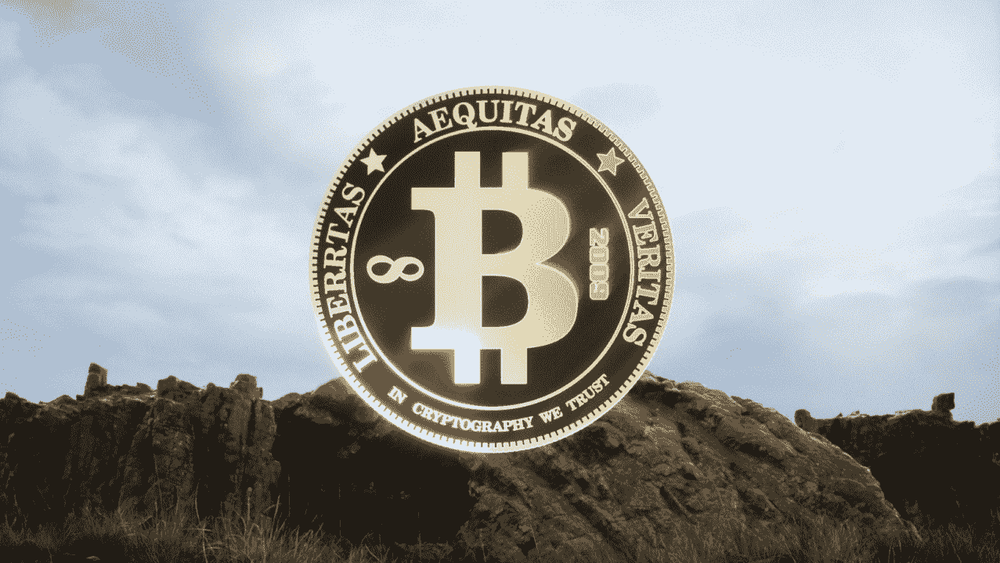

# 加密先锋& DEFI 的无名英雄

> 原文：<https://medium.com/coinmonks/crypto-pioneers-the-unsung-heroes-of-defi-efbe91cb5046?source=collection_archive---------70----------------------->

**由** [勇气金伯、](https://www.linkedin.com/in/couragekimber/) **密码战略家&区块链顾问**

我开始写关于加密先锋的文章是因为一次福布斯的加密缩放会议。在会议中，有一项关于 crypto 中最有影响力的领导者的调查。提出了五个名字。这些人几乎出现在我听说的所有有影响力的人或观察名单上。这个名单和大多数其他名单通常有以太坊的创始人之一，布莱恩·阿姆斯特朗，蒂姆·德雷珀，迈克尔·塞勒，加上或减去埃隆·马斯克或杰克·多西。我心想，“为什么每个人似乎都专注于同一批人，而有人在幕后承担着将加密货币和区块链技术解决方案带给大众的重任？”因此，为了纪念黑人历史月，我决定向一些不同的创造者&领导人以及他们为构建隐文所做的杰出工作展示光芒。

***隐名英雄***

有许多人帮助创建了加密社区，并帮助采用主流媒体没有报道的加密货币。这些人中有许多是女性、有色人种和 LGBTQ 社区的成员，他们一个街区一个街区地帮助建设了区块链。对于那些希望进入加密、NFTs、元宇宙等领域的人来说，这些不同的加密人员是你所寻求的知识的守门人，也是理解加密社区空间的关键。我直接发现了这一点。crypto 真正的无名英雄是社区的人们，他们分享 crypto 如何工作的知识，亲自动手帮助人们设置他们的钱包，解释私钥的重要性，并分享他们自己的个人失败。他们关心社区，正在努力实现 Satoshi Nakomato 在比特币首次引入世界时提出的愿景。

***黑历史月加密先锋***

[Michah Johnson](https://blog.cryptostars.is/crypto-pioneer-micah-johnson-5809ea9f1b3) ，NFT 艺术家&前 MLB 球员——黑人 NFT 历史创造者&突破者

[玛丽·斯皮奥](https://blog.cryptostars.is/crypto-pioneer-mary-spio-77d41c17f396)，CEEK VR 创始人兼首席执行官——火箭科学家&元宇宙·奥格

[亚瑟·海斯](https://www.linkedin.com/pulse/crypto-pioneer-arthur-hayes-courage-kimber)，联合创始人&bit MEX 前首席执行官——第一位黑人比特币亿万富翁&加密衍生品创新者

[肖恩·威尔金森](https://www.linkedin.com/pulse/crypto-pioneer-shawn-wilkinson-courage-kimber)，Storj-HBCU bit coiner 的创始人&分散存储的开拓者

[Alakanani Itireleng](https://www.linkedin.com/pulse/crypto-pioneer-alakanani-itireleng-courage-kimber) ，Satoshi 中心创始人——国际比特币影响者&密码教育家

[塔沃尼亚·埃文斯](https://www.linkedin.com/pulse/crypto-pioneer-tavonia-courage-kimber)，瓜普币创始人——密码专家，数据科学家&文化币创造者

[Olaoluwa Osuntokun](https://www.linkedin.com/pulse/crypto-pioneer-olaoluwa-osuntokun-courage-kimber) 闪电实验室的联合创始人——cypher punk&比特币开发者

[Saritta Hines](https://www.linkedin.com/pulse/crypto-pioneer-saritta-hines-courage-kimber-1f/) ，TrustaBit 联合创始人——数据分析专家&航空区块链颠覆者

[Ian Balina](https://www.linkedin.com/pulse/crypto-pioneer-ian-balina-courage-kimber/) ，Token Metrics 创始人——密码分析师&区块链影响者

[克丽丝·迈克法兰](https://www.linkedin.com/pulse/crypto-pioneer-chrissa-mcfarlane-courage-kimber/)，Patientory 的创始人——医疗保健倡导者&的密码发电站

[达芬奇·杰瑞米](https://www.linkedin.com/pulse/crypto-pioneer-davinci-jeremie-courage-kimber/)，比特币早期采用者——OG bit coiner&密码预言家

[卡洛琳·玛拉基](https://www.linkedin.com/pulse/crypto-pioneer-carolyn-malachi-courage-kimber/)，录音艺术家&教育家——格莱美奖提名人&比特币历史创造者

拉马尔·威尔逊(Lamar Wilson)&以赛亚·杰克森(Isaiah Jackson)，音频影响者&加密教育者

多学科艺术家——NFT 明星&非洲朋克

**关注并订阅更多**

*原为发表于***。**

> *加入 Coinmonks [电报频道](https://t.me/coincodecap)和 [Youtube 频道](https://www.youtube.com/c/coinmonks/videos)了解密码交易和投资*

# *此外，请阅读*

*   *[Exness Review](https://coincodecap.com/exness-review)|[moon xbt Vs Bitget Vs bing bon](https://coincodecap.com/bingbon-vs-bitget-vs-moonxbt)*
*   *[如何通过隐性贷款获得被动收入](https://coincodecap.com/passive-income-crypto-lending)*
*   *[big one Exchange Review](/coinmonks/bigone-exchange-review-64705d85a1d4)|[网格交易机器人](https://coincodecap.com/grid-trading)*
*   *[氹欞侊贸易评论](https://coincodecap.com/anny-trade-review) | [期货评论](https://coincodecap.com/coinspot-review)*
*   *[10 新加坡最佳密码交易所](https://coincodecap.com/crypto-exchange-in-singapore) | [购买 AXS](https://coincodecap.com/buy-axs-token)*
*   *[在印度投资的最佳密码](https://coincodecap.com/best-crypto-to-invest-in-india-in-2021)|[waz rix P2P](https://coincodecap.com/wazirx-p2p)*
*   *[7 个最佳零费用密码交换平台](https://coincodecap.com/zero-fee-crypto-exchanges)*
*   *[最佳网上赌场](https://coincodecap.com/best-online-casinos) | [期货交易机器人](/coinmonks/futures-trading-bots-5a282ccee3f5)*
*   *[分散式交易所](https://coincodecap.com/what-are-decentralized-exchanges) | [比特币 FIP](https://coincodecap.com/bitbns-fip)|[bing bon Review](https://coincodecap.com/bingbon-review)*
*   *[用信用卡购买密码的 10 个最佳地点](https://coincodecap.com/buy-crypto-with-credit-card)*