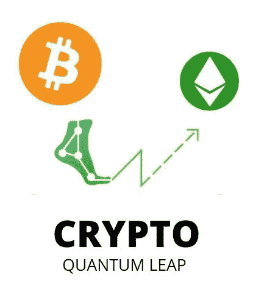
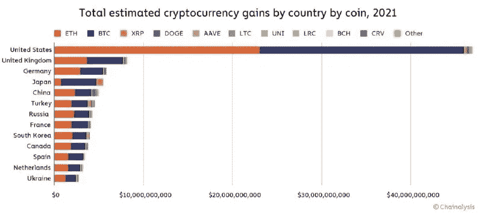

# 研究显示，加密利润增长 5X 投资者 2021 年获利 1630 亿美元

> 原文：<https://medium.com/coinmonks/crypto-profits-skyrocket-globally-investors-gains-grew-5x-to-163-billion-in-2021-chainalysis-49121cfcc032?source=collection_archive---------61----------------------->

**区块链数据分析公司**[**chain analysis**](https://www.chainalysis.com)**发现，全球加密货币利润总额达到 1630 亿美元，是 5X 前一年的 400%增长。**

Crypto Profits Surge

**全球加密利润-** [**连锁分析**](https://www.chainalysis.com)

区块链分析公司[chain analysis](https://www.chainalysis.com)上周发表了一篇题为“2021 年各国加密货币收益:以太坊引领全球收益暴涨”的博文。

[chain analysis](https://www.chainalysis.com)解释说，它的估计是基于网络流量数据及其交易数据，包括它跟踪的“所有加密资产的链上、宏观层面的流动”。

该公司在跟踪加密货币后发现，“2021 年是加密货币的又一个强劲年份”

***“2021 年全球投资者实现总收益 1627 亿美元，而 2020 年仅为 325 亿美元”***

美国以近 470 亿美元的已实现隐性利润领先，其次是英国、德国、日本、中国、土耳其、俄罗斯、法国、韩国、加拿大和西班牙。

Crypto Quantum Leap

***加密量子飞跃:如何在对技术毫无头绪的情况下用比特币致富***

***Crypto Quantum Leap 是一门在线课程，在一个自定进度的轻松环境中教授加密货币和区块链技术以及如何从中获利。您还将掌握智能合同和分散融资(defi)协议，这是发展最快的投资平台之一。***

***加密量子飞跃背后的深思熟虑是它的一个视频课程。你可能已经体验过在电脑上看了一段视频后，纠正电脑中的错误是多么容易。要了解更多关于加密量子飞跃-*** [***点击这里***](https://www.digistore24.com/redir/325658/appsun/)

[chain analysis](https://www.chainalysis.com)也提供了各个国家的估计加密利润。区块链数据分析公司描述道:

***“这里最值得注意的趋势涉及以太坊收益。以太坊刚刚在全球范围内以 763 亿至 747 亿美元的总实现收益挤掉了比特币。***

“我们相信这反映了由于 2021 年 defi 的崛起，对以太坊的需求增加”该公司重申，强调大多数分散金融(defi)协议都建立在以太坊区块链上，并使用 **ETH** 作为溢价货币。

Chainalysis 指出:“虽然大多数国家都遵循这一模式，但也有一些明显的例外，例如，日本从比特币中获得的已实现**加密利润**只有 40 亿美元，而以太坊的已实现利润只有 7.9 亿美元”。

**关联披露**:在完全透明的情况下，本文中的一些链接是关联链接。如果你从这些链接购买任何产品，我会从中获得佣金，没有任何额外的费用给你(无论如何)。这使得我们的团队能够写更多的文章，做更多的研究。