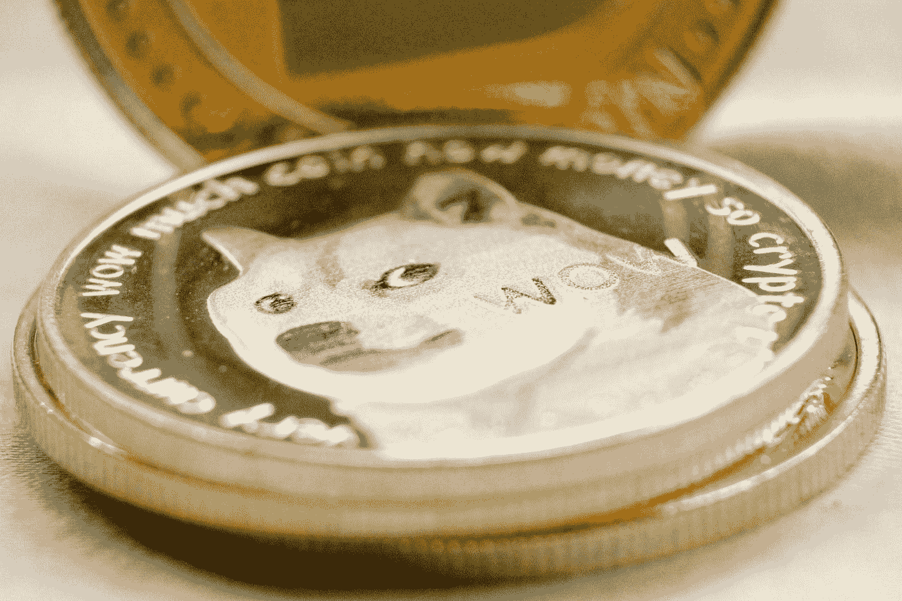

# 加密项目类型

> 原文：<https://medium.com/coinmonks/crypto-project-types-7532da75d29?source=collection_archive---------33----------------------->

*货币，迷因，定义，元诗句，天啊*

Photo by [Brett Jordan](https://unsplash.com/@brett_jordan?utm_source=medium&utm_medium=referral) on [Unsplash](https://unsplash.com?utm_source=medium&utm_medium=referral)

# 介绍

最初，加密作为一个领域是由[比特币](https://en.wikipedia.org/wiki/Bitcoin)发起的。这意味着是一种分散的货币，由分布式计算网络中的代码执行来管理。这与法定货币供应的集中控制相反。不久之后，随着[以太坊](https://en.wikipedia.org/wiki/Ethereum)的推出，智能合约被发明出来。从那以后，基本的区块链和智能合约被应用于解决不同类型的问题。随着加密领域的成熟，将会有更多的应用程序来解决特别的问题，这些问题非常适合围绕社会契约进行加密。在这篇文章中，我将介绍 5 种主要的项目类型:货币、迷因、定义、元和效用。这是一个详尽的列表，但它应该让你开始理解 19k+ cryptos(截至 2022 年 5 月，coinmarketcap.com)。

Photo by [Jason Leung](https://unsplash.com/@ninjason?utm_source=medium&utm_medium=referral) on [Unsplash](https://unsplash.com?utm_source=medium&utm_medium=referral)

# 货币项目

货币项目是试图模仿货币但利用加密的加密项目。他们中的一些人正试图取代现金，即由于交易费用低、延迟低和吞吐量高，日常交易可以使用这些项目进行。由于加密作为一种安全且不可审查的货币形式的常见属性，货币项目旨在使这些货币可以通过移动应用程序轻松使用，因为你可以随身携带它们，而不必随身携带笔记本电脑。

你想要一种货币的属性是要有一个稳定的价格，这样你就不会试图投资来增加你的钱或者把它作为价值储存手段。您希望价格保持一致，这样，如果您获得了一定的金额，就可以用类似的金额来购买商品，从而促进金融交易。

## 现金置换

[比特币现金](https://en.wikipedia.org/wiki/Bitcoin_Cash)，比特币的一个分支，旨在降低交易成本，增加每秒交易量，加快区块时间，以便更快地结算交易。这是通过增加块大小来实现的，这样每个块的开销就更少。在硬分叉的时候，任何拥有比特币的人都收到了等量的比特币现金。自成立以来，它已经增长到第 23 位，市值为 38 亿美元(截至 2022 年 5 月 coinmarketcap)。有许多纯货币项目，社区方法的差异最终导致比特币或其他链产生自己的利益。

## 隐私币

众所周知，区块链是公共的。也就是说，任何人都可以检查分类账，以核实钱包的所有余额和钱包自成立以来的全部历史。对许多人来说，这太透明了，也就是说，他们希望他们的交易是保密的。为了满足这一需求，crypto 中增加了隐私功能。最受欢迎的隐私币是 2014 年 4 月作为字节币的一个分支推出的 [Monero](https://en.wikipedia.org/wiki/Monero) 。Money 通过为每笔交易生成一个新的钱包地址(发送方和接收方)来匿名化交易。发送者发送新钱包的公共地址以及金额。接收者只能查看当前交易，而不能查看发送者钱包的历史或当前状态。因此，你无法在 Monero 的分类账中追踪交易。还有其他的隐私币如 [ZCash](https://en.wikipedia.org/wiki/Zcash) 、[法令](https://coinmarketcap.com/currencies/decred)、[秘密](https://coinmarketcap.com/currencies/secret/)和 [Horizen](https://coinmarketcap.com/currencies/horizen/) 。

Photo by [Crystal Mapes](https://unsplash.com/@cmapes?utm_source=medium&utm_medium=referral) on [Unsplash](https://unsplash.com?utm_source=medium&utm_medium=referral)

# Meme 项目

甚至在 2017 年的每日秀[也取笑 crypto](https://www.youtube.com/watch?v=polQTX39WZA&ab_channel=TheDailyShowwithTrevorNoah) 因为任何人都可以使用网站创造自己的硬币。你可以从一个迷因中创造一种加密货币，而人们会认真对待它，这看起来确实很可笑。然而，这正是 Dogecoin 的确切目的，将与其他硬币的争议抛在身后，创建一个友好的加密爱好者社区。

现在是 2022 年，第一枚 meme 硬币 Dogecoin 正在蓬勃发展，自 2013 年推出以来，估值达到 190 亿美元，coinmarketcap 排名第 11。Dogecoin 的成功激发了其他迷因币，如[柴犬](http://en.wikipedia.org/wiki/Shiba_Inu_(cryptocurrency))、 [Dogelon Mars](https://coinmarketcap.com/currencies/dogelon/) 和[蒙娜币](https://coinmarketcap.com/currencies/monacoin/)。

Photo by [Nick Chong](https://unsplash.com/@nick604?utm_source=medium&utm_medium=referral) on [Unsplash](https://unsplash.com?utm_source=medium&utm_medium=referral)

## DeFi 项目

由于货币是推出比特币的初衷，将加密技术扩展到金融系统是一个自然的进步。因此，DeFi 项目有遗留的金融系统等价物。因此，让我们逐一了解它们的传统财务系统，因此，它们将具有相似的效用和潜在缺陷。

## 稳定币

稳定硬币的概念是，硬币的价值与法定货币挂钩，如美元或欧元。这是很有用的，因为你不必将密码交换给菲亚特，然后再交换回来。相反，你可以交易其他基于稳定硬币的密码，比如与美元挂钩的[系绳](https://en.wikipedia.org/wiki/Tether_(cryptocurrency))。这意味着你可以在没有法定货币储备的情况下经营一家交易所。相反，交易所必须拥有稳定的硬币储备，以使客户能够基于稳定的硬币进行加密交易。当然，拥有一枚稳定的硬币也意味着你可以很容易地移动它并“储存”它，而无需一个集中的系统，例如一个为你持有它的密码交易所。你可以把它移到只有你控制的钱包里。

## 交易所和经纪人

在 crypto 的初期，没有交易所购买 crypto。相反，你必须要么挖掘密码，要么从水龙头里得到它。然后，交易所开始出现，以促进密码的买卖。一开始，有一些甚至倒闭了。截至 2022 年 5 月，全球有 300 多家加密交易所。这种交流的扩散显示了加密是如何被接受的。此外，他们提供类似的服务，如保证金交易，期货交易，杠杆交易和贷款你的密码。使这些加密交易所在服务方面与传统交易所和经纪人不相上下。查看 coinmarketcap.com 的[顶级交易所列表。](https://coinmarketcap.com/rankings/exchanges/)

## 贷款

如上所述，交易所提供了一种将你的密码借给别人的方法。也有其他方式借你的密码获得奖励或基本利息支付。流动性池为您锁定您的密码提供一些奖励，以促进密码交易，而无需成为交易所的客户。委托赌注允许你借你的加密为赌注的目的。这些赌注服务将借出的密码集中起来运行它们自己的节点，以促进交易的验证，从而保持区块链的运行。作为回报，他们会得到一些奖励，这些奖励由出借密码的人分享。在大多数情况下，年收益率(APY)高于任何其他类似的金融工具，如货币市场，定期存单和储蓄账户。许多交易所提供这些服务。

Photo by [Tobias Bjerknes](https://unsplash.com/@cloud_mind?utm_source=medium&utm_medium=referral) on [Unsplash](https://unsplash.com?utm_source=medium&utm_medium=referral)

# 元宇宙项目

元宇宙项目试图创造虚拟世界，在那里你可以使用密码来购买、销售、交易和创造虚拟商品。对于元宇宙的项目，比如[沙盒](https://coinmarketcap.com/currencies/the-sandbox/)和[分散地](http://en.wikipedia.org/wiki/Decentraland)，你可以买卖土地、活动门票、衣服，甚至永久用户名。运营该项目的公司或其他创造者可以创造人们拥有的虚拟商品，从而创造虚拟经济。与任何商品一样，如果有需求，虚拟商品就会有一定的价格。如果没有需求，价格就会变为零。当然，驱动这些虚拟商品的加密技术是不可替代令牌(NFTs)。这使得创作者能够设定有限数量的数字商品，类似于比特币有一个最大数量的硬币。这是由运行区块链的代码强制执行的。有了数字商品的有限拷贝，你就可以开始根据需求创造稀缺性、独特性和投资机会。

Photo by [Matthew Henry](https://unsplash.com/@matthewhenry?utm_source=medium&utm_medium=referral) on [Unsplash](https://unsplash.com?utm_source=medium&utm_medium=referral)

# 公用事业项目

顾名思义，这些加密项目应用加密概念为用户提供实用程序。例如， [Flux](https://coinmarketcap.com/currencies/zel/) 是一个项目，他们通过在节点操作符上运行 Docker 容器来为客户提供这些容器。顾客不断地为服务付费。节点运营商收到一部分报酬。任何人都可以成为节点运营商，只要他们知道如何运行服务器，并持有一定数量的流量。赌注要求确保每个节点运营商在确保通量网络健康方面都有利害关系。如果它们对网络造成问题，操作者可能会失去桩通量。

Presearch 是一个加密网络搜索项目，用户可以因使用其搜索引擎而获得 PRE 代币奖励，拥有赌注 PRE 的节点运营商可以获得奖励。该项目旨在分散网络搜索引擎，并提供由用户驱动的服务，而不是为网络搜索引擎公司赚钱。

# 结论

随着加密领域的进一步发展，加密项目的类型也在激增，因为加密爱好者找到了更多的方法来应用该技术来改进现有的系统。比特币现金等货币项目体现了最初加密者的愿望，他们试图改善金融交易。meme 项目是有趣的项目，用户社区可以支持它们。DeFi 项目正在将加密方法应用于金融，试图创建与传统金融系统相当的加密系统。元宇宙项目正在应用 crypto 来创建真实作品的虚拟版本，如房地产、衣服、交易卡、活动门票等。公用事业项目正在对 web 服务应用加密许可，如运行 docker 容器、对象存储或 web 搜索。随着所有这些领域的发展，我希望人们在现实世界中使用更多的密码等价物。

> 加入 Coinmonks [电报频道](https://t.me/coincodecap)和 [Youtube 频道](https://www.youtube.com/c/coinmonks/videos)了解加密交易和投资

# 另外，阅读

*   [8 大加密联盟项目](https://coincodecap.com/crypto-affiliate-programs) | [eToro vs 比特币基地](https://coincodecap.com/etoro-vs-coinbase)
*   [最佳以太坊钱包](https://coincodecap.com/best-ethereum-wallets) | [电报上的加密货币机器人](https://coincodecap.com/telegram-crypto-bots)
*   [交易杠杆代币的最佳交易所](https://coincodecap.com/leveraged-token-exchanges) | [购买 HTZ 代币](https://coincodecap.com/how-to-buy-htz-token)
*   [5 大最佳社交交易平台](https://coincodecap.com/best-social-trading-platforms) | [瓦济克斯 NFT 印度](https://coincodecap.com/wazirx-nft-india)
*   [10 本关于加密的最佳书籍](https://coincodecap.com/best-crypto-books) | [英国 5 个最佳加密机器人](https://coincodecap.com/uk-trading-bots)