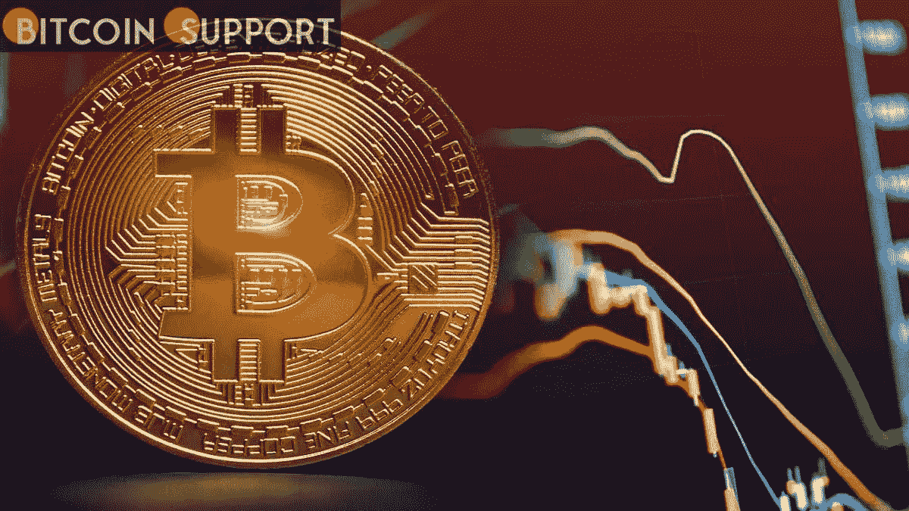

# 作为对行政决定的回应，与密码相关的股票已经上涨

> 原文：<https://medium.com/coinmonks/crypto-related-stocks-have-risen-in-response-to-the-executive-decision-2d2f38d61579?source=collection_archive---------54----------------------->

**Visit our website:-** [**https://bitcoinsupports.com/**](https://bitcoinsupports.com/)

市场张开双臂迎接乔·拜登的行政命令，导致加密和区块链相关公司的价格上涨。随着更广泛的市场对乔·拜登总统期待已久的行政命令做出积极反应，加密相关公司的股价上涨，该行政命令要求美国联邦机构制定数字资产的监管框架，并调查未来数字货币的可能性。

据 TradingView 报道，比特币基地(COIN)收盘时上涨 10.5%，而比特币倡导者迈克尔·塞勒(Michael Saylor)的微策略(MSTR)股价上涨 6.4%。

ProShares 比特币策略 ETF (BITO)和瓦尔基里比特币策略 ETF (BTF)都受益于市场对加密的信心增强，ProShares 比特币策略 ETF (BITO)上涨 10%，瓦尔基里比特币策略 ETF (BTF)收盘上涨 10.3%。Riot Blockchain Inc. (RIOT)上涨 11.2%，Marathon Digital Holdings Inc .(MARA)上涨 13.5%，据报道，Jefferies (JEF)分析师 Jonathan Peterson 在给客户的一份报告中恢复了对 MARA 的买入评级，称加密矿工很可能受益于美国政府“更正式地承认、参与和似乎支持”数字资产行业。

虽然 10%的波动在加密货币中很常见，但在传统市场中却是异常剧烈的波动。尽管在最后一天有所上涨，但比特币基地仍比去年 4 月的最初上市价格下跌了约 48%，而 RIOT 更糟糕，比 2021 年 2 月的最近峰值下跌了 76%。昨晚总统令的事实出现后，比特币(BTC)飙升 9%，随后稳定在当前 5%的涨幅。除了立即有利的价格变动之外，大多数投资者认为，这项行政命令即使没有给加密业务带来净利好，至少也没有预期的那么糟糕。“这是一个加强美国在全球金融体系和技术前沿的领导地位的机会，”拜登总统在谈到数字资产的崛起时说。

尽管该行政命令没有具体说明应该采取什么样的监管行动，但美国联邦政府的总体基调似乎是积极的，这意味着该行政命令可能有助于增加虚拟货币在美国金融体系中的使用。财政部长珍妮特·耶伦在一份声明中对此表示支持，称该措施将帮助消费者和公司。根据耶伦的说法，拜登总统前所未有的行政命令“呼吁对数字资产政策采取协调和全面的方法。”“这一战略将鼓励负责任的创新，这有可能使国家、消费者和企业受益。”明尼苏达州国会议员汤姆·艾默(Tom Emmer)对该行政命令忽略的领域进行了出色的评估，警告他的 48000 名推特粉丝，他们没有理由指望美国政府支持开放、无许可或私有技术的政策。

[https://twitter.com/RepTomEmmer/status/1501738110127857667](https://twitter.com/RepTomEmmer/status/1501738110127857667)

他继续说，这项行政命令最有希望的一点是，它“不寻求证券交易委员会的意见。SEC 主席 Gensler 通过公开声明和执法行动进行无效的监管，去年他一直在恐吓加密创新者和企业。他的意见不重要。”不管怎样，Gensler 在推特上发表了他对拜登监管努力的支持。鉴于 https://twitter.com/GaryGensler/status/1501513124091871235 频繁表达对数字资产业务的怀疑，他的言论在推特上遭到了比特币世界中一些人的批评。

Messario Crypto 的首席执行官瑞安·塞尔基斯(Ryan Selkis)将矛头对准了 Gensler，称 Gensler 的意图与投资者安全无关。

[https://twitter.com/twobitidiot/status/1501522415813378051](https://twitter.com/twobitidiot/status/1501522415813378051)

尽管东欧地缘政治局势持续紧张，但整个股市周三攀升，标准普尔 500 指数上涨 2.5%。

**访问我们的网站:-**[**https://bitcoinsupports.com/**](https://bitcoinsupports.com/)

**免责声明:以上为作者观点，不应视为投资建议。读者应该自己做研究。**