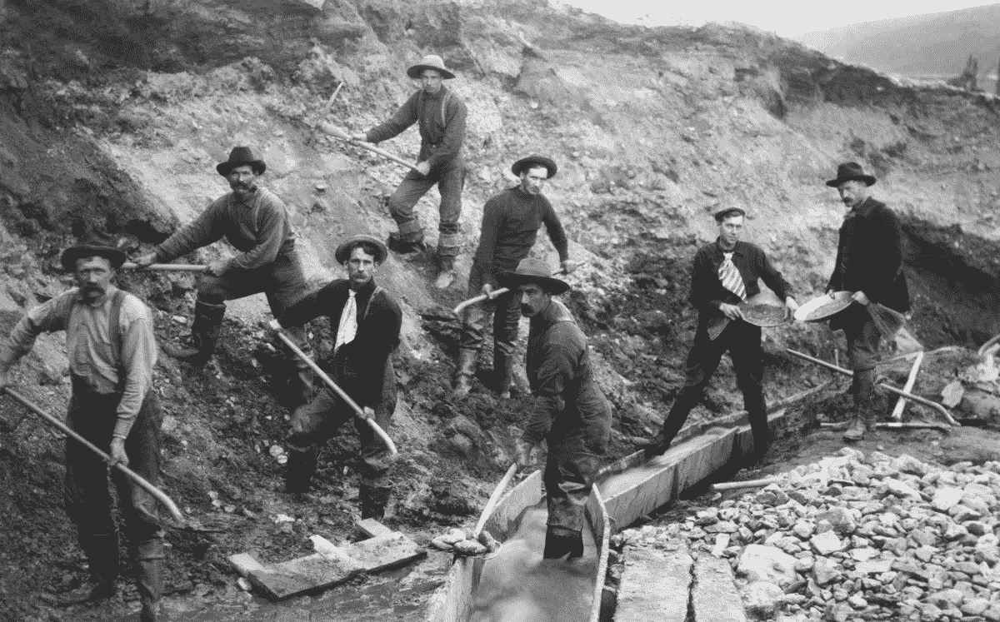
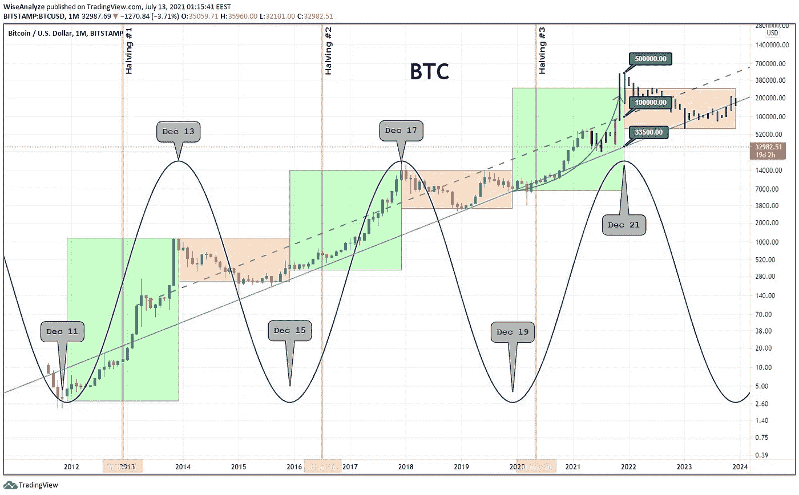
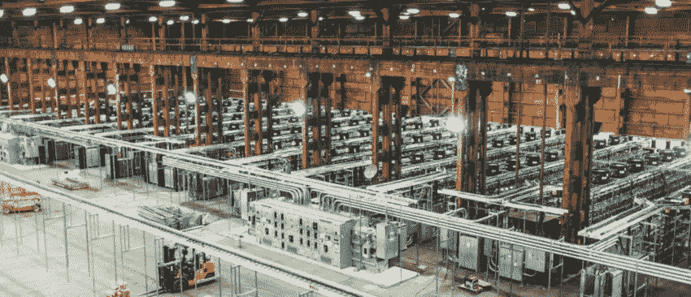
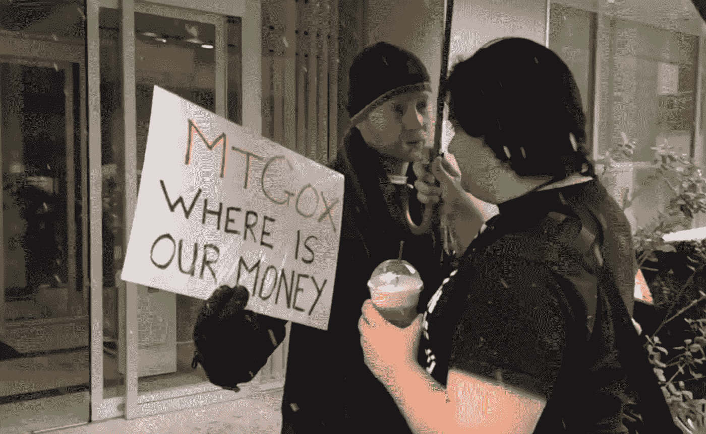
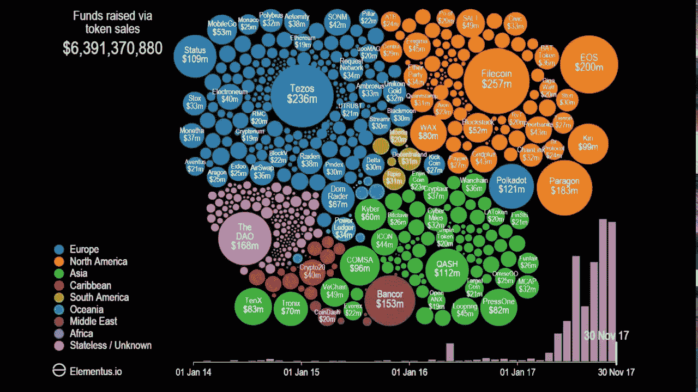
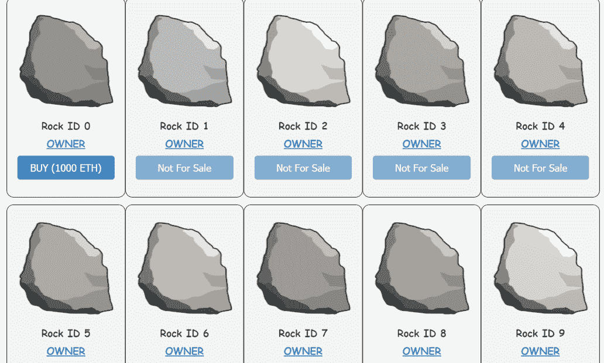
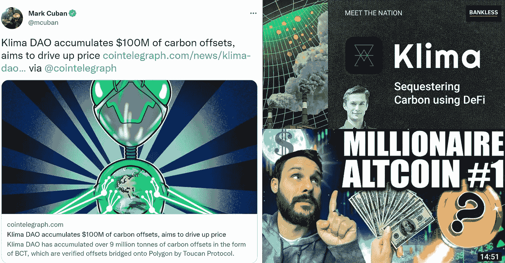

# 密码快攻

> 原文：<https://medium.com/coinmonks/crypto-rush-51cba8a90932?source=collection_archive---------50----------------------->

淘金热。很可能你们都听说过。如果你是少数不知道它是关于什么的人之一，帮你自己一个忙，把你的平板电脑放在抖音金融顾问那里，在这里查看一下。

# **淘金热**

我不是历史、金融或心理学方面的专家。但是让我们来看看什么是淘金热。我们可以把它定义为勘探者进入金矿领域的大规模运动。它总是被贪婪的人群和轻松赚钱(快速致富)的愿景所驱动。尽管事实证明这对绝大多数挖掘者来说是无利可图的，只有少数人能够改变命运。

Klondike Gold Rush. How many of them made great fortune? [Source](https://www.history.com/.image/t_share/MTU3ODc5MDg3NTA3NTE0Njk3/miners-pan-and-dig-for-gold-in-alaska-2.jpg)

当然，与黄金相关的业务产生了疯狂的利润。他们大多通过传播成功的故事和宣传任何人都可以轻松获得来支持这种热潮。正如开始所说，它引发了移民，创造了新的定居点，导致了一些个人悲剧，但也带来了这些地区的经济繁荣。

公平地说，这不仅仅与黄金有关。其他贵金属、钻石或任何当时有价值的东西以前也发生过这种情况。这种情况一次又一次地发生。有趣的是，我们可以观察它是如何循环发生的。只是为了挑选一些数据，让我们看看在北美的淘金热(尽管它发生在任何地方)。我们可以观察到波浪:

*   1800 年在北卡罗来纳州
*   19 世纪 30 年代在乔治亚州
*   19 世纪 40 年代在内华达山脉的加利福尼亚，
*   19 世纪 60 年代在新斯科舍
*   19 世纪 90 年代在育空地区的克朗代克。

**失败者**

*   大多数潜在客户

**获胜者**

*   商人，
*   银行，
*   当地商店，
*   交通设施，
*   一些前景

> “历史不会重演，但它经常押韵。"
> 
> *——马克·吐温*

# **加密加急**

现在，让我们快进到现在。让我们连接一些链接，检查我们是否从过去得到了教训。简而言之，没有。

比特币发行时，加密货币并不是一个新想法。事实上，许多人试图实现同样的目标，但只有比特币提出了双重支出问题的解决方案，我们可以看到第一种具有分散属性的货币。这需要时间，但主要是在 It 极客和书呆子的推动下，它开始得到更多的关注。而关注多了，当然价值就上去了。

Crypto market cycles. Some tries to relate it to Bitcoin halving event. [Source](https://www.newsbtc.com/wp-content/uploads/2021/07/E6IP7cjWUAczCN3-1.jpg)

比特币的核心是挖矿。听起来很熟悉？采矿保护网络，用新创造的硬币奖励矿工(加上交易的费用，但现在已经不重要了)。奖励。奖励是让更多人参与比特币和加密的导火索。

随着时间的推移，在个人笔记本电脑上进行挖掘变得越来越困难。第一批人被创造出来，并把他们的力量结合在一起，以增加从采矿中获得奖励的机会。只有一个人能赢。

## 第一波

我们可以将此视为第一波。由人们开始，他们提出了革命性的技术和分散的支付系统，然后更多的人参与到寻找有趣的互联网硬币中(喜欢或讨厌它，但它是价值增长的原因之一——需求)。

Bitcoin mining farm. [Source](https://www.researchgate.net/figure/Bitcoin-Mining-Farm-58_fig5_324798440)

**失败者**

*   售价较低的矿工会消耗能源

**获奖者**

*   密码交换，
*   为客户购买/出售密码的第三方服务，
*   采矿硬件生产商，
*   长期投资者

## 第二波

随着比特币的成功，一些人决定放弃原始源代码，修改一些参数，在自己的链上发行自己的比特币。这引起了一些人的注意，并迅速成为 Litecoin 或后来的 Dogecoin。较小的社区有机会获得更多奖励，并对下一个比特币充满希望。

MTGOX, one of the first major hacks.

**失败者**

*   选择了错误克隆的投资者
*   将资金留在遭黑客攻击的交易所的投资者

**获胜者**

*   密码交换

## 第三波

以太坊于 2014 年推出。智能合约平台，世界计算机。可能没有多少人能想象它将来会发展成什么样子。ICOs 从 2017 年开始疯狂代币抢购。人们投资的想法大多只写在纸上(白皮书),推动加密市场达到新高。连同 ico，比特币叉子和 masternode 币的价格被逼到了疯狂的地步。

ICOs raised millions in 2017\. Many projects turned out to be vaporware or exit scams. [Source](https://www.businessinsider.com/animation-shows-the-explosion-in-ico-funding-over-the-last-four-years-2017-12)

**失败者**

*   大多数长期投资者投资于:ICOs 和 forks

**获奖者**

*   密码交换，
*   推广 ICO 骗局的影响者，
*   可疑的开发团队

## 第四波

随着以太坊生态系统的发展，我们被引入了去中心化金融和金融产品应用的世界，没有任何限制(嗯，不完全是，但那是另一篇文章)。

除了流动性挖掘和空投，我们还看到了对治理令牌的另一次令牌热潮。人们被社交媒体上的(高薪)有影响力的人所说服(与 ICOs 期间的方式类似)，但这次主要是通过已经部署的项目。这比仅仅写在纸上的想法有了进步。新的故事和代币周围的证券气味让许多人进入了红色号码。

How to keep people buying failing projects? Sell dreams.

**失败者**

*   治理令牌的投资者
*   福克斯的投资者

**获奖者**

*   密码交换，
*   有影响力的人，
*   血管收缩剂

## NFT 波

随着治理令牌的成功，对“alpha”的新搜索开始了。有推动社会代币，但这种叙事并不成功。引起注意的是非功能性测试。尤其是当国际名人开始参与进来的时候。突然，我们看到了对 NFTs 和数字艺术的追逐。它得到了“玩到赚”游戏理念的支持，这可能会像大多数 ico 一样结束，因为最近炒作降温了。

NFTs. Digital ownership or overhyped toy?

**失败者**

*   大多数 NFT 投资者，
*   社会代币投资者

**获奖者**

*   密码交换，
*   有影响力的人，
*   几个 NFT 艺术家
*   可疑项目，退出骗局

## 基础波

随着叙述的变化，节目仍在继续。我们看到了算法币，它遵循了 masternode 币的命运。很多分叉，很多承诺和大失败。高收益的被动收入的愿景总是具有吸引力。我们在任何地方都能看到它，不仅仅是在 crypto 中。结局总是一样的。

Rebasing tokens got a lot of attention.

**失败者**

*   长期投资者

**获奖者**

*   早期投资者卖出获利，
*   可疑的开发团队，
*   影响者

## 结论

这场游戏有明显的赢家，就像淘金热一样。提供付费服务的企业与这股热潮有关。它可以是交易所、支付服务提供商，或者是向你兜售某种代币有影响力的人。他们有共同的利益让你投资生态系统，并让你这样做。

不要期望加密空间与真实世界不同。人们可以诈骗，欺骗，玩。贪婪和天真通常是导致我们迷失的原因。下次我们可能会更小心。请记住:你的决定=你的责任。

> 加入 Coinmonks [电报频道](https://t.me/coincodecap)和 [Youtube 频道](https://www.youtube.com/c/coinmonks/videos)了解加密交易和投资

# 另外，阅读

*   [如何匿名购买比特币](https://coincodecap.com/buy-bitcoin-anonymously) | [比特币现金钱包](https://coincodecap.com/bitcoin-cash-wallets)
*   [币安 vs FTX](https://coincodecap.com/binance-vs-ftx) | [最佳(SOL)索拉纳钱包](https://coincodecap.com/solana-wallets)
*   [比诺莫评论](https://coincodecap.com/binomo-review) | [斯多葛派 vs 3Commas vs TradeSanta](https://coincodecap.com/stoic-vs-3commas-vs-tradesanta)
*   [Capital.com 评论](https://coincodecap.com/capital-com-review) | [香港的加密借贷平台](https://coincodecap.com/crypto-lending-hong-kong)
*   [如何在 Uniswap 上交换加密？](https://coincodecap.com/swap-crypto-on-uniswap) | [A-Ads 评论](https://coincodecap.com/a-ads-review)