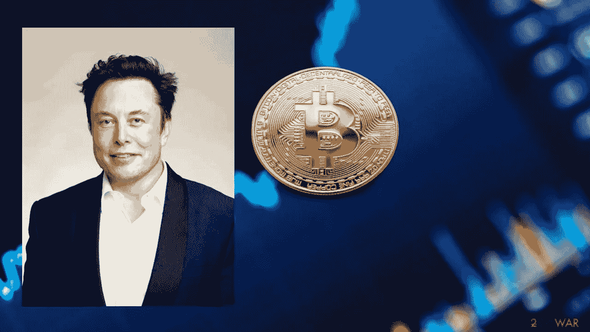

# 加密骗子制作了一段埃隆·马斯克的 TED 演讲的深度假视频，来捕食不知情的社交媒体用户。

> 原文：<https://medium.com/coinmonks/crypto-scammers-produce-a-deep-fake-video-of-elon-musks-ted-talks-to-prey-on-unwitting-social-fd584775f18c?source=collection_archive---------42----------------------->

Deepfakes 比比皆是！加密骗子制作了一段埃隆·马斯克的 TED 演讲的深度假视频，来捕食不知情的社交媒体用户。

特斯拉首席执行官埃隆·马斯克(Elon Musk)与另一个宣传加密货币骗局的捏造视频保持距离。

最初在 Twitter 上分享的视频是马斯克的一个深度伪造，据称是为了推广一个号称加密存款回报率为 30%的加密货币平台。骗子们利用了马斯克和策展人克里斯·安德森在今年 4 月温哥华 TED 大会上的 TED 演讲的原始片段。

这条推文和视频引起了马斯克本人的注意，自他以估计 440 亿美元收购社交媒体平台以来，他越来越活跃。这位特斯拉首席执行官兼 SpaceEx 创始人以他标志性的滑稽风格回复了视频:埃隆·马斯克

马斯克作为技术先驱的全球声誉使他成为骗子的选择目标，他们希望利用不知情的社交媒体用户和投资者。不太懂技术的用户有被宣传不切实际的投资回报的骗局欺骗的风险。

这种性质的加密货币骗局在 2020 年和 2021 年盛行，美国美国联邦贸易委员会(FTC)发布的一份报告估计，超过 8000 万美元的加密货币在六个月内从不知情的受害者手中被盗。

鉴于马斯克对加密货币领域的亲和力及其亲 Dogecoin 的倾向，欺诈性的 YouTube 直播流成为了一种首选武器。马斯克现在在美国电视节目《周六夜现场》中的著名亮相被证明是骗子的摇钱树，联邦贸易委员会放大了去年 5 月收到约 970 万只价值 500 万美元的狗币的诈骗地址。

马斯克收购 Twitter 的举动伴随着在该平台上促进言论自由的承诺，而这位特斯拉首席执行官在今年早些时候的 Ted talk 上也发誓要淘汰数量惊人的垃圾邮件和诈骗机器人，这些机器人近年来已经诈骗了数百万用户:

“我的首要任务是消除 Twitter 上的垃圾邮件和诈骗机器人以及机器人大军。他们使产品变得更糟。如果我看到的每一个加密骗局都有一个金币，我们就会有 1000 亿个金币。”

正如 Cointelegraph 之前所探索的那样，自 2017 年该术语被创造出来以来，深度虚假视频一直很普遍。创作者利用人工智能和计算机生成的图像、视频和音频，试图通过媒体操纵、欺骗或诈骗观众，这些媒体往往如此真实，以至于很难从小说中辨别出真相。

区块链技术被吹捧为打击深度造假和假新闻的潜在工具。但现实是，社交媒体平台仍然充斥着欺诈性媒体。

> 加入 Coinmonks [电报频道](https://t.me/coincodecap)和 [Youtube 频道](https://www.youtube.com/c/coinmonks/videos)了解加密交易和投资

# 另外，阅读

*   [Bookmap 点评](https://coincodecap.com/bookmap-review-2021-best-trading-software) | [美国 5 大最佳加密交易所](https://coincodecap.com/crypto-exchange-usa)
*   最佳加密[硬件钱包](/coinmonks/hardware-wallets-dfa1211730c6) | [Bitbns 评论](/coinmonks/bitbns-review-38256a07e161)
*   [新加坡十大最佳加密交易所](https://coincodecap.com/crypto-exchange-in-singapore) | [购买 AXS](https://coincodecap.com/buy-axs-token)
*   [红狗赌场评论](https://coincodecap.com/red-dog-casino-review) | [Swyftx 评论](https://coincodecap.com/swyftx-review) | [CoinGate 评论](https://coincodecap.com/coingate-review)
*   [投资印度的最佳密码](https://coincodecap.com/best-crypto-to-invest-in-india-in-2021)|[WazirX P2P](https://coincodecap.com/wazirx-p2p)|[Hi Dollar Review](https://coincodecap.com/hi-dollar-review)
*   [加拿大最佳加密交易机器人](https://coincodecap.com/5-best-crypto-trading-bots-in-canada) | [库币评论](https://coincodecap.com/kucoin-review)
*   [用于 Huobi 的加密交易信号](https://coincodecap.com/huobi-crypto-trading-signals) | [HitBTC 审查](/coinmonks/hitbtc-review-c5143c5d53c2)