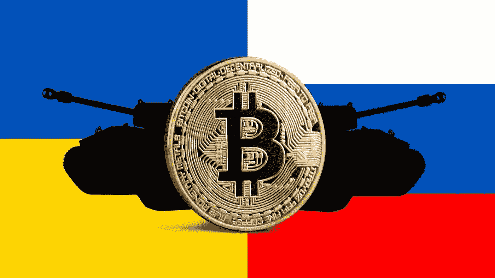

# 加密骗子利用饱受战争折磨的乌克兰人——Derev 博客

> 原文：<https://medium.com/coinmonks/crypto-scammers-take-advantage-of-war-afflicted-ukrainians-derev-blog-5a3f98da368f?source=collection_archive---------58----------------------->

# 快速拍摄:

*   诈骗者抢劫了数千名乌克兰人，因为他们试图攫取该国的一部分秘密捐款。
*   **这个国家已经筹集了超过 9 亿美元的捐款。**

俄罗斯对乌克兰的战争夺走了成千上万乌克兰人的家园、亲人甚至生命。