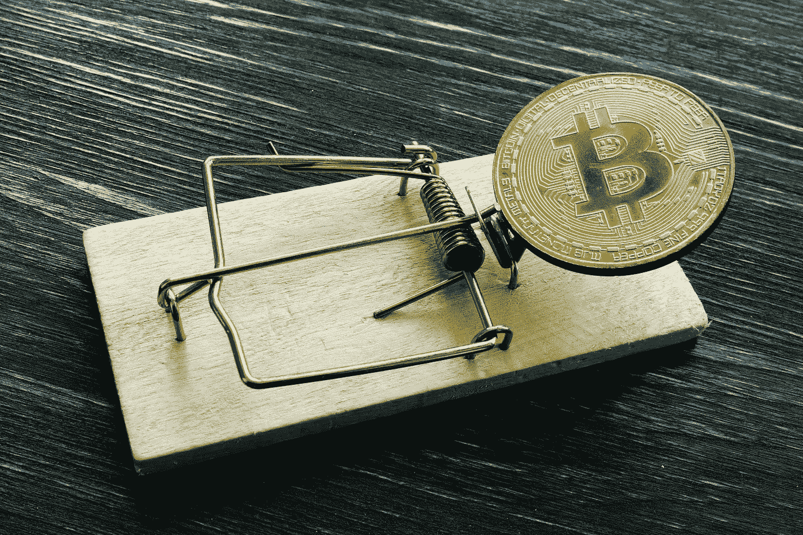

# 加密诈骗在 2021 年激增，增加了监管的必要性

> 原文：<https://medium.com/coinmonks/crypto-scams-surged-in-2021-increasing-the-need-for-regulation-126bf479d87f?source=collection_archive---------55----------------------->

Shutterstock.com

调查专员最近表示，法国四分之一的金融诈骗涉及加密技术。去中心化金融平台的兴起导致[骗子去年捕获超过 140 亿美元](https://www.cnbc.com/2022/01/11/crypto-scams-are-the-top-threat-to-investors-by-far-say-regulators.html)；预计这一趋势只会持续下去。

“北美证券监管机构的年度调查敦促投资者在购买受欢迎和波动性大的不受监管的投资之前保持谨慎，特别是那些涉及加密货币和数字资产的投资。”

根据 CoinDesk 的数据，法国四分之一的金融诈骗涉及数字货币。目前，成为这些骗局受害者的投资者几乎无能为力。法国投资者被警告说，政府不能帮助未注册的外国加密提供商的受害者，这可能是这些骗局的最重要来源。

在法国境内运营的加密提供商需要在 AMF 注册，“该机构负责检查公司治理以及是否符合反洗钱规范。”法国政府有能力帮助与注册供应商相关的诈骗受害者，这就是为什么投资者需要格外警惕未注册的供应商。

然而，考虑到数字货币目前的波动性，投资数字货币到底是不是一个好主意？比特币等货币在相对较短的时间内大幅下跌多达 50%的例子不胜枚举。另一方面，他们可以相当快地跳起来。

尽管有巨大收益的可能性，但缺乏稳定性使得它作为交易媒介对许多人来说没有吸引力。

# 美国如何监管数字货币

虽然州一级的法规还不太清楚，但是[联邦一级的法规已经变得越来越复杂。联邦政府将密码归类为“货币传输器”，而不是法定货币，是法定货币的“替代品”。](https://complyadvantage.com/insights/crypto-regulations/cryptocurrency-regulations-united-states/)

根据美国国税局的说法，加密也不是法定货币；相反，虚拟货币是“价值的数字表示，其功能是作为交换媒介、记账单位和/或价值储存手段。”

数字货币受《银行保密法》的监管。美国证券交易委员会将比特币和其他货币归类为证券。然而，商品期货交易委员会采取了一种更不干涉的方法，允许虚拟货币在公开市场上公开交易。

尽管加密货币已经受到监管，但美国财政部表示，迫切需要制定法规来打击上述骗子和欺诈者。

# 要小心的加密骗局

## 网络钓鱼

网络钓鱼可能是最常见的诈骗类型，当然不仅限于加密。网络钓鱼者试图伪装成一家声誉良好的公司，诱骗人们泄露密码或登录信息等敏感信息。在数字货币的情况下，网络钓鱼者会说服人们放弃他们的“私钥”，这可以访问他们的数字钱包。

在过去的十年里，电子邮件诈骗变得越来越复杂，这意味着更多的电子邮件看起来像真的一样。留意奇怪的、看起来不官方的电子邮件地址，确保你能识别邮件中的信息。

请注意，这种骗局不仅发生在电子邮件中。警惕 Twitter 等社交媒体平台上的随机链接。

## “杀猪”

这种骗局通常始于约会网站，在那里骗子通过在约会资料上使用有吸引力的照片来引诱脆弱的人。在获得他们的信任后不久，骗子告诉受害者他们成功使用了一种特定的加密货币。

然后，他们说服他们投资这种货币，将他们引向一个虚假网站，受害者的“投资”直接进入骗子的口袋。

在这个场景中，受害者是“猪”，而骗子是“屠夫”。名字和骗局都不好听。

## “泵送和倾倒”

这个骗局不是数字货币独有的。“抽水和转储”骗局通常发生在股票市场，主要是细价股，这些股票通常每股售价低于 5 美元。

骗子试图利用社交媒体或口头传播等多种媒体公开炒作股票。

在公众盲目地将大量资金投入股票后，骗子会抛售或出售所有股票，获得利润，而让投资者遭受损失。

## “地毯拉”

虽然“抽逃”和“拉地毯”计划相对类似，但“拉地毯”计划通常根本不允许公众投资者出售他们的股票，这意味着在骗子出售他们的股票后，他们一无所有。

相对较新的加密货币名为 Squid Game，在网飞系列游戏后受到欢迎，但不允许出售该货币。

“乌贼，硬币的代号，开始以 1 美分的价格出售，然后飙升至 90 美元以上，然后当骗子们“骚扰”大众时，立即暴跌回零。”

## 空投

尽管名为 airdropping，但在这种情况下，它与苹果设备之间无线发送文件没有任何关系。但是，功能有些相似。

“空投实际上是在你的数字钱包里投放代币，作为对在特定平台或软件上采取特定行动的奖励，”美国新闻的 John Divine 说。

一旦用户收到令牌并试图将其交换为更知名的令牌，用户给予骗子的权限可能比他们最初想象的要多。一旦骗子获得这些权限，他们几乎可以完全访问您的数字钱包。

# 结论

由于许多州政府已经或正在试图放松对加密货币的管制，在接下来的几年里，类似上述的诈骗只会越来越频繁。许多有影响力的人物，如埃隆·马斯克，在过去几年里一直在推动数字货币，但加密诈骗的突然激增使其可行性受到质疑。

> 加入 Coinmonks [电报频道](https://t.me/coincodecap)和 [Youtube 频道](https://www.youtube.com/c/coinmonks/videos)了解加密交易和投资

# 另外，阅读

*   [印度的加密交易所](/coinmonks/bitcoin-exchange-in-india-7f1fe79715c9) | [比特币储蓄账户](/coinmonks/bitcoin-savings-account-e65b13f92451)
*   [OKEx vs KuCoin](https://coincodecap.com/okex-kucoin) | [摄氏替代品](https://coincodecap.com/celsius-alternatives) | [如何购买 VeChain](https://coincodecap.com/buy-vechain)
*   [币安期货交易](https://coincodecap.com/binance-futures-trading)|[3 comas vs Mudrex vs eToro](https://coincodecap.com/mudrex-3commas-etoro)
*   [如何购买 Monero](https://coincodecap.com/buy-monero) | [IDEX 评论](https://coincodecap.com/idex-review) | [BitKan 交易机器人](https://coincodecap.com/bitkan-trading-bot)
*   [CoinDCX 评论](/coinmonks/coindcx-review-8444db3621a2) | [加密保证金交易交易所](https://coincodecap.com/crypto-margin-trading-exchanges)