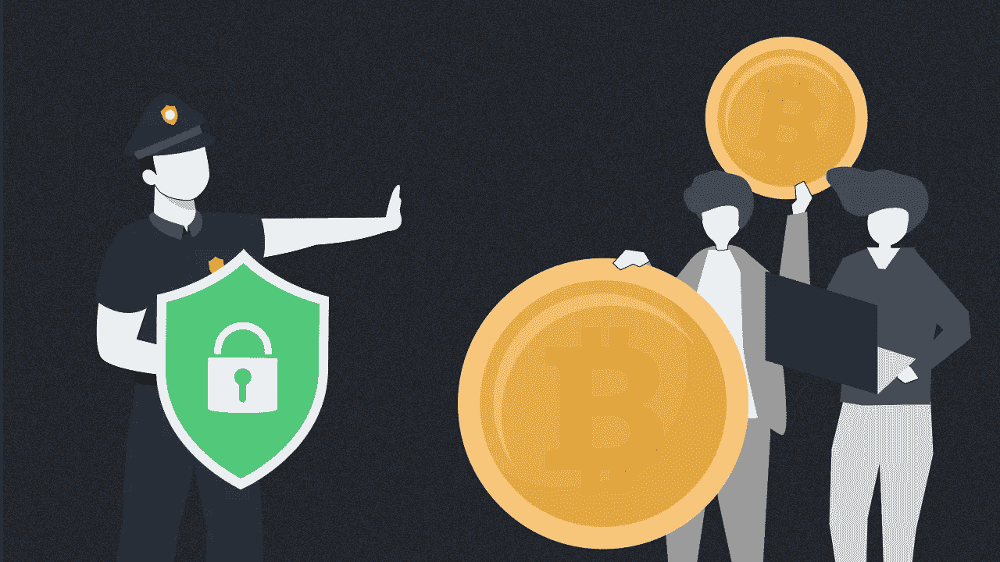
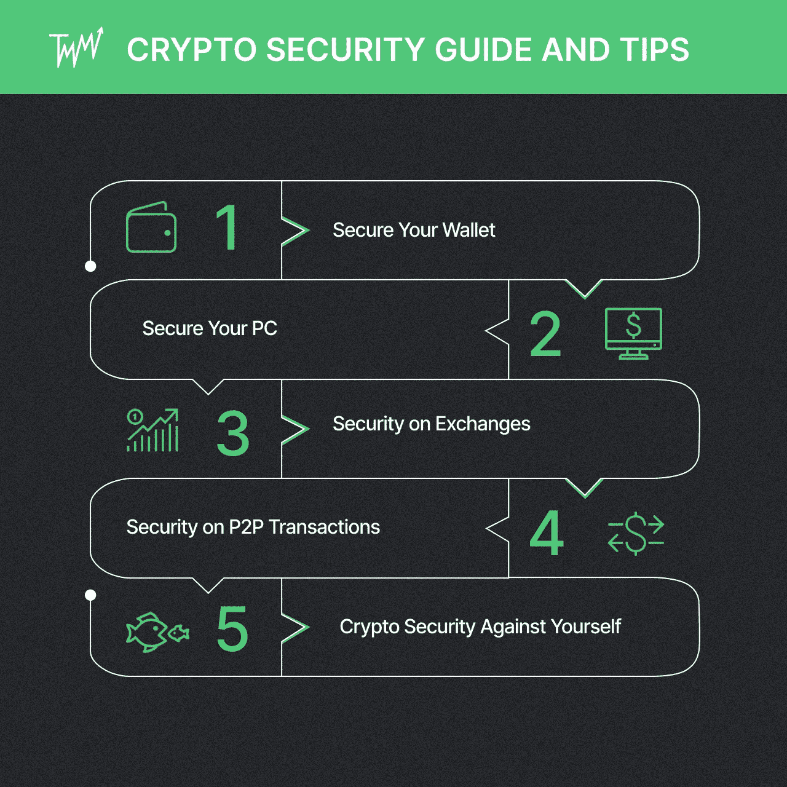

# 从 A 到 Z 的加密安全:如何保护您的加密货币免受欺诈

> 原文：<https://medium.com/coinmonks/crypto-security-from-a-to-z-how-to-secure-your-cryptocurrency-against-fraud-f34babcaeca9?source=collection_archive---------51----------------------->

[提示&招数](https://tradermake.money/blog/tag/tips-tricks/)

加密货币吸引了许多骗子和黑客。以下是如何通过采用这些加密安全标准来保护您的加密。

# 加密货币有多安全？

DeFi 炒作导致了更多的加密黑客和欺诈活动。人们变得更愿意使用不太安全的系统，因为他们害怕错过机会(FOMO)。

自 2020 年以来，加密货币盗窃增加了 516%，总计 32 亿美元的加密货币，其中 72%是通过 DeFi 协议窃取的现金。欺诈导致价值超过 78 亿美元的加密货币损失，增幅高达 82%。这些钱大部分是通过“拉地毯”计划赚来的，这是一种相当新但非常流行的加密骗局。

# 加密货币基础设施中的漏洞

当大量加密货币资产存储在交易所时，它可能会引起恶意人士的注意。如果你的账户被黑了，或者你中了一个骗局，很难取回所有被盗的加密货币。因此，用户不能完全避免失去自己的投资。

尽管加密货币的安全问题通常归咎于外部交易所，但有时基础设施也是原因之一。加密货币的基础设施存在一些漏洞和缺陷，黑客和骗子利用这些漏洞和缺陷来欺骗不明真相的加密交易员和投资者:

# I .列出相同的加密名

在分散的交易所列出相同的令牌名称是一种稍微复杂一些的窃取加密货币的方法。例如，骗子可以制作一个 ETH+令牌来欺骗不太了解加密货币交易的人。

# 二。“社会工程方法”

借助深度伪造技术，骗子可以在 Telegram 频道和 YouTube 视频中伪装成加密名人。随着名人的名气，骗子可以让密码交易员和投资者告诉他们秘密短语，这使他们能够从任何设备访问他们的账户。

在许多情况下，开发人员会建立一个钓鱼网站，并在发送交易时发出改变收件人地址的病毒。该方案从一封包含链接的电子邮件开始，该链接连接到看起来与原始邮件一模一样的钓鱼网站。

在这个经典的骗局中，用户的钱包或交易所向他们发送消息，称他们需要完成交易，登录他们的账户，或安装新的程序来保护他们的加密货币钱包的安全。

# 三。使用恶意软件/病毒

欺诈者有时会在用户向收件人发送密码之前，使用恶意软件更改收件人的钱包地址。在交易过程中，用户键入收件人的地址，但恶意软件会将其更改为骗子钱包的地址。如果寄件人在寄钱之前没有核对收件人的地址，硬币最终会落入骗子的手中。

在其他情况下，投资者会收到包含链接的电子邮件或私人信息。一旦这个按钮被点击，一个叫做“键盘记录器”的恶意软件就会被安装到电脑上。这种恶意软件可以记录密码、剪贴板历史和其他凭证。

# 您应该避免的加密安全错误

# 1.参与地毯拉花

加密地毯拉扫描非常简单。开发者制造一个假令牌，然后用它来交换有价值的密码。大多数地毯拉伴随着大量的营销和炒作，以获得投资者的钱。然后，一旦令牌创建者收集了大量有价值的密码，他们就会消失。

加密货币地毯很容易被发现，因为它会引发很多危险信号:

1.  可疑的流动资金
2.  由开发商支配的流动性
3.  价格在几小时内波动
4.  有影响力的人和升职的涌入
5.  白皮书听起来像一个销售页面
6.  恶意或复制粘贴的代码
7.  小心鲸鱼

阅读更多关于秘密拉地毯的信息:[2022 年避免卷入拉地毯的小贴士](https://tradermake.money/blog/crypto-trading-journal-review/)

没人需要知道你有多少密码。crypto 是一种数字货币，并不意味着恶意的个人不会尝试其他方式来蹭你。“暴力”可以用来提取你的私钥。有人也可以攻击并强迫你在枪口下转移你的密码。

# 3.在线存储私钥

云提供商拥有自己的服务器，为您提供与数据交互的界面。因此，他们的服务器可以关闭，你将无法获得你的私人密钥。当他们被黑了，你也会被黑。一次成功的攻击也可能一次性记录下数百万条记录，包括您的宝贵数据。

**专业提示:**在笔记本上写下你的私人密钥和种子短语，然后把笔记本放在一个安全的地方。

网络犯罪分子专门针对看起来不懂密码的不知情的交易者。Telegram 或 Discord 组的假管理员会亲自给你发消息，并自称是该组的管理员之一。在建立信任后，他们会要求您的私钥或种子短语。在某些情况下，欺诈性管理员会邀请您使用某个平台，这样他们就可以获取机密信息。

**专业提示:**如果你不认识的人给你发关于加密货币的信息，立刻屏蔽他们——不要问任何问题！

# 5.忽略多层安全特征

由于 cryptoverse 中有太多的网络威胁，金融平台应该采用多层次的安全措施。分层安全提供了一种全面的网络防御方法，而不仅仅是等待端到端的攻击。多层安全功能考虑了每种恶意软件可能注入的渠道的多样性。因此，它考虑了网络和最终用户级安全性的相关性。

换句话说，始终使用双因素身份验证和 exchange 上可用的其他加密安全层。

# 加密安全指南和提示

# 为您的钱包加密安全

新手倾向于将他们的硬币保留在他们得到它们的交易所，因此信任交易所来保持硬币的安全，放弃对他们的密码的控制。这被称为“保管钱包”，它容易出现加密货币钱包安全漏洞。

从交易所提取加密货币后，非托管钱包是保存加密货币的最佳场所。可以在手机或台式电脑上安装钱包。然而，一个[硬件钱包](https://tradermake.money/blog/how-to-get-into-crypto-trading/#:~:text=Exodus%20Wallet,to%20set%20up.)是最安全的加密货币钱包。通常，每种加密货币都需要一个专用的钱包，尽管大多数钱包都可以处理各种硬币。

# 您电脑上的加密安全性

黑客经常瞄准容易攻击的目标。许多黑客并不针对特定的个人。取而代之的是，他们建立了庞大的被入侵电脑网络。因此，您当前的计算机和网络不应该有任何可用于跟踪击键、凭证或下载其他恶意软件的计算机病毒。

**专业提示:**不要为你的重要账户使用相同的密码，比如你的银行账户、加密交易账户和 Wi-Fi 凭证。

应该将恶意软件签名添加到防病毒程序中，如 ZoneAlarm、Malwarebytes 和 AVG。定期对所有机器进行全面扫描。此外，考虑安装一个浏览器插件，阻止零日恶意软件和钓鱼网站。

# 交易所的加密安全

集中式交易所更容易受到黑客和数据泄露的攻击。对于黑客来说，要获得用户的资产、财务信息和其他潜在的破坏性数据，他们只需要通过交易所运营商的安全措施。

相比之下，分散的交易所很难被劫持。黑客必须危害每一个用户。该系统的点对点方式很少或没有渗透或操纵的可能性。另一方面，开发商可以很容易地在分散的交易所上市 shitcoins，这使得拉地毯骗局变得更容易。

**专业提示:**通过在[著名的加密交易所](https://tradermake.money/blog/how-to-get-into-crypto-trading/#:~:text=1.-,open%20an%20account%20in%20an%20exchange,-Choosing%20an%20exchange)开设账户来分散你的失败点。通过这样做，您可以避免在加密交换发生故障或受到攻击时陷入瘫痪。

# P2P 交易中的密码安全

点对点交易受到各种漏洞的困扰。P2P 交易的匿名性和分散性是大多数问题的主要原因。P2P 网络容易受到许多安全风险的攻击，例如更改您地址的恶意软件、接管您剪贴板的软件以及 P2P 诈骗。

虽然计算机卫生可以轻松解决与软件相关的问题，但 P2P 骗子有时太狡猾了。幸运的是，一些加密交易所为他们的 P2P 交易提供了安全保障，比如币安、 [Bybit](https://tradermake.money/blog/what-is-bybit/) 和 Gemini。因此，将你的业务限制在声誉良好的交易所比从社交媒体团体中寻找更安全。

尽管如此，您的 P2P 交易的加密安全仍掌握在您手中。因此，你应该避免向任何你不认识或不信任的人转移或索要金钱。

# 加密安全对你自己

对于初学者来说，屈服于 FOMO(害怕错过)和 FUD(害怕、不确定和怀疑)是很常见的。在开始你的密码交易生涯时，总是要控制你的情绪。以下是如何做到这一点的一些建议:

在制定加密货币的交易策略时，交易者不应该仅仅依靠技术分析来赚钱。你还需要熟悉项目的词汇学、效用和其他宏观指标，以及创建者和团队。请记住，每种加密货币都需要基本面和技术面的特殊组合。

> 阅读这篇文章中关于基本面分析的更多内容:[逐步指南:如何正确地进入加密交易](https://tradermake.money/blog/how-to-get-into-crypto-trading/)
> 
> 阅读更多关于技术分析的内容:[加密交易的 7 个最佳指标](https://tradermake.money/blog/best-indicators-for-crypto-trading/)

**2。风险管理** **—配比头寸规模**

合理分配你的头寸规模是风险管理的一个关键因素。如果你不知道如何合理分配你的头寸，你可能会为你的账户做太多大额交易。因此，当市场对你不利时，即使只有几个点，你也会变得脆弱。

> 阅读更多配比仓位大小:[熊市交易策略:如何在熊市中保本获利](https://tradermake.money/blog/bear-market-trading-strategy/)

**-止损&止盈**

*   **止损**是当价格跌破预定水平时终止未平仓合约的执行指令。止损保护你不在失败的交易中亏损。
*   **止盈**是一个可编程的订单，当价格达到指定的阈值时，它会平仓。止盈允许你在市场对你不利之前退出交易。

**-风险/回报比率**

风险/回报比率衡量的是与可能的回报成比例的风险大小。交易风险越大，利润可能就越丰厚。要决定什么时候加入和退出一个交易，你必须了解风险/回报比。您可以使用以下公式计算风险/回报比率:

**风险/回报比=(目标价格-进场价格)/(进场价格-止损)**

> 阅读更多关于风险管理的内容:[风险管理或如何在亏损时交易并赚钱](https://tradermake.money/blog/risk-management/)

**3。使用加密交易日志**

当你写交易日记时，你记录了所有的交易和任何影响你行为的想法或情绪。如果你不使用加密图表工具，加密技术分析，或者至少是一个免费的加密交易日志，加密交易就变成了一个碰运气的游戏。

> 阅读更多关于使用加密交易日志的内容:[加密交易日志回顾:CMM 与 TMM](https://tradermake.money/blog/crypto-trading-journal-review/)

# 结论

加密货币越来越受欢迎，许多不道德的行为者试图利用加密基础设施和人类漏洞的安全问题。

外面的世界很危险。需要做大量的尽职调查。通过坚持严格的网络安全加密货币标准，您可以在钱包中拥有安全的加密货币，保护自己免受骗子的攻击，并避免损失。

*原载于 2022 年 6 月 17 日*[*https://trader make . money*](https://tradermake.money/blog/beginners-guide-to-crypto-security/)*。*

> 加入 Coinmonks [电报频道](https://t.me/coincodecap)和 [Youtube 频道](https://www.youtube.com/c/coinmonks/videos)了解加密交易和投资

# 另外，阅读

*   [WazirX vs coin dcx vs bit bns](/coinmonks/wazirx-vs-coindcx-vs-bitbns-149f4f19a2f1)|[block fi vs coin loan vs Nexo](/coinmonks/blockfi-vs-coinloan-vs-nexo-cb624635230d)
*   [本地比特币评论](/coinmonks/localbitcoins-review-6cc001c6ed56) | [加密货币储蓄账户](https://coincodecap.com/cryptocurrency-savings-accounts)
*   [什么是融资融券交易](https://coincodecap.com/margin-trading) | [成本平均法](https://coincodecap.com/dca)
*   [支持卡审核](https://coincodecap.com/uphold-card-review) | [信任钱包 vs 元掩码](https://coincodecap.com/trust-wallet-vs-metamask)
*   [Exness 点评](https://coincodecap.com/exness-review)|[moon xbt Vs bit get Vs Bingbon](https://coincodecap.com/bingbon-vs-bitget-vs-moonxbt)
*   [如何开始通过加密贷款赚取被动收入](https://coincodecap.com/passive-income-crypto-lending)