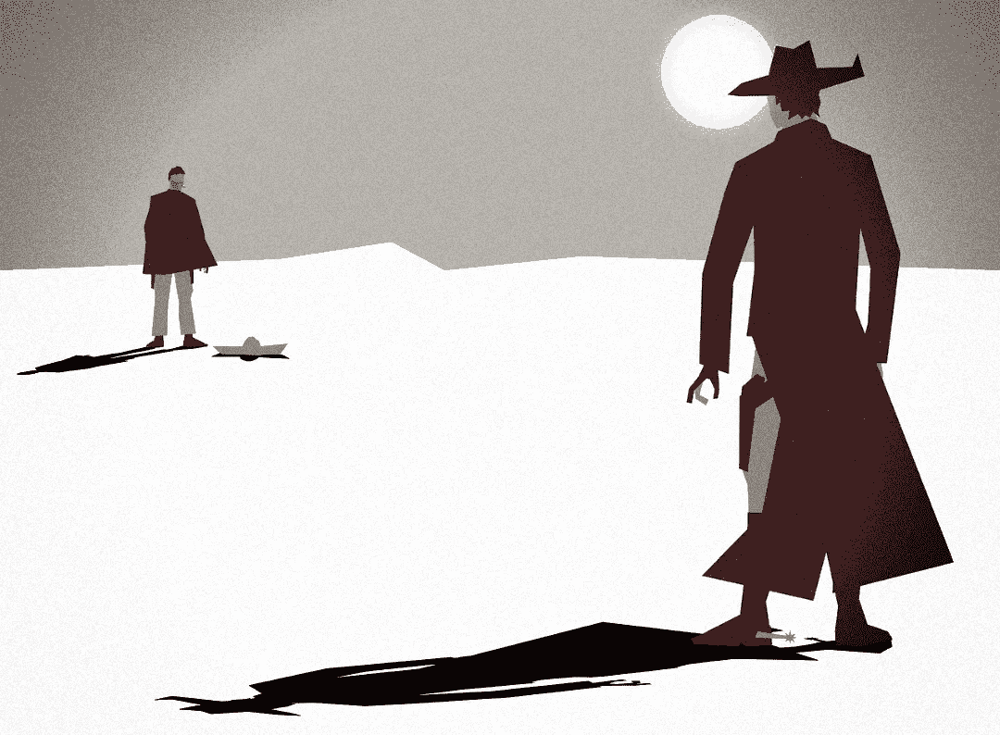

# 加密枪战:Q2 硬币，我正在用枪射击

> 原文：<https://medium.com/coinmonks/crypto-shoot-out-q2-coins-im-going-after-with-guns-blazing-3ede1d851fe4?source=collection_archive---------11----------------------->

到目前为止，2022 年是 crypto 疯狂的一年。我开始的时候有五个霍德勒，我以为我会留着，但是事情已经发生了变化。

Image: PixTeller

> 我认为精明投资的目标应该是寻找回报高于平均水平、同时又足够安全的机会——本杰明·格拉哈姆

# 2022 年才四个月？！

在快速发展的密码世界中，四个月感觉像是四年。我从 [2022](/coinmonks/five-crypto-assets-im-betting-big-on-in-2022-83893a5ecdf0) 出发，在声纳(PING)、近距离协议、Terra (LUNA)、Polygon (MATIC)和币安(BNB)采取了自信的立场。我包里只剩下平了。

什么变了？几乎所有的东西。

1.  **平依然是我的长 hodlr:** 我[几周前写过关于](/coinmonks/crypto-hidden-gems-sonar-ping-my-unicorn-play-cf77a3b221af)令牌的事。在焰火开始之前，完全符合 MiCA 是开发人员的首要任务。从 2021 年 10 月我第一次买的时候就开始了。即使有 DCA，我的包也比平均购买价格低。不过，我从不担心。耐心。
2.  我的两个大侄子现在都是年轻人了。我把我最近的财产一分为二，给了他们。人们一致押注于 12%的可观回报率。现在他们有东西可以学习/成长/修补了。我一直在想象他们会模仿一些对我来说毫无意义的东西，最终赚一大笔钱。
3.  Terra LUNA: 在 57 美元买入 12 月份的下跌。分别在 46 美元和 49 美元买入二月份的下跌。上周以 94 美元卖掉了我的包。我从不抱怨赚钱，但我显然卖得太快了。
4.  **Polygon (MATIC):** 我用了几周的链子。糟透了。我买了《纸上基本面》的 MATIC。使用链条给我上了宝贵的一课。买之前先试试。以 1.55 美元买入土人，以 1.71 美元卖出。以 2.02 美元的价格买入非本地人(比特币基地)，以 1.65 美元的价格卖出，成为一只狒狒。
5.  BNB:我好像不能把它放在钱包里。我本来打算买下它，然后[星球金融 AQUA](/coinmonks/defi-gems-planet-finance-7c6a81649cbe) 进行了一次 89 美元的大减价。我所有的 BNB 在 89 到 94 美元之间变成了水绿色。现在阿卡和 BNB 几乎是 1:1。

# Q1 晚期的新剧

我本质上是一个基本面分析的人。据我所知，人们经常通过模仿我认为完全荒谬的东西赚很多钱。我错过了很多船，因为我的基本面大脑不让我看到狒狒的价值。

但是不要查基础这个词。不是拍马屁。

无论如何，聪明的孩子从小到大做加密狗屎得到狒狒价值的权利。我不知道。但当我的基本大脑看到它喜欢的东西时，我就会购买。这是清单:

## **星际之门**

这是 OMFG 现在必须给我买的。在星际之门之前，我要么通过 CEX 跨链移动，要么试图为虫洞资产寻找流动市场。然后纳伊纳在[上提到了星际之门](https://www.cryptobanter.com/)。

我查过了。

我用过了。

我真的大声说了五次“我靠”。

然后我尽可能多的买了 STG。

我花了 3.20 美元买的。偷钱包以 3.60 美元购买。在 2.60 美元买入。动用存款以 2.70 美元的价格购买。我可能会在发薪日之前去买更多的沙发。如果到那时价格还不算太低，我可能会买更多。

总的来说，Ran 和 Crypto Banter 的人都是交易员。我是个有价值的人。冉在上周四的节目中表示，他将等到 STG 低于 2 美元时再买入。作为一个重视价值的人，我不知道这个价格是否会回来。

为了冉(也为了我！)，希望如此。我会把 STG 打得屁滚尿流。但我很确定那艘船现在已经在银河系的另一边了。不要相信我的话。就试一次星际之门。

然后告诉我拥有 STG 是一个糟糕的游戏。

## FXS/FRAX

我见过的最好的杂交马厩。上周做了一个[回顾](/coinmonks/frax-revolutionary-stablecoin-or-just-another-algo-3693c86f3eae)。以 18.12 美元买入 FXS。对我来说肯定很长。开发者绝对是超级大脑。我有没有提到行星金融公司 20%的 FRAX 贷款年利率？这是一个 keepr，tyvm。

## 2 份& 3omb

刚刚也写了这个。我[记录了](/coinmonks/defi-101-how-to-make-money-by-not-being-a-baboon-7763ab69746f)他们的 peg 崩溃[从](/coinmonks/tomb-zorks-from-defi-degen-to-defi-shark-12ddf66075c6)他们的骨灰中获利。现在救赎即将来临，我想他们可能会有一些很酷的东西。

就像我说的，我是个有价值的人。2 | 3omb 全部是 ponzinomics。[2 | 3 MB+赎回](/coinmonks/is-2-3omb-the-rocky-balboa-of-defi-e8fa652a26eb)则是另外一个故事。结果可能是更多的烟雾，但我不认为这一次。我不太了解他们在幕后做什么，无法做出明智的决定。

我只是相信我的直觉。

不过他们得到了莫邪，我认为 2 | 3omb 将会让所有人大吃一惊。谁知道呢？也许我终于能拿回我的 3 英镑债券了。

## 幽灵

我认为 Fantom 的价格可能会陷入坟墓泥中。或者它仍然可能只是挥之不去的克罗吉 FUD。也许两者都有，或者完全是别的什么。

无论如何，链条是一种享受。我肯定会继续叠这个。如果没有别的事，我总是可以达成共识，让小 ftm 滚滚而来。

## Axelar

我没有参加预售。如果 Uniswap 的发射遵循星际之门的路线，并且在最初的几个小时里保持相对便宜，我将会在这上面投入相当大的一部分 ETH。

5 月 11 日。我设置了闹钟。我担心的是它会从门外掉下来。如果是这样，我将不得不等待，并希望预售人倾倒。对我来说好消息是，我从来没有听到或看到有关它的窥视。

但是如果它像我想的那样工作，它也可能会在我的 STG 包里放屁。

## 好的，坏的和丑陋的

我的包最近就是这样。我仍然修补其他东西，但数量不多。AVAX 肯定是小股东的最爱。瑞士联邦理工学院和 BTC 只是坐在那里被瑞士联邦理工学院和 BTC。

但是我的 Q2 枪战的明显赢家必须去 STG。我觉得 FTM 是最弱的打法，尽管它是列表中最可靠的打法。就…而言，我似乎从不担心我会错过一个便宜的入口。当然，这些话可能会回来困扰我，因为我为 STG 抛弃了一些 FTM。

Axelar 还没在包里。如果我能得到一个合适的价位，这可能是我今年最大的一笔买卖。想想区块链的 TCP/IP 和为其服务的单点 API。“游戏规则改变者”被过度使用，而且完全低估了 Axelar 的潜力。

我最支持的是我的 2Share，3mb，3bond 游戏。他们还有一场漫长的战斗，他们的腿被击中了。但是他们现在躲起来了，他们可能会幸运地被击中。

当然，这些只是我 ***的观点*。**我不是财务顾问，这不是财务建议，而且总是 [DYOR](/coinmonks/crypto-investing-how-to-dyor-1e6dabdb1de9) 。遵循这些想法中的任何一个都可能会让你失去所有的钱。我对此 100%认真。我喜欢摆弄这些东西，但我公开表现得像个彻头彻尾的狒狒。相应投资。

直到下一次，安全，聪明，一定要[绑骆驼](https://www.oxfordreference.com/view/10.1093/acref/9780199539536.001.0001/acref-9780199539536-e-2318)。

> 加入 Coinmonks [电报频道](https://t.me/coincodecap)和 [Youtube 频道](https://www.youtube.com/c/coinmonks/videos)了解加密交易和投资

# 另外，阅读

*   [如何在印度购买比特币？](/coinmonks/buy-bitcoin-in-india-feb50ddfef94) | [瓦济克斯审查](/coinmonks/wazirx-review-5c811b074f5b)
*   [隐翅虫替代品](/coinmonks/cryptohopper-alternatives-d67287b16d27) | [HitBTC 审查](/coinmonks/hitbtc-review-c5143c5d53c2)
*   [CBET 点评](https://coincodecap.com/cbet-casino-review) | [库币 vs 比特币基地](https://coincodecap.com/kucoin-vs-coinbase)
*   [折叠 App 审核](https://coincodecap.com/fold-app-review) | [Kucoin 交易机器人](/coinmonks/kucoin-trading-bot-automate-your-trades-8cf0ca2138e0) | [Probit 审核](https://coincodecap.com/probit-review)
*   [如何匿名购买比特币](https://coincodecap.com/buy-bitcoin-anonymously) | [比特币现金钱包](https://coincodecap.com/bitcoin-cash-wallets)