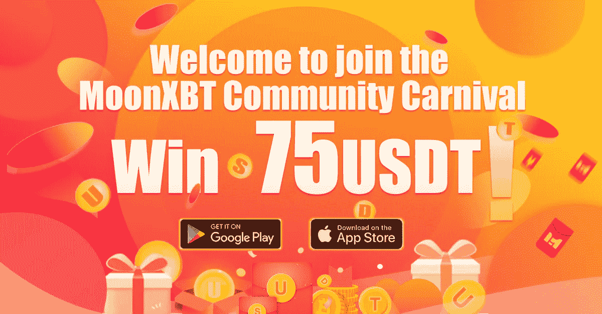

# 加密社交交易平台 MoonXBT 获得交易者的大力支持

> 原文：<https://medium.com/coinmonks/crypto-social-trading-exchange-moonxbt-gains-groundswell-support-among-traders-4088e294f64?source=collection_archive---------36----------------------->

对于大多数人来说，加密货币交易可能不是一个新概念。对于许多也想分一杯羹的旁观者来说，他们可以从类似 [**MoonXBT**](https://coincodecap.com/go/moonxbt) 这样的社交交易平台开始，这是一个对新手友好的交易平台。

作为一家成立于 2021 年 5 月的年轻交易所，MoonXBT 凭借其社交交易和副本交易新功能在全球市场上蓬勃发展。MoonXBT 的[首席运营官乔治·李说，“MoonXBT 不仅在名称上，而且在实质上把自己呈现为一个社交交易平台。”他认为互联性可以用来推动创新和创造力。](https://twitter.com/george_moonxbt)

为了达到这个目标，MoonXBT 为交易者提供了一个社区，有三大功能，分别是分享观点、加入交易战、被排名。

在 MoonXBT 的界面中，用户可以登录论坛聊天，关注和学习其他密码专家，特别是成功的交易者，然后在装备不足的情况下冲进未知的战争。向最好的人学习可以让新手很快熟悉加密交易。在论坛上，交易者也可以提出交易问题和发表评论，以获得互动，就像人们在参加工作面试之前所做的那样。新手很容易在 MoonXBT 社区找到自己的导师，志同道合的交易伙伴。

MoonXBT 还提供了一个“游戏列表”功能，用户可以在其中创建与其他交易者的交易战来增加交易的乐趣。这样，交易就不是独狼游戏，而是与 MoonXBT 社区中其他用户的战斗。他们还可以查看所有的交易战，并选择他们想要加入的，给他们更多的激励，同时享受交易利润。

**社区**也将为交易者提供排名，以激励他们进行更多交易。对于新手和专业交易者来说，这个排名也让他们清楚地看到他们在 MoonXBT 社区中的加密交易表现如何。排名还提供了一个成功交易者的池，供新手做复制交易，因为平台还提供了一键[复制交易](https://www.moonxbt.com/en-us/)功能。这样，与其他交易者相比，MoonXBT 交易者可以复制专业交易者的交易策略，并在交易过程中占据上风。

MoonXBT 的用户 Novian Alfarizi 表示“我们每天都在讨论很多事情，从交易到与交易无关的事情。其实我们在小区里就像一家人一样。”

一个健康的密码交易社区会带来终生的好朋友。MoonXBT 提供的不仅仅是加密交易，而是虚拟加密交易世界中的一个社区！说了这么多，你们中的许多人可能渴望在社交交易市场试试运气。在你开始之前，有些东西是你不能错过的。

从 2 月 15 日到 2 月 21 日(UTC+8)，用户在其 **APP** 的 MoonXBT **论坛**发布交易相关帖子，可获得高达 75 USDT 的奖励。

前 100 名用户将每人获得 10 USDT 的交易奖金。此外，前 1000 名参与的用户将获得 5 USDT 的交易奖励。

此外，获得最高点赞和评论数的用户将获得额外的 50 USDT 交易奖金，其次是第二高的 30 USDT 和第三高的 20 USDT。帖子点赞和评论最多的前 20 名用户将每人获得额外的 10 英镑 USDT 交易奖金。

奖励是可以叠加的。你还在等什么？让我们加入 MoonXBT，获得加密交易之旅的第一桶金！

详情请点击这里:【https://support.moonxbt.com/hc/en-us/articles/4415941348239】T4

加入 MoonXBT 社区下载 APP:[www.moonxbt.com/download](http://www.moonxbt.com/download)商务联系人:[Elon@moonxbt.com](https://t.me/MoonXBT_PeteD)电报:[https://t.me/MoonXBTGlobal](https://t.me/MoonXBTGlobal)脸书:[https://www.facebook.com/MoonXBT](https://www.facebook.com/MoonXBT)推特:[https://twitter.com/MoonXBT_Global](https://twitter.com/MoonXBT_Global)