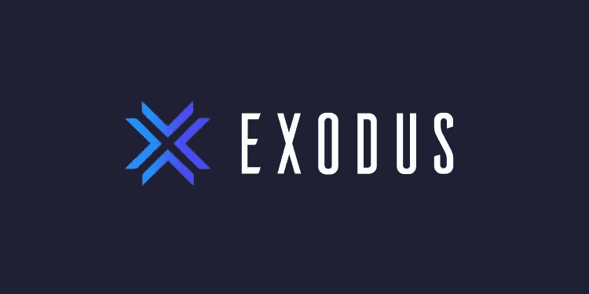

# 加密标桩

> 原文：<https://medium.com/coinmonks/crypto-staking-8ab8ddde789d?source=collection_archive---------41----------------------->

赚取利息和股息

[Photo](https://www.pexels.com/photo/person-putting-coin-in-a-piggy-bank-1602726/) by maitree rimthong

# 介绍

在菲亚特金融，有几个选择，通过低风险的方法，如债券和储蓄账户存款赚取你的钱。加密的等价物被称为赌注，你“借出”你的加密，你会得到你借出的一定比例。通常，当你押上你的密码时，年收益率(APY)被用来比较投资回报率。所以，用这个来确定你的投资回报率。在这篇文章中，我将通过 [Exodus wallet](https://www.exodus.com/) 来回顾赌注，它们的支付方式类似于存款单(CD)、储蓄账户和股息。

[Photo](https://www.pexels.com/photo/photo-of-golden-cogwheel-on-black-background-3785935) by Miguel Á. Padriñán

# 赌注时会发生什么？

在我们进入下注的细节之前，让我们先讨论一下你如何能从下注中获得奖励。就像你把自己的资产借给别人的任何其他类型的金融合同一样，你会收取一些费用。这种类型的赌注是分散融资(DeFi)的一部分。在这一领域，有许多理由将借款作为 DeFi 的一部分。一些交易所需要借用密码进行保证金、期权和期货交易。本质上，交易所通过向客户提供这些服务来获取费用。当你押上你的密码，你会得到一部分费用。

在其他情况下，你可以把你的密码作为区块链网络的运营商。例如，股份证明(PoS)作为工作证明(PoW)的替代，您的股份用于验证网络上的交易。这通常需要你运行一个节点，你的股份被用作抵押品，你没有恶意。如果网络发现你不靠谱，撒谎或者别的什么，你就可以失去你的股份。对于一些实用程序加密，如[预搜索](https://presearch.org/signup?rid=3735534)或 flux，您可以让您的加密分别运行返回搜索结果的搜索节点或提供计算的 Flux 节点。

# 押上《出埃及记》

在 Exodus 钱包上，你可以押索拉纳、宇宙、泰佐斯等。Exodus 使用一个名为 Everstake 的第三方赌注服务来代表你押上你的密码。您可以在钱包用户界面的右上角访问赌注。如果你可以用 Exodus 下注，钱包列表会在加密名旁边以百分比显示每年的 APY。一旦你有了加密的钱包，你可以点击右上角的奖励图标来查看赌注功能。你可以把你的密码全部或部分押上，每个密码都有不同的规则，比如每年的 APY，第一次支付的时间，如何兑现奖励以及如何解散工作。

对于索拉纳来说，一旦你下注 SOLs，大约需要 4 天时间你就可以开始获得回报。奖励会一直累积，直到你解散。因此，这类似于存款单(CD ),你将一些钱存一段时间，当你在最初约定的时间过后取回你的钱时，你会收到你的利息。你的钱包里还有 2-4 天的时间可以使用。因此，这是一张可在 2-4 天内提取的 CD，但它是开放的，可以无限期存放。请注意，还有一些其他的赌注服务，你可以在其中下注几个月，就像 CD 一样。在 Exodus 钱包中，您的奖励每小时累积一次或更少。你可以检查你的钱包，你的奖励会有少量的变化。

当您通过 Exodus wallet 下注 Tezos 时，在您下注的 Tezos 开始获得奖励之前需要 35 天。奖励会每 3 天添加到您的下注 Tezos 中，以弥补 35 天前的余额。这意味着你的 Tezos 每 3 天复利，延迟 35 天。因此，Tezos 赌注就像一个储蓄账户，你每 3 天就可以从你的余额中赚取利息。没有文档记录在您拆分后需要多长时间来访问您的 Tezos。然而，在开始的 35 天等待期内，你将在开始后的 35 天内获得奖励。

Exodus wallet 也可以入股 Cosmos。你马上开始获得奖励。您的奖励累积率低于每小时。您可以随时申领奖励，奖励将存入您的 Cosmos 钱包。如果你想把你的奖励添加到你的赌注宇宙中，你必须手动操作。请注意，申领奖励和下注更多宇宙需要网络费用。你必须做一些投资回报率的计算，以找到最佳的频率来复合你的赌注宇宙。分解宇宙需要 21 天。

[Photo](https://www.pexels.com/photo/close-up-shot-of-stock-of-coins-8370747/) by RODNAE Productions

# 结论

随着加密行业的成熟，赌博等金融机会正在开放。由于其分散的性质，加密可以通过 DeFi 提供传统的法定金融，并通过促进区块链网络的健康发展提供新的盈利机会。与 fiat finance 不同，crypto staking 一年 365 天 24/7 可用。许多钱包和交易所正在向他们的客户提供这种服务，让他们更容易使用。没有人会确切知道 2 年、5 年或 10 年后我们会有什么，但有一件事是肯定的。随着使用密码的新方法的尝试，该行业将继续增长。有些人会失败，但有些人会成功。而且这趟狂野之旅的门票很便宜也很容易买到。

> 加入 Coinmonks [电报频道](https://t.me/coincodecap)和 [Youtube 频道](https://www.youtube.com/c/coinmonks/videos)了解加密交易和投资

# 另外，阅读

*   [如何开始通过加密贷款赚取被动收入](https://coincodecap.com/passive-income-crypto-lending)
*   [BigONE 交易所点评](/coinmonks/bigone-exchange-review-64705d85a1d4) | [电网交易 Bot](https://coincodecap.com/grid-trading)
*   [氹欞侊贸易评论](https://coincodecap.com/anny-trade-review) | [CoinSpot 评论](https://coincodecap.com/coinspot-review)
*   [新加坡十大最佳加密交易所](https://coincodecap.com/crypto-exchange-in-singapore) | [购买 AXS](https://coincodecap.com/buy-axs-token)
*   [投资印度的最佳加密软件](https://coincodecap.com/best-crypto-to-invest-in-india-in-2021) | [WazirX P2P](https://coincodecap.com/wazirx-p2p)
*   [7 个最佳零费用加密交易平台](https://coincodecap.com/zero-fee-crypto-exchanges)