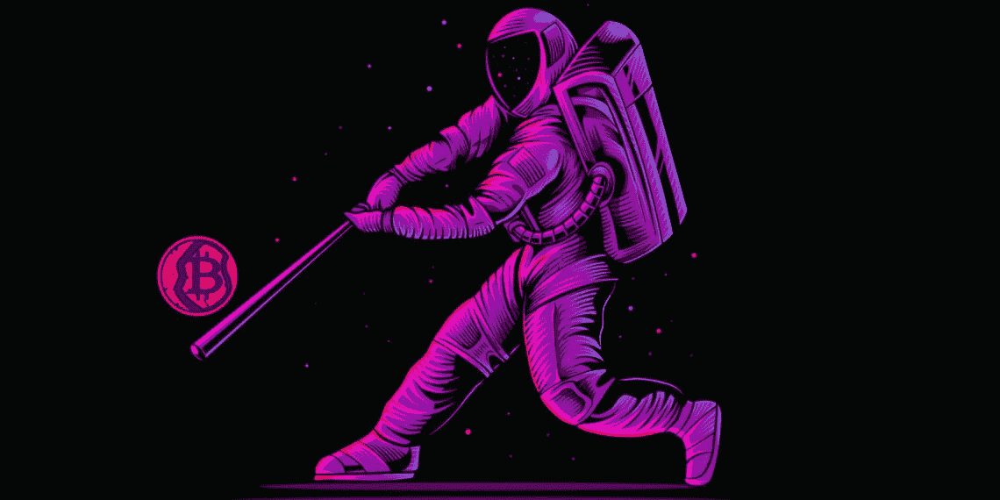
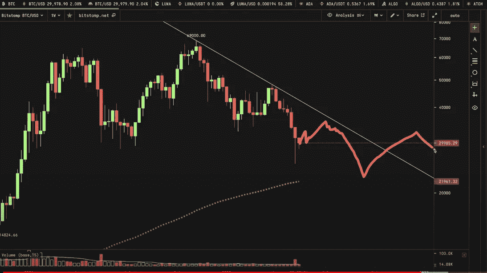

# 加密策略师表示，随着美国股市闪现看涨信号，比特币(BTC)即将反弹

> 原文：<https://medium.com/coinmonks/crypto-strategist-says-bitcoin-btc-primed-for-a-bounce-as-us-stock-market-flashes-bullish-signals-924e29c7d61?source=collection_archive---------68----------------------->

一位受欢迎的密码分析师和交易员认为，比特币(BTC)已经准备好与美国股市一起反弹。

在一个新的策略会议上，加密交易员凯文·斯文森告诉他的 69，000 名 YouTube 用户，比特币最近显示出与标准普尔 500 的相关性接近 90%。

他还表示，在衡量资产市场势头的每周相对强弱指数(RSI)上，标准普尔 500 正达到“极度超卖水平”。Svenson 指出，自 2020 年初 Covid 崩盘以来，该指数尚未触及如此低点。

该分析师还表示，标准普尔 500 往往不会花太多时间在相对强弱指标的历史低位上。他认为股市“应该出现某种反弹”，特别是因为该指数在上周末刚刚跌至关键的斐波那契水平。

Svenson 预测比特币将跟随 S&P 经历一个“持续多周的反向上行”，尽管他认为 BTC 很有可能在未来达到更低的价格。

这位分析师表示，比特币可能会测试目前向下倾斜的阻力线，之后会跌至低点。BTC 价格可能飙升至 36，200 美元左右的前期支撑区或 37，500 美元左右的前期蜡烛线收盘区。

在撰写本文时，比特币的交易价格为 29305 美元。市值最高的加密资产在过去 24 小时内下跌超过 2.5%。

> 加入 Coinmonks [电报频道](https://t.me/coincodecap)和 [Youtube 频道](https://www.youtube.com/c/coinmonks/videos)了解加密交易和投资

# 另外，阅读

*   [如何在加拿大购买加密货币？](https://coincodecap.com/how-to-buy-cryptocurrency-in-canada)
*   [无聊猿游艇俱乐部(BAYC)回顾](https://coincodecap.com/bored-ape-yacht-club-bayc-review) | [拜比特 vs 比特币基地](https://coincodecap.com/bybit-vs-coinbase)
*   [5 款最佳加密交易终端](https://coincodecap.com/crypto-trading-terminals) | [最佳 DeFi 应用](https://coincodecap.com/best-defi-apps)
*   [比特币基地 vs 瓦济克斯](https://coincodecap.com/coinbase-vs-wazirx) | [比特鲁点评](https://coincodecap.com/bitrue-review) | [波洛涅克斯 vs 比特鲁](https://coincodecap.com/poloniex-vs-bittrex)
*   [德国最佳加密交易所](https://coincodecap.com/crypto-exchanges-in-germany) | [Arbitrum:第二层解决方案](https://coincodecap.com/arbitrum)
*   [币安交易机器人](/coinmonks/binance-trading-bots-d0d57bb62c4c) | [OKEx 评论](/coinmonks/okex-review-6b369304110f) | [阿塔尼评论](https://coincodecap.com/atani-review)
*   [最佳加密交易信号电报](/coinmonks/best-crypto-signals-telegram-5785cdbc4b2b) | [MoonXBT 评论](/coinmonks/moonxbt-review-6e4ab26d037)