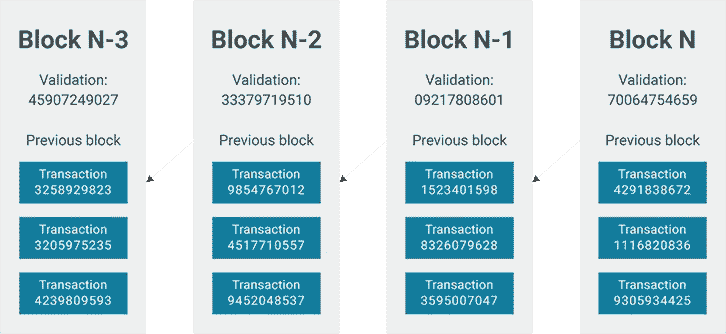
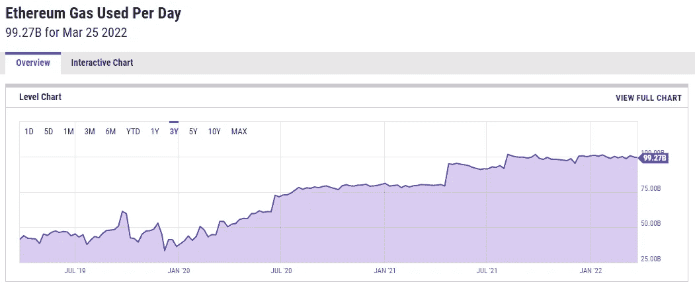
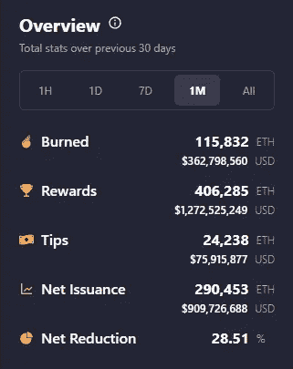
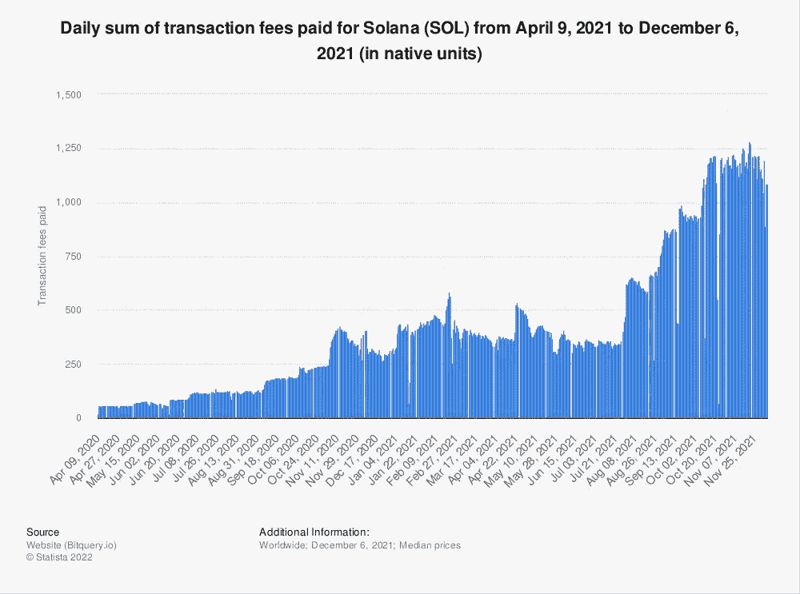

# |加密讲座 11 | PoS 第 1 层区块链的商业模式—区块空间估价的理念。

> 原文：<https://medium.com/coinmonks/crypto-talk-11-the-business-model-of-pos-layer-1-blockchains-the-idea-of-block-space-valuation-c00dd97ee2d0?source=collection_archive---------58----------------------->

# 理解加密层 1 项目的内在价值。

## 1.为什么公众对区块链越来越感兴趣，这是合法的吗？

在区块链上市之前，我们在互联网上并不拥有任何东西。Youtube、Tiktok 和脸书拥有您正在创建的内容。谷歌和微软基本上拥有在线谷歌文档和电子表格以及你的数据。当你在网上买东西时，你需要使用你的卡，这些卡也受到银行有线系统的监控。

Youtube 或 Tiktok 可以删除他们想要的任何内容，银行可以停止或撤销他们不喜欢的任何交易。作为用户，我们能做的就是希望 Youtube 不会删除你的视频，或者相信银行不会在极端事件中冻结你的账户。在目前的过程中，我们对互联网上的任何事情都没有控制权。

就像其他创新技术一样，人们对公共区块链的兴趣正在上升，因为它们使人们能够在互联网上做他们过去不能做的事情，例如在互联网上进行点对点交易，在互联网上实际拥有物品/数字资产，以及我们可以在互联网上做的新商业模式的所有其他可能性。

正因为如此，公共区块链有两个关键特征:无许可和抵制审查。

对于那些不熟悉术语的人来说，无权限意味着任何人都可以以任何角色(节点、用户、代码贡献者……)参与网络。审查阻力意味着没有一个实体可以逆转区块链的活动，从而降低了控制方实施欺诈的风险，即使在极端情况下也是如此。

这些建立在密码术和区块链技术基础上的公共网络，现在允许任何人(无需许可)向他们喜欢的任何人(钱包地址)转移他们想要的任何金额的钱，没有任何人的任何干预，就像使用现金一样，但在互联网上。然而，这些网络能够处理的事务数量有限，通常以每秒事务数(fps)来衡量。

网络需要足够分散，以保持这些网络的抗审查性和安全性。不幸的是，到目前为止使网络去中心化的努力已经使网络变慢了。在本文中，我不会深入探讨这些与技术杂草相关的技术原因，比如块大小、事务数据或节点需求。但是，请记住，分散式块空间受到限制是有技术原因的。

## 2.出售街区空间商业模式的想法。

如果有任何机构控制网络，如何适当地监控您的交易或活动？

网络的参与者负责确保所有的交易都是合法的(没有人比他们花得更多)，他们被称为节点。这些节点同意做验证工作，并接受一些回报，也就是验证奖励。

*(如上图所示，每个块空间限于每个块 3 个事务)。*

如果你问谁可以成为网络的一个节点，这时无权限特性就出现了:任何人——如果网络真的是无权限的。

从根本上说，这种商业模式是:验证节点投资于可以创建块空间的资源，然后将该块空间出售给希望在网络上进行对等交易的用户。作为回报，用户支付一定数量的汽油费来执行交易，所有这些汽油费(或部分)被支付给验证节点作为验证奖励。

在使用工作证明协议的比特币的情况下，验证节点需要投资使用电力和计算能力的矿机，首先相互竞争，然后验证交易以获得验证奖励。

因此，PoW 网络的块空间创建者/销售者是所谓的“矿工”，而不是令牌持有者。

因为比特币网络非常安全，14 年来没有被黑客攻击过，理论上它是一个惊人的价值资产商店。然而，那也是比特币唯一的价值。由于比特币的数量也是有限的，就像黄金一样，法币的价值越低，比特币的价值就会变得越高。

## 3.利益证明——有助于将块空间业务模式的内在价值添加到令牌中的共识。

在股权证明的情况下，当它在代币中包含某种形式的内在价值时，它会有趣得多。在利益一致网络的证明中，验证节点需要锁定一定数量的本地令牌(称为赌注)来运行验证节点并接收验证奖励。因此，区块销售者是那些下注他们的代币并运行节点以接收验证奖励的人。

正如我们所看到的，平台/网络使用率的增加将增加验证奖励，并使区块空间销售者受益。

那么，谁将从 PoS 网络平台/网络使用率的增加中受益呢？

首先，代币持有者可以用你的代币做赌注，成为区块空间卖家，也就是赌注者。然后，这些赌注者可以从网络用户支付的气费中获得有效奖励。换句话说，这些代币有能力为代币所有者创造现金流，这就是作为投资的内在价值的定义。

此外，当对区块空间的需求增加时，用户将开始支付更多的天然气费用作为区块空间的投标人。支付的更高的汽油费导致验证奖励的增加，这激励更多的代币被下注，以使供需回到平衡点，减少市场上代币的总浮动供应量。这种机制还为令牌创造了额外的外在价值。

## 4.街区空间的每日估价:用户支付的每日燃气费。

随着数字区块空间经济的发展，更多的交易需要结算，更多的经济活动发生在区块空间，人们将愿意支付更高的数字天然气费用。

2020 年和 2021 年的加密牛市是由智能合约、NFTs、Defi 和 GameFi 的迷人想法推动的。当更多的概念和用例在公用事业区块链上进行试验时，对块空间的需求激增。根据 Y-chart 的数据，以太坊每日用气量在两年内翻了一番(与 2019 年 3 月的水平相比)，每月用气量超过 17 亿美元。

*注意:虽然 Y 图显示每天使用的以太币气体是 100 亿，但在检查了其他来源后，我认为这个数字不合理，30 天内 17 亿美元更合理。然而，由于他们从一个来源查询数据，增长率应该是正确的。*

但是，会有一定水平的可接受的数字气价。就像物理石油的价格上涨到一定水平，人们将开始转向替代品，如骑自行车、步行或驾驶电动汽车。类似的案例还有，当以太坊 block-space 估值见顶时，人们开始寻找替代品:Solana 的 block-space、BSC 的 block-space、Avalanche 的 block-space、Fantom 的 block-space……如果你仔细看看今年密码市场的最高市值，你可以观察到，除了比特币和少数 memes/get rich quick scheme 币；其余的都是公用块空间销售业务。

正因为如此，因为我相信对块状空间的需求将继续上升，块状空间经济将继续繁荣。任何第一层项目或以太坊的第二层项目，只要足够分散、足够安全、足够高效，都将继续在区块空间经济中占有一些份额，并在阳光下度过它们的日子。

## 5.所有的商业模式都需要盈利和可持续发展。

由于我们将销售区块空间视为一种商业模式，因此在 PoS 项目中，我们可以将总的赌注价值视为商业估值，将确认奖励视为净收入。为了使商业模式变得有利可图，用户支付的煤气费应比通货膨胀率有更大的回报。

换句话说，(每年确认奖励总额+代币的价格升值/贬值)除以总赌注值应大于通货膨胀率，以使该业务盈利。

有很多因素可以帮助提高代币的价格，例如市场投机或通过燃烧机制减少总供应量。然而，如果我们忽略代币的价格升值/贬值，使用块空间估值来估计每年的总验证奖励要容易得多。

区块空间销售业务的净收入是总的确认奖励，可以从用户支付的气费中计算，或=区块空间使用量 x 气价。

撇开数学不谈，用更简单的话来说，如果总赌注价值为 300 亿美元，他们应该期望每年获得 24 亿美元的赌注奖励，以跟上最近的通货膨胀，或者每年获得 9 亿美元的赌注奖励，以跟上新的 3%的长期通货膨胀。

为了使其长期可持续，这些现金流应该真正来自用户的支付意愿，而不是凭空印刷代币的“赌注池”。

其中一个可以证明商业模式的项目是以太坊。在过去的 30 天里，这个网络的用户已经支付了 4 . 5 亿美元的天然气费用，因为天然气费用已经比高峰期低了很多。

与 Solana network 的用户 project SOL 相比，截至 2021 年 12 月 6 日，SOL a 的每日交易费峰值为每天 1250 索尔，每天价值 31.3 万美元，每年 1.12 亿美元，即使是在 SOL 的峰值价格(每索尔 250 美元)。所以作为一种商业模式，我们可以说，跑马圈地拥有以太坊比跑马圈地拥有索拉纳更赚钱。

## 6.那么为什么以太坊的块空间值比索拉纳等网络高那么多呢？

我们可以有根据地猜测，块空间的价值很可能是基于网络的声誉。如果亚马逊或易贝的信誉不够好，就不会有太多人加入这些网络，从事经济活动。声誉越低，网络的价值就越低，这些网络的所有者作为一个平台也不会获得太多利润。这个类比也适用于区块链网络。当网络声誉更好、更稳定且具有更好的传统时，这些网络具有更高的块空间值是合理的。

然而，这仍将是一场比赛，随时都会有新的竞争者出现。有一天，可能会有一个更好的第 1 层网络，它建立在更好的技术上，并且发展足够快，以击败以太坊多年来建立的网络效应。

就 Solana 而言，按照目前的价格水平，他们的天然气费需要再上涨 50 倍，才能使区块空间商业模式变得有利可图，并证明当前的总价值是合理的。

请记住，块空间值不会很快改变，例如以太坊的块空间值在过去的两年中翻了一番。此外，如果溶胶的价格增加，它也将增加目前的总赌注价值。因此，如果你把索拉纳作为一项投资，你肯定是在赌用户的大幅增长能够把油价推高到 50 倍(以索尔计算，而不是以美元计算)。

不是财务建议。请自担风险阅读。

Chí。

> 加入 Coinmonks [电报频道](https://t.me/coincodecap)和 [Youtube 频道](https://www.youtube.com/c/coinmonks/videos)了解加密交易和投资